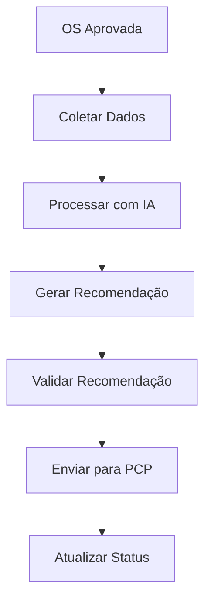
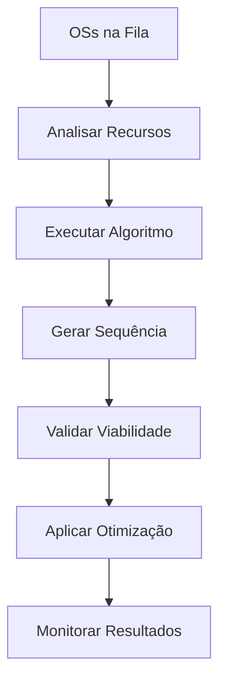
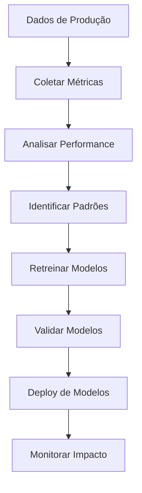

# 🏗️ Arquitetura do Sistema - Módulo PCP Inteligente

## 📋 Visão Geral da Arquitetura

**Padrão:** Microserviços com IA/ML integrado  
**Estilo:** Event-Driven Architecture  
**Comunicação:** APIs REST + Message Queues  
**Persistência:** PostgreSQL + Redis + InfluxDB  
**Deploy:** Docker + Kubernetes  

## 🎯 Princípios Arquiteturais

### **1. Isolamento e Modularidade**
- Módulo completamente isolado
- Dependências mínimas com outros módulos
- APIs bem definidas e versionadas
- Autonomia operacional

### **2. Escalabilidade Horizontal**
- Stateless services
- Load balancing automático
- Auto-scaling baseado em métricas
- Cache distribuído

### **3. Resilência e Tolerância a Falhas**
- Circuit breakers
- Retry policies
- Fallback mechanisms
- Health checks

### **4. Observabilidade**
- Logs estruturados
- Métricas em tempo real
- Tracing distribuído
- Alertas proativos

## 🏛️ Arquitetura de Alto Nível

```
┌─────────────────────────────────────────────────────────────┐
│                    Frontend Layer                          │
├─────────────────────────────────────────────────────────────┤
│  React App  │  Mobile App  │  Admin Dashboard  │  Reports  │
└─────────────────────────────────────────────────────────────┘
                                │
                                ▼
┌─────────────────────────────────────────────────────────────┐
│                    API Gateway                             │
├─────────────────────────────────────────────────────────────┤
│  Authentication  │  Rate Limiting  │  Routing  │  Logging  │
└─────────────────────────────────────────────────────────────┘
                                │
                                ▼
┌─────────────────────────────────────────────────────────────┐
│                  Microservices Layer                       │
├─────────────────────────────────────────────────────────────┤
│  OS Integration  │  PCP Integration  │  AI Engine  │  UI    │
└─────────────────────────────────────────────────────────────┘
                                │
                                ▼
┌─────────────────────────────────────────────────────────────┐
│                    Data Layer                              │
├─────────────────────────────────────────────────────────────┤
│  PostgreSQL  │  Redis  │  InfluxDB  │  MinIO  │  Kafka    │
└─────────────────────────────────────────────────────────────┘
```

## 🔧 Componentes Principais

### **1. API Gateway**
```typescript
// Configuração do API Gateway
@Module({
  imports: [
    JwtModule.register({
      secret: process.env.JWT_SECRET,
      signOptions: { expiresIn: '24h' }
    }),
    RateLimitModule.forRoot({
      windowMs: 15 * 60 * 1000, // 15 minutos
      max: 1000 // limite de requests
    })
  ],
  controllers: [APIGatewayController],
  providers: [AuthService, RateLimitService]
})
export class APIGatewayModule {}
```

**Responsabilidades:**
- Autenticação e autorização
- Rate limiting
- Routing de requests
- Logging centralizado
- CORS e segurança

### **2. Serviço de Integração OS**
```typescript
@Injectable()
export class OSIntegrationService {
  constructor(
    private readonly httpService: HttpService,
    private readonly configService: ConfigService
  ) {}

  async obterOS(osId: string): Promise<OSData> {
    const osUrl = this.configService.get('OS_SERVICE_URL');
    const response = await this.httpService.get(`${osUrl}/os/${osId}`).toPromise();
    return response.data;
  }

  async atualizarStatusOS(osId: string, status: string): Promise<void> {
    const osUrl = this.configService.get('OS_SERVICE_URL');
    await this.httpService.patch(`${osUrl}/os/${osId}/status`, { status }).toPromise();
  }
}
```

**Responsabilidades:**
- Comunicação com módulo OS
- Sincronização de dados
- Cache de informações
- Tratamento de erros

### **3. Serviço de Integração PCP**
```typescript
@Injectable()
export class PCPIntegrationService {
  async obterWorkflowsDisponiveis(): Promise<WorkflowTemplate[]> {
    // Busca workflows do módulo PCP
  }

  async criarInstanciaWorkflow(dados: CreateWorkflowDto): Promise<string> {
    // Cria instância no módulo PCP
  }

  async atualizarStatusWorkflow(instanciaId: string, status: string): Promise<void> {
    // Atualiza status no módulo PCP
  }
}
```

**Responsabilidades:**
- Comunicação com módulo PCP
- Gestão de workflows
- Sincronização de status
- Monitoramento de instâncias

### **4. Engine de IA**
```typescript
@Injectable()
export class AIEngineService {
  constructor(
    private readonly workflowSelector: WorkflowSelectorModel,
    private readonly timePredictor: TimePredictionModel,
    private readonly resourceOptimizer: ResourceOptimizationModel
  ) {}

  async processarRecomendacoes(contexto: ProductionContext): Promise<AIRecommendation[]> {
    const workflowRec = await this.workflowSelector.predict(contexto);
    const timePred = await this.timePredictor.predict(contexto);
    const resourceOpt = await this.resourceOptimizer.optimize(contexto);

    return [workflowRec, timePred, resourceOpt];
  }
}
```

**Responsabilidades:**
- Execução de modelos de ML
- Processamento de dados
- Geração de recomendações
- Aprendizado contínuo

## 🗄️ Arquitetura de Dados

### **1. PostgreSQL - Dados Transacionais**
```sql
-- Tabela principal de recomendações
CREATE TABLE ai_recommendations (
  id UUID PRIMARY KEY DEFAULT gen_random_uuid(),
  os_id UUID NOT NULL,
  item_os_id UUID,
  tipo_recomendacao VARCHAR(50) NOT NULL,
  dados_recomendacao JSONB NOT NULL,
  confianca DECIMAL(5,4) NOT NULL,
  status VARCHAR(20) DEFAULT 'PENDENTE',
  criado_em TIMESTAMP DEFAULT NOW(),
  atualizado_em TIMESTAMP DEFAULT NOW()
);

-- Tabela de modelos de ML
CREATE TABLE ml_models (
  id UUID PRIMARY KEY DEFAULT gen_random_uuid(),
  nome VARCHAR(100) NOT NULL,
  versao VARCHAR(20) NOT NULL,
  algoritmo VARCHAR(50) NOT NULL,
  arquivo_modelo BYTEA NOT NULL,
  precisao DECIMAL(5,4),
  status VARCHAR(20) DEFAULT 'TREINANDO',
  criado_em TIMESTAMP DEFAULT NOW()
);

-- Tabela de métricas de performance
CREATE TABLE performance_metrics (
  id UUID PRIMARY KEY DEFAULT gen_random_uuid(),
  modelo_id UUID REFERENCES ml_models(id),
  metrica VARCHAR(50) NOT NULL,
  valor DECIMAL(10,4) NOT NULL,
  timestamp TIMESTAMP DEFAULT NOW()
);
```

### **2. Redis - Cache e Sessões**
```typescript
// Configuração do Redis
@Injectable()
export class CacheService {
  constructor(
    @InjectRedis() private readonly redis: Redis
  ) {}

  async get<T>(key: string): Promise<T | null> {
    const value = await this.redis.get(key);
    return value ? JSON.parse(value) : null;
  }

  async set(key: string, value: any, ttl: number = 3600): Promise<void> {
    await this.redis.setex(key, ttl, JSON.stringify(value));
  }
}
```

**Uso:**
- Cache de recomendações
- Sessões de usuário
- Dados temporários
- Rate limiting

### **3. InfluxDB - Métricas e Time Series**
```typescript
// Configuração do InfluxDB
@Injectable()
export class MetricsService {
  constructor(
    private readonly influxDB: InfluxDB
  ) {}

  async registrarMetrica(
    measurement: string,
    tags: Record<string, string>,
    fields: Record<string, number>
  ): Promise<void> {
    await this.influxDB.writePoints([{
      measurement,
      tags,
      fields,
      timestamp: new Date()
    }]);
  }
}
```

**Dados:**
- Métricas de performance
- Dados de produção
- Logs de sistema
- Métricas de negócio

### **4. Kafka - Event Streaming**
```typescript
// Configuração do Kafka
@Injectable()
export class EventService {
  constructor(
    private readonly kafka: Kafka
  ) {}

  async publicarEvento(topic: string, evento: any): Promise<void> {
    await this.kafka.send({
      topic,
      messages: [{
        key: evento.id,
        value: JSON.stringify(evento)
      }]
    });
  }
}
```

**Eventos:**
- Mudanças de status
- Novas recomendações
- Alertas de sistema
- Métricas de performance

## 🔄 Fluxos de Dados

### **1. Fluxo de Recomendação de Workflow**


### **2. Fluxo de Otimização de Produção**


### **3. Fluxo de Aprendizado Contínuo**


## 🚀 Deploy e Infraestrutura

### **1. Docker Configuration**
```dockerfile
# Dockerfile para o serviço principal
FROM node:18-alpine AS base
WORKDIR /app
COPY package*.json ./
RUN npm ci --only=production

FROM python:3.9-slim AS ai-service
WORKDIR /app
COPY requirements.txt .
RUN pip install -r requirements.txt
COPY ai/ ./ai/

FROM base AS final
COPY --from=ai-service /app/ai ./ai
COPY . .
EXPOSE 3000
CMD ["npm", "run", "start:prod"]
```

### **2. Kubernetes Deployment**
```yaml
# k8s-deployment.yaml
apiVersion: apps/v1
kind: Deployment
metadata:
  name: pcp-inteligente
spec:
  replicas: 3
  selector:
    matchLabels:
      app: pcp-inteligente
  template:
    metadata:
      labels:
        app: pcp-inteligente
    spec:
      containers:
      - name: pcp-inteligente
        image: pcp-inteligente:latest
        ports:
        - containerPort: 3000
        env:
        - name: DATABASE_URL
          valueFrom:
            secretKeyRef:
              name: pcp-inteligente-secrets
              key: database-url
        resources:
          requests:
            memory: "512Mi"
            cpu: "250m"
          limits:
            memory: "1Gi"
            cpu: "500m"
        livenessProbe:
          httpGet:
            path: /health
            port: 3000
          initialDelaySeconds: 30
          periodSeconds: 10
        readinessProbe:
          httpGet:
            path: /ready
            port: 3000
          initialDelaySeconds: 5
          periodSeconds: 5
```

### **3. Service Mesh (Istio)**
```yaml
# istio-gateway.yaml
apiVersion: networking.istio.io/v1alpha3
kind: Gateway
metadata:
  name: pcp-inteligente-gateway
spec:
  selector:
    istio: ingressgateway
  servers:
  - port:
      number: 80
      name: http
      protocol: HTTP
    hosts:
    - pcp-inteligente.company.com
```

## 🔒 Segurança

### **1. Autenticação e Autorização**
```typescript
@Injectable()
export class AuthService {
  async validarToken(token: string): Promise<boolean> {
    try {
      const payload = jwt.verify(token, process.env.JWT_SECRET);
      return payload.exp > Date.now() / 1000;
    } catch {
      return false;
    }
  }

  async obterPermissoes(usuarioId: string): Promise<string[]> {
    // Busca permissões do usuário
  }
}
```

### **2. Criptografia de Dados**
```typescript
@Injectable()
export class EncryptionService {
  private readonly algorithm = 'aes-256-gcm';
  private readonly key = process.env.ENCRYPTION_KEY;

  async encrypt(data: any): Promise<string> {
    const iv = crypto.randomBytes(16);
    const cipher = crypto.createCipher(this.algorithm, this.key);
    cipher.setAAD(Buffer.from('pcp-inteligente'));
    
    let encrypted = cipher.update(JSON.stringify(data), 'utf8', 'hex');
    encrypted += cipher.final('hex');
    
    const authTag = cipher.getAuthTag();
    return iv.toString('hex') + ':' + authTag.toString('hex') + ':' + encrypted;
  }
}
```

### **3. Isolamento de Dados**
```typescript
@Injectable()
export class TenantIsolationService {
  async filtrarPorTenant(query: any, tenantId: string): Promise<any> {
    return query.where({
      ...query.where,
      loja_id: tenantId
    });
  }
}
```

## 📊 Monitoramento e Observabilidade

### **1. Health Checks**
```typescript
@Controller('health')
export class HealthController {
  @Get()
  async health(): Promise<HealthStatus> {
    const checks = await Promise.all([
      this.checkDatabase(),
      this.checkRedis(),
      this.checkAIEngine(),
      this.checkExternalServices()
    ]);

    return {
      status: checks.every(c => c.status === 'UP') ? 'UP' : 'DOWN',
      checks
    };
  }
}
```

### **2. Métricas Customizadas**
```typescript
@Injectable()
export class MetricsCollector {
  private readonly recommendationsCounter = new Counter({
    name: 'ai_recommendations_total',
    help: 'Total number of AI recommendations generated',
    labelNames: ['type', 'status']
  });

  private readonly predictionAccuracy = new Histogram({
    name: 'ai_prediction_accuracy',
    help: 'Accuracy of AI predictions',
    buckets: [0.5, 0.6, 0.7, 0.8, 0.9, 0.95, 1.0]
  });

  async recordRecommendation(type: string, status: string): Promise<void> {
    this.recommendationsCounter.inc({ type, status });
  }
}
```

### **3. Logging Estruturado**
```typescript
@Injectable()
export class LoggerService {
  private readonly logger = new Logger('PCPInteligente');

  logRecommendation(recommendation: AIRecommendation): void {
    this.logger.log({
      message: 'AI recommendation generated',
      recommendationId: recommendation.id,
      osId: recommendation.osId,
      type: recommendation.type,
      confidence: recommendation.confidence,
      timestamp: new Date().toISOString()
    });
  }
}
```

## 🔄 CI/CD Pipeline

### **1. Build Pipeline**
```yaml
# .github/workflows/build.yml
name: Build and Test
on: [push, pull_request]

jobs:
  build:
    runs-on: ubuntu-latest
    steps:
    - uses: actions/checkout@v2
    - name: Setup Node.js
      uses: actions/setup-node@v2
      with:
        node-version: '18'
    - name: Install dependencies
      run: npm ci
    - name: Run tests
      run: npm run test:coverage
    - name: Run linting
      run: npm run lint
    - name: Build application
      run: npm run build
    - name: Build Docker image
      run: docker build -t pcp-inteligente:${{ github.sha }} .
```

### **2. Deploy Pipeline**
```yaml
# .github/workflows/deploy.yml
name: Deploy
on:
  push:
    branches: [main]

jobs:
  deploy:
    runs-on: ubuntu-latest
    steps:
    - name: Deploy to staging
      run: |
        kubectl apply -f k8s/staging/
        kubectl rollout status deployment/pcp-inteligente
    - name: Run smoke tests
      run: npm run test:smoke
    - name: Deploy to production
      if: success()
      run: |
        kubectl apply -f k8s/production/
        kubectl rollout status deployment/pcp-inteligente
```

## 🎯 Considerações de Performance

### **1. Otimizações de Banco de Dados**
- Índices otimizados para queries frequentes
- Particionamento de tabelas grandes
- Connection pooling
- Query optimization

### **2. Cache Strategy**
- Cache de recomendações frequentes
- Cache de dados de referência
- Invalidação inteligente
- TTL baseado em criticidade

### **3. Processamento Assíncrono**
- Message queues para operações pesadas
- Background jobs para treinamento de modelos
- Processamento em lotes
- Rate limiting

---

**Documento:** Arquitetura do Sistema - Módulo PCP Inteligente  
**Versão:** 1.0  
**Data:** 2024  
**Autor:** Arquiteto de Software  
**Status:** Em Desenvolvimento


