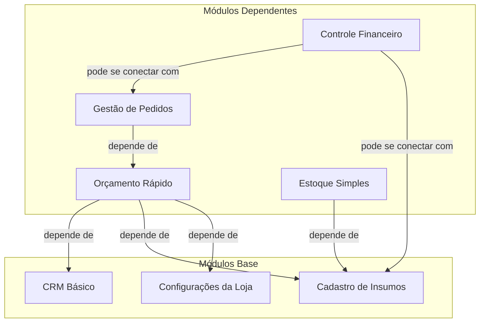

# Arquitetura e Dependência de Módulos

Este documento define a relação de dependência entre os diferentes módulos do sistema Comunikapp. Compreender essa arquitetura é fundamental para a lógica de instalação, ativação e faturamento dos módulos no marketplace.

## Estratégia de Módulos no Onboarding

Para o período inicial de **teste de 30 dias**, todos os módulos serão disponibilizados ativados para o cliente. Isso permite que ele experimente o ecossistema completo e entenda o valor de cada funcionalidade. Após o período de trial, o cliente poderá escolher quais módulos ou pacotes de módulos deseja contratar.

## 1. Módulos Base (Estruturais)

Estes módulos são os pilares do sistema. Eles podem funcionar de forma independente e servem como alicerce para os módulos funcionais. Uma loja deve ter esses módulos como base para a operação.

- **`CRM Básico`**: Gerencia o cadastro e o histórico dos clientes.
- **`Cadastro de Insumos`**: Gerencia os materiais, seus custos e fornecedores.
- **`Configurações da Loja`**: Centraliza as configurações de custos (mão de obra, máquinas, custos indiretos), parâmetros de negócio (margens, impostos) e personalização (logo, timbrado).

## 2. Módulos Dependentes (Funcionais)

Estes módulos agregam funcionalidades específicas e, para operar, dependem de um ou mais dos Módulos Base.

- **`Orçamento Rápido`**
  - **Função:** Cria orçamentos detalhados e compartilháveis.
  - **Depende de:**
    - `CRM Básico` (para associar o orçamento a um cliente).
    - `Cadastro de Insumos` (para obter os custos de material).
    - `Configurações da Loja` (para obter custos de mão de obra, máquinas, margens e impostos).

- **`Gestão de Pedidos`**
  - **Função:** Converte orçamentos em pedidos e acompanha o status da produção.
  - **Depende de:** `Orçamento Rápido`.

- **`Estoque Simples`**
  - **Função:** Controla a entrada e saída de materiais.
  - **Depende de:** `Cadastro de Insumos`.

- **`Controle Financeiro`**
  - **Função:** Gerencia contas a pagar e a receber.
  - **Pode se conectar com (dependência "fraca"):**
    - `Gestão de Pedidos` (para gerar contas a receber automaticamente).
    - `Cadastro de Insumos` (para registrar despesas com a compra de materiais).

## Diagrama de Dependências

