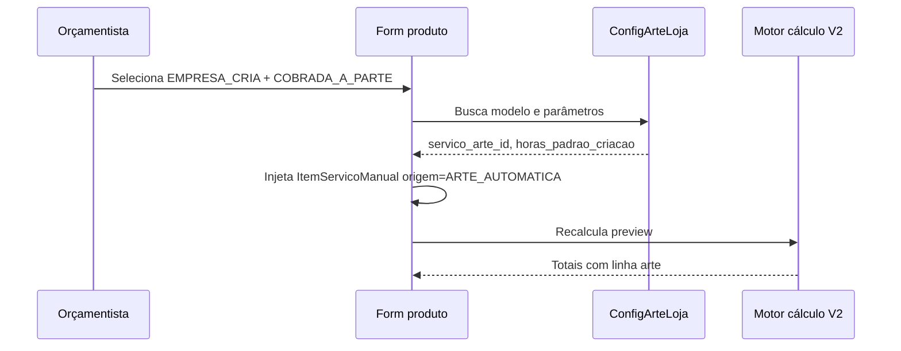

# Especificação funcional — Módulo Arte & Aprovação

**Versão:** 0.1 (rascunho para validação)  
**Data:** 2026-06-26  
**Autores:** produto + engenharia (sessão de alinhamento OS / orçamento / arte)

---

## 1. Contexto e problema

Hoje o Comunikapp possui um subsistema robusto de arte (versões, arquivos, link público, mensagens, liberação para PCP), mas ele está **acoplado à aba Arte & Aprovação dentro da OS** (`/os/{id}`). Consequências:

- O departamento de arte precisa abrir OS uma a uma para saber se há trabalho.
- Não existe fila dedicada (diferente do PCP, que tem `/pcp` com kanban/fila).
- O orçamento não registra **quem produz a arte** nem **como o custo entra no cálculo** de forma automática.
- O anexo de imagem/DXF no orçamento foi tratado como “arte da OS” (Leitura B), mas na prática inclui referências visuais, desenhos técnicos e arte final — papéis distintos.

Esta especificação define um **módulo operacional Arte & Aprovação** com fila própria e as mudanças necessárias no **Orçamento V2** e na **OS**.

---

## 2. Objetivos

### 2.1 Objetivos do módulo Arte & Aprovação

1. Oferecer **fila de trabalho** para o departamento de arte (itens que exigem criação ou adaptação interna).
2. **Reutilizar** os componentes e APIs existentes de arte (não reescrever o núcleo).
3. Permitir que o designer trabalhe **sem navegar pela lista genérica de OS**.
4. Manter **vínculo com a OS** (cliente, prazo, produto, briefing do orçamento).
5. Preservar fluxo de **aprovação externa** (link público) e **liberação para PCP**.

### 2.2 Objetivos no Orçamento V2

1. Registrar, por produto, **responsabilidade pela arte** e **política de cobrança**.
2. Diferenciar **finalidade do anexo** (referência, técnico, arte para produção).
3. **Injetar automaticamente** o custo de arte no preview de cálculo quando aplicável — sem depender do orçamentista lembrar de adicionar serviço manual.
4. Propagar decisões para a OS e para a fila de arte.

---

## 3. Escopo

### 3.1 Dentro do escopo

- Item de menu **Arte & Aprovação** com badge de pendentes.
- Rotas `/arte` (fila) e `/arte/trabalho/{osId}/{itemId}` (workspace).
- Endpoint de fila agregada por item de OS.
- Campos novos em `ProdutoOrcamento` e `ItemOS`.
- Configuração de **precificação de arte por loja**.
- Injeção automática de linha de custo no motor de cálculo do orçamento.
- Resumo enxuto de arte na OS (badge + atalho); remoção da aba completa como workspace principal.
- Redirecionamento de URLs legadas (`/os/{id}?tab=arte-aprovacao`).

### 3.2 Fora do escopo (fases futuras)

- Cobrança financeira específica “módulo arte” (usa estrutura já existente do orçamento).
- IA para classificar anexos automaticamente.
- Múltiplos anexos por produto (continua 1 anexo de geometria na v1).
- Marketplace / ativação do módulo por plano.

---

## 4. Personas e permissões

| Persona | Ações principais |
|---------|------------------|
| **Orçamentista** | Define responsabilidade/cobrança/finalidade do anexo no produto |
| **Designer / Arte** | Consome fila, cria versões, envia link, libera para PCP |
| **Gestor de OS** | Vê status na OS, não precisa ser workspace de arte |
| **Cliente (externo)** | Aprova via link público (fluxo atual, sem mudança de URL pública) |
| **Administrador** | Configura precificação de arte da loja |

**Permissões sugeridas (módulo `arte-aprovacao`):**

| Ação | Perfis |
|------|--------|
| Ver fila | Arte, Admin, Gestor |
| Trabalhar arte (CRUD versões) | Arte, Admin |
| Configurar preço de arte | Admin |
| Ver resumo na OS | Todos com acesso a OS |

---

## 5. Modelo de dados — dimensões da arte

### 5.1 Três eixos independentes (por produto)

Nenhum substitui o outro.

#### A) `responsabilidade_arte` — quem entrega o arquivo de produção

| Valor | Descrição | Entra na fila do dept. arte? |
|-------|-----------|------------------------------|
| `CLIENTE_FORNECE` | Cliente envia arte pronta | Não |
| `EMPRESA_CRIA` | Departamento cria do zero | **Sim** |
| `EMPRESA_ADAPTA` | Empresa adapta material do cliente | **Sim** |
| `NAO_APLICAVEL` | Sem arte gráfica | Não |

#### B) `politica_cobranca_arte` — aspecto comercial

| Valor | Descrição | Linha de custo no orçamento |
|-------|-----------|----------------------------|
| `NAO_APLICAVEL` | Sem arte cobrável | Nenhuma |
| `INCLUIDA_NO_PRODUTO` | Custo existe internamente; preço embutido | Sim (interno); PDF pode ocultar linha |
| `COBRADA_A_PARTE` | Cliente vê linha separada | Sim (explícita no preview/PDF) |
| `SEM_CUSTO` | Cortesia | Custo interno opcional; preço cliente = 0 |

#### C) `finalidade_anexo` — papel do arquivo anexado

| Valor | Descrição |
|-------|-----------|
| `REFERENCIA_VISUAL` | Mockup, foto, inspiração |
| `DESENHO_TECNICO` | DXF, planta, especificação |
| `ARTE_PRODUCAO` | Arquivo tratado como arte para produção |

**Defaults automáticos sugeridos:**

| responsabilidade | finalidade default do anexo |
|------------------|----------------------------|
| `EMPRESA_CRIA` | `REFERENCIA_VISUAL` (se houver JPG) |
| `EMPRESA_ADAPTA` | `REFERENCIA_VISUAL` ou `ARTE_PRODUCAO` se operador marcar |
| `CLIENTE_FORNECE` | `ARTE_PRODUCAO` se anexado; senão aguardar arquivo |
| `NAO_APLICAVEL` | `DESENHO_TECNICO` se DXF; senão null |

**Revisão da Leitura B (Fase 7.A):**  
`arte_anexada` na aprovação técnica da OS passa a considerar:

- `ArteVersao` existente, **ou**
- `ItemOS.arquivo_geometria_url` com `finalidade_anexo = ARTE_PRODUCAO`, **ou**
- `responsabilidade_arte = CLIENTE_FORNECE` com arquivo marcado como produção.

Referência visual **não** conta como arte anexada.

---

### 5.2 `status_arte` — estado operacional (ItemOS)

Aplicável quando `responsabilidade_arte ∈ { EMPRESA_CRIA, EMPRESA_ADAPTA }`.

| Status | Descrição |
|--------|-----------|
| `NAO_APLICA` | Sem trabalho interno de arte |
| `AGUARDANDO_INICIO` | Na fila; designer ainda não iniciou |
| `EM_CRIACAO` | Designer trabalhando (≥1 versão em rascunho) |
| `AGUARDANDO_CLIENTE` | Link enviado / aguardando aprovação externa |
| `REVISAO_SOLICITADA` | Cliente pediu alteração |
| `APROVADA` | Arte aprovada para o item |
| `LIBERADA_PCP` | Designer liberou para produção |

**Transições principais:**

```
AGUARDANDO_INICIO → EM_CRIACAO (designer cria v1 ou assume card)
EM_CRIACAO → AGUARDANDO_CLIENTE (envio ao cliente)
AGUARDANDO_CLIENTE → APROVADA | REVISAO_SOLICITADA
REVISAO_SOLICITADA → EM_CRIACAO
APROVADA → LIBERADA_PCP (ação do designer)
```

Para `CLIENTE_FORNECE`, usar status paralelo simplificado na OS (gestor): `AGUARDANDO_ARQUIVO_CLIENTE` | `ARQUIVO_RECEBIDO` — **fora da fila do departamento**.

---

### 5.3 Campos novos — resumo

**`ProdutoOrcamento` (orçamento):**

```text
responsabilidade_arte          VARCHAR(32)   NOT NULL DEFAULT 'NAO_APLICAVEL'
politica_cobranca_arte         VARCHAR(32)   NOT NULL DEFAULT 'NAO_APLICAVEL'
finalidade_anexo               VARCHAR(32)   NULL
complexidade_arte              VARCHAR(16)   NULL  -- SIMPLES | MEDIA | COMPLEXA (opcional)
arte_custo_automatico          BOOLEAN       DEFAULT false  -- linha foi injetada pelo sistema
arte_referencia_servico_id     VARCHAR       NULL  -- servico_manual usado no cálculo
arte_horas_calculadas          DECIMAL       NULL
arte_custo_calculado           DECIMAL       NULL
```

**`ItemOS` (propagado na criação da OS):** mesmos campos + `status_arte`, `designer_atribuido_id` (opcional).

**`ConfiguracaoArteLoja` (nova, 1:1 com loja):** ver seção 7.

---

## 6. Módulo Arte & Aprovação — experiência

### 6.1 Navegação

**Menu lateral** (mesmo padrão do PCP):

```text
Arte & Aprovação          [/arte]           badge: itens pendentes
```

Badge conta itens com `status_arte` ∈ `{ AGUARDANDO_INICIO, EM_CRIACAO, REVISAO_SOLICITADA }` e responsabilidade interna.

**Submenu (fase 2):**

- Fila → `/arte`
- Minhas artes → `/arte?designer=me`
- Histórico → `/arte?status=concluidas`

### 6.2 Tela `/arte` — Fila

Layout inspirado no PCP: **kanban ou lista segmentada por colunas**.

| Coluna | Filtro `status_arte` |
|--------|----------------------|
| A fazer | `AGUARDANDO_INICIO` |
| Em criação | `EM_CRIACAO` |
| Aguardando cliente | `AGUARDANDO_CLIENTE` |
| Revisão | `REVISAO_SOLICITADA` |
| Concluídas (recolhível) | `APROVADA`, `LIBERADA_PCP` |

**Card da fila (unidade = item de OS):**

- `#OS` + nome do produto
- Cliente, prazo, prioridade da OS
- `responsabilidade_arte` (Criar / Adaptar)
- Thumbnail da referência do orçamento (se `arquivo_geometria_url`)
- Designer atribuído (ou “Não atribuído”)
- Tempo na fila
- Ação: **Abrir** → `/arte/trabalho/{osId}/{itemId}`

**Filtros:** prazo, cliente, designer, responsabilidade, busca por número OS.

### 6.3 Tela `/arte/trabalho/{osId}/{itemId}` — Workspace

Reutiliza componentes atuais:

- `ArteAprovacaoTab` (escopo filtrado ao `itemId`)
- `ArteAprovacaoSidebar`
- Modais: upload, preview, link público, aprovação designer

**Bloco adicional no topo — Briefing do orçamento (somente leitura):**

- Referência / desenho técnico anexado
- Medidas, observações do produto
- `responsabilidade_arte`, `politica_cobranca_arte`
- Link “Ver OS” → `/os/{osId}` (gestor)

**Contexto lateral fixo:**

- Cliente, projeto, prazo (equivalente ao `ResumoOSSidebar` enxuto)

### 6.4 Mudanças na OS

| Antes | Depois |
|-------|--------|
| Aba completa Arte & Aprovação | **Removida** como workspace |
| — | Bloco **Resumo de arte** na aba Resumo ou header: status por produto + botão “Abrir na fila de arte” |
| — | Badge na listagem de OS: “Arte: 2 pendentes” |

URL legada `/os/{id}?tab=arte-aprovacao` → redirect para `/arte/trabalho/{osId}/{primeiroItemPendente}` ou `/arte` com filtro.

### 6.5 API — fila

**Novo endpoint:**

```http
GET /arte-aprovacao/fila
```

**Query params:** `status_arte`, `designer_id`, `prazo_ate`, `page`, `limit`

**Resposta (item):**

```json
{
  "os_id": "cuid",
  "os_numero": "OS-0042",
  "item_id": "cuid",
  "produto_nome": "Banner 3x1",
  "cliente_nome": "Cliente X",
  "responsabilidade_arte": "EMPRESA_CRIA",
  "status_arte": "AGUARDANDO_INICIO",
  "prazo_os": "2026-07-10T00:00:00Z",
  "referencia_url": "/orcamentos-v2/anexos-geometria/...",
  "finalidade_anexo": "REFERENCIA_VISUAL",
  "designer_atribuido": null,
  "versao_atual": null,
  "criado_em_fila": "2026-06-26T10:00:00Z"
}
```

**Ações:**

```http
POST /arte-aprovacao/fila/{itemId}/assumir     → atribui designer
PATCH /arte-aprovacao/fila/{itemId}/status     → transições controladas
```

Endpoints de versões/arquivos/link **permanecem** como hoje.

---

## 7. Orçamento V2 — ajustes funcionais

### 7.1 UI no card do produto

Ordem sugerida no formulário:

1. **Anexo** (`AnexoGeometriaInput`) — mantido no topo
2. **Arte deste produto** (novo bloco)
3. Nome, medidas, insumos, etc.

**Bloco “Arte deste produto”:**

**Pergunta 1 — Quem cuida da arte?** (obrigatório)

- ( ) Cliente envia arte pronta → `CLIENTE_FORNECE`
- ( ) Empresa cria a arte → `EMPRESA_CRIA`
- ( ) Empresa adapta arte do cliente → `EMPRESA_ADAPTA`
- ( ) Não precisa de arte → `NAO_APLICAVEL`

**Pergunta 2 — Cobrança** (exibida se `EMPRESA_CRIA` ou `EMPRESA_ADAPTA`)

- ( ) Já incluída no valor do produto → `INCLUIDA_NO_PRODUTO`
- ( ) Cobrada à parte → `COBRADA_A_PARTE`
- ( ) Sem cobrança (cortesia) → `SEM_CUSTO`

Default de cobrança: valor configurado na loja (`cobranca_padrao_arte`).

**Pergunta 3 — Finalidade do anexo** (se houver arquivo)

- Referência visual / Desenho técnico / Arte para produção  
- Default conforme tabela da seção 5.1

**Pergunta 4 — Complexidade** (opcional, se loja usa modelo por complexidade)

- Simples / Média / Complexa

### 7.2 Propagação para OS

Na criação da OS a partir do orçamento (`criarOSDeOrcamento`):

- Copiar todos os campos de arte do `ProdutoOrcamento` → `ItemOS`
- Inicializar `status_arte`:
  - `EMPRESA_CRIA` | `EMPRESA_ADAPTA` → `AGUARDANDO_INICIO`
  - `CLIENTE_FORNECE` → `AGUARDANDO_ARQUIVO_CLIENTE` (campo auxiliar)
  - demais → `NAO_APLICA`

Item entra automaticamente na fila `/arte` quando aplicável.

---

## 8. Precificação de arte — onde definir o custo

### 8.1 Problema

O CRUD de **serviços manuais** existe e suporta `custo_hora`, `horas_por_m2`, `horas_por_unidade`, mas:

- Depender do orçamentista **lembrar** de adicionar “Criação de arte” é frágil.
- Lojas diferentes cobram de formas diferentes (fixo, hora, m², incluso, cortesia).

### 8.2 Princípio da solução

1. **Catálogo:** a loja define **uma vez** como precifica arte (configuração).
2. **Orçamento:** ao marcar `EMPRESA_CRIA` / `EMPRESA_ADAPTA`, o sistema **injeta automaticamente** a linha de custo no produto.
3. **Preview:** recalcula imediatamente (mesmo pipeline do motor V2).
4. **Transparência:** linha injetada aparece no detalhamento como “Criação de arte (automático)” — editável conforme permissão.

A injeção usa estruturas **já existentes** (`ItemServicoManual` ou `ItemFuncao`), marcadas com metadado `origem: ARTE_AUTOMATICA` para não confundir com lançamento manual.

### 8.3 Onde configurar — `Configurações → Arte & Aprovação`

Nova tela em `/configuracoes/arte-aprovacao` (ou seção em Configurações gerais).

**Entidade `ConfiguracaoArteLoja` (1 por loja):**

| Campo | Tipo | Descrição |
|-------|------|-----------|
| `ativo` | boolean | Módulo habilitado |
| `modelo_precificacao` | enum | Ver tabela abaixo |
| `servico_arte_id` | FK → `servico_manual` | Serviço usado na injeção automática |
| `funcao_arte_id` | FK → `funcao` | Alternativa: função “Designer” |
| `usar_servico_ou_funcao` | enum | `SERVICO` \| `FUNCAO` |
| `cobranca_padrao` | enum | Default no orçamento: `INCLUIDA` \| `COBRADA_A_PARTE` \| `SEM_CUSTO` |
| `valor_fixo_padrao` | decimal | Se modelo = FIXO |
| `horas_padrao_criacao` | decimal | Horas se modelo = HORA |
| `horas_padrao_adaptacao` | decimal | Horas para `EMPRESA_ADAPTA` (ex.: 50% da criação) |
| `horas_por_m2` | decimal | Se modelo = M2 (sobrescreve serviço se informado) |
| `horas_por_unidade` | decimal | Se modelo = UNIDADE |
| `tabela_complexidade` | JSON | Se modelo = COMPLEXIDADE: `{ SIMPLES: 80, MEDIA: 150, COMPLEXA: 300 }` |
| `exibir_linha_pdf` | boolean | Se `INCLUIDA`, mostrar ou ocultar linha no PDF |
| `permitir_edicao_orcamentista` | boolean | Pode alterar horas/valor da linha automática |

**Modelos de precificação (`modelo_precificacao`):**

| Modelo | Cálculo automático | Fonte do valor |
|--------|-------------------|----------------|
| `FIXO` | `valor_fixo_padrao` por produto com arte interna | Config loja |
| `HORA` | `horas_padrao_criacao` × `custo_hora` do serviço/função | Config + catálogo |
| `M2` | `area_produto × horas_por_m2 × custo_hora` | Config + geometria do produto |
| `UNIDADE` | `quantidade × horas_por_unidade × custo_hora` | Config + quantidade |
| `COMPLEXIDADE` | valor da tabela conforme `complexidade_arte` | Config + seleção no produto |

**Recomendação inicial para MVP:** modelo `HORA` ou `FIXO`, com `servico_arte_id` apontando para um serviço sistêmico criado no onboarding:

```text
Nome: Criação de arte (sistema)
Flag: sistema = true  (não aparece para seleção manual no dropdown)
Setor: Arte
custo_hora: definido pela loja
```

Assim reutilizamos `servico_manual` **sem** depender de memória do orçamentista.

### 8.4 Fluxo de injeção no orçamento



**Regras:**

| responsabilidade | politica_cobranca | Injeção |
|------------------|-------------------|---------|
| `EMPRESA_CRIA` | `COBRADA_A_PARTE` | Sim — valor cheio |
| `EMPRESA_CRIA` | `INCLUIDA_NO_PRODUTO` | Sim — custo interno; margem do produto absorve |
| `EMPRESA_CRIA` | `SEM_CUSTO` | Opcional — custo interno para CMV; preço linha = 0 |
| `EMPRESA_ADAPTA` | qualquer cobrável | Sim — usa `horas_padrao_adaptacao` ou % do fixo |
| `CLIENTE_FORNECE` | — | Não |
| `NAO_APLICAVEL` | — | Não |

**Ao mudar** responsabilidade de interna → externa: remover linha `ARTE_AUTOMATICA` e recalcular.

**Ao mudar** `COBRADA_A_PARTE` ↔ `INCLUIDA`: linha permanece no custo; muda apenas flag de exibição no PDF/preview cliente.

### 8.5 Exibição no preview do orçamento

No detalhamento de custos do produto:

```text
Serviços
  └─ Criação de arte (automático)     R$ 150,00    [editar horas]
```

- Ícone ou badge “automático”
- Se `permitir_edicao_orcamentista`: editar horas ou valor com justificativa
- Se config ausente: alerta “Configure precificação de arte em Configurações” e **bloquear** `EMPRESA_CRIA` ou permitir com aviso (decisão em aberto — ver seção 12)

### 8.6 Templates de produto

`TemplateProduto` pode incluir defaults:

```text
responsabilidade_arte_default: EMPRESA_CRIA
politica_cobranca_arte_default: INCLUIDA_NO_PRODUTO
complexidade_arte_default: SIMPLES
```

Banner padrão da loja já nasce com arte inclusa; serviço de recorte nasce `NAO_APLICAVEL`.

---

## 9. Integrações

### 9.1 Aprovação técnica da OS

Critérios separados (não um bloco único “arte”):

| Critério | Condição |
|----------|----------|
| `arte_producao_presente` | `ArteVersao` ou anexo `ARTE_PRODUCAO` ou cliente forneceu |
| `arte_interna_pendente` | `status_arte` ∉ `{ APROVADA, LIBERADA_PCP, NAO_APLICA }` |
| `documentacao_tecnica` | DXF anexo (informativo) |

Alertas, não bloqueios rígidos (política atual mantida).

### 9.2 PCP

Liberação para PCP continua exigindo `liberado_para_pcp` na `ArteVersao` (fluxo atual).  
`status_arte = LIBERADA_PCP` sincronizado quando designer libera.

### 9.3 Home operacional / badges

- Novo contador `contadores.arte` no menu lateral
- Coluna opcional no fluxo de trabalho: “Arte a fazer”

### 9.4 Página pública

`/arte/aprovacao/[token]` — **sem alteração** de URL (cliente).

---

## 10. Regras de negócio consolidadas

1. Fila `/arte` lista **apenas** itens com arte interna (`EMPRESA_CRIA` | `EMPRESA_ADAPTA`).
2. Anexo de referência **não** substitui trabalho do departamento nem conta como arte aprovada.
3. Custo de arte interna entra no cálculo **automaticamente**; configuração mora em **Configurações → Arte & Aprovação**.
4. Serviço manual de arte sistêmico é **referência de catálogo**, não escolha manual do orçamentista.
5. Designer trabalha em `/arte/trabalho/...`; gestor vê resumo na OS.
6. Um orçamento pode misturar produtos com responsabilidades diferentes na mesma OS.

---

## 11. Fases de implementação

### Fase 1 — Fundação (MVP operacional)

- [ ] Migration: campos arte em `ProdutoOrcamento` e `ItemOS`
- [ ] `ConfiguracaoArteLoja` + tela de configuração básica (modelo FIXO ou HORA)
- [ ] Bloco “Arte deste produto” no orçamento + injeção automática
- [ ] `GET /arte-aprovacao/fila` + página `/arte` (lista simples)
- [ ] `/arte/trabalho/{osId}/{itemId}` reutilizando componentes
- [ ] Item menu + badge
- [ ] Resumo na OS + redirect aba legada

### Fase 2 — Operação completa

- [ ] Kanban na fila
- [ ] Assumir / atribuir designer
- [ ] Briefing do orçamento no workspace
- [ ] Modelos M2, UNIDADE, COMPLEXIDADE
- [ ] Templates com defaults de arte

### Fase 3 — Refinamento

- [ ] Home operacional
- [ ] Notificações (nova arte na fila, revisão cliente)
- [ ] Histórico e relatórios
- [ ] SLA / tempo na fila

---

## 12. Decisões em aberto (validação)

| # | Pergunta | Opções |
|---|----------|--------|
| 1 | Bloquear `EMPRESA_CRIA` se loja não configurou preço? | Bloquear / Apenas alertar |
| 2 | Nome no menu | “Arte & Aprovação” / “Arte” / “Departamento de Arte” |
| 3 | Injeção via `servico_manual` ou `funcao`? | Recomendado: `servico_manual` sistêmico (já tem `tipo_calculo`, setor) |
| 4 | `EMPRESA_ADAPTA` usa mesmo serviço com horas menores ou serviço distinto? | Mesmo serviço, `horas_padrao_adaptacao` |
| 5 | Linha automática no PDF quando `INCLUIDA`? | Ocultar por default (`exibir_linha_pdf = false`) |
| 6 | Permissão para orçamentista zerar linha automática? | Só com `SEM_CUSTO` explícito |

---

## 13. Glossário

| Termo | Definição |
|-------|-----------|
| **Arte de produção** | Arquivo que representa o que será impresso/cortado/aprovado |
| **Referência visual** | Material de briefing; não é arte final |
| **Fila de arte** | Lista de itens de OS que exigem trabalho do departamento |
| **Injeção automática** | Inclusão programática de linha de custo no produto do orçamento |
| **Workspace** | Tela `/arte/trabalho/...` onde o designer opera |

---

## 14. Referências técnicas atuais

| Área | Caminho |
|------|---------|
| Componentes arte (OS) | `frontend/src/components/os/arte-aprovacao/` |
| Backend arte | `backend/src/modules/arte-aprovacao/` |
| Anexo orçamento | `frontend/src/components/orcamentos-v2/AnexoGeometriaInput.tsx` |
| Criação OS do orçamento | `backend/src/os/services/os.service.ts` → `montarItensOSDoOrcamento` |
| Serviços manuais | `backend/src/servicos-manuais/`, `servico_manual` no Prisma |
| Motor cálculo | `backend/src/motor-calculo-v2/` |
| PCP (referência de fila) | `frontend/src/app/(main)/pcp/page.tsx` |
| Menu lateral | `frontend/src/app/(main)/layout.tsx` |

---

## Changelog

| Data | Versão | Alteração |
|------|--------|-----------|
| 2026-06-26 | 0.1 | Rascunho inicial para validação |
| 2026-06-30 | 0.1 | Sem alteração de texto — comportamento de `CLIENTE_FORNECE` e fila revisados em [03-arte-cliente-fila-preflight-e-storage-drive.md](./03-arte-cliente-fila-preflight-e-storage-drive.md) |
