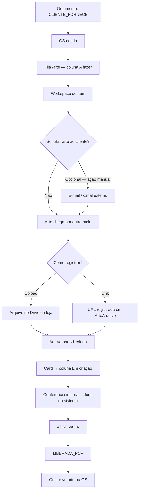

# Arte do cliente — fila, preflight e storage (Google Drive)

**Versão:** 1.0  
**Data:** 2026-06-30  
**Status:** Aprovado para implementação (produto)  
**Base:** [01-especificacao-funcional.md](./01-especificacao-funcional.md) — **revisa** seções 5.1, 5.2, 6.2 e regra 10.1  
**Contexto:** alinhamento após observação operacional — `CLIENTE_FORNECE` não aparecia em `/arte` nem no badge do menu.

---

## 1. Problema observado

### 1.1 Sintoma

No orçamento foi marcado **“Cliente fornece”** (`CLIENTE_FORNECE`). A OS foi gerada com sucesso e o painel de arte na OS exibiu **“Aguardando arquivo do cliente”**. Porém:

- Não apareceu card na fila `/arte`;
- Não apareceu badge no menu **Arte & Aprovação**.

### 1.2 Causa (comportamento atual — correto para spec v0.1)

| Regra atual | Efeito |
|-------------|--------|
| Fila `/arte` filtra `RESPONSABILIDADES_FILA_INTERNA` = `EMPRESA_CRIA` \| `EMPRESA_ADAPTA` | `CLIENTE_FORNECE` **excluído** |
| `resolverStatusArteInicial(CLIENTE_FORNECE)` → `AGUARDANDO_ARQUIVO_CLIENTE`, `arte_fila_desde: null` | Item não entra no critério de badge |
| Badge do menu = itens **novos na fila interna** desde última visita a `/arte` | Não reflete pendência de arquivo do cliente |
| `ArteResumoOsPanel` — botão “Abrir na fila” | Só para `EMPRESA_CRIA` / `EMPRESA_ADAPTA` |

A spec v0.1 tratava `CLIENTE_FORNECE` como **fora da fila do departamento**, assumindo arte pronta sem trabalho interno. Na prática da operação gráfica, **~99% dos arquivos enviados pelo cliente exigem conferência técnica (preflight)** pelo setor de arte antes da produção.

### 1.3 Conclusão de produto

- O orçamentista **não marcou a opção errada** — `CLIENTE_FORNECE` é semanticamente correto quando o cliente envia o arquivo.
- O **produto estava incompleto** para o caso de uso “cliente envia, empresa confere”.
- **Não** usar `EMPRESA_ADAPTA` apenas para aparecer na fila — adaptação é criação/adaptação criativa a partir de referência, não preflight de PDF final.

---

## 2. Objetivos desta feature

1. O departamento de arte **tem ciência imediata** de que precisa do arquivo do cliente para dar continuidade ao projeto.
2. Manter a fila **simples** — sem colunas novas no kanban.
3. **Não** impor checklist de preflight no sistema — a prática interna da empresa já cobre isso.
4. Resolver armazenamento de mídia com **Google Drive da loja**, evitando crescimento de disco no servidor.
5. Definir **onde o gestor da OS** acessa a arte de produção (sempre via Comunikapp, não navegando pastas no Drive).

---

## 3. Escopo

### 3.1 Dentro do escopo (esta feature)

- Inclusão de `CLIENTE_FORNECE` na fila `/arte` (coluna **A fazer**).
- Badge do menu refletindo pendências que exigem ação do dept. arte (incluindo aguardando arquivo).
- Workspace acessível para `CLIENTE_FORNECE` a partir da fila e do painel da OS.
- Registro de arquivo: **upload pelo workspace** ou **colar link** (ex.: arquivo já no Drive).
- Integração com **Google Drive da loja** (Workspace) como storage principal de arquivos de arte.
- Gestor da OS visualiza arte de produção no **resumo da OS** (versão aprovada / liberada).
- Ação manual **“Solicitar arte ao cliente”** no workspace (sem e-mail automático na v1).

### 3.2 Fora do escopo (fases futuras)

- Checklist configurável de preflight no sistema.
- Colunas novas no kanban (Cobrança enviada, Preflight, etc.).
- E-mail automático na aprovação do orçamento/OS.
- Integração WhatsApp (Evolution API) na cobrança de arte.
- Link público de upload para o cliente (sem login).
- Ingestão de arte por reply-to de e-mail.
- Integração com Google Drive **pessoal de cada cliente** (OAuth por cliente).
- SLA visual com alertas por tempo parado (pode vir depois como destaque no card, não como coluna).

---

## 4. Guia de escolha no orçamento

| Intenção real | `responsabilidade_arte` | Entra na fila `/arte`? |
|---------------|-------------------------|------------------------|
| Empresa cria do zero | `EMPRESA_CRIA` | Sim — A fazer |
| Cliente manda referência; empresa monta/adapta | `EMPRESA_ADAPTA` | Sim — A fazer |
| Cliente manda arquivo final; empresa confere (preflight) | `CLIENTE_FORNECE` | **Sim — A fazer** (após esta feature) |
| Sem arte gráfica | `NAO_APLICAVEL` | Não |

### 4.1 Ajuste de labels na UI do orçamento (recomendado)

| Valor | Label atual | Label proposto | Texto de ajuda |
|-------|-------------|----------------|----------------|
| `CLIENTE_FORNECE` | Cliente fornece | **Cliente envia arquivo** | O arquivo será conferido pelo departamento de arte antes da produção. |
| `EMPRESA_ADAPTA` | Adaptação | **Empresa adapta material do cliente** | Cliente envia referência; a equipe produz ou adapta a arte. |
| `EMPRESA_CRIA` | Criação interna | **Empresa cria a arte** | Criação do zero pela equipe interna. |

---

## 5. Fila `/arte` — simplicidade (sem colunas novas)

### 5.1 Princípio

**Não criar abas, seções nem colunas adicionais.** O kanban existente permanece com as mesmas colunas. Itens `CLIENTE_FORNECE` aguardando arquivo aparecem na coluna **A fazer**, com distinção visual por badge no card.

### 5.2 Mapeamento coluna × status

| Coluna kanban (existente) | Status incluídos |
|---------------------------|------------------|
| **A fazer** | `AGUARDANDO_INICIO` (arte interna) **e** `AGUARDANDO_ARQUIVO_CLIENTE` (arte do cliente) |
| **Em criação** | `EM_CRIACAO` (inclui conferência técnica após arquivo recebido) |
| **Aguardando cliente** | `AGUARDANDO_CLIENTE` |
| **Revisão** | `REVISAO_SOLICITADA` |
| **Concluídas** | `APROVADA`, `LIBERADA_PCP` |

### 5.3 Card na coluna A fazer (`CLIENTE_FORNECE`)

Informações mínimas no card:

- `#OS` + nome do produto
- Cliente, prazo da OS
- Badge: **Aguardando arquivo do cliente**
- Thumbnail da referência do orçamento (se houver `arquivo_geometria_url`)
- Tempo desde entrada na fila (`arte_fila_desde`)
- Ação: **Abrir** → `/arte/trabalho/{osId}/{itemId}`

### 5.4 Mudanças na query da fila (backend)

Expandir o critério de inclusão:

```text
ANTES: responsabilidade_arte IN (EMPRESA_CRIA, EMPRESA_ADAPTA)
DEPOIS: responsabilidade_arte IN (EMPRESA_CRIA, EMPRESA_ADAPTA, CLIENTE_FORNECE)
```

Para `CLIENTE_FORNECE`, incluir status:

- `AGUARDANDO_ARQUIVO_CLIENTE` → coluna **A fazer**
- `ARQUIVO_RECEBIDO`, `EM_CRIACAO` → coluna **Em criação** (conferência em andamento)
- Demais status alinhados ao fluxo comum quando aplicável (`AGUARDANDO_CLIENTE`, `APROVADA`, etc.)

### 5.5 Propagação na criação da OS

```text
CLIENTE_FORNECE → status_arte: AGUARDANDO_ARQUIVO_CLIENTE
                → arte_fila_desde: <timestamp da criação da OS>  // ALTERAÇÃO
```

Hoje `arte_fila_desde` é `null` — deve ser preenchido para ordenação, badge e “tempo na fila”.

---

## 6. Badge do menu lateral

### 6.1 Comportamento desejado

O badge em **Arte & Aprovação** deve alertar o departamento sobre itens que **exigem atenção**, incluindo OS com arquivo do cliente pendente.

### 6.2 Critério proposto

Contar itens com pendência de ação do dept. arte:

| Responsabilidade | Status contados no badge |
|------------------|--------------------------|
| `EMPRESA_CRIA` / `EMPRESA_ADAPTA` | `AGUARDANDO_INICIO`, `EM_CRIACAO`, `REVISAO_SOLICITADA` |
| `CLIENTE_FORNECE` | `AGUARDANDO_ARQUIVO_CLIENTE`, `ARQUIVO_RECEBIDO` |

**Nota:** manter ou evoluir o critério “novos desde última visita” conforme decisão de UX — o mínimo desta feature é que `CLIENTE_FORNECE` em `AGUARDANDO_ARQUIVO_CLIENTE` **entre no cálculo**. Se o badge continuar “só novos”, `arte_fila_desde` na criação da OS resolve a visibilidade inicial.

---

## 7. Fluxo operacional

### 7.1 Diagrama



### 7.2 Passo a passo

1. **Orçamento** — operador marca **Cliente envia arquivo** (`CLIENTE_FORNECE`).
2. **OS criada** — item recebe `AGUARDANDO_ARQUIVO_CLIENTE` e entra na fila **A fazer**.
3. **Finalista** abre o workspace (`/arte/trabalho/{osId}/{itemId}`).
4. **[Opcional]** Ação **“Solicitar arte ao cliente”** — envia e-mail com instruções (v1 manual; WhatsApp em fase futura). **Sem disparo automático** na aprovação do orçamento.
5. **Arquivo recebido** (e-mail, WhatsApp, presencial, etc.) — finalista registra no workspace:
   - **Upload** → sistema grava no Drive e cria `ArteVersao` + `ArteArquivo`;
   - **Colar link** → sistema registra metadados apontando para o arquivo existente.
6. Status transita para **`ARQUIVO_RECEBIDO`** ou diretamente **`EM_CRIACAO`**; card vai para **Em criação**.
7. **Conferência técnica** — prática interna da empresa; **sem checklist no Comunikapp**.
8. Após conferência OK → **`APROVADA`** → **`LIBERADA_PCP`** (fluxo existente).
9. **Gestor da OS** vê status e arte de produção no painel resumo da OS.

### 7.3 Cobrança de arte ao cliente

| Aspecto | Decisão v1 |
|---------|------------|
| E-mail automático na aprovação do orçamento | **Não** |
| Ação no workspace | **“Solicitar arte ao cliente”** (disparo manual) |
| WhatsApp | Fase futura (Evolution API) |
| Registro de cobrança | Opcional: `arte_cobranca_enviada_em`, `arte_cobranca_canal` (campos futuros) |

---

## 8. Máquina de estados (mínima)

### 8.1 Status para `CLIENTE_FORNECE`

| Status | Significado | Coluna kanban |
|--------|-------------|---------------|
| `AGUARDANDO_ARQUIVO_CLIENTE` | OS criada; arquivo ainda não registrado no sistema | A fazer |
| `ARQUIVO_RECEBIDO` | Arquivo ou link registrado; aguardando/iniciando conferência | Em criação |
| `EM_CRIACAO` | Conferência ou ajustes em andamento | Em criação |
| `AGUARDANDO_CLIENTE` | Link de aprovação enviado (se aplicável) | Aguardando cliente |
| `REVISAO_SOLICITADA` | Cliente pediu alteração | Revisão |
| `APROVADA` | Arte aprovada para o item | Concluídas |
| `LIBERADA_PCP` | Liberada para produção | Concluídas |

### 8.2 Transições principais

```text
AGUARDANDO_ARQUIVO_CLIENTE
  → ARQUIVO_RECEBIDO | EM_CRIACAO     (upload ou link registrado no workspace)

ARQUIVO_RECEBIDO
  → EM_CRIACAO                              (finalista assume conferência)

EM_CRIACAO
  → AGUARDANDO_CLIENTE                      (envio link aprovação — opcional)
  → APROVADA                                (conferência OK, sem aprovação externa)
  → AGUARDANDO_ARQUIVO_CLIENTE              (arquivo rejeitado; solicitar novo)

AGUARDANDO_CLIENTE → APROVADA | REVISAO_SOLICITADA   (fluxo existente)
REVISAO_SOLICITADA → EM_CRIACAO
APROVADA → LIBERADA_PCP                               (fluxo existente)
```

### 8.3 Lacuna atual a implementar

O status `ARQUIVO_RECEBIDO` **existe na UI** (`ArteStatusTracker`, `ArteResumoOsPanel`), mas **não há transição backend** ao registrar upload/link. Esta feature deve implementar essa transição.

---

## 9. Storage — Google Drive da loja

### 9.1 Decisão

| Opção | Decisão |
|-------|---------|
| Disco local do servidor como storage principal | **Não** — preocupação válida com espaço e escala |
| Google Drive da **loja** (Workspace) | **Sim** — storage principal de arquivos de arte |
| Google Drive **pessoal de cada cliente** | **Não** — permissões frágeis, links que expiram, suporte inviável |
| Comunikapp como índice; Drive como blob | **Sim** — princípio arquitetural |

O modelo `ArteArquivo` já prevê `storage_provider` (`google_drive`, `aws_s3`, `local`). A ADR-002 do módulo define interface multi-provider — Drive é o provider prioritário para produção.

### 9.2 Estrutura de pastas no Drive (criação sob demanda)

No **primeiro upload** de um item, o backend cria a hierarquia se não existir:

```text
Comunikapp/
  └── {Nome do Cliente}/
        └── OS-{numero}/
              └── {Nome do produto/serviço}/
                    └── {arquivos}
```

- Pastas identificadas por `drive_folder_id` persistido (ex.: em `ItemOS` ou tabela de mapeamento).
- Nomenclatura sanitizada (sem caracteres inválidos).
- Uma conta de serviço ou OAuth admin do **Google Workspace da loja**.

### 9.3 Duas vias de registro no workspace

| Via | Fluxo | `storage_provider` |
|-----|-------|-------------------|
| **A — Upload pelo workspace** | Arquivo → API → Drive (pasta do item) → `ArteArquivo` com `drive_file_id` | `google_drive` |
| **B — Colar link** | Finalista cola URL (Drive ou outro) → validação → `ArteArquivo` com URL e metadados | `google_drive` ou `link_externo` |

**Regra:** ambas as vias criam ou associam uma **`ArteVersao`** (ex.: v1 “Arquivo do cliente”). O workspace não é apenas um campo de link solto.

**Upload:** arquivo temporário no servidor apenas durante o transfer para o Drive; **não** manter cópia permanente local.

### 9.4 Configuração (loja)

Campos sugeridos em configuração (extensão de `ConfiguracaoArteLoja` ou entidade dedicada):

| Campo | Descrição |
|-------|-----------|
| `storage_provider_padrao` | `google_drive` |
| `google_drive_root_folder_id` | Pasta raiz “Comunikapp” no Drive da loja |
| `google_service_account_json` ou OAuth refresh token | Credenciais (variáveis de ambiente; nunca no repositório) |

Tela: **Configurações → Arte & Aprovação → Armazenamento**.

---

## 10. Onde cada persona acessa a arte

### 10.1 Princípio

> **Ninguém precisa navegar pastas no Drive manualmente.** O Comunikapp é a porta de entrada; o Drive fica atrás como storage.

### 10.2 Matriz de acesso

| Persona | Onde acessa | O que vê |
|---------|-------------|----------|
| **Finalista / Arte** | `/arte` → workspace | Referência do orçamento, uploads, versões, link público, liberação PCP |
| **Gestor da OS** | `/os/{id}` → painel **Arte & Aprovação** (resumo) | Status por produto; botão **Ver arte de produção** quando houver versão aprovada/liberada |
| **PCP** | Fluxo PCP existente | `ArteVersao` com `liberado_para_pcp = true` |
| **Cliente** | `/arte/aprovacao/[token]` | Apenas versões enviadas para aprovação externa |

### 10.3 Arte de produção (definição)

**Arte de produção** = `ArteVersao` **aprovada** e, para handoff ao PCP, com **`liberado_para_pcp = true`**.

O painel da OS (`ArteResumoOsPanel`) deve:

- Mostrar status atual (incl. `AGUARDANDO_ARQUIVO_CLIENTE`);
- Exibir botão **Abrir workspace** também para `CLIENTE_FORNECE`;
- Quando houver versão de produção: **Ver arte** (preview/download/link Drive via API, sem expor estrutura de pastas).

### 10.4 Anexo do orçamento vs arte de produção

| Origem | Papel |
|--------|-------|
| `arquivo_geometria_url` no item (herdado do orçamento) | Referência, desenho técnico ou rascunho — **não** substitui arte de produção |
| `ArteVersao` + `ArteArquivo` no workspace | Arte de produção conferida e versionada |

Critério `arte_producao_presente` (aprovação técnica da OS): considerar `ArteVersao` aprovada/liberada ou anexo com `finalidade_anexo = ARTE_PRODUCAO` quando `CLIENTE_FORNECE`.

---

## 11. Mudanças de UI resumidas

### 11.1 Orçamento (`ArteProdutoSection`)

- Renomear labels (seção 4.1).
- Sem mudança de valores enum.

### 11.2 Fila `/arte`

- Incluir cards `CLIENTE_FORNECE` na coluna **A fazer**.
- Badge no card: “Aguardando arquivo do cliente”.

### 11.3 Workspace `/arte/trabalho/{osId}/{itemId}`

- Ações: **Upload**, **Registrar link**, **Solicitar arte ao cliente** (v1).
- Reutilizar componentes existentes (`ArteAprovacaoTab`, versões, arquivos).

### 11.4 OS — `ArteResumoOsPanel`

- Botão **Abrir workspace** para `CLIENTE_FORNECE`.
- Botão **Ver arte de produção** quando versão aprovada existir.
- Manter `ArteStatusTracker` com etapas cliente: Aguardando → Recebido → (fluxo comum).

---

## 12. APIs e backend (visão funcional)

### 12.1 Alterações em serviços existentes

| Serviço / util | Alteração |
|----------------|-----------|
| `arte-fila.service.ts` | Incluir `CLIENTE_FORNECE` no `buildWhere`; mapear status para colunas |
| `arte-os-propagacao.util.ts` | `arte_fila_desde: new Date()` para `CLIENTE_FORNECE` |
| `contadores-menu.service.ts` | Incluir pendências `CLIENTE_FORNECE` no badge arte |
| `arte-arquivo.controller` / storage | Provider Google Drive + registro de link |
| Novo: `arte-storage.service.ts` (ou equivalente) | Upload Drive, criar pastas, resolver URLs |

### 12.2 Endpoints novos ou estendidos (sugestão)

```http
POST /arte-aprovacao/os/{osId}/itens/{itemId}/solicitar-arte
  → Dispara e-mail manual; opcionalmente registra cobrança

POST /arte-aprovacao/os/{osId}/itens/{itemId}/registrar-link
  Body: { url: string, descricao?: string }
  → Cria ArteVersao + ArteArquivo; transiciona status

POST /arte-aprovacao/versoes/{versaoId}/arquivos/upload
  → Upload multipart → Drive → ArteArquivo (estender implementação atual)
```

Transições de status via endpoint existente ou dedicado:

```http
PATCH /arte-aprovacao/fila/{itemId}/status
```

---

## 13. Fases de implementação

### Fase A — Visibilidade na fila (MVP operacional)

- [x] `CLIENTE_FORNECE` na query da fila; coluna **A fazer**
- [x] `arte_fila_desde` na propagação OS
- [x] Badge inclui `AGUARDANDO_ARQUIVO_CLIENTE`
- [x] `ArteResumoOsPanel`: botão workspace para `CLIENTE_FORNECE`
- [x] Transição `AGUARDANDO_ARQUIVO_CLIENTE` → `ARQUIVO_RECEBIDO` / `EM_CRIACAO` ao registrar arquivo (upload local temporário OK)

### Fase B — Google Drive

- [x] Configuração credenciais Drive da loja — ver [05-configuracao-google-drive.md](./05-configuracao-google-drive.md)
- [x] Provider upload + estrutura de pastas automática
- [x] Via “colar link” no workspace
- [x] Remover dependência de disco local como storage permanente

### Fase C — Cobrança e gestor

- [x] Ação “Solicitar arte ao cliente” (e-mail)
- [x] Gestor: “Ver arte de produção” no resumo da OS
- [x] Labels do orçamento atualizados

### Fase D — Futuro

- [ ] WhatsApp na cobrança
- [ ] Link público de upload para cliente
- [ ] SLA visual no card (sem coluna nova)
- [ ] E-mail automático configurável na aprovação do orçamento

---

## 14. Revisão da spec v0.1

Esta feature **altera** as seguintes afirmações do [01-especificacao-funcional.md](./01-especificacao-funcional.md):

| Seção original | Antes | Depois |
|----------------|-------|--------|
| 5.1 — tabela `CLIENTE_FORNECE` | Entra na fila: **Não** | Entra na fila: **Sim** (coluna A fazer) |
| 5.2 — status `CLIENTE_FORNECE` | Fora da fila do departamento | Na fila; conferência em **Em criação** |
| 10 — regra 1 | Fila lista apenas arte interna | Fila lista arte interna **e** `CLIENTE_FORNECE` aguardando/recebendo arquivo |
| 6.2 — card da fila | Só Criar/Adaptar | Inclui badge “Aguardando arquivo do cliente” |

Demais regras (precificação, injeção automática só para `EMPRESA_CRIA`/`EMPRESA_ADAPTA`, link público, PCP) **permanecem**.

---

## 15. Decisões fechadas

| # | Pergunta | Decisão |
|---|----------|---------|
| 1 | Nova coluna no kanban para arte do cliente? | **Não** — usar **A fazer** |
| 2 | Checklist de preflight no sistema? | **Não** na v1 |
| 3 | E-mail automático ao aprovar orçamento? | **Não** na v1 |
| 4 | Storage principal | **Google Drive da loja** |
| 5 | Drive do cliente (pessoal)? | **Não** |
| 6 | Gestor acessa arte onde? | **Resumo da OS** + índice de versões no Comunikapp |
| 7 | `EMPRESA_ADAPTA` para forçar fila? | **Não** — usar `CLIENTE_FORNECE` corretamente |
| 8 | Duas vias de arquivo | **Upload** (→ Drive) **e** **colar link** |

---

## 16. Referências técnicas

| Área | Caminho |
|------|---------|
| Spec módulo (base) | `docs/arte-aprovacao-modulo/01-especificacao-funcional.md` |
| Design técnico Fase 1 | `docs/arte-aprovacao-modulo/02-design-tecnico-fase1-backend.md` |
| Fila backend | `backend/src/modules/arte-aprovacao/services/arte-fila.service.ts` |
| Enums / fila interna | `backend/src/modules/arte-aprovacao/constants/arte.enums.ts` |
| Propagação OS | `backend/src/modules/arte-aprovacao/utils/arte-os-propagacao.util.ts` |
| Painel OS | `frontend/src/components/os/arte-aprovacao/components/ArteResumoOsPanel.tsx` |
| Página fila | `frontend/src/app/(main)/arte/page.tsx` |
| Schema arquivos | `backend/prisma/schema.prisma` → `ArteArquivo.storage_provider` |
| ADR storage | `docs/arte-aprovacao/implementacao/adr-decisions.md` → ADR-002 |
| Multer local (transitório) | `backend/src/config/multer.config.ts` |

---

## Changelog

| Data | Versão | Alteração |
|------|--------|-----------|
| 2026-06-30 | 1.1 | Fases A–C implementadas; link para guia de configuração Drive (doc 05) |
| 2026-06-30 | 1.0 | Documento inicial — arte do cliente na fila, preflight sem checklist, storage Drive, acesso gestor |
