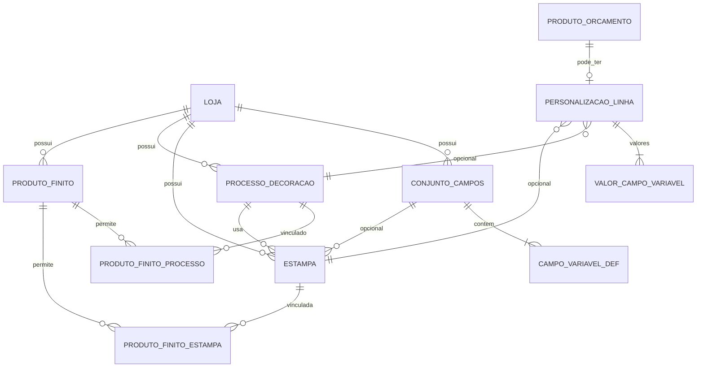

# 04 — Modelo de dados

**Versão:** 0.2  
**Data:** 2026-06-26  
**Status:** Proposta — validar antes das migrations  
**Branch:** `feature/catalogo-escala-e-seguranca`

---

## 1. Diagrama de entidades



---

## 2. Entidades novas

### 2.1 `processos_decoracao` (Personalização)

| Campo | Tipo | Notas |
|-------|------|-------|
| id | uuid/cuid | PK |
| loja_id | string | FK, índice |
| codigo | string | único por loja, opcional |
| nome | string | ex.: Silk 1 cor |
| descricao | text | opcional |
| exige_arte_aprovada | boolean | default false para VDP simples |
| insumos_aceitos | json | `["ARQUIVO","TEXTO","VETOR"]` |
| preco_base | decimal | opcional; preço unitário base quando não há faixas |
| **custo_setup** | decimal(10,2) | default `0.00` — cobrado **uma vez por linha** de orçamento/OS |
| **faixas_preco** | json | Quantity Breaks — ex.: `[{"min":1,"max":10,"preco":5.00},{"min":11,"max":100,"preco":3.00},{"min":101,"max":null,"preco":2.50}]`. `max: null` = sem teto. Faixas não podem se sobrepor; validar no cadastro. |
| setor_pcp_sugerido | string | opcional, integração PCP |
| ativo | boolean | default true |
| criado_em / atualizado_em | datetime | auditoria |

**Cálculo de linha (referência):**

```text
total_personalizacao = custo_setup + (quantidade × preco_unitario_faixa)
```

Onde `preco_unitario_faixa` é resolvido pela quantidade total da linha (após soma da grade, se houver).

### 2.2 `conjuntos_campos`

| Campo | Tipo | Notas |
|-------|------|-------|
| id | PK | |
| loja_id | FK | |
| nome | string | ex.: Nome + Mensagem |
| descricao | text | opcional |
| ativo | boolean | |

### 2.3 `campos_variaveis_def` (filhas do conjunto)

| Campo | Tipo | Notas |
|-------|------|-------|
| id | PK | |
| conjunto_id | FK | |
| chave | string | `nome`, `descricao` — estável para template |
| label | string | "Nome" na UI |
| tipo | enum | `TEXTO`, `NUMERO`, `DATA` |
| obrigatorio | boolean | |
| max_caracteres | int | nullable |
| fonte_sugerida | string | opcional, hint produção |
| ordem | int | exibição |
| placeholder | string | opcional |

> Estampas podem ter campos **inline** (sem conjunto) via mesma estrutura em `estampa_campos_def` OU obrigar conjunto — Ver decisão #3 em [09-decisoes-pendentes.md](./09-decisoes-pendentes.md).

### 2.4 `estampas`

| Campo | Tipo | Notas |
|-------|------|-------|
| id | PK | |
| loja_id | FK | |
| codigo | string | opcional |
| nome | string | |
| processo_id | FK | processos_decoracao |
| conjunto_campos_id | FK | nullable |
| arte_mestra_url | string | storage |
| thumb_url | string | opcional |
| preco_adicional | decimal | default 0 |
| ativo | boolean | |
| metadados | json | **âncoras / bounding boxes** das variáveis na arte-mestra (ver [05-cadastros-crud.md](./05-cadastros-crud.md)) |

### 2.5 `produto_finito_variacoes` (Matriz de Atributos — Grade)

Extensão leve para variações físicas do mesmo SKU base. Alternativa rejeitada na v1: N SKUs duplicados por tamanho/cor.

| Campo | Tipo | Notas |
|-------|------|-------|
| id | PK | |
| produto_finito_id | FK | produto “pai” |
| loja_id | FK | índice — **obrigatório em toda query** |
| sku_variacao | string | opcional; único por loja se preenchido |
| atributos | json | ex.: `{"tamanho":"M","cor":"Azul"}` — chaves definidas no cadastro do produto |
| estoque_atual | int | opcional; default 0 |
| preco_ajuste | decimal | opcional; delta sobre `preco_venda` do pai |
| ativo | boolean | default true |

**`produto_finito_atributos_def`** (opcional, no pai)

| Campo | Notas |
|-------|-------|
| produto_finito_id | FK |
| chave | ex.: `tamanho`, `cor` |
| label | "Tamanho" |
| opcoes | json array `["P","M","G"]` ou livre |
| ordem | int |

**No orçamento:** `personalizacao_orcamento.grade_distribuicao` (json):

```json
[
  {"atributos": {"tamanho": "P"}, "quantidade": 20},
  {"atributos": {"tamanho": "M"}, "quantidade": 50},
  {"atributos": {"tamanho": "G"}, "quantidade": 30}
]
```

Soma das quantidades da grade **deve** igualar `ProdutoOrcamento.quantidade`. Se o produto não tiver variações cadastradas, o bloco de grade fica oculto (retrocompatível).

### 2.6 Tabelas de vínculo (produto finito)

**`produto_finito_modos`** (ou colunas no produto)

| Campo | Notas |
|-------|-------|
| produto_finito_id | FK |
| modo | `NENHUM`, `ESTAMPA`, `IMPRINT_LIVRE`, `ARTE_SOB_MEDIDA` |
| habilitado | boolean |

**`produto_finito_estampas`**

| produto_finito_id | estampa_id | PK composta |

**`produto_finito_processos`** (imprint livre)

| produto_finito_id | processo_id | PK composta |

---

## 3. Extensões em entidades existentes

### 3.1 `ProdutoFinito` (já existe)

Adicionar (proposta):

| Campo | Tipo | Notas |
|-------|------|-------|
| personalizavel | boolean | default false |
| fulfillment_padrao | enum | `ESTOQUE`, `PRODUCAO`, `HIBRIDO` — opcional v1 |

### 3.2 `ProdutoOrcamento` (Orçamento V2)

Nova tabela filha ou JSON estruturado — ver decisão D1 em [09-decisoes-pendentes.md](./09-decisoes-pendentes.md).

**`personalizacao_orcamento`** (recomendado: tabela)

| Campo | Tipo |
|-------|------|
| id | PK |
| produto_orcamento_id | FK único |
| modo | enum |
| estampa_id | FK nullable |
| processo_id | FK nullable |
| valores_campos | json polimórfico | Ver **§3.2.1** |
| grade_distribuicao | json nullable | Matriz de atributos — ver §2.5 |
| arte_producao_url | string nullable | Ver **§3.2.2** |
| preview_url | string nullable | TTL / Signed URL — ver §7 |

#### 3.2.1 Payload polimórfico `valores_campos`

Campo **explicitamente polimórfico**. Validar com Zod no backend antes de persistir.

| Cenário | Quantidade | Formato JSON | Exemplo |
|---------|------------|--------------|---------|
| Unidade simples | 1 | `Record<string, string>` | `{"nome":"Elisa","frase":"Parabéns"}` |
| VDP em lote | &gt; 1 | `Record<string, string>[]` | `[{"nome":"Ana",...},{"nome":"Bruno",...}]` — length ≤ quantidade da linha |
| Híbrido grade + VDP | &gt; 1 | Array alinhado à expansão das unidades | Cada elemento do array corresponde a **uma unidade** após expansão da grade |

**Regras:**

- Chaves permitidas = união das chaves do `conjunto_campos` / `estampa_campos_def` da estampa selecionada.
- Modo `Record` quando `quantidade === 1` **ou** todos os registros do lote são idênticos (otimização opcional).
- Importação CSV popula o formato array; UI inline com qty=1 usa objeto simples.

#### 3.2.2 Ciclo de vida `arte_producao_url`

| Fase | Comportamento |
|------|----------------|
| Orçamento salvo | `null` ou preview provisório em `preview_url` |
| Aprovação / fechamento | Job assíncrono gera arte de produção |
| **VDP em lote** | Backend consolida **um único PDF multi-páginas** (*Print-Ready PDF*): página 1 = registro[0] + arte mestra; página N = registro[N-1]. Motor de merge usa `metadados` (bounding boxes) da estampa. |
| OS / PCP | `ItemOS.valores_personalizacao` espelha o JSON; `arte_producao_url` aponta para `uploads/{loja_id}/arte-producao/{os_id}/{item_id}.pdf` |
| Expedição | Mesmo arquivo; sem regeneração salvo revisão de estampa |

Arquivos gerados: path isolado por tenant; download apenas com validação `loja_id`.

### 3.3 `ItemOS` (pós-conversão orçamento → OS)

Herdar modo e status de personalização; alinhar com `responsabilidade_arte` / `status_arte` existentes.

| Campo novo (proposta) | Notas |
|-----------------------|-------|
| modo_fulfillment | `PICK`, `MAKE`, `HIBRIDO` |
| personalizacao_modo | espelho do orçamento |
| estampa_id | nullable |
| valores_personalizacao | json polimórfico | Mesmo contrato de `valores_campos` (§3.2.1) |
| grade_distribuicao | json nullable | Espelho do orçamento |
| arte_producao_url | string nullable | PDF print-ready — §3.2.2 |

---

## 4. Regras de integridade

1. `estampa.processo_id` obrigatório.
2. Estampa deve ter conjunto de campos **ou** ≥1 campo inline.
3. `produto_finito_estampas` só referencia estampas `ativo=true` da mesma loja.
4. Linha de orçamento com `modo=ESTAMPA` exige `estampa_id` e valores para campos obrigatórios.
5. Linha com `modo=IMPRINT_LIVRE` exige `processo_id` e conteúdo conforme `insumos_aceitos`.
6. `grade_distribuicao`: soma de `quantidade` = `ProdutoOrcamento.quantidade` quando presente.
7. `valores_campos` em modo array: `length` ≤ quantidade da linha; cada objeto validado contra esquema do conjunto de campos.
8. `faixas_preco`: faixas contíguas sem overlap; `min` ≥ 1; última faixa pode ter `max: null`.
9. `custo_setup` aplicado **uma vez** por `personalizacao_orcamento`, não multiplicado pela quantidade.

---

## 5. Índices sugeridos

- `(loja_id, ativo)` em estampas e processos.
- `(produto_finito_id)` em vínculos.
- `(produto_orcamento_id)` único em personalizacao_orcamento.

---

## 6. Migração

- **Somente aditiva** — não alterar comportamento de linhas legadas sem `personalizacao_orcamento`.
- Produtos finitos existentes: `personalizavel=false` por default.
- `custo_setup` default `0.00`; `faixas_preco` default `[]` (usa `preco_base` do processo).
- Sem tabela `produto_finito_variacoes` na v1 mínima: grade pode viver só em JSON na linha até migration da tabela filha.

---

## 7. Validação de segurança no modelo de dados

Alinhado a [01-visao-escopo.md §8](./01-visao-escopo.md).

| Controle | Onde aplicar |
|----------|--------------|
| **A01 BOLA** | FK + `loja_id` em todas as entidades novas; índice composto `(loja_id, id)`; services rejeitam recurso de outra loja com `403`. |
| **A03 Injection** | DTO `ImportVdpCsvDto` + sanitização de fórmulas; `ValoresCamposSchema` Zod discriminated union: `z.record(z.string())` \| `z.array(z.record(z.string()))`. |
| **A04 Design** | Paths de storage por tenant; `preview_url` com expiração em tabela auxiliar ou storage assinado. |
| **A05 Misconfiguration** | Upload estampa: whitelist MIME no `FileInterceptor`; limite de linhas CSV em config. |

**Query pattern obrigatório (exemplo Prisma):**

```typescript
await prisma.estampa.findFirst({
  where: { id: estampaId, loja_id: usuario.loja_id, ativo: true },
});
```

Nunca:

```typescript
// PROIBIDO — vulnerável a BOLA
await prisma.estampa.findUnique({ where: { id: estampaId } });
```
