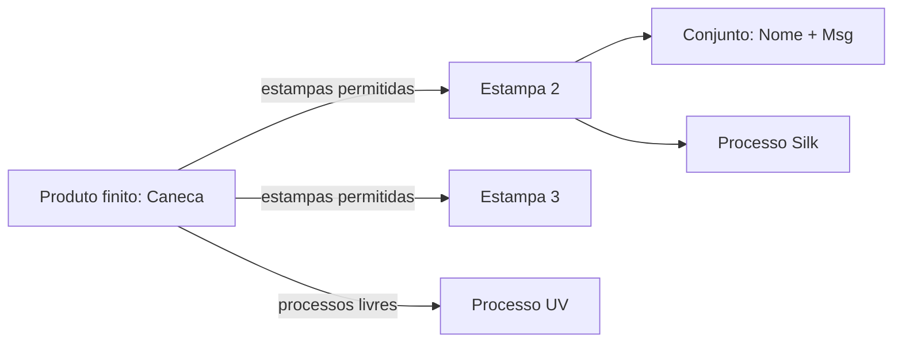

# 06 — Produto finito e vínculos de personalização

**Versão:** 0.1  
**Data:** 2026-06-26

---

## 1. O que o cadastro do produto define

O formulário do **produto finito** responde: *“O que posso oferecer ao vender este SKU?”*

**Não** responde: *“Qual nome o cliente quer?”* — isso é no orçamento.

---

## 2. Estrutura do formulário (abas sugeridas)

### Aba 1 — Identificação (existente)

- Nome, SKU, categoria, descrição, imagens, ativo.

### Aba 2 — Preço e logística (existente)

- Preço venda, promocional, peso, dimensões, estoque_atual.

### Aba 3 — Personalização (nova)

#### 3.1 Switch principal

```
[ ] Este produto pode ser personalizado
```

Se desligado: esconder restante; produto = só pick/expedição.

#### 3.2 Modos permitidos (multi-checkbox)

```
Modos disponíveis na venda:
  [x] Estampa do catálogo
  [x] Personalização livre (processo + texto/arquivo)
  [ ] Arte sob medida (fase futura — desabilitado em v1)
```

Pelo menos um modo se personalizável = sim.

#### 3.3 Estampas compatíveis (se modo Estampa)

- Grid com **thumbnails** das estampas ativas da loja.
- Multi-select com busca.
- Filtro opcional: “mostrar só estampas da categoria X”.
- Empty state: link “Cadastrar estampa” → hub.

#### 3.4 Processos para personalização livre (se modo Imprint livre)

- Multi-select da lista **Personalização** (processos).
- Ex.: UV, Laser.

#### 3.5 Fulfillment padrão (opcional v1)

```
Quando personalizado, o fluxo operacional padrão é:
  ( ) Só separação (estoque) — raro se personaliza
  (•) Produção (personalizar antes de expedir)
  ( ) Híbrido (reservar produto + personalizar)
```

Default recomendado: **Híbrido** ou **Produção** quando qualquer modo de personalização estiver ativo.

---

## 3. Exemplo completo: Caneca

| Campo cadastro | Valor |
|----------------|-------|
| Nome | Caneca 350 ml branca |
| Personalizável | Sim |
| Modos | Estampa + Personalização livre |
| Estampas | Estampa Aniversário, Estampa Corporativa |
| Processos livres | UV digital |
| Preço base | R$ 15,00 |

**Não cadastrar:** Nome “Elisa”, texto “Eu te amo”.

---

## 4. Como o produto “puxa” os CRUDs



- Produto **não copia** campos da estampa — só IDs de vínculo.
- Na venda, ao escolher Estampa 2, o orçamento **lê** campos de Estampa 2 → Conjunto.

---

## 5. Validações no save do produto

| Regra | Mensagem |
|-------|----------|
| Personalizável sem modo | “Selecione ao menos um modo de personalização” |
| Modo Estampa sem estampas | “Selecione ao menos uma estampa ou desative o modo” |
| Modo Imprint sem processos | “Selecione ao menos um processo” |
| Estampa de outra loja | Bloquear (tenant) |

---

## 6. API — extensões sugeridas

`PATCH /produtos-finitos/:id`

```json
{
  "personalizavel": true,
  "modos_habilitados": ["ESTAMPA", "IMPRINT_LIVRE"],
  "estampa_ids": ["uuid-1", "uuid-2"],
  "processo_ids": ["uuid-uv"]
}
```

`GET /produtos-finitos/:id/para-orcamento` — enriquecer com:

- modos, estampas (thumb, nome, preco_adicional, campos), processos livres.

---

## 7. Compatibilidade com produtos legados

| Situação | Comportamento |
|----------|---------------|
| Produto sem campos novos | `personalizavel=false`, orçamento inalterado |
| Orçamento antigo com PRODUTO_FINITO | Sem bloco personalização |

---

## 8. Relação com estoque

- Produto finito mantém `estoque_atual` (campo próprio) até integração com `estoque_itens`.
- Personalização **não consome** estoque de insumo de processo na v1 (decisão futura).
- Reserva de unidades na OS: ver [08-integracao-operacional.md](./08-integracao-operacional.md).
