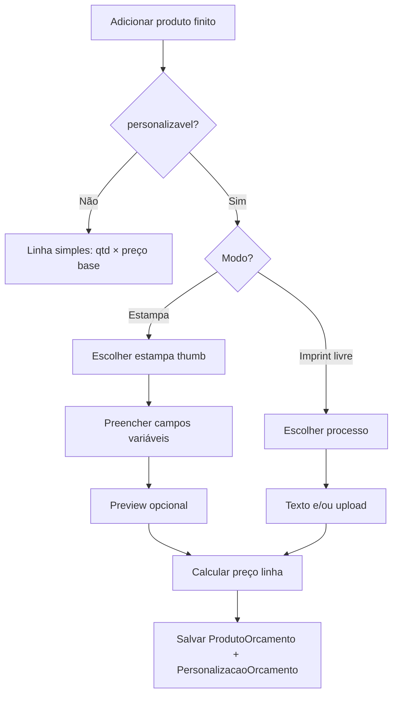

# 07 — Fluxo no orçamento

**Versão:** 0.2  
**Data:** 2026-06-26

---

## 1. Onde acontece

- **Módulo:** Orçamento V2 (`orcamentos-v2`).
- **Ponto de entrada:** adicionar produto da prateleira (`ProdutoPrateleiraSelectionModal` / `PRODUTO_FINITO`).
- **Fora do hub Catálogo** — vendedor não sai do orçamento.

---

## 2. Fluxo geral



---

## 3. Cenário A — Sem personalização

```
Caneca 350 ml
Quantidade: 100
Preço unitário: R$ 15,00
Total: R$ 1.500,00
```

Sem bloco extra. Comportamento atual preservado.

---

## 4. Cenário B — Estampa com variáveis

```
Caneca 350 ml
Personalizar: Sim
Modo: Estampa do catálogo
Estampa: [● Estampa 2 - Aniversário]  (grid thumbs — só vinculadas ao produto)

Campos:
  Nome *        [ Elisa                    ] 5/50
  Descrição *   [ Eu te amo                ] 9/120

Preço:
  Base:     R$ 15,00
  Estampa:  R$  8,00
  Unitário: R$ 23,00 × 100 = R$ 2.300,00
```

### 4.1 Validações

- Estampa obrigatória.
- Campos obrigatórios preenchidos.
- Respeitar `max_caracteres`.
- Estampa deve estar na lista permitida do produto.

### 4.2 Preview

- v1: thumb da estampa + overlay textual simples **ou** mensagem “Prova gerada após salvar”.
- v2: render PDF/imagem com valores aplicados.

### 4.3 VDP em lote (quantidade > 1)

Ver especificação de UI em [03-ia-ux-hub.md §4.3](./03-ia-ux-hub.md).

- Alternância **Digitar Inline** vs **Importar Planilha (CSV/Excel)**.
- Mapeamento de colunas do CSV às chaves do `conjunto_campos`.
- Persistência: `valores_campos` como `Record<string, string>[]` — ver [04-modelo-de-dados.md §3.2.1](./04-modelo-de-dados.md).
- Após fechamento: `arte_producao_url` = PDF multi-páginas print-ready (§3.2.2).

### 4.4 Precificação com Setup e Quantity Breaks

```
Total decoração = custo_setup (único) + quantidade × preco_unitario_faixa
Total linha     = (preco_base + preco_adicional_estampa) × qty + total decoração
```

Faixas resolvidas pelo processo vinculado à estampa (`processos_decoracao.faixas_preco`).

---

## 5. Cenário C — Personalização livre (UV + texto)

```
Caneca 350 ml
Personalizar: Sim
Modo: Personalização livre
Processo: UV digital

Conteúdo:
  (•) Texto   [ Eu te amo ]
  ( ) Arquivo [ upload ]

Posição: Lateral (se produto tiver zonas cadastradas — futuro)

Preço:
  Base:     R$ 15,00
  Processo: R$ 12,00
  Unitário: R$ 27,00
```

---

## 6. Cenário D — Mesmo orçamento, linhas diferentes

| Linha | Produto | Modo |
|-------|---------|------|
| 1 | Caneca | Estampa 2 |
| 2 | Caneca | Sem personalização |
| 3 | Adesivo | Modelo calculado (não finito) |

Cada linha `PRODUTO_FINITO` carrega seu próprio registro de personalização.

---

## 7. Persistência

### 7.1 Ao salvar orçamento

- `ProdutoOrcamento` existente + `personalizacao_orcamento` (1:1).
- `valores_campos` polimórfico: objeto (`qty=1`) ou array (`qty>1`, VDP) — [04-modelo-de-dados.md §3.2.1](./04-modelo-de-dados.md).
- `grade_distribuicao` quando produto tiver variações.
- Snapshot opcional: nome da estampa, preços no momento (histórico).

### 7.2 Ao duplicar / revisar orçamento

- Rehidratar campos a partir de `personalizacao_orcamento`.
- Se estampa foi desativada: aviso + forçar nova seleção.

---

## 8. Preço — regras v1

```
preco_unitario_produto = preco_base_produto + estampa.preco_adicional (se estampa)

custo_decoracao = processo.custo_setup
                + quantidade × preco_unitario_faixa(processo.faixas_preco, quantidade)

preco_linha = (preco_unitario_produto × quantidade) + custo_decoracao
              + ajustes_manuais_vendedor (se permitido)
```

Se `faixas_preco` vazio, usar `processo.preco_base` como unitário da decoração.

Promoção: `preco_promocional` do produto substitui **só** preço base, não adicional de estampa (decisão pendente).

---

## 9. UI — componentes sugeridos

| Componente | Uso |
|------------|-----|
| `PersonalizacaoToggle` | Sim/não na linha |
| `ModoPersonalizacaoSelect` | Estampa / Livre |
| `EstampaThumbGrid` | Seleção visual |
| `CamposVariaveisForm` | Dinâmico a partir da estampa |
| `VdpModoToggle` | Inline vs Importar planilha (qty > 1) |
| `CsvColumnMapper` | Mapeamento colunas → chaves conjunto_campos |
| `GradeDistribuicaoMini` | Matriz de atributos P/M/G |
| `ImprintLivreForm` | Processo + texto/arquivo |

Inserir no fluxo existente de `ProdutoSection` / modal de prateleira.

---

## 10. Conversão orçamento → OS

Ao aprovar orçamento e gerar OS:

- Copiar `modo`, `estampa_id`, `processo_id`, `valores_campos` para `ItemOS`.
- Definir `responsabilidade_arte` / `status_arte` conforme modo:
  - Estampa VDP: arte OK se só variáveis validadas.
  - Imprint livre com arquivo: pode exigir arte.
  - Imprint só texto: política a definir (auto-aprovação vs arte).

Ver [08-integracao-operacional.md](./08-integracao-operacional.md).

---

## 11. Critérios de aceite (orçamento)

- [ ] Vendedor orça caneca sem personalização (regressão zero).
- [ ] Vendedor orça caneca com Estampa 2 + 2 campos.
- [ ] Vendedor orça caneca UV livre com texto.
- [ ] Estampas não vinculadas ao produto **não** aparecem.
- [ ] Preço total reflete base + adicional.
- [ ] Orçamento salvo reabre com dados corretos.
