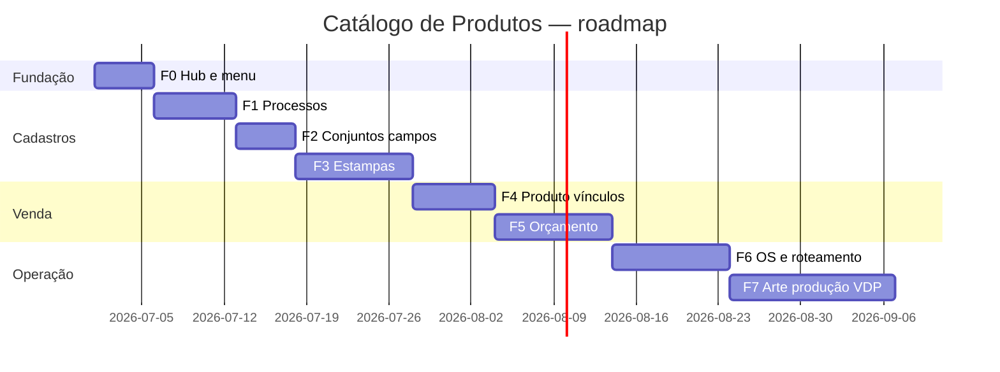

# 10 — Plano de implementação

**Versão:** 0.1  
**Data:** 2026-06-26

Plano em fases incrementais. Cada fase entrega valor testável sem quebrar o existente.

**Pré-requisito:** Validar itens **CRÍTICOS** em [09-decisoes-pendentes.md](./09-decisoes-pendentes.md).

---

## Visão das fases

(Datas ilustrativas — ajustar na sprint planning.)

---

## Fase 0 — Hub e navegação

**Objetivo:** Estrutura de módulo sem lógica de personalização ainda.

### Entregas

- [ ] Página hub `/catalogo` com cards (sem KPIs).
- [ ] Renomear menu lateral: **Catálogo de produtos**.
- [ ] Card **Produtos** → grid atual (`/produtos-finitos` ou alias `/catalogo/produtos`).
- [ ] Cards Personalização, Estampas, Conjuntos → placeholder “Em breve” ou 404 amigável.
- [ ] Redirect `/produtos-finitos` → mantido.
- [ ] **Modelos de Orçamento** permanece no menu sem alteração.

### Critérios de aceite

- [ ] Usuário acessa hub e abre lista de produtos finitos.
- [ ] Nenhuma regressão em orçamento com prateleira.

### Arquivos impactados (estimativa)

- `frontend/src/app/(main)/layout.tsx`
- `frontend/src/app/(main)/catalogo/page.tsx` (novo)

---

## Fase 1 — CRUD Personalização (processos)

**Objetivo:** Master data de processos de decoração.

### Entregas

- [ ] Migration `processos_decoracao`.
- [ ] Module NestJS + CRUD API multi-tenant.
- [ ] Telas lista + formulário no hub.
- [ ] Seeds opcionais: UV, Silk, Laser.

### Critérios de aceite

- [ ] CRUD completo por loja.
- [ ] Processo inativo não listado em selects.

---

## Fase 2 — CRUD Conjuntos de campos

**Objetivo:** Grupos reutilizáveis de variáveis.

### Entregas

- [ ] Migration `conjuntos_campos` + `campos_variaveis_def`.
- [ ] API + UI com tabela de campos editável.
- [ ] Validação chaves únicas e tipos.

### Critérios de aceite

- [ ] Criar conjunto “Nome + Mensagem” com 2 campos texto.
- [ ] Listar conjuntos no hub.

**Depende de:** D3 (modelo inline vs conjunto).

---

## Fase 3 — CRUD Estampas

**Objetivo:** Biblioteca visual com vínculo a processo e campos.

### Entregas

- [ ] Migration `estampas`.
- [ ] Upload arte mestra + thumb.
- [ ] Formulário: processo, conjunto de campos, preço adicional.
- [ ] Lista em grid com thumbnails.

### Critérios de aceite

- [ ] Estampa 2 com silk + conjunto “Nome + Mensagem” cadastrada.
- [ ] Preview na lista.

**Depende de:** Fase 1, Fase 2.

---

## Fase 4 — Produto finito: vínculos

**Objetivo:** Produto define modos e estampas/processos permitidos.

### Entregas

- [ ] Migration colunas + tabelas de vínculo em `ProdutoFinito`.
- [ ] Aba Personalização no `ProdutoFinitoForm`.
- [ ] API PATCH com `estampa_ids`, `processo_ids`, `modos`.
- [ ] Enriquecer `GET .../para-orcamento`.

### Critérios de aceite

- [ ] Caneca vinculada a 2 estampas e processo UV.
- [ ] Produto não personalizável sem aba extra funcional.

Ver [06-produto-finito-vinculos.md](./06-produto-finito-vinculos.md).

---

## Fase 5 — Orçamento

**Objetivo:** Vendedor personaliza linha de produto finito.

### Entregas

- [ ] Migration `personalizacao_orcamento` (ou decisão D1).
- [ ] UI: modo, grid estampas, formulário campos, imprint livre.
- [ ] Cálculo preço base + adicional.
- [ ] Persistência e reabertura do orçamento.

### Critérios de aceite

- [ ] Cenários A, B e C de [07-fluxo-orcamento.md](./07-fluxo-orcamento.md).
- [ ] Regressão: linhas sem personalização intactas.

**Depende de:** Fase 4, D1.

---

## Fase 6 — OS e roteamento operacional

**Objetivo:** Item na OS com fulfillment correto; PCP vs expedição.

### Entregas

- [ ] Campos em `ItemOS` ao converter orçamento.
- [ ] `modo_fulfillment` derivado automaticamente.
- [ ] Elegibilidade PCP / arte por item alinhada ao modo.
- [ ] Documentar em [08-integracao-operacional.md](./08-integracao-operacional.md).

### Critérios de aceite

- [ ] Caneca sem personalização → expedição, não PCP.
- [ ] Caneca com estampa → elegível PCP após prazo/arte.
- [ ] OS mista com liberação parcial.

**Depende de:** Fase 5, D4.

---

## Fase 7 — Arte de produção VDP (opcional / refinamento)

**Objetivo:** Gerar arquivo final mestra + variáveis.

### Entregas

- [ ] Serviço geração preview/PDF.
- [ ] Anexo arte de produção no item.
- [ ] Prova ao cliente (link ou PDF) — opcional.

---

## Riscos e mitigações

| Risco | Mitigação |
|-------|-----------|
| Escopo inflado na Fase 5 UI | Entregar Estampa antes de Imprint livre |
| Conflito com arte legado | Modos claros + status_arte por item (D4) |
| Menu confuso | Um hub; Modelos de Orçamento separado |
| Migration pesada | Só aditiva; defaults seguros |

---

## Checklist antes de cada PR

- [ ] `loja_id` em todas as queries novas.
- [ ] Migrations reversíveis documentadas.
- [ ] Produto finito legado sem personalização testado.
- [ ] Docs deste RP atualizados se decisão mudou.

---

## Ordem de leitura para dev novo

1. [README.md](./README.md)
2. [01-visao-escopo.md](./01-visao-escopo.md)
3. [02-glossario.md](./02-glossario.md)
4. [04-modelo-de-dados.md](./04-modelo-de-dados.md)
5. [09-decisoes-pendentes.md](./09-decisoes-pendentes.md) — fechar D1–D3
6. Fase atual neste plano
