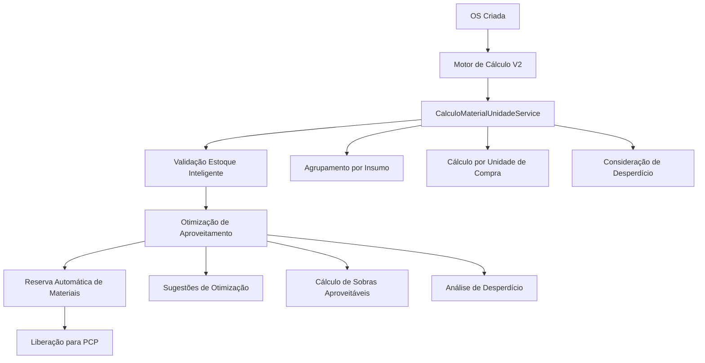

# 🧮 Melhorias no Cálculo de Materiais Inteligente - OS para PCP

## 📋 **Visão Geral**

Este documento detalha as melhorias propostas para o sistema de cálculo de materiais na transição de Orçamento → OS → PCP, implementando um sistema inteligente de cálculo por unidades de produção (bobinas, chapas, rolos) com otimização de aproveitamento e controle de desperdício.

## 🎯 **Problemas Identificados**

### **1. Cálculo Atual (Básico)**
- ❌ Sistema calcula apenas área total necessária (m²)
- ❌ Não converte para unidades de compra (bobinas, chapas)
- ❌ Não considera desperdício padrão
- ❌ Não sugere otimizações de aproveitamento
- ❌ Validação de estoque simplificada (TODO não implementado)

### **2. Exemplo do Problema**
```
OS: 120m² de banner
Material: Bobina 1,60m x 30m = 48m²
Cálculo atual: 120m² ÷ 48m² = 2,5 bobinas → 3 bobinas
Problema: Não considera desperdício, sobras aproveitáveis, otimização
```

## 🚀 **Solução Proposta: Sistema Inteligente**

### **1. Arquitetura do Sistema**



### **2. Estrutura de Dados**

#### **Interface de Insumo com Unidade**
```typescript
interface InsumoComUnidade {
  id: string;
  nome: string;
  unidade_compra: string; // BOBINA, CHAPA, ROLO, FOLHA
  unidade_uso: string;    // M², M, UN, L
  dimensoes: {
    largura: number;      // metros
    altura: number;       // metros
    area_total: number;   // m² por unidade
  };
  estoque_atual: number;  // quantidade de unidades
  estoque_minimo: number;
  desperdicio_padrao: number; // % de desperdício
  localizacao_estoque: string;
  custo_por_unidade: number;
}
```

#### **Interface de Cálculo Inteligente**
```typescript
interface CalculoMaterialInteligente {
  insumo_id: string;
  nome: string;
  area_necessaria: number;        // m² total necessário
  unidades_necessarias: number;   // quantas bobinas/chapas
  unidades_disponiveis: number;   // quantas tem em estoque
  sobra_aproveitavel: number;     // m² que sobrará
  desperdicio_estimado: number;   // m² de desperdício
  custo_total_estimado: number;   // custo total dos materiais
  otimizacao: {
    pode_otimizar: boolean;
    sugestoes: string[];
    alternativa_dimensoes?: {
      largura: number;
      altura: number;
      area_total: number;
      desperdicio_reduzido: number;
    };
  };
  status_disponibilidade: 'DISPONIVEL' | 'ESTOQUE_BAIXO' | 'INDISPONIVEL';
}
```

## 🔧 **Implementação Técnica**

### **1. Serviço Principal**

```typescript
@Injectable()
export class CalculoMaterialUnidadeService {
  constructor(
    private readonly prisma: PrismaService,
    private readonly validacaoEstoqueService: ValidacaoEstoqueService
  ) {}

  /**
   * Calcula materiais necessários por unidade de produção
   */
  async calcularMateriaisPorUnidade(
    produtos: ProdutoOS[],
    lojaId: string
  ): Promise<CalculoMaterialInteligente[]> {
    
    const resultados: CalculoMaterialInteligente[] = [];
    
    // 1. Agrupar insumos por tipo
    const insumosAgrupados = this.agruparInsumosPorTipo(produtos);
    
    // 2. Calcular para cada insumo
    for (const [insumoId, dados] of insumosAgrupados) {
      const insumoEstoque = await this.buscarInsumoEstoque(insumoId, lojaId);
      
      if (!insumoEstoque) continue;
      
      const calculo = await this.calcularInsumoInteligente(
        dados,
        insumoEstoque
      );
      
      resultados.push(calculo);
    }
    
    return resultados;
  }

  /**
   * Agrupa insumos por tipo, somando áreas necessárias
   */
  private agruparInsumosPorTipo(produtos: ProdutoOS[]): Map<string, any> {
    const agrupados = new Map();
    
    for (const produto of produtos) {
      for (const insumo of produto.insumos) {
        const insumoId = insumo.insumo.id;
        
        if (!agrupados.has(insumoId)) {
          agrupados.set(insumoId, {
            nome: insumo.insumo.nome,
            area_total: 0,
            quantidade_produto: produto.quantidade,
            produtos: []
          });
        }
        
        // Somar área necessária
        const areaInsumo = insumo.quantidade * produto.quantidade;
        const dados = agrupados.get(insumoId);
        dados.area_total += areaInsumo;
        dados.produtos.push({
          nome: produto.nome,
          quantidade: produto.quantidade,
          area_necessaria: insumo.quantidade
        });
      }
    }
    
    return agrupados;
  }

  /**
   * Calcula insumo específico com otimizações
   */
  private async calcularInsumoInteligente(
    dados: any,
    insumoEstoque: InsumoComUnidade
  ): Promise<CalculoMaterialInteligente> {
    
    // 1. Calcular área necessária com desperdício
    const areaComDesperdicio = dados.area_total * 
      (1 + insumoEstoque.desperdicio_padrao / 100);
    
    // 2. Calcular unidades necessárias
    const unidadesNecessarias = Math.ceil(
      areaComDesperdicio / insumoEstoque.dimensoes.area_total
    );
    
    // 3. Calcular sobras e desperdício
    const areaTotalComprar = unidadesNecessarias * insumoEstoque.dimensoes.area_total;
    const sobraAproveitavel = areaTotalComprar - areaComDesperdicio;
    const desperdicioEstimado = sobraAproveitavel * (insumoEstoque.desperdicio_padrao / 100);
    
    // 4. Calcular custo total
    const custoTotalEstimado = unidadesNecessarias * insumoEstoque.custo_por_unidade;
    
    // 5. Verificar disponibilidade
    const statusDisponibilidade = this.calcularStatusDisponibilidade(
      unidadesNecessarias,
      insumoEstoque.estoque_atual,
      insumoEstoque.estoque_minimo
    );
    
    // 6. Calcular otimizações
    const otimizacao = await this.calcularOtimizacao(
      dados.area_total,
      unidadesNecessarias,
      insumoEstoque
    );
    
    return {
      insumo_id: insumoEstoque.id,
      nome: insumoEstoque.nome,
      area_necessaria: dados.area_total,
      unidades_necessarias: unidadesNecessarias,
      unidades_disponiveis: insumoEstoque.estoque_atual,
      sobra_aproveitavel: sobraAproveitavel,
      desperdicio_estimado: desperdicioEstimado,
      custo_total_estimado: custoTotalEstimado,
      otimizacao: otimizacao,
      status_disponibilidade: statusDisponibilidade
    };
  }

  /**
   * Calcula otimizações possíveis
   */
  private async calcularOtimizacao(
    areaNecessaria: number,
    unidadesNecessarias: number,
    insumoEstoque: InsumoComUnidade
  ) {
    const sugestoes: string[] = [];
    let podeOtimizar = false;
    
    // Sugestão 1: Aproveitar sobras
    const sobraAproveitavel = (unidadesNecessarias * insumoEstoque.dimensoes.area_total) - areaNecessaria;
    
    if (sobraAproveitavel > 0) {
      sugestoes.push(`Sobra de ${sobraAproveitavel.toFixed(2)}m² pode ser aproveitada para outros projetos`);
      podeOtimizar = true;
    }
    
    // Sugestão 2: Verificar dimensões alternativas
    const dimensoesAlternativas = await this.buscarDimensoesAlternativas(
      insumoEstoque.id,
      areaNecessaria
    );
    
    if (dimensoesAlternativas.length > 0) {
      const melhor = dimensoesAlternativas[0];
      const desperdicioReduzido = sobraAproveitavel - melhor.desperdicio_estimado;
      
      if (desperdicioReduzido > 0) {
        sugestoes.push(
          `Considerar ${melhor.nome} (${melhor.largura}m x ${melhor.altura}m) ` +
          `para reduzir desperdício em ${desperdicioReduzido.toFixed(2)}m²`
        );
        podeOtimizar = true;
      }
    }
    
    // Sugestão 3: Verificar outros projetos com mesmo material
    const projetosSimilares = await this.buscarProjetosSimilares(
      insumoEstoque.id,
      sobraAproveitavel
    );
    
    if (projetosSimilares.length > 0) {
      sugestoes.push(
        `Verificar ${projetosSimilares.length} projetos que podem usar a sobra de material`
      );
      podeOtimizar = true;
    }
    
    return {
      pode_otimizar: podeOtimizar,
      sugestoes: sugestoes
    };
  }
}
```

### **2. Integração com Validação de OS**

```typescript
// Em OSService.validarEstoqueDisponivel()
private async validarEstoqueDisponivel(osId: string): Promise<{
  valida: boolean;
  motivo?: string;
  detalhes?: CalculoMaterialInteligente[];
  alertas?: string[];
}> {
  try {
    const os = await this.prisma.ordemServico.findUnique({
      where: { id: osId },
      include: {
        orcamento: {
          include: {
            produtos: {
              include: {
                insumos: {
                  include: {
                    insumo: {
                      include: {
                        estoque: true
                      }
                    }
                  }
                }
              }
            }
          }
        }
      }
    });

    if (!os) {
      return { valida: false, motivo: 'OS não encontrada' };
    }

    // 1. Calcular materiais necessários por unidade
    const calculoMateriais = await this.calculoMaterialUnidadeService
      .calcularMateriaisPorUnidade(
        os.orcamento?.produtos || [],
        os.loja_id
      );

    // 2. Verificar disponibilidade
    const materiaisIndisponiveis = calculoMateriais.filter(
      material => material.status_disponibilidade === 'INDISPONIVEL'
    );

    const materiaisEstoqueBaixo = calculoMateriais.filter(
      material => material.status_disponibilidade === 'ESTOQUE_BAIXO'
    );

    // 3. Gerar alertas
    const alertas: string[] = [];
    
    if (materiaisIndisponiveis.length > 0) {
      return {
        valida: false,
        motivo: `Estoque insuficiente: ${materiaisIndisponiveis.map(m => m.nome).join(', ')}`,
        detalhes: calculoMateriais
      };
    }

    if (materiaisEstoqueBaixo.length > 0) {
      alertas.push(
        `Estoque baixo: ${materiaisEstoqueBaixo.map(m => m.nome).join(', ')}`
      );
    }

    // 4. Adicionar alertas de otimização
    const materiaisOtimizaveis = calculoMateriais.filter(
      material => material.otimizacao.pode_otimizar
    );

    if (materiaisOtimizaveis.length > 0) {
      alertas.push(
        `${materiaisOtimizaveis.length} materiais podem ser otimizados`
      );
    }

    return {
      valida: true,
      detalhes: calculoMateriais,
      alertas: alertas
    };
  } catch (error) {
    this.logger.error('Erro ao validar estoque:', error);
    return { valida: false, motivo: 'Erro interno' };
  }
}
```

### **3. Sistema de Reserva Inteligente**

```typescript
@Injectable()
export class ReservaMaterialService {
  
  async reservarMateriais(
    osId: string,
    materiais: CalculoMaterialInteligente[]
  ): Promise<ReservaMaterial[]> {
    
    const reservas: ReservaMaterial[] = [];
    
    for (const material of materiais) {
      // 1. Verificar disponibilidade
      if (material.status_disponibilidade === 'INDISPONIVEL') {
        throw new Error(`Estoque insuficiente para ${material.nome}`);
      }
      
      // 2. Criar reserva
      const reserva = await this.criarReserva({
        os_id: osId,
        insumo_id: material.insumo_id,
        quantidade_reservada: material.unidades_necessarias,
        area_reservada: material.area_necessaria,
        data_reserva: new Date(),
        status: 'RESERVADO',
        observacoes: this.gerarObservacoesReserva(material)
      });
      
      // 3. Atualizar estoque
      await this.atualizarEstoque(
        material.insumo_id,
        material.unidades_necessarias,
        'RESERVA'
      );
      
      // 4. Notificar sobre otimizações
      if (material.otimizacao.pode_otimizar) {
        await this.notificarOtimizacoes(osId, material);
      }
      
      reservas.push(reserva);
    }
    
    return reservas;
  }

  private gerarObservacoesReserva(material: CalculoMaterialInteligente): string {
    const observacoes: string[] = [];
    
    if (material.sobra_aproveitavel > 0) {
      observacoes.push(`Sobra aproveitável: ${material.sobra_aproveitavel.toFixed(2)}m²`);
    }
    
    if (material.desperdicio_estimado > 0) {
      observacoes.push(`Desperdício estimado: ${material.desperdicio_estimado.toFixed(2)}m²`);
    }
    
    if (material.otimizacao.sugestoes.length > 0) {
      observacoes.push(`Sugestões: ${material.otimizacao.sugestoes.join('; ')}`);
    }
    
    return observacoes.join(' | ');
  }
}
```

## 🎨 **Interface de Usuário**

### **1. Tela de Validação Técnica**

```
┌─────────────────────────────────────────────────────────┐
│ 🔍 Validação Técnica - OS #2025-001                    │
├─────────────────────────────────────────────────────────┤
│ Cliente: Empresa ABC Ltda                              │
│ Serviço: Banner 120m² - Lona Front 440g               │
│ Prazo: 5 dias úteis                                    │
├─────────────────────────────────────────────────────────┤
│                                                         │
│ 📦 Controle de Materiais Inteligente:                  │
│                                                         │
│ ✅ Lona Front 440g (Bobina 1,60m x 30m)               │
│    • Área necessária: 120,00m²                        │
│    • Desperdício padrão: 5% (6,00m²)                  │
│    • Unidades necessárias: 3 bobinas (144,00m²)       │
│    • Estoque disponível: 5 bobinas                     │
│    • Sobra aproveitável: 18,00m²                      │
│    • Custo estimado: R$ 1.440,00                      │
│    💡 Sugestão: Sobra pode ser usada para banners     │
│       menores ou outros projetos                       │
│                                                         │
│ ✅ Tinta CMYK (Lata 1L)                               │
│    • Quantidade necessária: 2 litros                  │
│    • Estoque disponível: 8 litros                     │
│    • Custo estimado: R$ 120,00                        │
│                                                         │
│ ⚠️  Cordão 5mm (Rolo 50m)                             │
│    • Quantidade necessária: 50m                       │
│    • Estoque disponível: 45m (estoque baixo)          │
│    • Custo estimado: R$ 75,00                         │
│    💡 Sugestão: Comprar mais 5m de cordão             │
│                                                         │
│ 🎨 Arte: ✅ Anexada (banner_120m2.pdf)                │
│ 📋 Dados: ✅ Completos                                 │
│ ⏰ Prazo: ✅ Viável (5 dias úteis)                     │
│                                                         │
│ 📊 Resumo Financeiro:                                  │
│ • Custo total materiais: R$ 1.635,00                  │
│ • Margem de lucro: 35% (R$ 2.207,25)                  │
│ • Valor total: R$ 3.842,25                            │
│                                                         │
│ [✅ Aprovar e Reservar] [⚠️ Aguardar Correção] [❌ Rejeitar] │
└─────────────────────────────────────────────────────────┘
```

### **2. Tela de Detalhes de Material**

```
┌─────────────────────────────────────────────────────────┐
│ 📦 Detalhes do Material - Lona Front 440g              │
├─────────────────────────────────────────────────────────┤
│                                                         │
│ 📊 Cálculo Detalhado:                                  │
│ • Área total necessária: 120,00m²                      │
│ • Desperdício padrão: 5% (6,00m²)                     │
│ • Área com desperdício: 126,00m²                       │
│ • Unidades necessárias: 3 bobinas                      │
│ • Área total comprar: 144,00m²                         │
│ • Sobra aproveitável: 18,00m²                          │
│                                                         │
│ 📦 Estoque Disponível:                                 │
│ • Bobinas em estoque: 5 unidades                       │
│ • Localização: A1-B2-C3                               │
│ • Custo por bobina: R$ 480,00                         │
│ • Custo total: R$ 1.440,00                            │
│                                                         │
│ 💡 Sugestões de Otimização:                           │
│ • Sobra de 18m² pode ser usada para banners menores   │
│ • Considerar bobina de 1,20m x 30m para melhor        │
│   aproveitamento                                       │
│ • Verificar 3 projetos que podem usar a sobra         │
│                                                         │
│ 🔄 Projetos Similares:                                 │
│ • OS #2025-002: Banner 15m² (pode usar sobra)         │
│ • OS #2025-003: Banner 8m² (pode usar sobra)          │
│                                                         │
│ [✅ Reservar Material] [🔄 Otimizar] [📋 Lista Estoque] │
└─────────────────────────────────────────────────────────┘
```

## 📊 **Exemplos Práticos**

### **Exemplo 1: Banner 120m²**

**Cenário:**
- OS: Banner 120m²
- Material: Bobina Lona Front 440g (1,60m x 30m = 48m²)
- Desperdício padrão: 5%

**Cálculo Atual:**
```
120m² ÷ 48m² = 2,5 bobinas → 3 bobinas
Área total: 144m²
Sobra: 24m²
```

**Cálculo Inteligente:**
```
Área necessária: 120m²
Desperdício padrão: 5% (6m²)
Área com desperdício: 126m²
Unidades necessárias: Math.ceil(126 ÷ 48) = 3 bobinas
Área total comprar: 144m²
Sobra aproveitável: 18m²
Desperdício real: 18m² × 5% = 0,9m²
```

**Sugestões de Otimização:**
- Sobra de 18m² pode ser usada para banners menores
- Considerar bobina de 1,20m x 30m para melhor aproveitamento
- Verificar outros projetos que usem o mesmo material

### **Exemplo 2: Múltiplos Produtos**

**Cenário:**
- OS: Banner 80m² + Placa 20m² + Fachada 30m² = 130m² total
- Material: Bobina Lona Front 440g (1,60m x 30m = 48m²)

**Cálculo Inteligente:**
```
Produto 1 - Banner: 80m²
Produto 2 - Placa: 20m²  
Produto 3 - Fachada: 30m²
Total: 130m²

Desperdício padrão: 5% (6,5m²)
Área com desperdício: 136,5m²
Unidades necessárias: Math.ceil(136,5 ÷ 48) = 3 bobinas
Área total comprar: 144m²
Sobra aproveitável: 7,5m²
```

## 🎯 **Benefícios da Implementação**

### **Para Produção:**
- ✅ **Cálculo preciso** de materiais necessários
- ✅ **Otimização automática** de aproveitamento
- ✅ **Reserva inteligente** de materiais
- ✅ **Controle de desperdício** integrado
- ✅ **Sugestões de otimização** em tempo real

### **Para Estoque:**
- ✅ **Reserva automática** por OS
- ✅ **Previsão de compras** mais precisa
- ✅ **Controle de sobras** aproveitáveis
- ✅ **Redução de desperdício** financeiro
- ✅ **Otimização de compras**

### **Para Financeiro:**
- ✅ **Custos mais precisos** por OS
- ✅ **Controle de desperdício** financeiro
- ✅ **Otimização de compras**
- ✅ **Margem de lucro** mais realista
- ✅ **Auditoria completa** de custos

### **Para Gestão:**
- ✅ **Visão completa** de materiais por OS
- ✅ **Relatórios de otimização**
- ✅ **Controle de desperdício** por material
- ✅ **Análise de custos** detalhada
- ✅ **Tomada de decisão** informada

## 🚀 **Plano de Implementação**

### **Fase 1: Estrutura Base (2 semanas)**
- [ ] Criar interfaces de dados
- [ ] Implementar CalculoMaterialUnidadeService
- [ ] Integrar com validação de OS existente
- [ ] Testes unitários básicos

### **Fase 2: Cálculo Inteligente (3 semanas)**
- [ ] Implementar agrupamento de insumos
- [ ] Implementar cálculo por unidade de compra
- [ ] Implementar consideração de desperdício
- [ ] Implementar cálculo de sobras

### **Fase 3: Otimização (2 semanas)**
- [ ] Implementar sugestões de otimização
- [ ] Implementar busca de dimensões alternativas
- [ ] Implementar busca de projetos similares
- [ ] Testes de integração

### **Fase 4: Reserva e Interface (2 semanas)**
- [ ] Implementar sistema de reserva
- [ ] Implementar interface de validação
- [ ] Implementar notificações
- [ ] Testes end-to-end

### **Fase 5: Relatórios e Analytics (1 semana)**
- [ ] Implementar relatórios de otimização
- [ ] Implementar dashboards de desperdício
- [ ] Implementar métricas de performance
- [ ] Documentação final

## 📈 **Métricas de Sucesso**

### **Métricas Técnicas:**
- Redução de 30% no desperdício de materiais
- Aumento de 25% no aproveitamento de sobras
- Redução de 20% no tempo de validação de OS
- Aumento de 40% na precisão de cálculos

### **Métricas de Negócio:**
- Redução de 15% nos custos de materiais
- Aumento de 20% na margem de lucro
- Redução de 25% no tempo de aprovação técnica
- Aumento de 35% na satisfação do cliente

## 🔧 **Configurações do Sistema**

### **Desperdício Padrão por Material:**
```typescript
const DESPERDICIO_PADRAO = {
  'LONA_FRONT': 5,      // 5% para lonas frontlight
  'LONA_BACK': 3,       // 3% para lonas backlight
  'VINIL_ADESIVO': 8,   // 8% para vinil adesivo
  'ACRILICO': 10,       // 10% para acrílico
  'PAPEL': 15,          // 15% para papel
  'TINTA': 5,           // 5% para tintas
  'CORDÃO': 2           // 2% para cordões
};
```

### **Dimensões Alternativas:**
```typescript
const DIMENSOES_ALTERNATIVAS = {
  'LONA_FRONT': [
    { largura: 1.20, altura: 30, area: 36, nome: 'Bobina 1,20m x 30m' },
    { largura: 1.60, altura: 30, area: 48, nome: 'Bobina 1,60m x 30m' },
    { largura: 2.00, altura: 30, area: 60, nome: 'Bobina 2,00m x 30m' }
  ]
};
```

## 📝 **Conclusão**

O sistema de cálculo inteligente de materiais por unidade de produção representa uma evolução significativa no controle de materiais da OS para PCP. Com a implementação das melhorias propostas, o sistema será capaz de:

1. **Calcular precisamente** quantas unidades (bobinas, chapas, rolos) são necessárias
2. **Otimizar automaticamente** o aproveitamento de materiais
3. **Sugerir melhorias** para reduzir desperdício
4. **Reservar inteligentemente** materiais por OS
5. **Fornecer visão completa** para tomada de decisão

Esta implementação trará benefícios significativos em termos de redução de custos, otimização de recursos e melhoria na qualidade do serviço prestado.

---

**Documento criado em:** 2025-01-27  
**Versão:** 1.0  
**Status:** Proposta para Implementação  
**Responsável:** Equipe de Desenvolvimento OS/PCP


