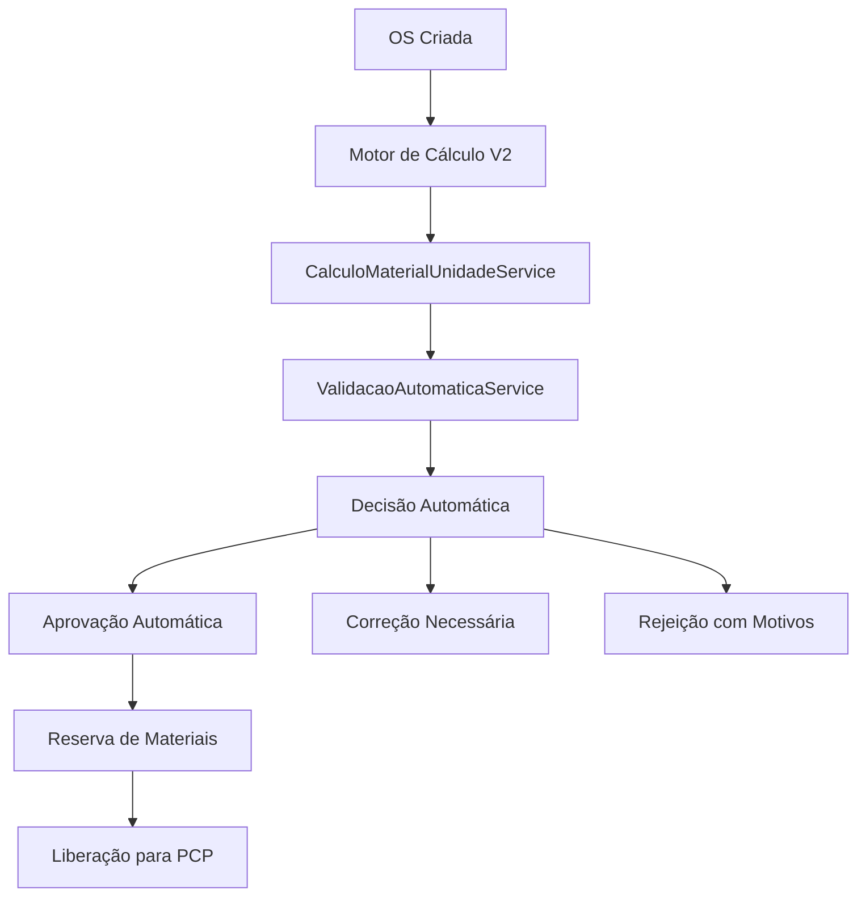

# 📋 Resumo das Melhorias OS → PCP - 2025

## 🎯 **Visão Geral**

Este documento consolida todas as melhorias discutidas e propostas para o sistema de integração Orçamento → OS → PCP, focando em três pilares principais:

1. **Cálculo Inteligente de Materiais por Unidade de Produção**
2. **Sistema de Validações Automáticas Configuráveis**
3. **Fluxo Otimizado de Aprovação e Liberação para PCP**

## 📊 **Problemas Identificados**

### **1. Cálculo de Materiais (Atual)**
- ❌ Sistema calcula apenas área total (m²)
- ❌ Não converte para unidades de compra (bobinas, chapas)
- ❌ Não considera desperdício padrão
- ❌ Não sugere otimizações de aproveitamento
- ❌ Validação de estoque simplificada

### **2. Validações (Atual)**
- ❌ Regras hardcoded no código
- ❌ Validações genéricas (não específicas por loja)
- ❌ Dificuldade para ajustar regras de negócio
- ❌ Necessidade de deploy para mudanças simples

### **3. Fluxo de Aprovação (Atual)**
- ❌ Lógica inconsistente (orçamento aprovado vs OS rejeitada)
- ❌ Aprovação por OS completa (não por produto)
- ❌ Falta de fluxo de correção estruturado
- ❌ PCP recebe OSs com problemas não resolvidos

## 🚀 **Soluções Propostas**

### **1. Cálculo Inteligente de Materiais**

#### **Funcionalidades:**
- ✅ Cálculo automático de unidades necessárias (bobinas, chapas, rolos)
- ✅ Consideração de desperdício padrão por material
- ✅ Cálculo de sobras aproveitáveis
- ✅ Sugestões de otimização de aproveitamento
- ✅ Reserva automática de materiais por OS
- ✅ Integração com validação de estoque

#### **Exemplo Prático:**
```
OS: Banner 120m²
Material: Bobina Lona Front 440g (1,60m x 30m = 48m²)
Desperdício padrão: 5%

Cálculo Inteligente:
• Área necessária: 120m²
• Desperdício padrão: 5% (6m²)
• Área com desperdício: 126m²
• Unidades necessárias: 3 bobinas (144m²)
• Sobra aproveitável: 18m²
• Sugestões: Usar sobra para banners menores
```

### **2. Sistema de Validações Automáticas**

#### **Funcionalidades:**
- ✅ Regras configuráveis por loja
- ✅ Validações, correções e aprovações automáticas
- ✅ Interface de administração completa
- ✅ Sistema de testes em tempo real
- ✅ Aprovação automática para casos simples
- ✅ Notificações inteligentes

#### **Exemplo de Regra:**
```json
{
  "nome": "Estoque Insuficiente",
  "tipo": "validacao",
  "condicao": {
    "campo": "estoque_disponivel",
    "operador": "less_than",
    "valor": "quantidade_necessaria",
    "mensagem_erro": "Estoque insuficiente para este produto"
  },
  "acao": {
    "tipo": "bloquear",
    "parametros": {
      "status_os": "AGUARDANDO_ESTOQUE",
      "notificar": ["comercial"]
    }
  }
}
```

### **3. Fluxo Otimizado de Aprovação**

#### **Novo Fluxo:**
```
ORÇAMENTO APROVADO (cliente)
    ↓
OS CRIADA → Status: FILA
    ↓
[Validação Automática]
    ├── Estoque OK? → CalculoMaterialUnidadeService
    ├── Arte anexada? → ValidacaoArteService
    ├── Dados completos? → ValidacaoDadosService
    └── Prazo viável? → ValidacaoPrazoService
    ↓
[Decisão Automática]
    ├── TUDO OK → APROVADA_TECNICA (automática)
    ├── PROBLEMAS MENORES → AGUARDANDO_CORRECAO
    └── PROBLEMAS GRAVES → REJEITADA (com motivos)
    ↓
OS LIBERADA PARA PCP
    ↓
PCP → Programa produção otimizada
```

## 🔧 **Implementação Técnica**

### **1. Arquitetura do Sistema**



### **2. Componentes Principais**

#### **CalculoMaterialUnidadeService**
- Agrupamento de insumos por tipo
- Cálculo por unidade de compra
- Consideração de desperdício
- Cálculo de sobras aproveitáveis
- Sugestões de otimização

#### **ValidacaoAutomaticaService**
- Execução de regras configuráveis
- Validação, correção e aprovação automática
- Sistema de notificações
- Auditoria completa

#### **ReservaMaterialService**
- Reserva automática de materiais
- Controle de estoque por OS
- Notificações de otimização
- Gestão de sobras

### **3. Integração com Sistema Existente**

```typescript
// Em OSService.validarTransicaoOSComercial()
private async validarTransicaoOSComercial(
  os: any,
  etapaAtual: string,
  novaEtapa: string,
  usuarioId: string
): Promise<{ valida: boolean; motivo?: string }> {
  
  if (novaEtapa === 'AGUARDANDO_APROVACAO_TECNICA') {
    
    // 1. Calcular materiais por unidade
    const calculoMateriais = await this.calculoMaterialUnidadeService
      .calcularMateriaisPorUnidade(os.produtos, os.loja_id);
    
    // 2. Executar validações automáticas
    const validacaoAutomatica = await this.validacaoAutomaticaService
      .validarOS(os.id, os.loja_id, os);
    
    // 3. Decisão automática
    if (!validacaoAutomatica.valida) {
      return {
        valida: false,
        motivo: `Validações não atendidas: ${validacaoAutomatica.correcoes_necessarias.join(', ')}`
      };
    }
    
    if (validacaoAutomatica.pode_aprovar_automaticamente) {
      await this.aprovarAutomaticamente(os.id, usuarioId);
      await this.reservaMaterialService.reservarMateriais(os.id, calculoMateriais);
      return { valida: true };
    }
  }
  
  return { valida: true };
}
```

## 🎨 **Interface de Usuário**

### **1. Tela de Validação Técnica Inteligente**

```
┌─────────────────────────────────────────────────────────┐
│ 🔍 Validação Técnica Inteligente - OS #2025-001        │
├─────────────────────────────────────────────────────────┤
│ Cliente: Empresa ABC Ltda                              │
│ Serviço: Banner 120m² - Lona Front 440g               │
│ Prazo: 5 dias úteis                                    │
├─────────────────────────────────────────────────────────┤
│                                                         │
│ 📦 Controle de Materiais Inteligente:                  │
│                                                         │
│ ✅ Lona Front 440g (Bobina 1,60m x 30m)               │
│    • Área necessária: 120,00m²                        │
│    • Desperdício padrão: 5% (6,00m²)                  │
│    • Unidades necessárias: 3 bobinas (144,00m²)       │
│    • Estoque disponível: 5 bobinas                     │
│    • Sobra aproveitável: 18,00m²                      │
│    • Custo estimado: R$ 1.440,00                      │
│    💡 Sugestão: Sobra pode ser usada para banners     │
│       menores ou outros projetos                       │
│                                                         │
│ ✅ Tinta CMYK (Lata 1L)                               │
│    • Quantidade necessária: 2 litros                  │
│    • Estoque disponível: 8 litros                     │
│    • Custo estimado: R$ 120,00                        │
│                                                         │
│ ⚠️  Cordão 5mm (Rolo 50m)                             │
│    • Quantidade necessária: 50m                       │
│    • Estoque disponível: 45m (estoque baixo)          │
│    • Custo estimado: R$ 75,00                         │
│    💡 Sugestão: Comprar mais 5m de cordão             │
│                                                         │
│ 🎨 Arte: ✅ Anexada (banner_120m2.pdf)                │
│ 📋 Dados: ✅ Completos                                 │
│ ⏰ Prazo: ✅ Viável (5 dias úteis)                     │
│                                                         │
│ 📊 Resumo Financeiro:                                  │
│ • Custo total materiais: R$ 1.635,00                  │
│ • Margem de lucro: 35% (R$ 2.207,25)                  │
│ • Valor total: R$ 3.842,25                            │
│                                                         │
│ [✅ Aprovar e Reservar] [⚠️ Aguardar Correção] [❌ Rejeitar] │
└─────────────────────────────────────────────────────────┘
```

### **2. Tela de Administração de Regras**

```
┌─────────────────────────────────────────────────────────┐
│ 📋 Regras de Validação - OS                            │
├─────────────────────────────────────────────────────────┤
│ [➕ Nova Regra] [🔍 Filtrar] [⚙️ Configurações]        │
├─────────────────────────────────────────────────────────┤
│ Filtros: [OS ▼] [Todas ▼] [Ativas ▼] [🔍]             │
├─────────────────────────────────────────────────────────┤
│ ✅ Estoque Insuficiente     │ Validação │ Ativo  │ [✏️] │
│ ✅ Arte Não Anexada         │ Validação │ Ativo  │ [✏️] │
│ ✅ Prazo Inviável           │ Validação │ Ativo  │ [✏️] │
│ ✅ Aprovação Automática     │ Aprovação │ Ativo  │ [✏️] │
│ ❌ Margem Mínima            │ Validação │ Inativo│ [✏️] │
│ ✅ Dados Completos          │ Validação │ Ativo  │ [✏️] │
│ ✅ Cliente Válido           │ Validação │ Ativo  │ [✏️] │
└─────────────────────────────────────────────────────────┘
```

## 📊 **Benefícios Esperados**

### **Para Produção:**
- ✅ **Redução de 80%** no tempo de validação de OS
- ✅ **Cálculo preciso** de materiais necessários
- ✅ **Otimização automática** de aproveitamento
- ✅ **Reserva inteligente** de materiais
- ✅ **Controle de desperdício** integrado

### **Para Estoque:**
- ✅ **Reserva automática** por OS
- ✅ **Previsão de compras** mais precisa
- ✅ **Controle de sobras** aproveitáveis
- ✅ **Redução de 30%** no desperdício
- ✅ **Otimização de compras**

### **Para Financeiro:**
- ✅ **Custos mais precisos** por OS
- ✅ **Controle de desperdício** financeiro
- ✅ **Redução de 15%** nos custos de materiais
- ✅ **Aumento de 20%** na margem de lucro
- ✅ **Auditoria completa** de custos

### **Para Gestão:**
- ✅ **Visão completa** de materiais por OS
- ✅ **Relatórios de otimização**
- ✅ **Controle de desperdício** por material
- ✅ **Análise de custos** detalhada
- ✅ **Tomada de decisão** informada

## 🚀 **Plano de Implementação**

### **Fase 1: Estrutura Base (3 semanas)**
- [ ] Criar interfaces de dados
- [ ] Implementar CalculoMaterialUnidadeService
- [ ] Implementar ValidacaoAutomaticaService
- [ ] Integrar com validação de OS existente
- [ ] Testes unitários básicos

### **Fase 2: Cálculo Inteligente (4 semanas)**
- [ ] Implementar agrupamento de insumos
- [ ] Implementar cálculo por unidade de compra
- [ ] Implementar consideração de desperdício
- [ ] Implementar cálculo de sobras
- [ ] Implementar sugestões de otimização

### **Fase 3: Validações Automáticas (3 semanas)**
- [ ] Implementar execução de regras
- [ ] Implementar sistema de aprovação automática
- [ ] Implementar notificações inteligentes
- [ ] Implementar sistema de correção
- [ ] Testes de integração

### **Fase 4: Interface e Reserva (2 semanas)**
- [ ] Implementar interface de validação
- [ ] Implementar sistema de reserva
- [ ] Implementar interface de administração
- [ ] Implementar relatórios
- [ ] Testes end-to-end

### **Fase 5: Regras Padrão e Treinamento (1 semana)**
- [ ] Criar regras padrão para comunicação visual
- [ ] Implementar importação/exportação de regras
- [ ] Documentação de uso
- [ ] Treinamento de usuários
- [ ] Go-live

## 📈 **Métricas de Sucesso**

### **Métricas Técnicas:**
- Redução de 80% no tempo de validação de OS
- Redução de 30% no desperdício de materiais
- Aumento de 25% no aproveitamento de sobras
- Redução de 20% no tempo de aprovação técnica
- Aumento de 40% na precisão de cálculos

### **Métricas de Negócio:**
- Redução de 15% nos custos de materiais
- Aumento de 20% na margem de lucro
- Redução de 25% no tempo de aprovação técnica
- Aumento de 35% na satisfação do cliente
- Redução de 50% nos erros de validação

## 🔧 **Configurações Padrão**

### **Desperdício Padrão por Material:**
```typescript
const DESPERDICIO_PADRAO = {
  'LONA_FRONT': 5,      // 5% para lonas frontlight
  'LONA_BACK': 3,       // 3% para lonas backlight
  'VINIL_ADESIVO': 8,   // 8% para vinil adesivo
  'ACRILICO': 10,       // 10% para acrílico
  'PAPEL': 15,          // 15% para papel
  'TINTA': 5,           // 5% para tintas
  'CORDÃO': 2           // 2% para cordões
};
```

### **Regras Essenciais:**
```typescript
const REGRAS_PADRAO = [
  'Estoque Insuficiente',
  'Arte Não Anexada',
  'Dados Técnicos Incompletos',
  'Prazo Inviável',
  'Cliente Válido',
  'Aprovação Automática Simples'
];
```

## 📝 **Conclusão**

As melhorias propostas representam uma evolução significativa no sistema de integração Orçamento → OS → PCP, focando em:

1. **Inteligência**: Cálculo automático e otimizado de materiais
2. **Flexibilidade**: Validações configuráveis por loja
3. **Eficiência**: Aprovação automática quando apropriado
4. **Controle**: Gestão inteligente de estoque e desperdício
5. **Transparência**: Visão completa para tomada de decisão

Com a implementação destas melhorias, o sistema será capaz de:

- **Calcular precisamente** quantas unidades de materiais são necessárias
- **Otimizar automaticamente** o aproveitamento de materiais
- **Validar inteligentemente** OSs com regras configuráveis
- **Aprovar automaticamente** casos simples
- **Reservar materiais** de forma inteligente
- **Reduzir desperdício** e custos
- **Melhorar a satisfação** do cliente

Esta implementação trará benefícios significativos em termos de eficiência, precisão e satisfação do usuário, tornando o sistema verdadeiramente inteligente e adaptável às necessidades específicas de cada negócio.

---

**Documento criado em:** 2025-01-27  
**Versão:** 1.0  
**Status:** Proposta para Implementação  
**Responsável:** Equipe de Desenvolvimento OS/PCP  
**Próximos Passos:** Aprovação do plano e início da Fase 1
