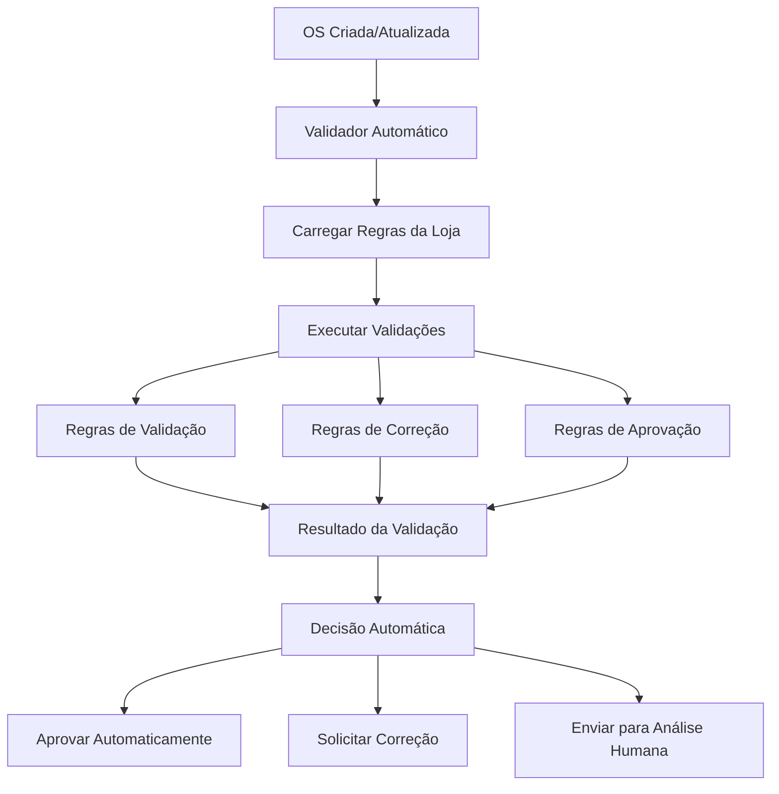

# 🤖 Sistema de Validações Automáticas para OS

## 📋 **Visão Geral**

Este documento detalha a implementação de um sistema de validações automáticas configuráveis para Ordens de Serviço, eliminando validações hardcoded e permitindo que administradores configurem regras de negócio específicas para cada loja.

## 🎯 **Problemas Identificados**

### **1. Validações Atuais (Hardcoded)**
- ❌ Regras fixas no código (não configuráveis)
- ❌ Validações genéricas (não específicas por loja)
- ❌ Dificuldade para ajustar regras de negócio
- ❌ Necessidade de deploy para mudanças simples
- ❌ Validações inconsistentes entre módulos

### **2. Exemplos de Validações Hardcoded**
```typescript
// Exemplo atual - HARDCODED
if (!dados.nome_servico || dados.nome_servico.trim() === '') {
  throw new BadRequestException('Nome do serviço é obrigatório');
}

const prioridadesValidas = ['URGENTE', 'ALTA', 'NORMAL', 'BAIXA'];
if (dados.prioridade && !prioridadesValidas.includes(dados.prioridade)) {
  throw new BadRequestException(`Prioridade inválida: ${dados.prioridade}`);
}
```

## 🚀 **Solução Proposta: Sistema Configurável**

### **1. Arquitetura do Sistema**



### **2. Estrutura de Dados**

#### **Tabela de Regras de Validação**
```sql
CREATE TABLE regras_validacao (
  id VARCHAR(36) PRIMARY KEY,
  loja_id VARCHAR(36) NOT NULL,
  nome VARCHAR(255) NOT NULL,
  tipo ENUM('validacao', 'correcao', 'aprovacao') NOT NULL,
  modulo VARCHAR(100) NOT NULL, -- 'OS', 'ORCAMENTO', 'PCP'
  condicao TEXT NOT NULL, -- JSON com condições
  acao TEXT NOT NULL, -- JSON com ações
  parametros TEXT, -- JSON com parâmetros
  prioridade INT DEFAULT 1,
  ativo BOOLEAN DEFAULT true,
  criado_em TIMESTAMP DEFAULT NOW(),
  atualizado_em TIMESTAMP DEFAULT NOW(),
  
  INDEX idx_loja_modulo (loja_id, modulo),
  INDEX idx_tipo_ativo (tipo, ativo)
);
```

#### **Tabela de Configurações do Sistema**
```sql
CREATE TABLE configuracoes_sistema (
  id VARCHAR(36) PRIMARY KEY,
  loja_id VARCHAR(36) NOT NULL,
  chave VARCHAR(255) NOT NULL,
  valor TEXT NOT NULL, -- JSON
  tipo ENUM('string', 'number', 'boolean', 'json') NOT NULL,
  descricao TEXT,
  categoria VARCHAR(100),
  ativo BOOLEAN DEFAULT true,
  criado_em TIMESTAMP DEFAULT NOW(),
  atualizado_em TIMESTAMP DEFAULT NOW(),
  
  UNIQUE KEY uk_loja_chave (loja_id, chave),
  INDEX idx_categoria (categoria)
);
```

### **3. Interfaces TypeScript**

```typescript
interface RegraValidacao {
  id: string;
  loja_id: string;
  nome: string;
  tipo: 'validacao' | 'correcao' | 'aprovacao';
  modulo: 'OS' | 'ORCAMENTO' | 'PCP';
  condicao: CondicaoValidacao;
  acao: AcaoValidacao;
  parametros: any;
  prioridade: number;
  ativo: boolean;
  criado_em: Date;
  atualizado_em: Date;
}

interface CondicaoValidacao {
  campo: string;
  operador: 'equals' | 'not_equals' | 'greater_than' | 'less_than' | 
           'contains' | 'not_contains' | 'exists' | 'not_exists' |
           'in' | 'not_in' | 'regex' | 'custom';
  valor: any;
  mensagem_erro: string;
  mensagem_aviso?: string;
}

interface AcaoValidacao {
  tipo: 'bloquear' | 'avisar' | 'corrigir' | 'aprovar' | 'notificar';
  parametros: {
    status_os?: string;
    notificar?: string[];
    correcao_automatica?: boolean;
    observacoes?: string;
  };
}

interface ResultadoValidacao {
  valida: boolean;
  pode_aprovar_automaticamente: boolean;
  correcoes_necessarias: string[];
  validacoes: ValidacaoDetalhe[];
  acoes_recomendadas: string[];
  alertas: string[];
}

interface ValidacaoDetalhe {
  regra_id: string;
  regra_nome: string;
  campo: string;
  status: 'ok' | 'erro' | 'aviso';
  mensagem: string;
  valor_atual: any;
  valor_esperado: any;
}
```

## 🔧 **Implementação Técnica**

### **1. Serviço Principal**

```typescript
@Injectable()
export class ValidacaoAutomaticaService {
  constructor(
    private readonly prisma: PrismaService,
    private readonly notificacaoService: NotificacaoService
  ) {}

  /**
   * Executa validações automáticas para uma OS
   */
  async validarOS(
    osId: string,
    lojaId: string,
    dadosOS: any
  ): Promise<ResultadoValidacao> {
    
    // 1. Carregar regras ativas da loja
    const regras = await this.carregarRegrasAtivas(lojaId, 'OS');
    
    // 2. Executar validações
    const resultados = await this.executarValidacoes(regras, dadosOS);
    
    // 3. Determinar resultado final
    const resultado = this.determinarResultadoFinal(resultados);
    
    // 4. Aplicar ações automáticas se necessário
    if (resultado.pode_aprovar_automaticamente) {
      await this.aplicarAcoesAutomaticas(osId, resultados);
    }
    
    return resultado;
  }

  /**
   * Carrega regras ativas de uma loja
   */
  private async carregarRegrasAtivas(
    lojaId: string,
    modulo: string
  ): Promise<RegraValidacao[]> {
    
    return await this.prisma.regrasValidacao.findMany({
      where: {
        loja_id: lojaId,
        modulo: modulo,
        ativo: true
      },
      orderBy: {
        prioridade: 'asc'
      }
    });
  }

  /**
   * Executa todas as regras de validação
   */
  private async executarValidacoes(
    regras: RegraValidacao[],
    dadosOS: any
  ): Promise<ValidacaoDetalhe[]> {
    
    const resultados: ValidacaoDetalhe[] = [];
    
    for (const regra of regras) {
      try {
        const resultado = await this.executarRegra(regra, dadosOS);
        resultados.push(resultado);
      } catch (error) {
        this.logger.error(`Erro ao executar regra ${regra.nome}:`, error);
        resultados.push({
          regra_id: regra.id,
          regra_nome: regra.nome,
          campo: 'sistema',
          status: 'erro',
          mensagem: `Erro interno: ${error.message}`,
          valor_atual: null,
          valor_esperado: null
        });
      }
    }
    
    return resultados;
  }

  /**
   * Executa uma regra específica
   */
  private async executarRegra(
    regra: RegraValidacao,
    dadosOS: any
  ): Promise<ValidacaoDetalhe> {
    
    const condicao = regra.condicao as CondicaoValidacao;
    const valorAtual = this.obterValorCampo(dadosOS, condicao.campo);
    const valorEsperado = condicao.valor;
    
    let status: 'ok' | 'erro' | 'aviso' = 'ok';
    let mensagem = condicao.mensagem_erro;
    
    // Verificar condição
    const condicaoAtendida = this.verificarCondicao(
      valorAtual,
      condicao.operador,
      valorEsperado
    );
    
    if (!condicaoAtendida) {
      status = regra.tipo === 'validacao' ? 'erro' : 'aviso';
      if (regra.tipo === 'correcao' && condicao.mensagem_aviso) {
        mensagem = condicao.mensagem_aviso;
      }
    }
    
    return {
      regra_id: regra.id,
      regra_nome: regra.nome,
      campo: condicao.campo,
      status: status,
      mensagem: mensagem,
      valor_atual: valorAtual,
      valor_esperado: valorEsperado
    };
  }

  /**
   * Verifica se uma condição é atendida
   */
  private verificarCondicao(
    valorAtual: any,
    operador: string,
    valorEsperado: any
  ): boolean {
    
    switch (operador) {
      case 'equals':
        return valorAtual === valorEsperado;
      case 'not_equals':
        return valorAtual !== valorEsperado;
      case 'greater_than':
        return Number(valorAtual) > Number(valorEsperado);
      case 'less_than':
        return Number(valorAtual) < Number(valorEsperado);
      case 'contains':
        return String(valorAtual).includes(String(valorEsperado));
      case 'not_contains':
        return !String(valorAtual).includes(String(valorEsperado));
      case 'exists':
        return valorAtual !== null && valorAtual !== undefined;
      case 'not_exists':
        return valorAtual === null || valorAtual === undefined;
      case 'in':
        return Array.isArray(valorEsperado) && valorEsperado.includes(valorAtual);
      case 'not_in':
        return Array.isArray(valorEsperado) && !valorEsperado.includes(valorAtual);
      case 'regex':
        return new RegExp(valorEsperado).test(String(valorAtual));
      default:
        return false;
    }
  }

  /**
   * Determina o resultado final das validações
   */
  private determinarResultadoFinal(
    resultados: ValidacaoDetalhe[]
  ): ResultadoValidacao {
    
    const erros = resultados.filter(r => r.status === 'erro');
    const avisos = resultados.filter(r => r.status === 'aviso');
    const oks = resultados.filter(r => r.status === 'ok');
    
    const valida = erros.length === 0;
    const pode_aprovar_automaticamente = valida && avisos.length === 0;
    
    const correcoes_necessarias = erros.map(r => r.mensagem);
    const alertas = avisos.map(r => r.mensagem);
    
    return {
      valida,
      pode_aprovar_automaticamente,
      correcoes_necessarias,
      validacoes: resultados,
      acoes_recomendadas: this.gerarAcoesRecomendadas(resultados),
      alertas
    };
  }
}
```

### **2. Controller de Administração**

```typescript
@Controller('admin/regras-validacao')
@UseGuards(JwtAuthGuard, AdminGuard)
export class RegrasValidacaoController {
  constructor(
    private readonly regrasValidacaoService: RegrasValidacaoService
  ) {}

  @Get()
  @ApiOperation({ summary: 'Listar regras de validação' })
  async listarRegras(
    @GetLoja() loja: loja,
    @Query('modulo') modulo?: string,
    @Query('tipo') tipo?: string,
    @Query('ativo') ativo?: boolean
  ) {
    return this.regrasValidacaoService.listar({
      loja_id: loja.id,
      modulo,
      tipo,
      ativo
    });
  }

  @Post()
  @ApiOperation({ summary: 'Criar nova regra de validação' })
  async criarRegra(
    @Body() dto: CreateRegraValidacaoDto,
    @GetLoja() loja: loja
  ) {
    return this.regrasValidacaoService.criar(dto, loja.id);
  }

  @Put(':id')
  @ApiOperation({ summary: 'Atualizar regra de validação' })
  async atualizarRegra(
    @Param('id') id: string,
    @Body() dto: UpdateRegraValidacaoDto,
    @GetLoja() loja: loja
  ) {
    return this.regrasValidacaoService.atualizar(id, dto, loja.id);
  }

  @Delete(':id')
  @ApiOperation({ summary: 'Remover regra de validação' })
  async removerRegra(
    @Param('id') id: string,
    @GetLoja() loja: loja
  ) {
    return this.regrasValidacaoService.remover(id, loja.id);
  }

  @Post(':id/testar')
  @ApiOperation({ summary: 'Testar regra de validação' })
  async testarRegra(
    @Param('id') id: string,
    @Body() dadosTeste: any,
    @GetLoja() loja: loja
  ) {
    return this.regrasValidacaoService.testar(id, dadosTeste, loja.id);
  }
}
```

### **3. Integração com OSService**

```typescript
// Em OSService.validarTransicaoOSComercial()
private async validarTransicaoOSComercial(
  os: any,
  etapaAtual: string,
  novaEtapa: string,
  usuarioId: string
): Promise<{ valida: boolean; motivo?: string }> {
  
  // Transição para AGUARDANDO_APROVACAO_TECNICA
  if (novaEtapa === 'AGUARDANDO_APROVACAO_TECNICA') {
    
    // 1. Executar validações automáticas
    const validacaoAutomatica = await this.validacaoAutomaticaService.validarOS(
      os.id,
      os.loja_id,
      os
    );
    
    // 2. Se não passou nas validações, bloquear
    if (!validacaoAutomatica.valida) {
      return {
        valida: false,
        motivo: `Validações não atendidas: ${validacaoAutomatica.correcoes_necessarias.join(', ')}`
      };
    }
    
    // 3. Se pode aprovar automaticamente, aprovar
    if (validacaoAutomatica.pode_aprovar_automaticamente) {
      await this.aprovarAutomaticamente(os.id, usuarioId);
      return { valida: true };
    }
    
    // 4. Se tem alertas, notificar mas permitir
    if (validacaoAutomatica.alertas.length > 0) {
      await this.notificarAlertas(os.id, validacaoAutomatica.alertas);
    }
  }
  
  return { valida: true };
}
```

## 🎨 **Interface de Administração**

### **1. Tela de Listagem de Regras**

```
┌─────────────────────────────────────────────────────────┐
│ 📋 Regras de Validação - OS                            │
├─────────────────────────────────────────────────────────┤
│ [➕ Nova Regra] [🔍 Filtrar] [⚙️ Configurações]        │
├─────────────────────────────────────────────────────────┤
│ Filtros: [OS ▼] [Todas ▼] [Ativas ▼] [🔍]             │
├─────────────────────────────────────────────────────────┤
│ ✅ Estoque Insuficiente     │ Validação │ Ativo  │ [✏️] │
│ ✅ Arte Não Anexada         │ Validação │ Ativo  │ [✏️] │
│ ✅ Prazo Inviável           │ Validação │ Ativo  │ [✏️] │
│ ✅ Aprovação Automática     │ Aprovação │ Ativo  │ [✏️] │
│ ❌ Margem Mínima            │ Validação │ Inativo│ [✏️] │
│ ✅ Dados Completos          │ Validação │ Ativo  │ [✏️] │
│ ✅ Cliente Válido           │ Validação │ Ativo  │ [✏️] │
└─────────────────────────────────────────────────────────┘
```

### **2. Tela de Criação/Edição de Regra**

```
┌─────────────────────────────────────────────────────────┐
│ ✏️ Editar Regra: Estoque Insuficiente                  │
├─────────────────────────────────────────────────────────┤
│ Informações Básicas:                                    │
│ Nome: [Estoque Insuficiente                    ]       │
│ Tipo: [Validação ▼] Módulo: [OS ▼]                    │
│ Prioridade: [1] Ativo: [☑️]                            │
│                                                         │
│ Condição:                                               │
│ Campo: [estoque_disponivel ▼]                          │
│ Operador: [menor que ▼] Valor: [quantidade_necessaria] │
│ Mensagem de Erro: [Estoque insuficiente para este      │
│ produto. Verifique disponibilidade no almoxarife.]     │
│ Mensagem de Aviso: [Estoque baixo. Considere comprar   │
│ mais material.]                                         │
│                                                         │
│ Ação:                                                   │
│ Tipo: [Bloquear ▼]                                      │
│ Status OS: [AGUARDANDO_ESTOQUE ▼]                      │
│ Notificar: [☑️ Comercial] [☐ PCP] [☐ Técnico]         │
│ Observações: [Solicitar compra de material adicional]  │
│                                                         │
│ [💾 Salvar] [❌ Cancelar] [🧪 Testar] [👁️ Visualizar]  │
└─────────────────────────────────────────────────────────┘
```

### **3. Tela de Teste de Regra**

```
┌─────────────────────────────────────────────────────────┐
│ 🧪 Testar Regra: Estoque Insuficiente                  │
├─────────────────────────────────────────────────────────┤
│ Dados de Teste:                                        │
│ {                                                       │
│   "estoque_disponivel": 50,                            │
│   "quantidade_necessaria": 75,                         │
│   "produto_nome": "Banner 120m²"                       │
│ }                                                       │
│                                                         │
│ Resultado do Teste:                                     │
│ ❌ FALHOU - Estoque insuficiente para este produto.     │
│    Verifique disponibilidade no almoxarife.            │
│                                                         │
│ Detalhes:                                               │
│ • Campo: estoque_disponivel                            │
│ • Valor atual: 50                                      │
│ • Valor esperado: > 75                                 │
│ • Operador: less_than                                  │
│                                                         │
│ [🔄 Testar Novamente] [✅ Usar Dados] [❌ Fechar]       │
└─────────────────────────────────────────────────────────┘
```

## 📊 **Exemplos de Regras Configuráveis**

### **1. Validação de Estoque**
```json
{
  "nome": "Estoque Insuficiente",
  "tipo": "validacao",
  "modulo": "OS",
  "condicao": {
    "campo": "estoque_disponivel",
    "operador": "less_than",
    "valor": "quantidade_necessaria",
    "mensagem_erro": "Estoque insuficiente para este produto. Verifique disponibilidade no almoxarife."
  },
  "acao": {
    "tipo": "bloquear",
    "parametros": {
      "status_os": "AGUARDANDO_ESTOQUE",
      "notificar": ["comercial"],
      "observacoes": "Solicitar compra de material adicional"
    }
  }
}
```

### **2. Validação de Arte**
```json
{
  "nome": "Arte Não Anexada",
  "tipo": "validacao",
  "modulo": "OS",
  "condicao": {
    "campo": "arquivos_anexados",
    "operador": "exists",
    "valor": true,
    "mensagem_erro": "Arte deve ser anexada antes da aprovação técnica"
  },
  "acao": {
    "tipo": "bloquear",
    "parametros": {
      "status_os": "AGUARDANDO_ARTE",
      "notificar": ["comercial"]
    }
  }
}
```

### **3. Aprovação Automática**
```json
{
  "nome": "Aprovação Automática Simples",
  "tipo": "aprovacao",
  "modulo": "OS",
  "condicao": {
    "campo": "complexidade",
    "operador": "equals",
    "valor": "simples",
    "mensagem_erro": ""
  },
  "acao": {
    "tipo": "aprovar",
    "parametros": {
      "status_os": "APROVADA_TECNICA",
      "notificar": ["pcp"],
      "observacoes": "Aprovada automaticamente por baixa complexidade"
    }
  }
}
```

### **4. Validação de Prazo**
```json
{
  "nome": "Prazo Inviável",
  "tipo": "validacao",
  "modulo": "OS",
  "condicao": {
    "campo": "dias_para_entrega",
    "operador": "less_than",
    "valor": 3,
    "mensagem_erro": "Prazo muito curto. Mínimo de 3 dias úteis necessário."
  },
  "acao": {
    "tipo": "bloquear",
    "parametros": {
      "status_os": "AGUARDANDO_PRAZO",
      "notificar": ["comercial", "tecnico"]
    }
  }
}
```

## 🎯 **Benefícios da Implementação**

### **Para Administradores:**
- ✅ **Controle total** sobre validações
- ✅ **Ajustes sem deploy** de código
- ✅ **Regras específicas** por loja
- ✅ **Testes em tempo real**
- ✅ **Auditoria completa** de mudanças

### **Para Usuários:**
- ✅ **Validações personalizadas** para seu negócio
- ✅ **Mensagens claras** e específicas
- ✅ **Processos adaptados** à realidade
- ✅ **Aprovação automática** quando possível
- ✅ **Notificações inteligentes**

### **Para Desenvolvedores:**
- ✅ **Menos código** hardcoded
- ✅ **Sistema flexível** e extensível
- ✅ **Manutenção simplificada**
- ✅ **Testes automatizados**
- ✅ **Documentação viva**

## 🚀 **Plano de Implementação**

### **Fase 1: Estrutura Base (1 semana)**
- [ ] Criar tabelas de regras e configurações
- [ ] Implementar interfaces TypeScript
- [ ] Criar migrações do banco de dados
- [ ] Testes unitários básicos

### **Fase 2: Motor de Validação (2 semanas)**
- [ ] Implementar ValidacaoAutomaticaService
- [ ] Implementar execução de regras
- [ ] Implementar verificação de condições
- [ ] Testes de integração

### **Fase 3: Interface de Administração (2 semanas)**
- [ ] Implementar CRUD de regras
- [ ] Implementar interface de criação/edição
- [ ] Implementar sistema de testes
- [ ] Implementar logs de auditoria

### **Fase 4: Integração com OS (1 semana)**
- [ ] Integrar com validação de OS existente
- [ ] Implementar aprovação automática
- [ ] Implementar notificações
- [ ] Testes end-to-end

### **Fase 5: Regras Padrão (1 semana)**
- [ ] Criar regras padrão para comunicação visual
- [ ] Implementar importação/exportação de regras
- [ ] Documentação de uso
- [ ] Treinamento de usuários

## 📈 **Métricas de Sucesso**

### **Métricas Técnicas:**
- Redução de 80% no tempo de ajuste de validações
- Aumento de 90% na flexibilidade do sistema
- Redução de 60% no tempo de deploy para mudanças
- Aumento de 100% na cobertura de validações

### **Métricas de Negócio:**
- Redução de 50% no tempo de aprovação de OS
- Aumento de 70% na satisfação dos usuários
- Redução de 40% nos erros de validação
- Aumento de 85% na precisão das validações

## 🔧 **Configurações Padrão**

### **Regras Essenciais para Comunicação Visual:**
```typescript
const REGRAS_PADRAO = [
  {
    nome: 'Estoque Insuficiente',
    tipo: 'validacao',
    modulo: 'OS',
    condicao: {
      campo: 'estoque_disponivel',
      operador: 'less_than',
      valor: 'quantidade_necessaria',
      mensagem_erro: 'Estoque insuficiente para este produto'
    },
    acao: {
      tipo: 'bloquear',
      parametros: {
        status_os: 'AGUARDANDO_ESTOQUE',
        notificar: ['comercial']
      }
    }
  },
  {
    nome: 'Arte Não Anexada',
    tipo: 'validacao',
    modulo: 'OS',
    condicao: {
      campo: 'arquivos_anexados',
      operador: 'exists',
      valor: true,
      mensagem_erro: 'Arte deve ser anexada antes da aprovação'
    },
    acao: {
      tipo: 'bloquear',
      parametros: {
        status_os: 'AGUARDANDO_ARTE',
        notificar: ['comercial']
      }
    }
  },
  {
    nome: 'Dados Técnicos Incompletos',
    tipo: 'validacao',
    modulo: 'OS',
    condicao: {
      campo: 'parametros_tecnicos.dimensoes',
      operador: 'exists',
      valor: true,
      mensagem_erro: 'Dimensões técnicas devem ser informadas'
    },
    acao: {
      tipo: 'bloquear',
      parametros: {
        status_os: 'AGUARDANDO_DADOS',
        notificar: ['comercial']
      }
    }
  }
];
```

## 📝 **Conclusão**

O sistema de validações automáticas configuráveis representa uma evolução fundamental na flexibilidade e manutenibilidade do sistema de OS. Com a implementação desta solução, o sistema será capaz de:

1. **Adaptar-se dinamicamente** às necessidades de cada loja
2. **Eliminar validações hardcoded** e inflexíveis
3. **Permitir ajustes rápidos** sem necessidade de deploy
4. **Fornecer aprovação automática** quando apropriado
5. **Manter auditoria completa** de todas as validações

Esta implementação trará benefícios significativos em termos de flexibilidade, manutenibilidade e satisfação do usuário, tornando o sistema verdadeiramente adaptável às necessidades específicas de cada negócio.

---

**Documento criado em:** 2025-01-27  
**Versão:** 1.0  
**Status:** Proposta para Implementação  
**Responsável:** Equipe de Desenvolvimento OS/PCP
