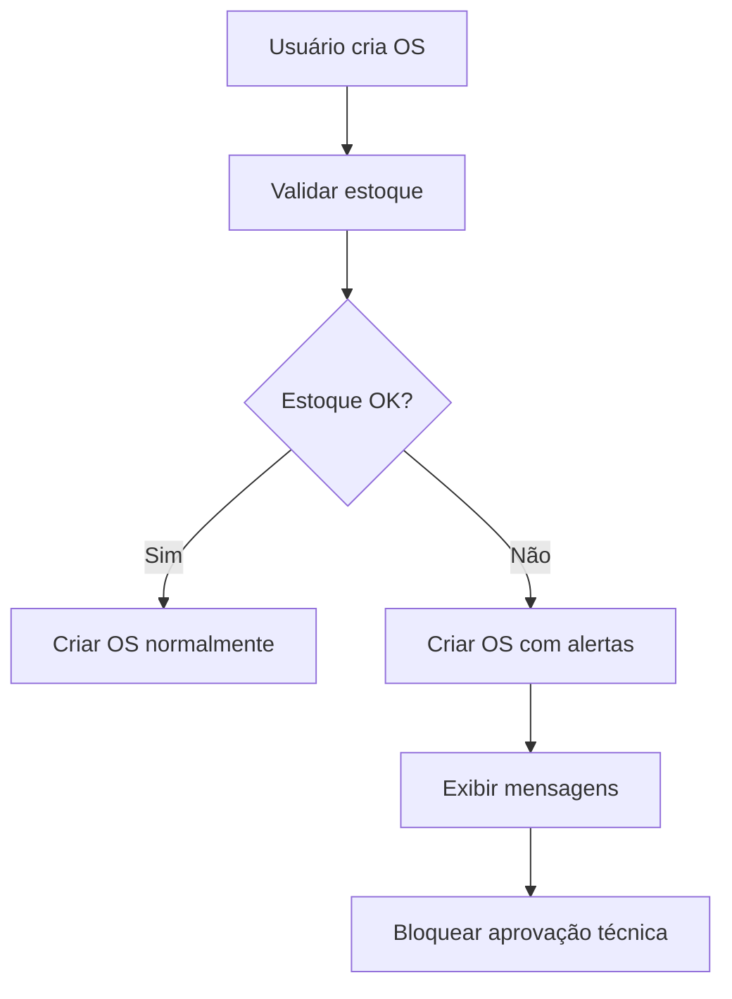
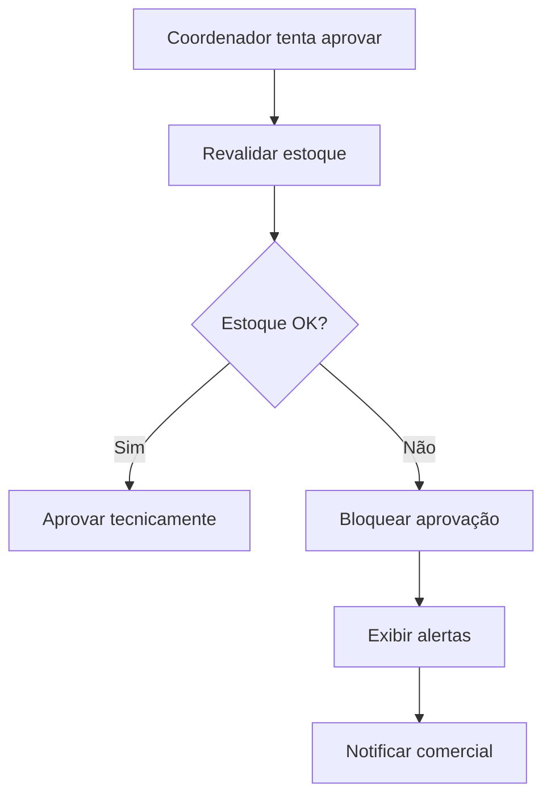

# Guia de Validação de Estoque - Módulo OS

## Visão Geral

Este documento descreve os cenários de validação de estoque no módulo OS, incluindo quando o sistema bloqueia a criação/aprovação de OS e quais mensagens são exibidas ao usuário.

## Cenários de Validação

### 1. **Estoque Suficiente (Cenário OK)**

**Condição**: Todos os insumos necessários estão disponíveis em estoque

**Comportamento**:
- ✅ OS é criada normalmente
- ✅ Aprovação técnica é liberada
- ✅ Sem alertas ou bloqueios

**Mensagem**: Nenhuma mensagem especial (processo normal)

---

### 2. **Estoque Insuficiente**

**Condição**: Um ou mais insumos não têm quantidade suficiente em estoque

**Comportamento**:
- ⚠️ OS é criada mas com alertas
- ⚠️ Aprovação técnica é bloqueada
- 📋 Sistema gera recomendações automáticas

**Mensagens Exibidas**:
```
🚨 ALERTA: Estoque insuficiente para [Nome do Insumo]
   Necessário: 100 folhas
   Disponível: 50 folhas
   Faltam: 50 folhas

💡 RECOMENDAÇÕES:
   • Comprar 50 folhas de [Nome do Insumo]
   • Contatar fornecedor principal
   • Verificar estoque em outras lojas
```

**Ações Disponíveis**:
- Comprar insumos faltantes
- Ajustar quantidade da OS
- Solicitar transferência entre lojas

---

### 3. **Fornecedor Inativo**

**Condição**: Insumo não está disponível e fornecedor está inativo

**Comportamento**:
- 🚫 OS é criada mas com bloqueio crítico
- 🚫 Aprovação técnica é bloqueada
- ⚠️ Sistema sugere fornecedores alternativos

**Mensagens Exibidas**:
```
🚫 BLOQUEIO: Fornecedor de [Nome do Insumo] está inativo
   Fornecedor: [Nome do Fornecedor]
   Última atualização: [Data]

💡 ALTERNATIVAS:
   • Buscar fornecedor alternativo
   • Reativar fornecedor atual
   • Usar insumo substituto
```

**Ações Disponíveis**:
- Ativar fornecedor
- Cadastrar novo fornecedor
- Usar insumo substituto

---

### 4. **Insumo Não Cadastrado**

**Condição**: Insumo necessário não existe no sistema

**Comportamento**:
- 🚫 OS é criada mas com erro crítico
- 🚫 Aprovação técnica é bloqueada
- 📝 Sistema sugere cadastro do insumo

**Mensagens Exibidas**:
```
❌ ERRO: Insumo "[Nome do Insumo]" não encontrado
   ID: [ID do Insumo]
   Quantidade necessária: [Quantidade]

💡 SOLUÇÕES:
   • Cadastrar novo insumo
   • Verificar ID do insumo
   • Usar insumo similar cadastrado
```

**Ações Disponíveis**:
- Cadastrar novo insumo
- Corrigir ID do insumo
- Usar insumo substituto

---

### 5. **Erro na Validação**

**Condição**: Erro técnico durante a validação (banco de dados, rede, etc.)

**Comportamento**:
- ⚠️ OS é criada mas com aviso
- ⚠️ Validação é marcada como "pendente"
- 🔄 Sistema sugere tentar novamente

**Mensagens Exibidas**:
```
⚠️ AVISO: Erro ao validar estoque
   Motivo: [Descrição do erro]
   Data: [Data/hora do erro]

🔄 AÇÕES:
   • Tentar validar novamente
   • Verificar conexão
   • Contatar suporte técnico
```

**Ações Disponíveis**:
- Tentar validação novamente
- Verificar conectividade
- Contatar suporte

---

## Fluxo de Validação

### Durante a Criação da OS



### Durante a Aprovação Técnica



## Configurações do Sistema

### Limites de Validação

- **Timeout**: 30 segundos para validação
- **Retry**: 3 tentativas em caso de erro
- **Cache**: 5 minutos para resultados de estoque

### Níveis de Bloqueio

1. **AVISO**: OS criada, apenas alertas exibidos
2. **ALERTA**: OS criada, aprovação bloqueada
3. **ERRO**: OS criada, validação pendente
4. **CRÍTICO**: OS não pode ser aprovada

## Mensagens Personalizáveis

### Templates de Mensagem

As mensagens podem ser personalizadas por loja através de templates:

```json
{
  "estoque_insuficiente": "Estoque insuficiente para {nome_insumo}",
  "fornecedor_inativo": "Fornecedor {nome_fornecedor} está inativo",
  "insumo_nao_encontrado": "Insumo {nome_insumo} não encontrado",
  "erro_validacao": "Erro ao validar estoque: {erro}"
}
```

### Variáveis Disponíveis

- `{nome_insumo}`: Nome do insumo
- `{quantidade_necessaria}`: Quantidade necessária
- `{quantidade_disponivel}`: Quantidade disponível
- `{quantidade_faltante}`: Quantidade faltante
- `{nome_fornecedor}`: Nome do fornecedor
- `{erro}`: Descrição do erro

## Integração com Outros Módulos

### Módulo de Compras

Quando estoque é insuficiente, o sistema pode:
- Gerar requisição de compra automática
- Sugerir fornecedores baseado no histórico
- Calcular prazo de entrega estimado

### Módulo de Estoque

- Reservas automáticas quando OS é aprovada
- Baixa automática quando produção inicia
- Alertas de reposição baseados em OS pendentes

### Módulo de Relatórios

- Relatórios de insumos faltantes por período
- Análise de fornecedores mais problemáticos
- Métricas de disponibilidade de estoque

## Troubleshooting

### Problemas Comuns

1. **"Erro ao validar estoque"**
   - Verificar conexão com banco de dados
   - Verificar se ValidacaoEstoqueService está rodando
   - Verificar logs do sistema

2. **"Insumo não encontrado"**
   - Verificar se insumo está ativo
   - Verificar se insumo pertence à loja
   - Verificar se ID está correto

3. **"Fornecedor inativo"**
   - Verificar status do fornecedor
   - Verificar se fornecedor tem produtos ativos
   - Considerar fornecedor alternativo

### Logs Importantes

```bash
# Logs de validação de estoque
grep "validacao-estoque" /var/log/comunikapp/os.log

# Logs de erros
grep "ERROR.*estoque" /var/log/comunikapp/os.log

# Logs de alertas
grep "ALERT.*estoque" /var/log/comunikapp/os.log
```

## Suporte

Para problemas relacionados à validação de estoque:

1. **Verificar logs** do sistema
2. **Consultar este guia** para cenários específicos
3. **Contatar suporte técnico** com logs e detalhes do erro

---

**Última atualização**: Janeiro 2025  
**Versão**: 1.0  
**Responsável**: Equipe de Desenvolvimento OS


