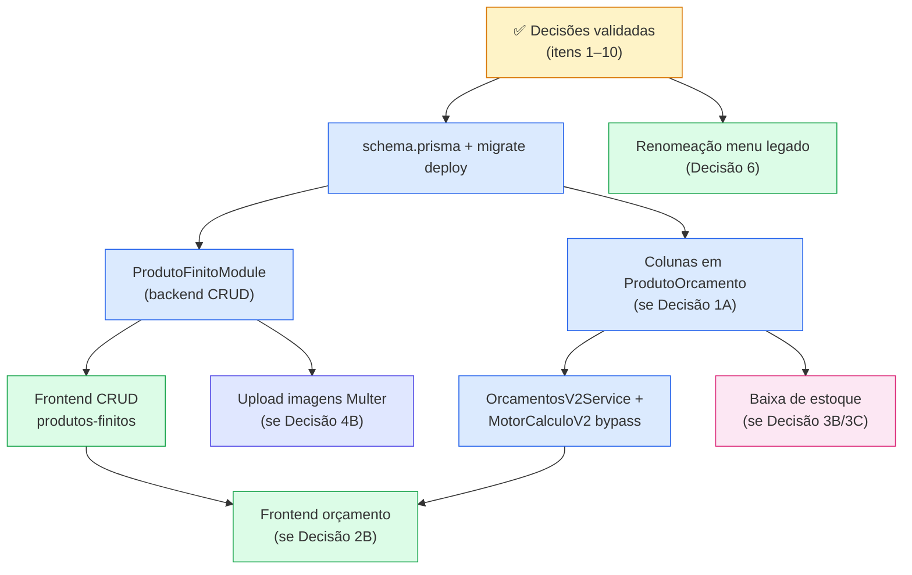

# Decisões Pré-Implementação — Módulo de Produtos Finitos

**Data:** 24/06/2026  
**Status:** Aguardando validação  
**Referência:** [ComunikApp - Especificação Técnica - Módulo de Produtos Finitos.pdf](./ComunikApp%20-%20Especificação%20Técnica%20-%20Módulo%20de%20Produtos%20Finitos.pdf)  
**Branch planejada:** `feature/modulo-produtos-finitos`

---

## 1. Resumo executivo

A especificação técnica define com clareza o **modelo de dados base** (3 tabelas novas), o **CRUD de produtos finitos** e o **bypass no motor de cálculo** para itens de prateleira. Porém, existem lacunas e conflitos com o monorepo atual que precisam ser validados **antes** de iniciar a implementação.

Este documento consolida:

- O que já está bem definido e pode seguir sem ambiguidade
- As decisões pendentes, com opções e recomendação
- Divergências entre o PDF/prompt e as convenções do código atual
- Mapa de dependências entre as entregas

---

## 2. O que está bem definido (pode seguir)

| Item | Detalhe |
|------|---------|
| **Migração aditiva** | Criar apenas tabelas novas; não alterar, truncar ou dropar `insumos`, `orcamento`, `template_produtos` |
| **Multi-tenant** | `loja_id` obrigatório em `CategoriaProdutoFinito` e `ProdutoFinito`; todas as queries filtradas por loja |
| **Backend CRUD** | Endpoints REST em `/produtos-finitos` com isolamento por `loja_id` do JWT |
| **Bypass no motor** | Itens `PRODUTO_FINITO` não passam por cálculo de insumos/máquinas/geometria; preço = `(preco_promocional \|\| preco_venda) × quantidade` |
| **Frontend CRUD** | Telas de listagem e formulário estruturado em seções (identificação, preço, logística, mídia) |
| **Legado preservado** | Rota `/produtos` atual aponta para `TemplateProduto` (modelos/templates de orçamento), não para produtos finitos |

---

## 3. Contexto do código atual

### 3.1 Módulo legado “Produtos”

- **Backend:** `ProdutosModule` → tabela `template_produtos` (`TemplateProduto`)
- **Frontend:** `src/app/(main)/produtos/` → label no menu: **“Produtos”**
- **API:** `GET/POST/PATCH/DELETE /produtos`

### 3.2 Orçamento V2

- Itens persistidos em `ProdutoOrcamento` (sem campo `tipo_item` ou `produto_finito_id` hoje)
- Cálculo via `OrcamentosV2Service` → `IntegracaoMotorService` → `MotorCalculoV2Service`
- DTO atual: `ProdutoOrcamentoDto` em `backend/src/orcamentos-v2/dto/criar-orcamento.dto.ts`

### 3.3 Estoque

- Módulo `estoque_itens` vinculado a **insumos** (`insumoId`), não a produtos finitos
- `ProdutoFinito.estoque_atual` no PDF é um campo **próprio** na nova tabela

### 3.4 Upload de arquivos

- Padrão existente: Multer + disco local (ex.: `anexo-geometria.controller.ts` para orçamentos)
- Não há serviço genérico de storage para imagens de produto

### 3.5 Convenções do monorepo

| Aspecto | Padrão atual |
|---------|--------------|
| Layout autenticado | `src/app/(main)/` — **não** `(dashboard)` |
| Método HTTP de update | `PATCH` (não `PUT`) |
| Autenticação nos controllers | `JwtAuthGuard` + `@CurrentLojaId()` |
| Middleware global | `JwtGlobalMiddleware` já aplicado em `app.module.ts` |
| IDs novos no PDF | `@default(uuid())` |
| IDs em `ProdutoOrcamento` | `@default(cuid())` |

---

## 4. Decisões pendentes

Marque a opção desejada em cada item antes de iniciar a implementação.

---

### Decisão 1 — Colunas em `ProdutoOrcamento` (CRÍTICA)

**Problema:** A seção 4 do PDF exige `tipo_item` e persistência do ID do produto finito no item do orçamento, mas a seção 2 (schema) **não inclui** essas colunas em `ProdutoOrcamento`.

**Impacto:** Sem migração aditiva em `ProdutoOrcamento`, os passos 3 (OrcamentosV2 + Motor) e a integração com estoque futuro não têm onde gravar o vínculo.

**Opções:**

- [ ] **1A — Adicionar colunas aditivas** *(recomendado)*
  - `tipo_item` — `String` com default `'SOB_DEMANDA'` (`'SOB_DEMANDA' | 'PRODUTO_FINITO'`)
  - `produto_finito_id` — `String?` com FK opcional para `ProdutoFinito`
- [ ] **1B — Não alterar `ProdutoOrcamento` nesta fase** (somente CRUD de produtos finitos, sem integração com orçamento)

**Recomendação:** **1A**

---

### Decisão 2 — Escopo do frontend de orçamento

**Problema:** O passo 4 do prompt de execução menciona apenas telas de cadastro/gestão. A seção 4 do PDF descreve inclusão de produtos de prateleira na **tela de Orçamentos V2**.

**Opções:**

- [ ] **2A — Só backend + CRUD de produtos finitos** (integração com orçamento em fase 2)
- [ ] **2B — Backend + CRUD + UI no `orcamento-v2-form`** para adicionar itens `PRODUTO_FINITO` *(recomendado para entrega ponta a ponta)*

**Recomendação:** **2B**

---

### Decisão 3 — Decremento de estoque na aprovação

**Problema:** O PDF diz que o ID salvo serve para o estoque decrementar “após aprovação comercial”, mas não define evento, fluxo nem integração com `estoque_itens`.

**Opções:**

- [ ] **3A — Apenas persistir `produto_finito_id`** no item do orçamento; baixa automática em fase futura *(recomendado para risco zero)*
- [ ] **3B — Decrementar `ProdutoFinito.estoque_atual`** na aprovação do orçamento
- [ ] **3C — Integrar com módulo `estoque`** (exige modelagem adicional — fora do escopo do PDF)

**Recomendação:** **3A**

---

### Decisão 4 — Upload de imagens da galeria

**Problema:** O PDF pede “upload múltiplo de fotos”, mas `GaleriaProdutoFinito` só armazena `url_imagem`. Não há endpoint nem estratégia de storage definidos.

**Opções:**

- [ ] **4A — MVP com URL externa** (usuário informa URL; sem upload de arquivo)
- [ ] **4B — Endpoint dedicado com Multer** (`POST /produtos-finitos/:id/imagens`), seguindo padrão de `anexo-geometria` *(recomendado)*
- [ ] **4C — Storage externo** (Supabase Storage / S3 — depende de credenciais no ambiente)

**Recomendação:** **4B**

---

### Decisão 5 — CRUD de categorias

**Problema:** `CategoriaProdutoFinito` existe no schema, mas o PDF **não define endpoints** para categorias.

**Opções:**

- [ ] **5A — Endpoints dedicados** (`/categorias-produto-finito`)
- [ ] **5B — Categorias inline no formulário** (autocomplete + criar se não existir) *(recomendado)*
- [ ] **5C — Sem categorias no MVP**

**Recomendação:** **5B**

---

### Decisão 6 — Renomeação do menu “Produtos” legado

**Problema:** O PDF pede renomear o antigo “Produtos” para “Modelos de Orçamento” ou “Templates”, sem quebrar tabelas/rotas de backend.

**Estado atual no menu (`layout.tsx`):**

| Label | Rota | Destino real |
|-------|------|--------------|
| Produtos | `/produtos` | `TemplateProduto` (modelos de orçamento) |

**Subdecisões:**

| Pergunta | Opções |
|----------|--------|
| Label do módulo legado | [ ] “Modelos de Orçamento” &nbsp; [ ] “Templates” |
| URL `/produtos` | [ ] Manter URL, só alterar label &nbsp; [ ] Migrar para `/modelos-orcamento` (com redirect) |
| Novo item no menu | [ ] “Produtos” → `/produtos-finitos` &nbsp; [ ] “Produtos Finitos” → `/produtos-finitos` &nbsp; [ ] “Produtos de Prateleira” → `/produtos-finitos` |

**Recomendação:**

- Legado: label **“Modelos de Orçamento”**, manter **`/produtos`**
- Novo: label **“Produtos”** (ou **“Produtos de Prateleira”** se preferir evitar ambiguidade) em **`/produtos-finitos`**

---

### Decisão 7 — Regra de `preco_promocional`

**Problema:** O PDF indica usar `preco_promocional` ou `preco_venda`, sem definir vigência ou condições.

**Opções:**

- [ ] **7A — Regra simples** *(recomendado)*: se `preco_promocional` preenchido, `> 0` e `< preco_venda` → usa promocional; senão `preco_venda`
- [ ] **7B — Sempre `preco_venda` no orçamento** (promocional reservado para e-commerce futuro)
- [ ] **7C — Campo `promocao_ativa` + datas de validade** (exige alteração de schema não prevista no PDF)

**Recomendação:** **7A**

---

### Decisão 8 — Margem, impostos e comissão em itens `PRODUTO_FINITO`

**Problema:** O bypass zera cálculo de insumos/máquinas, mas não esclarece se margem/impostos/comissão do orçamento incidem sobre o preço de prateleira.

**Opções:**

- [ ] **8A — Preço de prateleira é final por item** (sem margem/imposto extra do motor) *(recomendado)*
- [ ] **8B — Aplicar margem/imposto/comissão do orçamento** em cima do preço de prateleira

**Recomendação:** **8A** — o `preco_venda` já é o preço comercial definido no cadastro.

---

### Decisão 9 — Validações de negócio (complementares)

| Campo / regra | Lacuna | Proposta default |
|---------------|--------|------------------|
| **SKU** | Único por loja (já no schema) | HTTP 409 se duplicado na mesma loja |
| **EAN** | Opcional, 13 caracteres | Validar formato; checksum GTIN opcional |
| **Estoque negativo** | Não definido | [ ] Permitir &nbsp; [ ] Bloquear venda no orçamento se `quantidade > estoque_atual` |
| **Soft delete** | PDF: “soft delete ou `ativo = false`” | [ ] `ativo = false` *(recomendado, alinhado a `TemplateProduto`)* |

---

### Decisão 10 — Paginação e filtros (GET `/produtos-finitos`)

**Problema:** O PDF menciona paginação e filtro por categoria, sem definir parâmetros.

**Proposta default** (se não houver preferência):

```
?page=1&limit=20&categoria_id=&busca=&ativo=true
```

- Ordenação padrão: `nome ASC`
- Alinhar ao padrão de `/insumos` ou `/clientes` se existir convenção estabelecida

- [ ] Aprovar proposta default
- [ ] Definir parâmetros customizados: _______________

---

## 5. Divergências PDF/prompt vs monorepo (resolução proposta)

| PDF / prompt | Código atual | Resolução proposta |
|--------------|--------------|-------------------|
| `(dashboard)/produtos-finitos` | `(main)/` em todo o app | Usar **`src/app/(main)/produtos-finitos/`** |
| `PUT /produtos-finitos/:id` | Módulos usam `PATCH` | Usar **`PATCH`** (padrão do projeto) |
| `JwtGlobalMiddleware` nos endpoints | Controllers usam `JwtAuthGuard` + `@CurrentLojaId()` | Seguir padrão dos controllers existentes |
| FK explícita para `loja` | Outros models têm `@relation` | Adicionar relação em `loja` (migração aditiva) |
| `@default(uuid())` nos novos models | `ProdutoOrcamento` usa `cuid()` | Manter `uuid()` nas tabelas novas conforme PDF |

---

## 6. Schema proposto (além do PDF)

### 6.1 Tabelas novas (conforme PDF)

- `categorias_produto_finito` → `CategoriaProdutoFinito`
- `produtos_finitos` → `ProdutoFinito`
- `galeria_produto_finito` → `GaleriaProdutoFinito`

### 6.2 Alteração aditiva em tabela existente (se Decisão 1A aprovada)

```prisma
// Em model ProdutoOrcamento — campos aditivos
tipo_item         String   @default("SOB_DEMANDA") @db.VarChar(20)
produto_finito_id String?

produto_finito ProdutoFinito? @relation(fields: [produto_finito_id], references: [id], onDelete: SetNull)

@@index([produto_finito_id])
```

### 6.3 Relação em `loja` (aditiva)

```prisma
// Em model loja — relações aditivas
categorias_produto_finito CategoriaProdutoFinito[]
produtos_finitos          ProdutoFinito[]
```

---

## 7. Mapa de dependências



### 7.1 Ordem de execução sugerida (após validação)

| Fase | Entrega | Depende de |
|------|---------|------------|
| **0** | Validação deste documento | — |
| **1** | Branch `feature/modulo-produtos-finitos` | Fase 0 |
| **2** | `schema.prisma` + `prisma migrate` | Fase 1, Decisão 1 |
| **3** | `ProdutoFinitoModule` (CRUD + categorias conforme Decisão 5) | Fase 2 |
| **4** | Frontend CRUD em `(main)/produtos-finitos` | Fase 3 |
| **5** | Upload de imagens (se Decisão 4B) | Fase 3 |
| **6** | Bypass motor + OrcamentosV2 (se Decisão 1A) | Fase 2 |
| **7** | UI orçamento (se Decisão 2B) | Fases 4 e 6 |
| **8** | Renomeação menu legado (Decisão 6) | Pode ser paralelo à Fase 4 |
| **9** | Baixa de estoque (se Decisão 3B/3C) | Fases 6 e 7 |

---

## 8. Pacote de recomendações (MVP sugerido)

Para agilizar a validação, segue o pacote coerente com o PDF e com risco mínimo no banco:

| # | Decisão | Opção recomendada |
|---|---------|-------------------|
| 1 | Colunas em `ProdutoOrcamento` | **1A** |
| 2 | Escopo frontend orçamento | **2B** |
| 3 | Decremento de estoque | **3A** |
| 4 | Upload de imagens | **4B** |
| 5 | Categorias | **5B** |
| 6 | Menu legado | Label “Modelos de Orçamento” em `/produtos`; novo “Produtos” em `/produtos-finitos` |
| 7 | Preço promocional | **7A** |
| 8 | Margem/impostos em prateleira | **8A** |
| 9 | Soft delete | `ativo = false` |
| 10 | Paginação | Proposta default (`page`, `limit`, `categoria_id`, `busca`, `ativo`) |

---

## 9. Checklist de validação

Preencha e devolva para iniciar a implementação:

```
[ ] Decisão 1: _____ (1A / 1B)
[ ] Decisão 2: _____ (2A / 2B)
[ ] Decisão 3: _____ (3A / 3B / 3C)
[ ] Decisão 4: _____ (4A / 4B / 4C)
[ ] Decisão 5: _____ (5A / 5B / 5C)
[ ] Decisão 6 — Label legado: _____________________
[ ] Decisão 6 — URL legado: manter /produtos [ ] sim [ ] não → nova URL: _____
[ ] Decisão 6 — Label novo menu: _____________________
[ ] Decisão 7: _____ (7A / 7B / 7C)
[ ] Decisão 8: _____ (8A / 8B)
[ ] Decisão 9 — Estoque negativo: permitir [ ] / bloquear [ ]
[ ] Decisão 10 — Paginação: default [ ] / custom: _____

Observações adicionais:
_________________________________________________
_________________________________________________
```

---

## 10. Próximo passo após validação

1. Criar e mudar para a branch `feature/modulo-produtos-finitos`
2. Atualizar `backend/prisma/schema.prisma` conforme decisões aprovadas
3. Executar migração aditiva local (`npx prisma migrate dev`)
4. Implementar backend → integração orçamento → frontend, na ordem do mapa de dependências

---

*Documento gerado a partir da análise do PDF de especificação, do prompt de execução e do estado atual do monorepo ComunikApp.*
