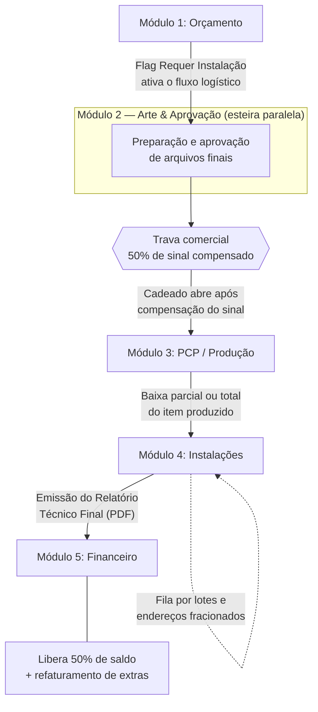
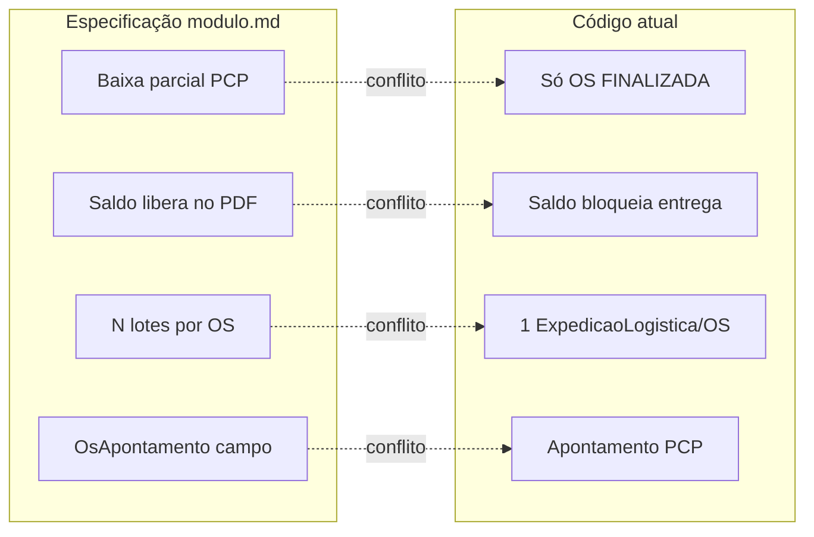

# Análise de Implementação e Decisões Pendentes — Módulo de Instalações

**Versão:** 1.0  
**Data:** 2025-06-30  
**Status:** Documentação de engenharia — aguardando decisões de produto/arquitetura  
**Documento base:** [`modulo.md`](./modulo.md) (Especificação Técnica e Funcional v2.0)  
**Público-alvo:** Produto, desenvolvimento core e code review arquitetural

---

## 1. Resumo executivo

O documento [`modulo.md`](./modulo.md) descreve a **Fase 2** do ComunikApp: um módulo unificado de **logística de campo**, **execução em obra** e **pós-cálculo financeiro**. Não se trata apenas de cadastrar instalações — o objetivo é transformar o pós-venda em controle operacional vivo e inteligência de margem (BI).

O repositório já possui **aproximadamente 40% da base técnica** reutilizável (orçamento com flag de instalação, tipos de instalação, módulo de Expedição, financeiro 50/50, Arte & Aprovação, assinatura digital). O que falta concentra-se em:

- fracionamento de entrega por endereço/lote;
- apontamentos de campo com impacto em CMV e cobrança extra;
- reconciliação da trava financeira (sinal/saldo) com o comportamento atual da Expedição;
- PDF nativo de Relatório Técnico Final;
- UX dual (broker desktop vs instalador mobile).

**Bloqueador principal antes de codificar:** alinhar a relação entre **Expedição** (já implementada) e o **Módulo de Instalações** (especificado), e definir **quando** a parcela de saldo (50%) é liberada para faturamento — o documento e o código atual divergem.

---

## 2. Escopo funcional (conforme especificação)

### 2.1. O que o módulo cobre

| Frente | Descrição |
|--------|-----------|
| **Logística de campo** | Fila por endereço/lote; rollouts fracionados (ex.: 10 totens em 5 condomínios ao longo de meses) |
| **Execução em campo** | Mobile para instalador interno **ou** desktop/timeline para broker que registra retornos de parceiros |
| **Pós-cálculo financeiro** | Apontamentos de obra, margem real (CMV), cobrança complementar, split NF-e / NFS-e |

### 2.2. Dois perfis de UX (mesma base de código)

| Perfil | Foco | Interface |
|--------|------|-----------|
| **Broker / Agente** | Intermediação, sem equipe de rua | Desktop — timeline estilo feed; entrada manual de fotos/textos recebidos via WhatsApp |
| **Indústria verticalizada** | Fábrica + equipes próprias | Mobile responsivo — checklist de 3 cliques: iniciar → fotos → assinatura |

### 2.3. Jornada ponta a ponta



| Etapa | Gatilho principal |
|-------|-------------------|
| Orçamento → Arte | Flag **Requer Instalação** (`instalacao_necessaria`) ativa o fluxo logístico |
| Arte → PCP | Trava comercial: confirmação dos **50% de sinal** |
| PCP → Instalações | Baixa de produção (parcial ou total) |
| Instalações → Financeiro | Geração do **Relatório Técnico Final** (PDF) |

### 2.4. Modelagem de dados proposta (ainda não no Prisma)

Conforme [`modulo.md`](./modulo.md) §3:

- **`ItemOSInstalacao`** — fracionamento por endereço e quantidade alocada; status, datas, fotos, assinatura
- **`OsApontamento`** — ocorrências de campo (`VISITA_IMPRODUTIVA`, `MATERIAL_EXTRA`, etc.) com `custo_interno` e `preco_cliente`
- **Enums:** `StatusInstalacao`, `TipoApontamento`, `CategoriaApont`
- **`tipo_faturamento`** — propriedade estrutural `'PRODUTO' | 'SERVICO'` em insumos/serviços para split fiscal

### 2.5. Regras de negócio críticas (especificação)

1. **Rollouts fracionados** — uma OS pode ter N registros `ItemOSInstalacao`; baixas parciais por endereço; OS mãe aberta até liquidar saldo.
2. **Blindagem de custo (RBAC)** — operadores/instaladores nunca veem `custo_interno` nem `preco_cliente`; backend popula valores a partir de tabela de taxas da loja.
3. **Impacto financeiro** — cada apontamento recalcula margem líquida real e pode gerar cobrança extra ao cliente.
4. **Split fiscal** — somatório segregado NF-e (produto) vs NFS-e (serviço) no fechamento.
5. **Fechamento** — ao gerar PDF do Relatório Técnico: libera parcela 2 (50% saldo) + dispara cobrança complementar de extras.

### 2.6. Dependência declarada

A especificação marca status **"Pronto para Implementação (Fase 2)"** com dependência da **Fase 1 (Arte & Aprovação)**. No código, Arte já possui schema e módulo backend; validar o que ainda falta da Fase 1 antes de amarrar gatilhos comerciais (trava de sinal → PCP).

---

## 3. Estado atual do repositório

### 3.1. O que já existe e é reutilizável

| Área | Situação | Referências no código |
|------|----------|----------------------|
| Flag no orçamento | Implementado | `instalacao_necessaria` e campos relacionados em `ProdutoOrcamento` (`backend/prisma/schema.prisma`); formulários e mapeamento V2 no frontend |
| Tipos de instalação | CRUD + defaults | Model `TipoInstalacao` — preço, custo mão de obra, deslocamento, tempo, pessoas |
| Módulo Expedição | Implementado (Fase 2–3) | `backend/src/expedicao/` — Kanban, assinatura, bloqueio financeiro, devolução ao PCP |
| Modalidade instalação | Override automático | `ExpedicaoModalidadeMapper` — se `instalacao_necessaria = true` → `INSTALACAO_NO_LOCAL` |
| Status logístico | Enum com instalação | `AGUARDANDO_INSTALACAO` em `StatusExpedicao` |
| Gatilho PCP → logística | Hook pós-conclusão | `ExpedicaoCriacaoService.criarSeElegivel` chamado em `pcp-kanban.service.ts` e `os.service.ts` |
| Financeiro 50/50 | Parcelas ENTRADA + SALDO | `CondicaoPagamentoTipo.ENTRADA_SALDO`, `ParcelaTipo.ENTRADA` / `SALDO` |
| Cobrança na aprovação | Automática | `OrcamentosV2Service.criarCobrancaAposAprovacao` |
| Arte & Aprovação | Schema + módulo | `ArteVersao`, `ArteArquivo`, controllers em `arte-aprovacao` |
| Assinatura digital | Canvas + upload | `AssinaturaCanvas`, `ExpedicaoAssinaturaService` |
| Campos OS para instalação | Parcial | `data_instalacao_agendada`, `observacoes_instalacao` em `OrdemServico` |
| Item OS com status PCP | Por item | `status_liberacao_pcp` em `ItemOS` (PENDENTE, LIBERADO, EM_PRODUCAO, CONCLUIDO) |
| Endpoint agendadas | Existe | `GET instalacoes/agendadas` em `os-direta-interna.controller.ts` |

### 3.2. Documentação relacionada no repositório

| Documento | Conteúdo |
|-----------|------------|
| [`modulo.md`](./modulo.md) | Especificação unificada v2.0 (este módulo) |
| [`docs/modulo de expedicao/01-plano-de-acao-tecnico-fases-2-3.md`](../modulo%20de%20expedicao/01-plano-de-acao-tecnico-fases-2-3.md) | Plano técnico da Expedição — decisões fechadas, hooks PCP, trava financeira |
| [`docs/arte-aprovacao/`](../arte-aprovacao/) | Módulo Arte & Aprovação — ADRs, checklist (parcialmente desatualizado) |

### 3.3. Fluxo atual PCP → Expedição (código)

```
PCP workflow CONCLUIDO  OU  OS status FINALIZADA
        ↓
ExpedicaoCriacaoService.criarSeElegivel(osId, lojaId)
        ↓
  (se OS comercial, não interna, sem expedição ativa)
        ↓
ExpedicaoLogistica criada com modalidade inicial
  (instalacao_necessaria → INSTALACAO_NO_LOCAL)
```

**Arquivos principais:**

- `backend/src/expedicao/services/expedicao-criacao.service.ts`
- `backend/src/pcp/services/pcp-kanban.service.ts` (linhas ~377 e ~831)
- `backend/src/os/services/os.service.ts` (~2485)

### 3.4. Fluxo financeiro atual da Expedição

`ExpedicaoFinanceiroService.verificarBloqueioEntrega` — **antes** de `ENTREGUE_FINALIZADO`:

- Bloqueia se parcela `SALDO` em `PREVISTO` / `VENCIDO` / `PARCIAL_PAGO`
- Bloqueia se qualquer parcela `VENCIDO`
- Libera se OS sem `orcamento_id` ou sem cobrança vinculada (null safety)

**Arquivo:** `backend/src/expedicao/services/expedicao-financeiro.service.ts`

---

## 4. Lacunas em relação à especificação

### 4.1. Modelagem de dados

| Entidade / campo | Especificação | Repositório |
|------------------|---------------|-------------|
| `ItemOSInstalacao` | Fracionamento por endereço | **Não existe** |
| `OsApontamento` (campo) | Ocorrências com custo/preço | **Não existe** — ver §4.2 |
| `tipo_faturamento` | PRODUTO \| SERVICO em insumos | **Não existe** no schema |
| Config loja: exigir sinal para OS | Flag comercial | **Não existe** |
| Status PCP `BLOQUEADO: AGUARDANDO SINAL` | Trava pré-produção | **Não existe** |
| Tabela de taxas (visita improdutiva, etc.) | Consulta pelo backend | **Não definida** — candidatos: `TipoInstalacao`, nova config comercial |

### 4.2. Colisão de nomenclatura: `Apontamento`

Já existe model `Apontamento` vinculado ao **PCP/workflow** com tipos operacionais:

- `INICIO`, `PAUSA`, `RETOMADA`, `CONCLUSAO`, `REFUGO`

A especificação propõe `OsApontamento` para **ocorrências de campo**:

- `VISITA_IMPRODUTIVA`, `MATERIAL_EXTRA`, `SERVICO_ADICIONAL`, `RETRABALHO`

São domínios distintos. **Não reutilizar** o model `Apontamento` existente sem risco de confusão semântica e quebra de relatórios PCP.

### 4.3. Gatilho PCP → Instalações (divergência)

| Especificação | Código atual |
|---------------|--------------|
| Baixa **parcial ou total** do item produzido dispara fila de instalações | Expedição criada apenas quando OS/workflow vai para **CONCLUIDO / FINALIZADA** (conclusão total) |

Para rollouts fracionados, é necessário um **evento de produção por item/lote**, ainda inexistente como gatilho logístico.

### 4.4. Trava financeira (lógica invertida)

| Momento | Especificação (`modulo.md`) | Expedição atual |
|---------|----------------------------|-----------------|
| 50% sinal | Libera PCP após compensação | Cobrança criada na aprovação; **não há** bloqueio explícito de PCP por sinal |
| 50% saldo | **Libera** ao gerar PDF do Relatório Técnico (fim da instalação) | **Bloqueia** conclusão de entrega se `SALDO` ainda não pago |

Estas regras precisam ser **reconciliadas** antes da implementação — não é possível aplicar o documento literalmente sem alterar `ExpedicaoFinanceiroService` ou definir exceções por modalidade.

### 4.5. Expedição vs Instalações (escopo)

A Expedição atual:

- **1 registro** `ExpedicaoLogistica` por OS (com histórico `DEVOLVIDA`)
- Status `AGUARDANDO_INSTALACAO`, assinatura, recebedor
- Kanban desktop em `/expedicao`
- Sem lotes por endereço, sem timeline de ocorrências, sem PDF técnico nativo, sem app mobile dedicado

A especificação pede camada adicional significativa.

### 4.6. Funcionalidades não implementadas

- [ ] PDF **Relatório Técnico Final** (fotos embutidas, assinaturas, sumário fiscal)
- [ ] Disparo automático de **cobrança complementar** por `preco_cliente` acumulado
- [ ] **RBAC** ocultando valores financeiros para operador/instalador
- [ ] **Fila mobile** on-demand para instalador
- [ ] **Timeline/feed** desktop para perfil broker
- [ ] **Split automático** NF-e vs NFS-e no fechamento
- [ ] **Recálculo de margem líquida real** com custos extras de apontamentos
- [ ] Múltiplos endereços/lotes por OS (`ItemOSInstalacao`)

---

## 5. Tensões arquiteturais (mapa de conflitos)



| # | Tensão | Impacto se ignorada |
|---|--------|---------------------|
| T1 | Expedição existente vs novo módulo Instalações | Duplicação de UI/API ou refatoração cara |
| T2 | Gatilho total vs parcial no PCP | Rollouts impossíveis sem mudança no PCP |
| T3 | Trava saldo na entrega vs na geração do PDF | Comportamento financeiro incorreto ou inconsistente entre modalidades |
| T4 | Dois tipos de "apontamento" | Bugs de relatório, queries ambíguas |
| T5 | `tipo_faturamento` global | Escopo explode para catálogo, orçamento e NF — pode ser fase posterior |

---

## 6. Decisões pendentes

Cada item deve ser **fechado por produto/arquitetura** antes de iniciar implementação. Opções sugeridas são ponto de partida — não são decisões tomadas.

### DEC-01 — Relação Expedição × Instalações

**Pergunta:** O módulo de Instalações substitui, estende ou convive com a Expedição?

| Opção | Descrição | Prós | Contras |
|-------|-----------|------|---------|
| **A** | Evoluir Expedição | Menos duplicação; reutiliza Kanban, assinatura, hooks | Expedição fica complexa; mistura entrega simples com rollout |
| **B** | Módulo `instalacoes/` separado | Domínio claro; Expedição permanece para retirada/transporte | Dois Kanbans; risco de fluxos paralelos |
| **C (híbrido)** | Expedição para modalidades simples; Instalações quando `INSTALACAO_NO_LOCAL` + fracionamento | Separação por caso de uso | Roteamento e ownership entre módulos precisam de contrato explícito |

**Recomendação técnica preliminar:** Opção **C** — alinha com `INSTALACAO_NO_LOCAL` já existente e evita reescrever Expedição inteira.

**Decisão:** ☐ A ☐ B ☐ C — Responsável: ______ — Data: ______

---

### DEC-17 — Imprevistos de campo vs. grade da OS (Dúvida 3)

**Pergunta:** Materiais extras, serviços não previstos ou sobras de execução devem alterar a grade de produtos da OS?

**Decisão fechada (2026-07-01):** **Não.** Imprevistos de campo registram-se **somente** em `OcorrenciaInstalacao` (spec: `OsApontamento`). A grade contratual (`ItemOS`) e o saldo de alocação em lotes (`ItemOSInstalacao`) **não** recebem aditivos automáticos nem saldos negativos.

**Fluxo:** Ocorrências → seção de extras no Relatório Técnico (PDF Fase 5) → pós-cálculo financeiro (cobrança complementar ou abono comercial).

**Documentação completa:** [`12-decisoes-produto-instalacao-comunikapp.md`](./12-decisoes-produto-instalacao-comunikapp.md) § Dúvida 3.

**Decisão:** ☑ Fechada — Responsável: Produto/Operações — Data: 2026-07-01

---

### DEC-02 — Modelo `ItemOSInstalacao` vs `ExpedicaoLogistica`

**Pergunta:** Como relacionar lotes por endereço com o registro de expedição?

| Opção | Descrição |
|-------|-----------|
| **A** | `ItemOSInstalacao` filho de `ExpedicaoLogistica` (1 expedição, N lotes) |
| **B** | `ItemOSInstalacao` filho direto de `ItemOS` / `OrdemServico`; Expedição opcional ou derivada |
| **C** | Substituir `ExpedicaoLogistica` por lotes quando modalidade = instalação |

**Decisão:** ☐ A ☐ B ☐ C — Responsável: ______ — Data: ______

---

### DEC-03 — Gatilho de entrada na fila de instalações

**Pergunta:** Quando um lote entra na fila?

| Opção | Descrição |
|-------|-----------|
| **A** | Conforme spec: baixa parcial/total por item no PCP |
| **B** | Manter atual: só quando OS/workflow conclui (total) |
| **C** | Híbrido: parcial só se flag `instalacao_necessaria` + config da loja habilitar rollout |

**Impacto:** Opção A exige novo evento no PCP (`ItemOS.status_liberacao_pcp = CONCLUIDO` ou apontamento com quantidade).

**Decisão:** ☐ A ☐ B ☐ C — Responsável: ______ — Data: ______

---

### DEC-04 — Momento de liberação da parcela SALDO (50%)

**Pergunta:** Quando o saldo pode ser faturado/recebido?

| Opção | Descrição |
|-------|-----------|
| **A** | Spec: ao gerar PDF do Relatório Técnico (último lote concluído) |
| **B** | Atual Expedição: saldo deve estar pago **antes** de `ENTREGUE_FINALIZADO` |
| **C** | Por modalidade: retirada/transporte = regra B; instalação = regra A |
| **D** | Saldo sempre liberado para faturamento no PDF; recebimento antes/depois configurável |

**Decisão:** ☐ A ☐ B ☐ C ☐ D — Responsável: ______ — Data: ______

---

### DEC-05 — Trava de sinal no PCP

**Pergunta:** Como implementar *"Exigir confirmação de sinal para iniciar OS"*?

| Opção | Descrição |
|-------|-----------|
| **A** | Flag em config da loja; OS nasce com status/substatus `BLOQUEADO_AGUARDANDO_SINAL` |
| **B** | Bloqueio no `ItemOS` (`status_liberacao_pcp = BLOQUEADO`) até parcela ENTRADA `LIQUIDADO` |
| **C** | Bloqueio no workflow PCP (setores não liberados) |
| **D** | Apenas aviso visual — sem trava hard (fast track sempre disponível) |

**Decisão:** ☐ A ☐ B ☐ C ☐ D — Responsável: ______ — Data: ______

---

### DEC-06 — Nomenclatura dos apontamentos de campo

**Pergunta:** Nome do model para ocorrências de obra?

| Opção | Nome sugerido |
|-------|---------------|
| **A** | `OsApontamentoCampo` |
| **B** | `OcorrenciaInstalacao` |
| **C** | `ApontamentoObra` |
| **D** | Outro: ________________ |

**Decisão:** ☐ A ☐ B ☐ C ☐ D — Responsável: ______ — Data: ______

---

### DEC-07 — Tabela de taxas (visita improdutiva, etc.)

**Pergunta:** Onde configurar valores padrão cobrados/custeados por tipo de ocorrência?

| Opção | Descrição |
|-------|-----------|
| **A** | Campos em `TipoInstalacao` |
| **B** | Nova entidade `TaxaOcorrenciaLoja` (tipo + valor custo + valor cliente) |
| **C** | Configuração comercial global da loja (JSON ou tabela key-value) |
| **D** | Híbrido: defaults na loja, override por `TipoInstalacao` |

**Decisão:** ☐ A ☐ B ☐ C ☐ D — Responsável: ______ — Data: ______

---

### DEC-08 — Cobrança extra de apontamentos

**Pergunta:** Como faturar `preco_cliente` acumulado?

| Opção | Descrição |
|-------|-----------|
| **A** | Automática: nova parcela/cobrança ao gerar PDF |
| **B** | Automática com revisão: gestor aprova lista antes de faturar |
| **C** | Manual: gestor dispara cobrança complementar no financeiro |
| **D** | Incluir no saldo final (única NF complementar) |

**Decisão:** ☐ A ☐ B ☐ C ☐ D — Responsável: ______ — Data: ______

---

### DEC-09 — Split fiscal (`tipo_faturamento`)

**Pergunta:** Escopo da propriedade PRODUTO vs SERVICO?

| Opção | Descrição |
|-------|-----------|
| **A** | Fase completa: catálogo, insumos, serviços, orçamento, fechamento |
| **B** | Só no relatório de fechamento (cálculo derivado das linhas existentes) |
| **C** | Postergar para fase 3; PDF mostra totais sem comando de emissão segregado |

**Decisão:** ☐ A ☐ B ☐ C — Responsável: ______ — Data: ______

---

### DEC-10 — RBAC e visibilidade de margem

**Pergunta:** Quem vê `custo_interno`, `preco_cliente` e "Lucro Real"?

| Papel | Ver custo interno | Ver preço cliente | Ver margem real |
|-------|-------------------|-------------------|-----------------|
| Instalador / operador PCP | ☐ Não | ☐ Não | ☐ Não |
| Produção | ☐ | ☐ | ☐ |
| Gestor logística | ☐ | ☐ | ☐ |
| Administrador | ☐ | ☐ | ☐ |
| Financeiro | ☐ | ☐ | ☐ |

**Decisão documentada:** ________________________________

---

### DEC-11 — UX mobile do instalador

**Pergunta:** Como entregar a interface de campo?

| Opção | Descrição |
|-------|-----------|
| **A** | Rotas responsivas em `(main)` — mesmo app Next.js |
| **B** | Layout/rota dedicada `/campo` ou `/instalador` (mobile-first) |
| **C** | PWA instalável |
| **D** | App nativo (fora de escopo imediato) |

**Decisão:** ☐ A ☐ B ☐ C ☐ D — Responsável: ______ — Data: ______

---

### DEC-12 — UX broker (timeline)

**Pergunta:** Onde vive o feed de ocorrências?

| Opção | Descrição |
|-------|-----------|
| **A** | Aba na OS |
| **B** | Dentro do módulo Instalações/Expedição (detalhe do lote) |
| **C** | Módulo global de ocorrências |
| **D** | A + B |

**Decisão:** ☐ A ☐ B ☐ C ☐ D — Responsável: ______ — Data: ______

---

### DEC-13 — Origem dos endereços de instalação

**Pergunta:** De onde vêm os registros `ItemOSInstalacao`?

| Opção | Descrição |
|-------|-----------|
| **A** | Snapshot do orçamento (`instalacao_*` em `ProdutoOrcamento`) na aprovação |
| **B** | Cadastro manual pós-venda pelo gestor |
| **C** | A na criação da OS + edição manual depois |
| **D** | Importação/planilha para rollouts grandes |

**Decisão:** ☐ A ☐ B ☐ C ☐ D — Responsável: ______ — Data: ______

---

### DEC-14 — Storage de evidências (fotos e assinatura)

**Pergunta:** Reutilizar infraestrutura existente?

| Opção | Descrição |
|-------|-----------|
| **A** | Mesmo padrão `ExpedicaoAssinaturaService` (`uploads/anexos/expedicao/`) |
| **B** | Pasta dedicada `uploads/anexos/instalacao/` |
| **C** | Mesmo storage da Arte (`ArteArquivo`) |
| **D** | Object storage externo (S3-compatible) — alinhar com ADR Arte |

**Decisão:** ☐ A ☐ B ☐ C ☐ D — Responsável: ______ — Data: ______

---

### DEC-15 — Backfill de OS históricas

**Pergunta:** OS finalizadas antes do deploy entram no novo fluxo?

| Opção | Descrição |
|-------|-----------|
| **A** | Não — igual Expedição (só pós-deploy) |
| **B** | Migração opcional sob demanda |
| **C** | Script de backfill para OS com `instalacao_necessaria` |

**Decisão:** ☐ A ☐ B ☐ C — Responsável: ______ — Data: ______

---

### DEC-16 — Dependência Fase 1 (Arte & Aprovação)

**Pergunta:** O que deve estar pronto na Fase 1 antes de iniciar Instalações?

Checklist mínimo sugerido:

- [ ] Arte aprovada pelo cliente dispara liberação comercial (se aplicável)
- [ ] Trava de sinal integrada ou explicitamente dispensada por config
- [ ] Link público de aprovação estável em produção
- [ ] Definir se instalação exige arte aprovada antes do PCP

**Decisão / critério de pronto:** ________________________________

---

## 7. Ordem sugerida de implementação

Após fechamento das decisões §6 (mínimo: DEC-01, DEC-03, DEC-04, DEC-05, DEC-06):

| Fase | Entrega | Dependências |
|------|---------|--------------|
| **0** | ADR com decisões fechadas | Este documento |
| **1** | Schema Prisma: `ItemOSInstalacao`, apontamentos de campo, config comercial, taxas | DEC-02, DEC-06, DEC-07 |
| **2** | Gatilho PCP parcial → criação de lote na fila | DEC-03 |
| **3** | Backend Instalações: CRUD lotes, transições de status, upload evidências | Fase 1, DEC-14 |
| **4** | RBAC + motor de taxas (valores ocultos no front de campo) | DEC-07, DEC-10 |
| **5** | Integração financeira: CMV, cobrança extra, liberação saldo | DEC-04, DEC-08 |
| **6** | UX gestor: tabela de endereços + timeline broker | DEC-12 |
| **7** | UX instalador: fila mobile + fluxo 3 cliques | DEC-11 |
| **8** | PDF Relatório Técnico Final | Fases 3–5 |
| **9** | Split fiscal NF-e / NFS-e | DEC-09 (pode ser postergado) |

---

## 8. Critérios de aceite (alto nível)

Extraídos da especificação — devem constar no plano de ação detalhado após decisões:

1. OS com 10 unidades pode ter 5+ lotes por endereço com baixas independentes.
2. Instalador registra início, fotos e assinatura sem ver valores monetários.
3. Visita improdutiva gera apontamento com custo/preço calculados pelo backend.
4. Último lote concluído permite exportar PDF com histórico, evidências e ocorrências.
5. Geração do PDF executa liberação de saldo e cobrança complementar (conforme DEC-04 e DEC-08).
6. Gestor broker consegue registrar ocorrência com fotos via desktop sem app mobile.
7. Trava de sinal impede PCP quando configurada e sinal não compensado (conforme DEC-05).
8. Integração com Expedição não quebra fluxos de retirada/transporte existentes.

---

## 9. Próximos artefatos recomendados

Após fechamento das decisões:

1. **`02-adr-decisoes.md`** — Registrar opções escolhidas com contexto e consequências.
2. **`03-plano-de-acao-tecnico.md`** — Espelhar formato de `docs/modulo de expedicao/01-plano-de-acao-tecnico-fases-2-3.md` (pastas backend/frontend, hooks, DTOs, testes).
3. **`04-checklist-progresso.md`** — Acompanhamento por fase (como catálogo de produtos).

---

## 10. Histórico de revisões

| Versão | Data | Autor | Alteração |
|--------|------|-------|-----------|
| 1.0 | 2025-06-30 | Análise inicial | Levantamento estado atual, lacunas e 16 decisões pendentes |
| 1.1 | 2026-07-01 | DEC-17 | Fechamento Dúvida 3 — sobra/aditivos de campo via `OcorrenciaInstalacao` |

---

## Referências rápidas de código

| Tópico | Caminho |
|--------|---------|
| Schema instalação no orçamento | `backend/prisma/schema.prisma` — `ProdutoOrcamento`, `TipoInstalacao` |
| Expedição — criação | `backend/src/expedicao/services/expedicao-criacao.service.ts` |
| Expedição — financeiro | `backend/src/expedicao/services/expedicao-financeiro.service.ts` |
| Expedição — modalidade | `backend/src/expedicao/services/expedicao-modalidade.mapper.ts` |
| Hook PCP | `backend/src/pcp/services/pcp-kanban.service.ts` |
| Apontamento PCP (não confundir) | `backend/prisma/schema.prisma` — model `Apontamento` |
| Parcelas 50/50 | `backend/src/financeiro/services/parcelas-builder.service.ts` |
| Frontend Expedição | `frontend/src/app/(main)/expedicao/`, `frontend/src/components/expedicao/` |
| Mapeamento instalação orçamento | `frontend/src/components/ui/orcamento/utils/map-instalacao-formulario.ts` |
