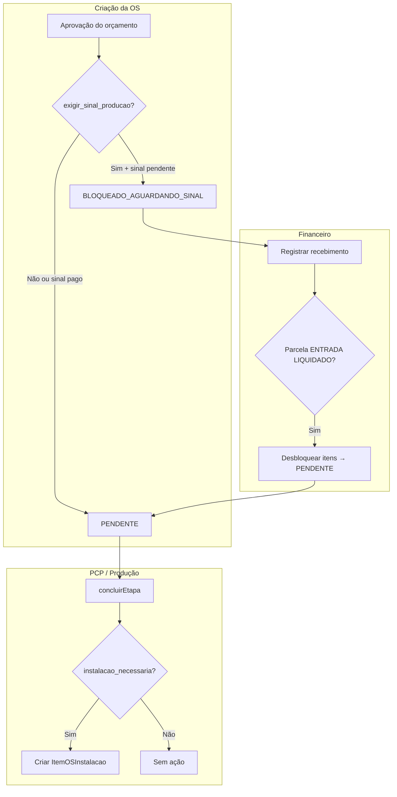

# Relatório de Conclusão — Fase 2: Travas Comerciais e Hooks de Produção (PCP)

**Status:** ✅ Implementada — aguardando aprovação formal para Fase 3  
**Dependência:** Fase 1 concluída e aprovada  
**Documentos relacionados:** [`02-relatorio-fase-1-banco-dados-e-configuracoes.md`](./02-relatorio-fase-1-banco-dados-e-configuracoes.md)

---

## 1. Arquivos criados ou alterados

| Arquivo | Ação |
|---------|------|
| `backend/src/instalacao/constants/pcp-liberacao.constants.ts` | Criado |
| `backend/src/instalacao/services/pcp-bloqueio-sinal.service.ts` | Criado |
| `backend/src/instalacao/services/pcp-bloqueio-sinal.service.spec.ts` | Criado |
| `backend/src/instalacao/services/item-os-instalacao-criacao.service.ts` | Criado |
| `backend/src/instalacao/services/item-os-instalacao-criacao.service.spec.ts` | Criado |
| `backend/src/instalacao/utils/endereco-instalacao.util.ts` | Criado |
| `backend/src/instalacao/instalacao.module.ts` | Modificado |
| `backend/src/os/utils/os-liberacao-pcp.util.ts` | Modificado |
| `backend/src/os/services/os.service.ts` | Modificado |
| `backend/src/os/services/os-produto-prazo.service.ts` | Modificado |
| `backend/src/os/os.module.ts` | Modificado |
| `backend/src/financeiro/services/cobrancas.service.ts` | Modificado |
| `backend/src/financeiro/financeiro.module.ts` | Modificado |
| `backend/src/pcp/services/pcp-kanban.service.ts` | Modificado |
| `backend/src/pcp/services/pcp-kanban.service.spec.ts` | Modificado |
| `backend/src/pcp/pcp.module.ts` | Modificado |

---

## 2. Verificação de regras de negócio e padrões

| Critério | Resultado |
|----------|-----------|
| Sem CSS inline e compatível com Dark/Light Mode? | Não se aplica nesta fase (somente backend) |
| 100% responsivo, sem overflow-x ou quebra de cards no mobile? | Não se aplica nesta fase |
| Integração/autopreenchimento por CEP funcional? | Não se aplica nesta fase |
| Codificação UTF-8 preservada em pt-BR para acentuação? | **Sim** |
| Regras de isolamento OWASP/RBAC aplicadas ao escopo? | **Sim** (queries com `loja_id`; hook financeiro valida tenant) |
| Ocorrências de campo usando `OcorrenciaInstalacao` isolado do PCP? | **Sim** (sem alteração no `Apontamento` do PCP) |

---

## 3. Resumo técnico por entrega

### 3.1. Bloqueio do PCP por sinal

**Serviço:** `PcpBloqueioSinalService`

| Método | Responsabilidade |
|--------|------------------|
| `resolverStatusInicialItem(lojaId, orcamentoId?)` | Define status inicial do item na criação da OS |
| `entradaJaLiquidada(lojaId, orcamentoId)` | Verifica parcela `ENTRADA` com status `LIQUIDADO` |
| `processarEntradaLiquidadaCobranca(lojaId, cobrancaId)` | Hook pós-recebimento financeiro |
| `desbloquearItensPorOrcamento(lojaId, orcamentoId)` | `BLOQUEADO_AGUARDANDO_SINAL` → `PENDENTE` |

**Regras:**

- Se `exigir_sinal_producao = true` e sinal não liquidado → `BLOQUEADO_AGUARDANDO_SINAL`.
- Se sinal já liquidado na criação → `PENDENTE` (fast track).
- Se flag desativada → `PENDENTE`.

**Pontos de integração:**

- `OSService.criarOSDeOrcamento()` / `montarItensOSDoOrcamento()`
- `OSProdutoPrazoService` (migração lazy produto orçamento → ItemOS)

**Arte & Aprovação permanece livre:**

- Apenas `status_liberacao_pcp` é afetado.
- `status_arte` e fluxo de Arte & Aprovação **não são alterados**.

**Bloqueios complementares:**

- `getMotivosBloqueioPcp()` retorna código `AGUARDANDO_SINAL` com mensagem em pt-BR.
- Auto-liberação por prazo (`OSProdutoPrazoService`) **não ocorre** enquanto item estiver `BLOQUEADO_AGUARDANDO_SINAL`.

**Constantes:** `StatusLiberacaoPcp` em `pcp-liberacao.constants.ts`

```
PENDENTE | BLOQUEADO_AGUARDANDO_SINAL | LIBERADO | EM_PRODUCAO | CONCLUIDO
```

**Significado de “Pronto para Produzir” após desbloqueio:**

- Status `PENDENTE` — item elegível ao fluxo normal de liberação (prazo, arte, materiais, liberação manual para PCP).
- Não salta direto para `LIBERADO`; respeita as demais travas já existentes no sistema.

---

### 3.2. Hook de desbloqueio financeiro

**Arquivo:** `backend/src/financeiro/services/cobrancas.service.ts`

**Gatilho:** `registrarRecebimento()` — após liquidação da parcela.

**Condição:**

```typescript
liquidouParcela === true
&& novoStatusParcela === ParcelaStatus.LIQUIDADO
&& parcelaAlvo.tipo === ParcelaTipo.ENTRADA
```

**Ação:**

1. Chama `PcpBloqueioSinalService.processarEntradaLiquidadaCobranca()`.
2. Atualiza itens bloqueados para `PENDENTE`.
3. Registra log `PCP_DESBLOQUEIO_SINAL` em `ordem_servico_log`.

**Resiliência:** falha no desbloqueio é logada mas **não reverte** o recebimento financeiro.

---

### 3.3. Gatilho de produção parcial/total → Instalações

**Serviço:** `ItemOSInstalacaoCriacaoService`

**Gatilho:** `PCPKanbanService.concluirEtapa()` — ao final da conclusão de etapa.

**Fluxo:**

```
concluirEtapa(itemOsId, quantidadeProduzida?)
        ↓
ItemOSInstalacaoCriacaoService.processarBaixaProducao()
        ↓
  instalacao_necessaria === true no ProdutoOrcamento?
        ↓ sim
  Cria registro em ItemOSInstalacao
```

**Regras de quantidade:**

| Cenário | Quantidade alocada |
|---------|-------------------|
| Baixa parcial (`quantidadeProduzida` informada) | Valor informado (limitado ao saldo) |
| Baixa total (todos setores `CONCLUIDA`/`CANCELADA`) | Saldo restante do item |
| Produção incompleta sem quantidade | Nenhum lote criado (`PRODUCAO_INCOMPLETA`) |

**Endereço:** montado via `montarEnderecoInstalacaoDoProduto()` a partir dos campos `instalacao_*` do `ProdutoOrcamento`. Fallbacks seguros quando campos estão vazios (`S/N`, `A definir`).

**Resiliência:** falha na criação do lote é logada mas **não reverte** a conclusão da etapa PCP (mesmo padrão da Expedição).

**Motivos de skip (`motivo_skip`):**

| Código | Significado |
|--------|-------------|
| `SEM_INSTALACAO` | Produto sem `instalacao_necessaria` |
| `ITEM_NAO_ENCONTRADO` | ItemOS inválido ou de outra loja |
| `SEM_ORCAMENTO` | OS sem vínculo com orçamento |
| `SEM_SALDO` | Quantidade já totalmente alocada |
| `PRODUCAO_INCOMPLETA` | Baixa total ainda não aplicável |

---

## 4. Diagrama de fluxo (Fase 2)



---

## 5. Validações executadas

| Comando | Resultado |
|---------|-----------|
| `jest src/instalacao` | ✅ 7 testes |
| `jest pcp-kanban.service.spec.ts` | ✅ 17 testes |
| `tsc --noEmit -p tsconfig.build.json` | ✅ |

**Cobertura de testes unitários (novos):**

- `PcpBloqueioSinalService` — bloqueio, fast track com sinal pago, desbloqueio por cobrança.
- `ItemOSInstalacaoCriacaoService` — skip sem instalação, criação com baixa parcial.

---

## 6. Plano de teste manual

### Teste 1 — Bloqueio na criação da OS

```sql
UPDATE configuracao_instalacao_loja
SET exigir_sinal_producao = true
WHERE loja_id = '<loja_id>';
```

Aprovar orçamento com instalação e verificar:

```sql
SELECT produto_servico, status_liberacao_pcp, status_arte
FROM itens_os
WHERE os_id = '<os_id>';
```

**Esperado:**

- `status_liberacao_pcp = BLOQUEADO_AGUARDANDO_SINAL`
- `status_arte` independente (fluxo de arte continua editável)

---

### Teste 2 — Desbloqueio ao receber sinal

```http
POST /financeiro/cobrancas/<cobranca_id>/recebimentos
Authorization: Bearer <token>
Content-Type: application/json

{
  "valor": <valor_entrada>,
  "data_recebimento": "2026-06-30",
  "metodo": "PIX"
}
```

```sql
SELECT status_liberacao_pcp FROM itens_os WHERE os_id = '<os_id>';
-- Esperado: PENDENTE

SELECT tipo_acao, descricao FROM ordem_servico_log
WHERE os_id = '<os_id>' AND tipo_acao = 'PCP_DESBLOQUEIO_SINAL';
```

---

### Teste 3 — Lote de instalação após baixa no PCP

Concluir etapa no kanban PCP para produto com `instalacao_necessaria = true` (com ou sem `quantidade_produzida`).

```sql
SELECT id, quantidade_alocada, logradouro, cidade, uf, status_instalacao
FROM itens_os_instalacao
WHERE item_os_id = '<item_os_id>';
```

**Esperado:** novo registro com `status_instalacao = AGUARDANDO` e endereço do orçamento.

---

## 7. Escopo da Fase 3 (próxima)

- Controlador e endpoints API rota mobile `/instalador` com RBAC (omitir `custo_interno` / `preco_cliente`).
- Service de CEP (ViaCEP) para validação de endereços.
- Motor de ocorrências (`OcorrenciaInstalacao` + `TaxaOcorrenciaLoja`).
- Pós-cálculo financeiro (margem real, liberação de saldo no relatório de encerramento).

---

## 8. Histórico

| Data | Evento |
|------|--------|
| 2025-06-30 | Implementação da Fase 2 |
| 2025-06-30 | Testes e compilação validados |
