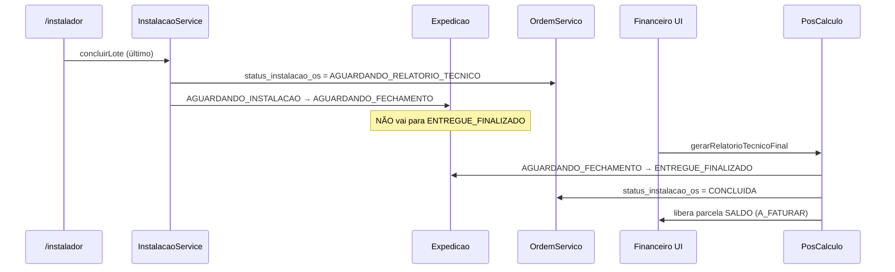

# Plano de Execução — Evolução UX (Doc 08) + DEC-04

**Versão:** 1.0  
**Data:** 2026-07-01  
**Status:** Plano de implementação — **aguardando execução**  
**Público:** Produto, UX e desenvolvimento  
**Relacionado:** [`08-ux-gestao-agenda-e-calendario.md`](./08-ux-gestao-agenda-e-calendario.md) · [`modulo.md`](./modulo.md) · [`../HANDOFF-CONTINUIDADE-INSTALACAO-JUL-2026.md`](../HANDOFF-CONTINUIDADE-INSTALACAO-JUL-2026.md)

---

## 1. Contexto

O motor de dados do módulo de instalação (Prisma, serviços centrais, lotes, ocorrências, PDF, split fiscal) está validado nas Fases 1–5. **Não** vamos finalizar a UI legada da Fase 4 (tabela global de lotes) para depois descartá-la.

Este plano consolida:

- **Decisões oficiais de produto** (DEC-04, UX-01 a UX-06)
- **Diretrizes de engenharia** obrigatórias no ComunikApp
- **Mapa de injeção** no código existente
- **Ordem sequencial de execução** com validações entre passos

A especificação de UX detalhada permanece no [Doc 08](./08-ux-gestao-agenda-e-calendario.md). Este documento é o **roteiro técnico de implementação**.

---

## 2. Decisões de produto oficiais

### DEC-04 — Resolução da tensão comercial/operacional

| Momento | Comportamento |
|---------|----------------|
| Último lote concluído em campo (`/instalador`) | OS entra em status operacional `AGUARDANDO_RELATORIO_TECNICO` |
| Expedição associada | **Não** avança para `ENTREGUE_FINALIZADO`. Retém em `AGUARDANDO_FECHAMENTO` |
| Gestor aprova no Financeiro | Relatório técnico + split fiscal → libera saldo + expedição → `ENTREGUE_FINALIZADO` |

> `AGUARDANDO_RELATORIO_TECNICO` na OS é **status operacional de instalação**, distinto de `StatusOS` (PCP) e homônimo da parcela financeira.

### UX-01 — Workspace de gestão

- Desktop `/instalacao`: clique no grid abre **Drawer/Modal fullscreen** com reidratação por payload.
- Suporte a **`/instalacao?os=:id`** para abrir o workspace após refresh ou link direto.
- Referência de padrão: `ArteWorkspaceModal` + `ArteWorkspacePanel`.

### UX-02 — `data_instalacao_agendada` na OS

- **Fonte da verdade:** `ItemOSInstalacao.data_previsao` (por lote).
- **Retrocompat:** service reativo atualiza `OrdemServico.data_instalacao_agendada` com a **menor** `data_previsao` futura e ativa dos lotes da OS.

### UX-03 e UX-04 — Agenda e conflitos

- Campos: `data_previsao` (Date) + `turno_previsao` (enum: `MANHA`, `TARDE`, `INTEIRO`).
- Conflito por equipe + dia: **alerta soft** (toast/confirmação), **não bloqueante**.
- MVP de equipe: campo `equipe_instalacao` (string), até existir entidade `Equipe`.

### UX-05 e UX-06 — Vistas e instalação simples

- Calendário em `/instalacao`: vista **padrão = Semanal**.
- **Instalação simples:** se a OS tem **apenas 1 lote**, o drill-down **pula** o Kanban interno e abre direto evidências/ações daquele lote.

---

## 3. Diretrizes de engenharia (obrigatórias)

1. **Multi-tenancy (OWASP / IDOR):** toda query Prisma e rota API valida `loja_id` do JWT.
2. **Estilo:** Tailwind + tokens semânticos (`bg-card`, `text-foreground`, `border-border`, `dark:`). Sem CSS inline. Responsivo 320px–ultrawide.
3. **Componentes:** reutilizar `frontend/src/components/ui/` e padrões CRUD (`DataTable`). Não duplicar modais/botões.
4. **Persistência:** reidratação por `key` de entidade; PATCH com payload completo de endereço/agenda; evitar perda em async.
5. **Localização:** pt-BR, UTF-8, em UI, toasts, erros e logs visíveis.
6. **Sem código morto:** buscar helpers/enums/DTOs existentes antes de criar novos.

---

## 4. Diagnóstico do estado atual (jul/2026)

| Ponto | Estado hoje | Conflito |
|-------|-------------|----------|
| `concluirLote` | Avança expedição → `ENTREGUE_FINALIZADO` quando todos os lotes concluem | **Quebra DEC-04** |
| `gerarRelatorioTecnicoFinal` | Libera parcela SALDO + PDF; **não** finaliza expedição | Falta gatilho pós-aprovação |
| `StatusExpedicao` | Sem `AGUARDANDO_FECHAMENTO` | Precisa migration |
| `OrdemServico` | Sem status operacional de instalação | Precisa campo novo |
| `ItemOSInstalacao` | `data_previsao` sem UI; sem `turno_previsao` / equipe | Migration + DTO |
| `data_instalacao_agendada` | API legada; não sincroniza com lotes | Service reativo (UX-02) |
| `/instalacao` | Tabela flat de **lotes** | Substituir por grid de **OS** |
| Financeiro (frontend) | Sem UI de relatório técnico | Gatilho DEC-04 órfão |
| Calendário | Nenhuma lib no `package.json` | Passo 4 |

### Arquivos centrais mapeados

```
backend/
├── prisma/schema.prisma
│   ├── OrdemServico.data_instalacao_agendada
│   ├── ItemOSInstalacao (data_previsao; sem turno/equipe)
│   └── StatusInstalacao (lote)
├── src/instalacao/services/
│   ├── instalacao.service.ts          ← concluirLote, avancarExpedicaoSeInstalacaoCompleta
│   ├── instalacao-pos-calculo.service.ts  ← gerarRelatorioTecnicoFinal
│   └── item-os-instalacao-criacao.service.ts
├── src/instalacao/controllers/instalacao.controller.ts
├── src/instalacao/dto/gestao.dto.ts
└── src/expedicao/enums/status-expedicao.enum.ts

frontend/
├── src/app/(main)/instalacao/page.tsx          ← UI legada (lotes)
├── src/components/instalacao/InstalacaoOsPainel.tsx  ← espelho OS
├── src/components/arte-aprovacao/ArteWorkspaceModal.tsx  ← padrão workspace
├── src/components/crud/DataTable.tsx
└── src/lib/instalacao/instalacao-api.ts
```

---

## 5. Fluxo alvo DEC-04



---

## 6. Passo 1 — Backend: transições, trava e agenda

### 6.1 Migration Prisma

**Arquivo sugerido:** `backend/prisma/migrations/20260701120000_instalacao_dec04_agenda/migration.sql`

| Alteração | Detalhe |
|-----------|---------|
| `StatusExpedicao` | Novo valor `AGUARDANDO_FECHAMENTO` (enum TS + coluna VARCHAR se aplicável) |
| `OrdemServico.status_instalacao_os` | Enum: `EM_ANDAMENTO`, `AGUARDANDO_RELATORIO_TECNICO`, `CONCLUIDA` (nullable até primeira instalação) |
| `ItemOSInstalacao.turno_previsao` | Enum `MANHA`, `TARDE`, `INTEIRO` (opcional) |
| `ItemOSInstalacao.equipe_instalacao` | `VARCHAR` opcional (MVP) |

**Pré-requisito Windows:** parar `npm run dev` antes de `prisma migrate` / `generate` (ver [`../DEV-GESTAO-PROCESSOS-NODE-WINDOWS.md`](../DEV-GESTAO-PROCESSOS-NODE-WINDOWS.md)).

### 6.2 `InstalacaoService.concluirLote`

**Arquivo:** `backend/src/instalacao/services/instalacao.service.ts` (~L168–218)

```
ANTES:  último lote CONCLUIDO → avancarExpedicaoSeInstalacaoCompleta() → ENTREGUE_FINALIZADO
DEPOIS: último lote CONCLUIDO → reterExpedicaoAguardandoFechamento()
        + OS.status_instalacao_os = AGUARDANDO_RELATORIO_TECNICO
        (sem ENTREGUE_FINALIZADO)
```

- Renomear/refatorar `avancarExpedicaoSeInstalacaoCompleta` → lógica de retenção.
- Idempotente: só transiciona expedição se status atual = `AGUARDANDO_INSTALACAO`.

### 6.3 `InstalacaoPosCalculoService.gerarRelatorioTecnicoFinal`

**Arquivo:** `backend/src/instalacao/services/instalacao-pos-calculo.service.ts` (~L141–297)

Dentro da `$transaction` existente, após criar `RelatorioTecnicoInstalacao`:

1. Expedição `AGUARDANDO_FECHAMENTO` → `ENTREGUE_FINALIZADO` (`loja_id` + `os_id`).
2. `OrdemServico.status_instalacao_os` → `CONCLUIDA`.

**Sugestão:** extrair `InstalacaoFechamentoService` para evitar dependência circular entre serviços.

### 6.4 `InstalacaoAgendaSyncService` (novo — UX-02)

**Arquivo:** `backend/src/instalacao/services/instalacao-agenda-sync.service.ts`

**Invocar após:** criar lote, PATCH lote (endereço/agenda), update de `data_previsao`.

**Regra:**

```
data_instalacao_agendada = MIN(data_previsao)
  WHERE lote.os_id = :osId
    AND data_previsao >= início do dia UTC/local (definir timezone loja)
    AND status_instalacao NOT IN (CONCLUIDO, LOGISTICA_NEGATIVA)
Se nenhum → null
```

Manter `GET /os/instalacoes/agendadas` sem quebrar contrato.

### 6.5 DTOs e endpoints

| Item | Ação |
|------|------|
| `gestao.dto.ts` | `AtualizarEnderecoLoteDto`: + `data_previsao?`, `turno_previsao?`, `equipe_instalacao?` |
| `instalacao.controller.ts` | `GET /instalacao/os` (grid) |
| | `GET /instalacao/agenda?de=&ate=` |
| | `GET /instalacao/agenda/conflitos?data=&equipe=&lote_id=` |
| `atualizarEnderecoLote` | Persistir agenda + chamar sync |

**Conflitos (UX-04):** endpoint read-only; confirmação no frontend; backend não bloqueia no MVP.

### 6.6 Expedição — arquivos adicionais

- `backend/src/expedicao/enums/status-expedicao.enum.ts`
- `backend/src/expedicao/constants/expedicao-kanban.constants.ts`
- `backend/src/expedicao/constants/expedicao-status.constants.ts`
- `backend/src/expedicao/services/expedicao-criacao.service.ts` — reversão PCP incluir `AGUARDANDO_FECHAMENTO`
- Labels frontend em `frontend/src/lib/expedicao/` (se existirem)

### 6.7 Testes (Passo 1)

```powershell
cd backend
npx jest src/instalacao/services/instalacao.service.spec.ts --runInBand --forceExit --no-coverage
npx jest src/instalacao/services/instalacao-pos-calculo.service.spec.ts --runInBand --forceExit --no-coverage
# + instalacao-agenda-sync.service.spec.ts (novo)
```

| Caso | Esperado |
|------|----------|
| `concluirLote` último lote | `AGUARDANDO_FECHAMENTO`; OS `AGUARDANDO_RELATORIO_TECNICO` |
| `gerarRelatorioTecnicoFinal` | Expedição `ENTREGUE_FINALIZADO`; OS `CONCLUIDA` |
| Sync agenda | `data_instalacao_agendada` = menor data futura dos lotes |

### 6.8 Passo 1f — Financeiro mínimo (recomendado no mesmo ciclo)

Sem superfície no Financeiro, DEC-04 não é testável E2E.

**Mínimo viável:**

- Painel na cobrança/OS em `/financeiro` (ex.: recebimentos ou detalhe)
- Exibir split fiscal (`GET /instalacao/os/:id/split-fiscal`)
- Botão **Aprovar relatório técnico** → `POST /instalacao/os/:id/relatorio-tecnico`
- Guard: `FINANCEIRO` / `ADMINISTRADOR`

APIs já existem; falta BFF + componente.

---

## 7. Passo 2 — Frontend: Grid + Workspace + `?os=:id`

### 7.1 Substituir UI legada

| Atual | Novo |
|-------|------|
| `frontend/src/app/(main)/instalacao/page.tsx` (tabela de lotes) | Grid de OS + slot para calendário (Passo 4) |

**Reutilizar:** `frontend/src/components/crud/DataTable.tsx`.

**Colunas sugeridas do grid:** OS, cliente, progresso (`8/20`), próxima visita, `status_instalacao_os`, ações.

### 7.2 API client e BFF

| Camada | Arquivo |
|--------|---------|
| Backend | `GET /instalacao/os` |
| BFF | `frontend/src/app/api/instalacao/os/route.ts` (novo) |
| Client | `instalacao-api.ts` → `listarOsInstalacao()` |

### 7.3 Workspace (UX-01)

**Novos componentes:**

```
frontend/src/components/instalacao/
  InstalacaoWorkspaceModal.tsx
  InstalacaoWorkspacePanel.tsx
```

**Padrão:** `ArteWorkspaceModal.tsx` — Dialog `h-[94vh]`, header com OS #, botão fechar, link nova aba opcional.

**Query string:**

```tsx
const osId = searchParams.get('os');
// osId presente → abrir modal
// onClose → router.replace('/instalacao') sem query
```

**Reidratação:** `key={osId}` no panel; `obterPainelOs(osId)` ao abrir.

### 7.4 Aba OS

- Manter `InstalacaoOsPainel.tsx` como **espelho read-only** (sem financeiro).
- Extrair núcleo compartilhado com workspace se evitar duplicação (`InstalacaoOperacaoCore` — opcional).

---

## 8. Passo 3 — Workspace interno: simples vs Kanban

### 8.1 Critério (UX-06)

```
painel.lotes.length === 1  → InstalacaoLoteSimplesView (evidências, endereço, ocorrências)
painel.lotes.length > 1    → InstalacaoOsKanbanBoard (card = lote/endereço)
```

### 8.2 Kanban interno

- Colunas alinhadas a `StatusInstalacao` do lote: `AGUARDANDO` → `EM_ANDAMENTO` → `CONCLUIDO` (+ `LOGISTICA_NEGATIVA`).
- Referência drag: `ArteKanbanBoard.tsx` (`@hello-pangea/dnd`); transição por ação é aceitável no MVP.
- Clique no card → painel do lote dentro do workspace.

### 8.3 Instalação simples

- Reaproveitar padrões de `frontend/src/app/(main)/instalador/lotes/[id]/page.tsx` em modo gestão desktop.

---

## 9. Passo 4 — Calendário semanal + conflitos

### 9.1 Dependência frontend

Não há lib de calendário no projeto. **Recomendação:** `react-big-calendar` com locale `pt-BR`.

| Vista | Uso |
|-------|-----|
| **Semana** (default UX-05) | Despacho operacional |
| Dia | Detalhe do dia |
| Mês | Rollouts longos |

### 9.2 Layout desktop

```
/instalacao
├── esquerda (~60%): Grid OS
└── direita (~40%): InstalacaoCalendarioPanel
```

- Evento = **lote** (`data_previsao` + `turno_previsao` no título).
- Clique no dia → filtra grid.
- Clique no evento → `?os=:id` + foco no lote.

### 9.3 Mobile

- Fila de OS em **cards** (CRUD responsivo).
- Header: botão **Ver calendário** → tela cheia semanal.

### 9.4 Fluxo de conflito (UX-04)

1. Ao salvar agenda: `GET /instalacao/agenda/conflitos?...`
2. Se `total > 0`: `AlertDialog` — *"A equipe X já possui agenda neste dia. Manter em paralelo?"*
3. Confirmar → `PATCH` normalmente.

### 9.5 BFF

- `frontend/src/app/api/instalacao/agenda/route.ts`
- `frontend/src/app/api/instalacao/agenda/conflitos/route.ts`

---

## 10. Ordem de execução sequencial

| # | Entrega | Depende de | Validação |
|---|---------|------------|-----------|
| **1a** | Migration + enums Prisma | — | `prisma migrate deploy` + `generate` |
| **1b** | DEC-04 em `concluirLote` + retenção expedição | 1a | Jest `instalacao.service` |
| **1c** | Avanço expedição em `gerarRelatorioTecnicoFinal` | 1a | Jest `instalacao-pos-calculo` |
| **1d** | `InstalacaoAgendaSyncService` + DTO agenda | 1a | Jest sync + PATCH |
| **1e** | `GET /instalacao/os` + `GET /instalacao/agenda` | 1d | curl autenticado |
| **1f** | UI Financeiro mínima (relatório técnico) | 1c | E2E DEC-04 manual |
| **2** | Grid OS + workspace + `?os=` | 1e | Navegação + refresh |
| **3** | Kanban interno / instalação simples | 2 | OS 1 vs N lotes |
| **4** | Calendário semanal + conflitos soft | 1e, 2 | Agenda + toast |

**Documentação:** ao iniciar Passo 1, atualizar [Doc 08](./08-ux-gestao-agenda-e-calendario.md) §12 (fechar UX-01–06) e marcar DEC-04 como **fechada**.

---

## 11. Riscos e decisões pré-implementação

| ID | Tópico | Decisão proposta |
|----|--------|------------------|
| **P-01** | Campo OS | `status_instalacao_os` persistido (não só rollup em memória) |
| **P-02** | Equipe | `equipe_instalacao` string no MVP; conflito só se preenchida |
| **P-03** | PATCH lote | Incluir `data_previsao` em `AtualizarEnderecoLoteDto` |
| **P-04** | Rota relatório | Manter `POST /instalacao/os/:id/relatorio-tecnico` com guard financeiro; BFF em `/api/financeiro/...` opcional |
| **P-05** | Timezone agenda | Usar timezone da loja ou UTC documentado no sync service |
| **P-06** | Passo 4 | Bloqueado sem API `GET /instalacao/agenda` (Passo 1e) |

---

## 12. Fora de escopo deste plano

- Finalizar UI legada Fase 4 (tabela global de lotes) — **substituída** pelo grid OS.
- Importação planilha rollouts (DEC-13).
- `tipo_faturamento` global no catálogo (DEC-09 opção A).
- Tela de config `exigir_sinal_producao` (backend já existe).
- Widget Home operacional (backlog Doc 08 §11).
- Associar fornecedor por lote (spec `modulo.md` §5.1 — nunca priorizado).

---

## 13. Roteiro de teste E2E (pós Passo 1f + 2)

1. Orçamento com `instalacao_necessaria` → OS → PCP → lotes criados.
2. `/instalador` → concluir todos os lotes com fotos/assinatura.
3. Verificar: OS `AGUARDANDO_RELATORIO_TECNICO`; expedição `AGUARDANDO_FECHAMENTO` (**não** `ENTREGUE_FINALIZADO`).
4. Financeiro → aprovar relatório técnico → PDF + saldo `A_FATURAR` + expedição `ENTREGUE_FINALIZADO`.
5. `/instalacao` → grid mostra OS; `?os=` abre workspace.
6. (Passo 4) Agendar lote → aparece no calendário; conflito exibe confirmação.

---

## 14. Prompt sugerido para retomar implementação

```text
Implementar Plano 09 do módulo instalação.
Leia: docs/modulo instalacao/09-plano-execucao-doc08-dec04.md
Começar pelo Passo 1a (migration). Não commitar sem eu pedir.
```

---

**Última atualização:** 2026-07-01
