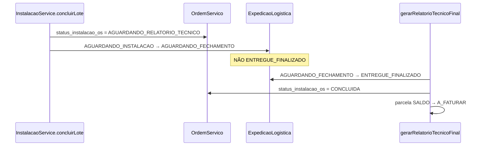

# Análise de Varredura e Alinhamento Técnico — Passo 1 (DEC-04 + Agenda)

**Versão:** 1.0  
**Data:** 2026-07-01  
**Status:** Análise concluída — pronto para implementar Passo 1  
**Público:** Desenvolvimento  
**Plano mestre:** [`09-plano-execucao-doc08-dec04.md`](./09-plano-execucao-doc08-dec04.md)  
**Especificação UX:** [`08-ux-gestao-agenda-e-calendario.md`](./08-ux-gestao-agenda-e-calendario.md)

---

## 1. Objetivo deste documento

Registrar o resultado da **varredura inicial** nos arquivos citados no mapa de injeção do Plano 09, confirmar **alinhamento técnico** com as decisões oficiais (DEC-04, UX-01 a UX-06) e detalhar o **Passo 1** (backend) como sequência executável com arquivos, trechos afetados, testes e critérios de aceite.

**Escopo desta análise:** Passo 1 completo (1a–1f do Plano 09). Passos 2–4 ficam referenciados, sem varredura profunda neste arquivo.

---

## 2. Decisões oficiais (resumo vinculante)

| ID | Regra |
|----|--------|
| **DEC-04** | Último lote concluído → OS `status_instalacao_os = AGUARDANDO_RELATORIO_TECNICO`; expedição → `AGUARDANDO_FECHAMENTO` (não `ENTREGUE_FINALIZADO`). Liberação de saldo + expedição finalizada **somente** via Financeiro ao aprovar relatório técnico. |
| **UX-02** | `data_previsao` no lote é canônico; `OrdemServico.data_instalacao_agendada` sincronizado por service. |
| **UX-03** | `turno_previsao`: `MANHA`, `TARDE`, `INTEIRO`. |
| **UX-04** | Conflito equipe+dia: alerta soft no frontend; API de consulta, sem bloqueio no backend. |
| **UX-01, 05, 06** | Passos 2–4 (grid, workspace, kanban, calendário). |

---

## 3. Resultado da varredura — estado atual do código

### 3.1 Conclusão geral

| Área | Situação | Ação Passo 1 |
|------|----------|----------------|
| Motor Fases 1–5 | Validado (lotes, ocorrências, PDF, split, trava parcela) | Estender, não reescrever |
| DEC-04 em `concluirLote` | **Implementação antiga ativa** — conflita com decisão | Substituir lógica |
| `gerarRelatorioTecnicoFinal` | Libera financeiro; **não** finaliza expedição | Adicionar avanço expedição |
| Schema Prisma | Faltam enums/campos novos | Migration |
| Agenda | `data_previsao` existe; sem `turno_previsao` / equipe | Migration + DTO |
| APIs grid/calendário | Inexistentes | Criar no Passo 1e |
| UI Financeiro relatório | Inexistente | Passo 1f (recomendado mesmo sprint) |
| UI `/instalacao` | Tabela de lotes (Fase 4 legada) | **Não alterar** no Passo 1 |

### 3.2 Evidências críticas (código atual)

#### `concluirLote` chama avanço automático para `ENTREGUE_FINALIZADO`

**Arquivo:** `backend/src/instalacao/services/instalacao.service.ts`

- Linhas ~168–209: após marcar lote `CONCLUIDO`, invoca `avancarExpedicaoSeInstalacaoCompleta`.
- Linhas ~572–621: método privado atualiza expedição `AGUARDANDO_INSTALACAO` → `ENTREGUE_FINALIZADO` quando não há lotes pendentes.
- Comentário no código ainda referencia **DEC-01** (comportamento pré-DEC-04).

**Impacto:** quebra a retenção comercial; expedição “fecha” antes do relatório técnico no Financeiro.

#### `gerarRelatorioTecnicoFinal` não mexe na expedição

**Arquivo:** `backend/src/instalacao/services/instalacao-pos-calculo.service.ts`

- Linhas ~141–297: transação libera parcela `SALDO` (`AGUARDANDO_RELATORIO_TECNICO` → `A_FATURAR`), cria parcela extra, persiste `RelatorioTecnicoInstalacao`.
- **Não há** `update` em `ExpedicaoLogistica` nem em `status_instalacao_os` da OS.

**Impacto:** mesmo após aprovação financeira, expedição pode permanecer em estado intermediário incorreto se só corrigirmos `concluirLote`.

#### Schema — o que existe vs o que falta

**Arquivo:** `backend/prisma/schema.prisma`

| Entidade / enum | Existe | Falta para Passo 1 |
|-----------------|--------|---------------------|
| `ItemOSInstalacao.data_previsao` | ✅ L2343 | — |
| `ItemOSInstalacao.turno_previsao` | ❌ | Enum + coluna |
| `ItemOSInstalacao.equipe_instalacao` | ❌ | `String?` (MVP) |
| `OrdemServico.data_instalacao_agendada` | ✅ L1803 | Sync reativo |
| `OrdemServico.status_instalacao_os` | ❌ | Enum novo |
| `StatusExpedicao` (Prisma enum L2279) | 7 valores | `AGUARDANDO_FECHAMENTO` |
| `StatusInstalacao` (lote) | ✅ 4 valores | Sem alteração |

`ExpedicaoLogistica.status` usa enum Prisma `StatusExpedicao` — migration deve alterar enum MySQL + espelho TS em `backend/src/expedicao/enums/status-expedicao.enum.ts`.

#### DTOs — agenda não exposta no PATCH

**Arquivo:** `backend/src/instalacao/dto/gestao.dto.ts`

- `AtualizarEnderecoLoteDto`: endereço + `quantidade_alocada`; **sem** `data_previsao`, `turno_previsao`, `equipe_instalacao`.
- `CriarLoteInstalacaoDto`: idem (sem agenda na criação).

#### Controller — rotas existentes vs planejadas

**Arquivo:** `backend/src/instalacao/controllers/instalacao.controller.ts`

| Rota atual | Passo 1 |
|------------|---------|
| `GET /instalacao/lotes` | Mantém (legado até Passo 2) |
| `GET /instalacao/os/:osId/painel` | Mantém |
| `POST /instalacao/lotes` | + sync agenda após criar |
| `PATCH /instalacao/lotes/:id` | + campos agenda + sync |
| `POST /instalacao/os/:osId/relatorio-tecnico` | + avanço expedição no service |
| `GET /instalacao/os` | **Criar** (grid) |
| `GET /instalacao/agenda` | **Criar** |
| `GET /instalacao/agenda/conflitos` | **Criar** |

**Mobile:** `backend/src/instalacao/controllers/instalador.controller.ts` — `PATCH lotes/:id/concluir` → `InstalacaoService.concluirLote` (ponto de gatilho DEC-04).

#### Expedição — arquivos que precisam reconhecer novo status

| Arquivo | Motivo |
|---------|--------|
| `backend/src/expedicao/enums/status-expedicao.enum.ts` | Enum TS |
| `backend/src/expedicao/constants/expedicao-kanban.constants.ts` | Coluna kanban |
| `backend/src/expedicao/constants/expedicao-status.constants.ts` | Status ativos |
| `backend/src/expedicao/services/expedicao-criacao.service.ts` | `cancelarPorReversaoConclusaoPcp` — incluir `AGUARDANDO_FECHAMENTO` no `in` de status arquiváveis |
| `frontend/src/lib/expedicao/expedicao-columns.tsx` | Label + coluna kanban |
| `frontend/src/lib/expedicao/expedicao.types.ts` | Union type |

#### Módulo Nest — registro de providers

**Arquivo:** `backend/src/instalacao/instalacao.module.ts`

- Adicionar providers: `InstalacaoAgendaSyncService`, `InstalacaoFechamentoService` (ou equivalente).
- Exportar se `InstalacaoPosCalculoService` precisar do fechamento de expedição.

#### Testes existentes — lacuna DEC-04

**Arquivo:** `backend/src/instalacao/services/instalacao.service.spec.ts`

- Cobre: listagem instalador, ocorrências, RBAC de campos financeiros.
- **Não cobre:** `concluirLote`, expedição, status OS.

**Arquivo:** `backend/src/instalacao/services/instalacao-pos-calculo.service.spec.ts`

- Cobre: relatório técnico e liberação de parcela.
- **Não cobre:** transição expedição pós-PDF.

#### Frontend — fora do Passo 1 (confirmado)

| Arquivo | Estado |
|---------|--------|
| `frontend/src/app/(main)/instalacao/page.tsx` | Lista **lotes** globais — substituído no Passo 2 |
| `frontend/src/components/instalacao/InstalacaoOsPainel.tsx` | Espelho operacional OS — mantém |
| `frontend/src/components/arte-aprovacao/ArteWorkspaceModal.tsx` | Referência UX Passo 2 |
| `frontend/package.json` | Sem lib de calendário — Passo 4 |

#### Listagem legada de agendamentos

**Arquivo:** `backend/src/os/controllers/os-direta-interna.controller.ts` — `GET instalacoes/agendadas` filtra `OrdemServico.data_instalacao_agendada`. O sync service (UX-02) **deve** alimentar este campo para não quebrar consumidores legados.

---

## 4. Fluxo alvo DEC-04 (confirmado na varredura)



---

## 5. Plano de ação detalhado — Passo 1

### 5.1 Ordem de sub-passos

```
1a → Migration Prisma
1b → InstalacaoFechamentoService + alterar concluirLote
1c → Integrar fechamento em gerarRelatorioTecnicoFinal
1d → InstalacaoAgendaSyncService + DTOs + PATCH/POST
1e → GET /instalacao/os + GET /instalacao/agenda (+ conflitos)
1f → UI Financeiro mínima (relatório técnico)
```

Cada sub-passo termina com teste ou validação antes do próximo.

---

### 5.2 Sub-passo 1a — Migration Prisma

**Migration sugerida:** `backend/prisma/migrations/20260701120000_instalacao_dec04_agenda/migration.sql`

**Alterações `schema.prisma`:**

```prisma
enum StatusInstalacaoOs {
  EM_ANDAMENTO
  AGUARDANDO_RELATORIO_TECNICO
  CONCLUIDA
}

enum TurnoPrevisaoInstalacao {
  MANHA
  TARDE
  INTEIRO
}

// StatusExpedicao: + AGUARDANDO_FECHAMENTO (após AGUARDANDO_INSTALACAO)

model OrdemServico {
  status_instalacao_os StatusInstalacaoOs?  // novo
}

model ItemOSInstalacao {
  turno_previsao      TurnoPrevisaoInstalacao?
  equipe_instalacao   String? @db.VarChar(120)
}
```

**Comandos (parar `npm run dev` antes):**

```powershell
cd backend
npx prisma migrate dev --name instalacao_dec04_agenda
npx prisma generate
```

**Critério de aceite:** migration aplica sem erro; enum visível no client Prisma.

---

### 5.3 Sub-passo 1b — DEC-04 em `concluirLote`

**Arquivos:**

| Arquivo | Mudança |
|---------|---------|
| `instalacao-fechamento.service.ts` | **Novo** — `reterAposInstalacaoCompleta(lojaId, osId)` |
| `instalacao.service.ts` | Substituir chamada L206–209; remover/refatorar `avancarExpedicaoSeInstalacaoCompleta` |

**Lógica `reterAposInstalacaoCompleta`:**

1. Contar lotes da OS com `loja_id`; se algum `status_instalacao NOT IN (CONCLUIDO, LOGISTICA_NEGATIVA)` → return (idempotente).
2. Se `totalLotes === 0` → return.
3. `ordemServico.updateMany({ id: osId, loja_id })` → `status_instalacao_os = AGUARDANDO_RELATORIO_TECNICO`.
4. `expedicaoLogistica.updateMany({ os_id, loja_id, status: AGUARDANDO_INSTALACAO })` → `AGUARDANDO_FECHAMENTO`, `atualizado_em = now()`.
5. Log em pt-BR.

**Segurança:** todas as queries com `loja_id`.

**Testes novos** em `instalacao.service.spec.ts` ou `instalacao-fechamento.service.spec.ts`:

- Último lote concluído → expedição **não** vai para `ENTREGUE_FINALIZADO`.
- OS recebe `AGUARDANDO_RELATORIO_TECNICO`.
- Lote concluído mas ainda há pendente → sem mudança de OS/expedição.

---

### 5.4 Sub-passo 1c — Fechamento no relatório técnico

**Arquivo:** `instalacao-pos-calculo.service.ts` — dentro da `$transaction` de `gerarRelatorioTecnicoFinal`, após criar relatório:

**Chamar** `InstalacaoFechamentoService.finalizarAposRelatorioTecnico(lojaId, osId, tx?)`:

1. `expedicaoLogistica.updateMany({ status: AGUARDANDO_FECHAMENTO })` → `ENTREGUE_FINALIZADO`, `data_conclusao = now()`.
2. `ordemServico.update` → `status_instalacao_os = CONCLUIDA`.

**Teste** em `instalacao-pos-calculo.service.spec.ts`:

- Mock expedição em `AGUARDANDO_FECHAMENTO` → após `gerarRelatorioTecnicoFinal`, status `ENTREGUE_FINALIZADO`.

---

### 5.5 Sub-passo 1d — Agenda sync + DTOs

**Novo:** `instalacao-agenda-sync.service.ts`

```typescript
async sincronizarDataInstalacaoAgendadaOs(lojaId: string, osId: string): Promise<void>
```

**Algoritmo:**

1. Buscar lotes da OS (`item_os.os_id = osId`, `loja_id`).
2. Filtrar: `data_previsao IS NOT NULL`, `data_previsao >= startOfToday`, status ∉ `{CONCLUIDO, LOGISTICA_NEGATIVA}`.
3. `MIN(data_previsao)` → `OrdemServico.data_instalacao_agendada` (ou `null`).

**Invocar após:**

- `ItemOSInstalacaoCriacaoService.criarLoteManual` (create)
- `InstalacaoService.atualizarEnderecoLote` (patch)
- Qualquer update futuro de `data_previsao`

**DTO `gestao.dto.ts`:**

```typescript
// AtualizarEnderecoLoteDto e opcionalmente CriarLoteInstalacaoDto
@IsOptional() @IsDateString() data_previsao?: string;
@IsOptional() @IsEnum(TurnoPrevisaoInstalacao) turno_previsao?: ...;
@IsOptional() @IsString() @MaxLength(120) equipe_instalacao?: string;
```

**`atualizarEnderecoLote`:** persistir novos campos no `update` Prisma; chamar sync.

**Teste:** `instalacao-agenda-sync.service.spec.ts` — 3 lotes com datas futuras → OS recebe a menor.

---

### 5.6 Sub-passo 1e — APIs de grid e calendário

#### `GET /instalacao/os`

**Service:** `listarOsInstalacaoGestao(lojaId, filtros?)`

Retorno por OS com instalação:

- `os_id`, `numero`, `cliente_nome`, `nome_servico`
- `status_instalacao_os`
- `progresso`: `{ concluidos, total, alocados, saldo }` (rollup lotes)
- `proxima_visita`: menor `data_previsao` futura
- `data_instalacao_agendada` (campo OS sincronizado)

Query (atualizada em jul/2026 — gate de fluxo): OS que tenham **≥1 lote existente** ou que estejam **`FINALIZADA`** com ≥1 item `instalacao_necessaria` no orçamento. OS recém-criada de orçamento aprovado, ainda sem baixa de produção no PCP, **não** aparece no grid (`modulo.md` § 2.1 — gatilho PCP → Instalação).

#### `GET /instalacao/agenda?de=&ate=`

Retorno: eventos = lotes com `data_previsao` no intervalo:

- `lote_id`, `os_id`, `os_numero`, endereço resumido, `turno_previsao`, `equipe_instalacao`, `status_instalacao`

#### `GET /instalacao/agenda/conflitos`

Query: `data` (obrigatório), `equipe_instalacao?`, `lote_id?` (excluir self)

Retorno:

```json
{
  "total_no_dia": 2,
  "severidade": "informacao",
  "itens": [{ "lote_id", "os_numero", "equipe_instalacao", "turno_previsao" }]
}
```

Se `equipe_instalacao` vazio no request → conflito apenas informativo por dia (opcional no MVP).

**Controller:** `instalacao.controller.ts` + guards `InstalacaoGestaoPermissionsGuard`.

**BFF (Passo 2, preparar rotas no 1e se desejado):**

- `frontend/src/app/api/instalacao/os/route.ts`
- `frontend/src/app/api/instalacao/agenda/route.ts`

**Critério de aceite Passo 1e:** `curl` autenticado retorna JSON com `loja_id` isolado (tentativa com OS de outra loja → 404).

---

### 5.7 Sub-passo 1f — Financeiro mínimo (DEC-04 testável)

**Problema:** sem UI, gatilho de aprovação não é exercitável E2E.

**Entrega mínima:**

| Item | Detalhe |
|------|---------|
| Componente | Ex.: `InstalacaoRelatorioTecnicoCard.tsx` em financeiro |
| Dados | `GET split-fiscal`, `GET relatorio-tecnico` (404 = não emitido) |
| Ação | `POST relatorio-tecnico` |
| Guard | Perfil FINANCEIRO / ADMINISTRADOR |
| Local | Detalhe cobrança ou `/financeiro/recebimentos` com contexto OS |

APIs já existem em `instalacao.controller.ts`; falta proxy BFF + UI.

**Critério E2E:**

1. Concluir todos os lotes → expedição `AGUARDANDO_FECHAMENTO`.
2. Financeiro → emitir relatório → expedição `ENTREGUE_FINALIZADO`, parcela `A_FATURAR`.

---

## 6. Matriz de arquivos — Passo 1 (checklist)

| # | Arquivo | Ação |
|---|---------|------|
| 1 | `backend/prisma/schema.prisma` | Enums + campos |
| 2 | `backend/prisma/migrations/.../migration.sql` | SQL |
| 3 | `backend/src/expedicao/enums/status-expedicao.enum.ts` | +`AGUARDANDO_FECHAMENTO` |
| 4 | `backend/src/expedicao/constants/*.ts` | Kanban + ativos |
| 5 | `backend/src/expedicao/services/expedicao-criacao.service.ts` | Reversão PCP |
| 6 | `backend/src/instalacao/services/instalacao-fechamento.service.ts` | **Criar** |
| 7 | `backend/src/instalacao/services/instalacao-agenda-sync.service.ts` | **Criar** |
| 8 | `backend/src/instalacao/services/instalacao.service.ts` | DEC-04 + PATCH agenda |
| 9 | `backend/src/instalacao/services/instalacao-pos-calculo.service.ts` | Fechar expedição |
| 10 | `backend/src/instalacao/services/item-os-instalacao-criacao.service.ts` | Sync pós-create |
| 11 | `backend/src/instalacao/dto/gestao.dto.ts` | Campos agenda |
| 12 | `backend/src/instalacao/controllers/instalacao.controller.ts` | Novas rotas |
| 13 | `backend/src/instalacao/instalacao.module.ts` | Providers |
| 14 | `backend/src/instalacao/services/*.spec.ts` | Testes |
| 15 | `frontend/src/lib/expedicao/expedicao-columns.tsx` | Label novo status |
| 16 | Financeiro frontend | Passo 1f |

---

## 7. Riscos identificados na varredura

| Risco | Mitigação |
|-------|-----------|
| Enum Prisma `StatusExpedicao` em MySQL exige `ALTER` cuidadoso | Migration dedicada; testar em dev |
| `instalacao.service.spec` sem mock de `expedicaoLogistica` | Extrair `InstalacaoFechamentoService` testável isolado |
| Dependência circular Service ↔ PosCalculo | Fechamento em service dedicado injetado nos dois |
| Timezone em `sincronizarDataInstalacaoAgendadaOs` | Documentar: `startOfDay` em America/Sao_Paulo ou UTC; alinhar com calendário Passo 4 |
| Kanban expedição sem coluna nova | Atualizar `expedicao-columns.tsx` no mesmo PR do 1a |
| Relatório só via `/instalacao` API | Manter rota; Financeiro consome mesma API via BFF |

---

## 8. O que **não** fazer no Passo 1

- Refatorar `frontend/src/app/(main)/instalacao/page.tsx` (Passo 2).
- Implementar Kanban interno ou calendário (Passos 3–4).
- Adicionar `react-big-calendar` (Passo 4).
- Remover `GET /instalacao/lotes` (legado até grid pronto).
- Commitar sem solicitação do usuário.

---

## 9. Validação final do Passo 1

```powershell
cd backend
npx jest src/instalacao/services/instalacao-fechamento.service.spec.ts --runInBand --forceExit --no-coverage
npx jest src/instalacao/services/instalacao-agenda-sync.service.spec.ts --runInBand --forceExit --no-coverage
npx jest src/instalacao/services/instalacao.service.spec.ts --runInBand --forceExit --no-coverage
npx jest src/instalacao/services/instalacao-pos-calculo.service.spec.ts --runInBand --forceExit --no-coverage
```

**Checklist manual:**

- [ ] Último lote via `/instalador` → OS `AGUARDANDO_RELATORIO_TECNICO`
- [ ] Expedição `AGUARDANDO_FECHAMENTO` (não finalizada)
- [ ] Financeiro emite relatório → expedicao `ENTREGUE_FINALIZADO` + saldo `A_FATURAR`
- [ ] PATCH lote com `data_previsao` → `data_instalacao_agendada` na OS atualizada
- [ ] `GET /instalacao/agenda` retorna eventos no intervalo
- [ ] IDOR: token loja A não acessa OS loja B

---

## 10. Próximo passo imediato

Iniciar **Sub-passo 1a** (migration Prisma), seguido de **1b** na mesma branch de trabalho.

**Prompt para o agente implementador:**

```text
Implementar Passo 1 do doc 10-analise-varredura-alinhamento-passo1.md
Começar por 1a (migration). Seguir checklist §6. Não commitar sem pedido.
```

---

## 11. Referências cruzadas

| Documento | Papel |
|-----------|--------|
| [`09-plano-execucao-doc08-dec04.md`](./09-plano-execucao-doc08-dec04.md) | Plano mestre Passos 1–4 |
| [`08-ux-gestao-agenda-e-calendario.md`](./08-ux-gestao-agenda-e-calendario.md) | Especificação UX |
| [`../HANDOFF-CONTINUIDADE-INSTALACAO-JUL-2026.md`](../HANDOFF-CONTINUIDADE-INSTALACAO-JUL-2026.md) | Estado integração PCP |
| [`../DEV-GESTAO-PROCESSOS-NODE-WINDOWS.md`](../DEV-GESTAO-PROCESSOS-NODE-WINDOWS.md) | Prisma / dev servers |

---

**Última atualização:** 2026-07-01 · varredura alinhada ao repositório `comunikapp` (branch de trabalho local jul/2026)
