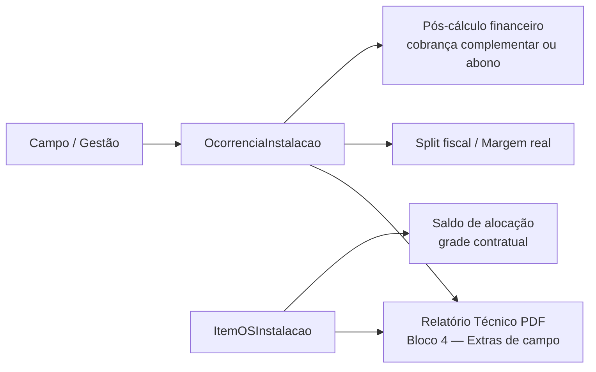

# Decisões de Produto — Instalação ComunikApp

**Versão:** 1.0  
**Data:** 2026-07-01  
**Status:** Registro oficial de decisões — Dúvida 3 **fechada**  
**Público:** Produto, operações, financeiro e desenvolvimento  
**Relacionado:** [`01-analise-implementacao-e-decisoes.md`](./01-analise-implementacao-e-decisoes.md) · [`modulo.md`](./modulo.md) · [`06-relatorio-fase-5-pdf-e-fechamento.md`](./06-relatorio-fase-5-pdf-e-fechamento.md) · [`11-ux-kanban-saldo-alocacao-e-correcao-lotes.md`](./11-ux-kanban-saldo-alocacao-e-correcao-lotes.md)

---

## 1. Propósito

Este documento consolida as **dúvidas de produto** levantadas durante a homologação do módulo de Instalação (jul/2026), com foco em governança entre **grade contratual da OS**, **alocação física em lotes** e **imprevistos de campo**.

Cada dúvida aponta para a decisão formal (DEC-XX) ou para especificação de UX quando aplicável.

---

## 2. Índice de dúvidas

| ID | Tema | Status | Referência |
|----|------|--------|------------|
| **Dúvida 1** | Relação Expedição × Instalações | ✅ Fechada | [DEC-01](#3-dúvida-1--expedição--instalações-dec-01) |
| **Dúvida 2** | Saldo de alocação vs. execução no Kanban | 📋 Em validação UX | [Dúvida 2](#4-dúvida-2--saldo-de-alocação-no-kanban) |
| **Dúvida 3** | Lotes de sobra / aditivos de campo | ✅ **Fechada** | [Dúvida 3](#5-dúvida-3--lotes-de-sobra--aditivos-de-campo) |

---

## 3. Dúvida 1 — Expedição × Instalações (DEC-01)

**Pergunta:** O módulo de Instalações substitui, estende ou convive com a Expedição?

**Decisão fechada:** **Opção C (híbrido)** — Expedição para modalidades simples; Instalações quando `INSTALACAO_NO_LOCAL` + fracionamento por lote/endereço.

**Implementação de referência:**
- `ExpedicaoCriacaoService` — status inicial `AGUARDANDO_INSTALACAO` quando `instalacao_necessaria`.
- `ItemOSInstalacao` — lotes por endereço; expedição agrega o fechamento logístico da OS.

**Detalhamento completo:** [`01-analise-implementacao-e-decisoes.md`](./01-analise-implementacao-e-decisoes.md) § DEC-01.

---

## 4. Dúvida 2 — Saldo de alocação no Kanban

**Pergunta:** Como o gestor enxerga, no quadro de lotes, quanto da OS ainda falta distribuir em endereços — e como corrige erros de quantidade sem quebrar a contabilidade?

**Proposta em validação:** [`11-ux-kanban-saldo-alocacao-e-correcao-lotes.md`](./11-ux-kanban-saldo-alocacao-e-correcao-lotes.md) (UX-07 header de saldo + UX-08 edição/exclusão de lote).

**Princípio já acordado:** **alocação ≠ execução**. Zerar o saldo pendente significa que todas as unidades contratuais foram distribuídas em lotes, independentemente do status operacional (Aguardando / Em andamento).

**Status:** aguardando checklist de aprovação no doc 11.

---

## 5. Dúvida 3 — Lotes de sobra / aditivos de campo

**Pergunta:** Materiais extras, serviços não previstos ou “sobras” identificadas durante a execução em campo devem alterar a grade de produtos da OS original (quantidade contratual / saldo de lotes)?

### 5.1. Decisão (fechada em 2026-07-01)

> **DECISÃO (DEC-17):** Itens adicionais ou imprevistos nascidos durante a execução em campo **NÃO** alteram a grade de produtos da OS original e **NÃO** geram saldos negativos na OS.

### 5.2. Fluxo oficial

| O que acontece em obra | Onde registrar | Impacto na OS original |
|------------------------|----------------|-------------------------|
| Material extra consumido | `OcorrenciaInstalacao` (`MATERIAL_EXTRA`) | **Nenhum** na `ItemOS.quantidade` nem em novos lotes automáticos |
| Serviço adicional executado | `OcorrenciaInstalacao` (`SERVICO_ADICIONAL`) | **Nenhum** |
| Visita improdutiva, retrabalho, etc. | `OcorrenciaInstalacao` (demais tipos) | **Nenhum** |
| Redistribuição de unidades **já contratadas** entre endereços | `ItemOSInstalacao` (lotes) — gestão manual | Consome **saldo de alocação** da grade original |
| Produção de unidades **além do contratado** | **Fora do escopo** deste módulo — aditivo comercial / nova OS | Não via lote de instalação |

**Regra de ouro:** a **grade da OS** (`ItemOS` / produtos do orçamento) é o teto contratual. A **alocação física** (`ItemOSInstalacao.quantidade_alocada`) só pode consumir esse teto, nunca ultrapassá-lo. **Imprevistos de campo** fluem exclusivamente por **`OcorrenciaInstalacao`**.

### 5.3. Persistência e nomenclatura

| Conceito na spec v2.0 | Implementação atual | Papel |
|-----------------------|---------------------|-------|
| `OsApontamento` (campo) | `OcorrenciaInstalacao` | Registro canônico de imprevistos |
| `custo_interno` / `preco_cliente` | Colunas na ocorrência | Calculados no backend via `TaxaOcorrenciaLoja` (RBAC oculta no front de campo) |
| Apontamento PCP (`Apontamento`) | Model distinto | **Não reutilizar** — domínio produção |

A quantidade informada em uma ocorrência (`OcorrenciaInstalacao.quantidade`) representa **unidades de cobrança do evento** (horas, peças extras, visitas), **não** unidades da grade instalável da OS.

### 5.4. Encadeamento financeiro e PDF (Fase 5)

1. **PDF — Relatório Técnico:** ocorrências listadas no bloco *“4. Ocorrências técnicas e extras de campo”* com `preco_cliente` — semanticamente equivalente à seção **Serviços Adicionais** do relatório de encerramento.
2. **Split fiscal:** `InstalacaoSplitFiscalService` segrega extras (ex.: `MATERIAL_EXTRA` → NF-e, serviços → NFS-e).
3. **Pós-cálculo:** `InstalacaoPosCalculoService` consolida extras na aprovação financeira (DEC-04) para cobrança complementar ou tratamento comercial (abono), conforme DEC-08.

### 5.5. O que é explicitamente proibido

- Criar lote (`ItemOSInstalacao`) para “sobra” ou material extra não previsto no orçamento.
- Incrementar `ItemOS.quantidade` a partir de ocorrência de campo.
- Permitir `quantidade_alocada` agregada **superior** à quantidade contratual do `ItemOS`.
- Expor `custo_interno` / `preco_cliente` ao instalador mobile (DEC-10).

### 5.6. Validações de backend (governança)

| Operação | Serviço | Regra |
|----------|---------|-------|
| Criar lote manual | `ItemOSInstalacaoCriacaoService.criarLoteManual` | `quantidade_alocada ≤ saldo_disponível`; `loja_id` em todas as queries |
| Baixa PCP → lote | `ItemOSInstalacaoCriacaoService.processarBaixaProducao` | Idem; skip `SEM_SALDO` se grade esgotada |
| Atualizar lote | `InstalacaoService.atualizarEnderecoLote` | Se `quantidade_alocada` informada: `1 ≤ nova ≤ saldo_disponível + qtd_atual_lote` |
| Registrar ocorrência | `InstalacaoService.registrarOcorrenciaObra` | Apenas `OcorrenciaInstalacao.create`; **não** altera `ItemOS` nem soma em lotes |
| Painel / PDF | `obterPainelOs` / `InstalacaoRelatorioPdfService` | Ocorrências com `preco_cliente`; lotes com `quantidade_alocada` da grade |

### 5.7. Critérios de aceite (Dúvida 3)

- [ ] Registrar `MATERIAL_EXTRA` em campo não altera `ItemOS.quantidade` nem cria lote.
- [ ] `POST /instalacao/lotes` rejeita alocação acima do saldo (`SEM_SALDO`).
- [ ] `PATCH /instalacao/lotes/:id` rejeita `quantidade_alocada` que estouraria a grade.
- [ ] PDF do relatório técnico lista ocorrências com valor de cobrança (`preco_cliente`).
- [ ] Aprovação financeira (DEC-04) considera soma de extras de `OcorrenciaInstalacao` da OS.
- [ ] Isolamento `loja_id` em todas as operações acima.

---

## 6. Registro formal — DEC-17

| Campo | Valor |
|-------|-------|
| **ID** | DEC-17 |
| **Título** | Imprevistos de campo via ocorrência; grade da OS intocável |
| **Decisão** | Aditivos/sobras de execução → `OcorrenciaInstalacao` apenas; sem saldo negativo na OS |
| **Data** | 2026-07-01 |
| **Responsável** | Produto / Operações |
| **Implementação** | Backend existente alinhado; reforço de validação em `atualizarEnderecoLote` |

---

## 7. Histórico de revisões

| Versão | Data | Alteração |
|--------|------|-----------|
| 1.0 | 2026-07-01 | Fechamento Dúvida 3 (DEC-17); índice dúvidas 1–3 |

---

## 8. Referências de código

| Tópico | Caminho |
|--------|---------|
| Saldo e criação de lote | `backend/src/instalacao/services/item-os-instalacao-criacao.service.ts` |
| Ocorrências de campo | `backend/src/instalacao/services/instalacao.service.ts` → `registrarOcorrenciaObra` |
| Atualização de lote | `backend/src/instalacao/services/instalacao.service.ts` → `atualizarEnderecoLote` |
| PDF extras de campo | `backend/src/instalacao/services/instalacao-relatorio-pdf.service.ts` |
| Pós-cálculo financeiro | `backend/src/instalacao/services/instalacao-pos-calculo.service.ts` |
| Taxas por loja | `backend/src/instalacao/constants/taxa-ocorrencia.defaults.ts` |
