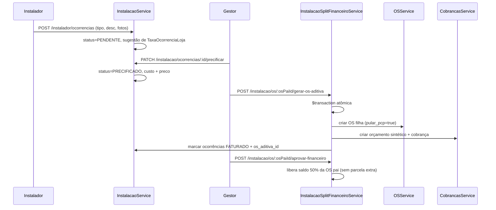

# Plano técnico — Split Financeiro com OS Aditiva (intercorrências de campo)

**Versão:** 1.0  
**Data:** 2026-07-01  
**Status:** Especificação de engenharia — aguardando implementação  
**Público-alvo:** Produto, desenvolvimento core e code review arquitetural  
**Relacionado:** [DEC-17](./12-decisoes-produto-instalacao-comunikapp.md) (sobra/aditivos de campo), [Fase 3 — Backend e Finanças](./04-relatorio-fase-3-backend-e-financas.md), [Fase 5 — PDF e fechamento](./06-relatorio-fase-5-pdf-e-fechamento.md)

---

## 1. Contexto e dor operacional

No módulo de instalação, o instalador registra ocorrências (fotos + texto) durante a execução — visita perdida, material extra, serviço adicional, retrabalho. Esses eventos precisam gerar **cobrança com margem de lucro** sem reabrir ou alterar a OS principal de produção/venda (imutável após aprovação técnica).

**Persona:** Jonathan (gestor operacional) precisa cobrar custos extras e deslocamentos que ocorrem na rua, com margem aplicada pelo backoffice, mantendo rastreabilidade com a OS pai.

### Caminho escolhido: Split Financeiro

| Etapa | Ator | Ação |
|-------|------|------|
| 1 | Instalador | Registra o problema **sem ver valores** (diário de bordo) |
| 2 | Gestor | Revisa ocorrências, aplica **Custo** e **Valor de Repasse** (com margem) |
| 3 | Sistema | Gera **OS Aditiva** (filha) para faturar, vinculada à OS pai |

---

## 2. Diagnóstico do estado atual no repositório

O repositório **já implementa ~70% da infraestrutura operacional**, mas o fluxo financeiro ainda **não** segue o caminho de OS Aditiva + precificação pelo gestor.

### 2.1 O que já existe

| Camada | Situação |
|--------|----------|
| `OcorrenciaInstalacao` | Tipo, categoria, quantidade, `custo_interno`, `preco_cliente`, fotos, vínculo OS/lote |
| `TaxaOcorrenciaLoja` | Tabela de sugestão por `loja_id` + `tipo` |
| RBAC campo | Instalador não recebe valores (`InstaladorController` + `.select()` omitindo financeiro) |
| Pós-cálculo | `InstalacaoPosCalculoService` consolida extras em **parcela extra na cobrança do orçamento pai** |
| Split fiscal | `InstalacaoSplitFiscalService` inclui ocorrências no PDF do relatório técnico |
| DEC-17 | Ocorrências **não** alteram `ItemOS` nem lotes (`ItemOSInstalacao`) |

**Referências no código:**

- `backend/src/instalacao/services/instalacao.service.ts` — `registrarOcorrenciaObra()`
- `backend/src/instalacao/services/instalacao-pos-calculo.service.ts` — `executarLiberacaoComercialEmTransacao()`
- `backend/src/instalacao/services/instalacao-split-fiscal.service.ts`
- `backend/src/expedicao/services/expedicao-financeiro.service.ts` — trava de entrega (parcela SALDO)
- `backend/prisma/schema.prisma` — modelos `OcorrenciaInstalacao`, `OrdemServico`, `Cobranca`

### 2.2 Lacuna em relação ao objetivo

Hoje, em `registrarOcorrenciaObra`, o backend **já precifica automaticamente** via `TaxaOcorrenciaLoja`:

```typescript
const quantidade = input.quantidade ?? 1;
const custoUnitario = Number(taxa?.custo_padrao ?? 0);
const precoUnitario = Number(taxa?.preco_padrao ?? 0);
// ...
custo_interno: new Prisma.Decimal(custoUnitario * quantidade),
preco_cliente: new Prisma.Decimal(precoUnitario * quantidade),
```

**Ainda não há:**

- máquina de estados (`PENDENTE` → `PRECIFICADO` → `FATURADO`);
- `os_pai_id` em `OrdemServico`;
- OS Aditiva;
- fila transversal de pendências para o gestor.

O caminho de **parcela extra na cobrança pai** (`InstalacaoPosCalculoService.executarLiberacaoComercialEmTransacao`) precisará ser **substituído ou bifurcado** quando a OS Aditiva entrar em produção.

---

## 3. Mudanças no Prisma

### 3.1 `OcorrenciaInstalacao` — evolução aditiva

```prisma
enum StatusFinanceiroOcorrencia {
  PENDENTE_PRECIFICACAO  // instalador registrou; sem valores finais
  PRECIFICADO            // gestor definiu custo + repasse
  FATURADO               // vinculada à OS Aditiva / cobrança
  ABONADO                // gestor decidiu não cobrar (auditoria)
  CANCELADO              // erro operacional
}

model OcorrenciaInstalacao {
  // ... campos existentes ...

  // Workflow financeiro
  status_financeiro     StatusFinanceiroOcorrencia @default(PENDENTE_PRECIFICACAO)

  // Valores finais (nullable até precificação)
  custo_interno         Decimal?  @db.Decimal(10, 2)
  preco_cliente         Decimal?  @db.Decimal(10, 2)

  // Sugestão da taxa (somente referência para o gestor)
  custo_sugerido        Decimal?  @db.Decimal(10, 2)
  preco_sugerido        Decimal?  @db.Decimal(10, 2)

  // Auditoria de precificação
  precificado_por       String?
  precificado_em        DateTime?
  observacao_gestor     String?   @db.Text

  // Rastreabilidade pós-faturamento
  os_aditiva_id         String?
  cobranca_parcela_id   String?   // se cobrança avulsa sem OS formal

  // Concorrência
  versao                Int       @default(0)

  os_aditiva OrdemServico? @relation("OcorrenciasFaturadas", fields: [os_aditiva_id], references: [id], onDelete: SetNull)

  @@index([loja_id, status_financeiro])
  @@index([loja_id, status_financeiro, criado_em])
  @@index([os_aditiva_id])
}
```

**Regras de negócio (validadas no service):**

| Status | `custo_interno` / `preco_cliente` | Outros |
|--------|-----------------------------------|--------|
| `PENDENTE_PRECIFICACAO` | `null` (ou zero tratado como null) | — |
| `PRECIFICADO` | ambos obrigatórios | `preco_cliente >= custo_interno` (configurável por loja) |
| `FATURADO` | preenchidos | `os_aditiva_id` obrigatório |
| `ABONADO` | opcional | `observacao_gestor` obrigatória |

**Migração de dados legados:** ocorrências com `preco_cliente > 0` → `status_financeiro = PRECIFICADO`; copiar valores atuais para `custo_sugerido` / `preco_sugerido`.

### 3.2 `OrdemServico` — OS Aditiva

```prisma
model OrdemServico {
  // ... campos existentes ...

  os_pai_id               String?
  tipo_vinculo_os         String?  @db.VarChar(24) // PRINCIPAL | ADITIVA_INSTALACAO

  // Flags operacionais (evitam efeitos colaterais)
  pular_pcp               Boolean  @default(false)
  pular_expedicao         Boolean  @default(true)   // aditiva nunca entra no kanban logístico
  pular_validacao_estoque Boolean  @default(true)

  os_pai    OrdemServico?  @relation("OsFilhas", fields: [os_pai_id], references: [id])
  os_filhas OrdemServico[] @relation("OsFilhas")

  @@index([loja_id, os_pai_id])
  @@index([loja_id, tipo_vinculo_os])
}
```

Estender `origem_os`: incluir `ADITIVA_INSTALACAO` (além de `ORCAMENTO`, `DIRETA`, `INTERNA`).

### 3.3 Orçamento mínimo para cobrança (recomendado)

`Cobranca` hoje é **1:1 com `orcamento_id`** (`orcamento_id String @unique`). Para multi-tenant sem quebrar o financeiro existente, a OS Aditiva deve nascer com um **orçamento sintético**:

```prisma
model OrcamentoAditivoInstalacao {
  id                   String   @id @default(cuid())
  loja_id              String
  os_pai_id            String
  os_aditiva_id        String   @unique
  orcamento_id         String   @unique
  criado_em            DateTime @default(now())
  ocorrencias_snapshot Json     // snapshot imutável das ocorrências faturadas
}
```

**Alternativa não recomendada no curto prazo:** tornar `orcamento_id` opcional em `Cobranca` e adicionar `os_id`. Exige refatorar `ExpedicaoFinanceiroService`, rollup de status e relatórios.

### 3.4 Índices multi-tenant

```sql
CREATE INDEX idx_ocorrencias_fila_gestor
  ON ocorrencias_instalacao (loja_id, status_financeiro, criado_em DESC);

CREATE INDEX idx_os_aditivas_pai
  ON ordens_servico (loja_id, os_pai_id)
  WHERE tipo_vinculo_os = 'ADITIVA_INSTALACAO';
```

---

## 4. Dinâmica de fluxo e transação

### 4.1 Máquina de estados (visão geral)



### 4.2 Novo service: `InstalacaoSplitFinanceiroService`

**Não** colocar em `ExpedicaoFinanceiroService` — ele cuida de **trava de entrega por parcela SALDO** da OS principal. A OS Aditiva é domínio de instalação + financeiro comercial.

**Método principal:** `gerarOsAditiva(osPaiId, lojaId, usuarioId, ocorrenciaIds?)`

Transação Prisma (pseudocódigo):

```typescript
await prisma.$transaction(async (tx) => {
  // 1. Lock pessimista: ocorrências elegíveis
  const ocorrencias = await tx.ocorrenciaInstalacao.findMany({
    where: {
      loja_id: lojaId,
      os_id: osPaiId,
      status_financeiro: 'PRECIFICADO',
      os_aditiva_id: null,
      ...(ocorrenciaIds ? { id: { in: ocorrenciaIds } } : {}),
    },
  });
  if (!ocorrencias.length) throw new BadRequestException(...);

  const osPai = await tx.ordemServico.findFirst({ ... });
  validarOsPaiElegivel(osPai); // aprovada, não inativa, mesma loja

  // 2. Criar orçamento sintético (1 linha por ocorrência ou agrupado por tipo_faturamento)
  const orcamentoAditivo = await criarOrcamentoSintetico(tx, osPai, ocorrencias);

  // 3. Criar OS filha — NÃO chamar OSService.create() completo
  const osAditiva = await tx.ordemServico.create({
    data: {
      loja_id: lojaId,
      cliente_id: osPai.cliente_id,
      os_pai_id: osPaiId,
      tipo_vinculo_os: 'ADITIVA_INSTALACAO',
      origem_os: 'ADITIVA_INSTALACAO',
      orcamento_id: orcamentoAditivo.id,
      nome_servico: `Aditivo instalação — OS ${osPai.numero}`,
      quantidade: 1,
      status: 'FINALIZADA',           // ou status dedicado ADITIVA_ABERTA
      pular_pcp: true,
      pular_expedicao: true,
      pular_validacao_estoque: true,
      aprovacao_tecnica_status: 'APROVADA', // bypass checkpoint produção
      valor_orcado: somaPrecoCliente,
      criado_por: usuarioId,
      numero: await gerarNumeroAditiva(tx, lojaId, osPai.numero), // ex: OS-2026-042-A1
    },
  });

  // 4. Itens OS (somente descritivos — sem insumos, sem PCP)
  await criarItensOsAditiva(tx, osAditiva.id, ocorrencias);

  // 5. Cobrança (condição A_VISTA ou FATURADO_30 conforme política da loja)
  await cobrancasService.criarCobrancaParaOrcamento(..., { skipTravaInstalacao: true });

  // 6. Fechar ocorrências
  await tx.ocorrenciaInstalacao.updateMany({
    where: { id: { in: ocorrencias.map(o => o.id) }, versao: { in: versoes } },
    data: {
      status_financeiro: 'FATURADO',
      os_aditiva_id: osAditiva.id,
    },
  });

  // 7. Log + snapshot
  await tx.ordemServicoLog.create({ tipo_acao: 'OS_ADITIVA_GERADA', ... });
  await tx.orcamentoAditivoInstalacao.create({ snapshot: ocorrencias });

  return { os_aditiva_id: osAditiva.id, valor_total, cobranca_id };
});
```

**Numeração sugerida:** `OS-2026-042-A1`, `OS-2026-042-A2` (uma aditiva por ciclo de fechamento).

### 4.3 Proteção das travas existentes

| Sistema | Risco | Mitigação |
|---------|-------|-----------|
| **PCP** | OS filha entrar na fila | `pular_pcp=true`; `OSService.create` checa flag e **não** cria `WorkflowInstancia`, não chama `workflowAssignmentService` |
| **Estoque** | Baixa indevida | `pular_validacao_estoque=true`; itens aditivos sem `insumos_necessarios` |
| **Expedição** | Kanban duplicado | `pular_expedicao=true`; `ExpedicaoCriacaoService.criarSeElegivel` ignora `tipo_vinculo_os = ADITIVA_INSTALACAO` |
| **Sinal 50%** | Bloqueio indevido | Orçamento aditivo **não** chama `aplicarTravaSaldoAposAprovacao` |
| **Saldo OS pai** | Confundir cobranças | `aprovarFinanceiroOs` libera apenas parcela SALDO do orçamento **pai**; extras saem só da aditiva |
| **Split fiscal PDF** | Dupla contagem | PDF pai: extras já faturados como **referência** (`origem: OCORRENCIA_REF`) sem somar ao total |

### 4.4 Ajuste em `InstalacaoPosCalculoService`

Substituir o bloco que cria `parcelaExtra` por validação:

```typescript
const extrasPendentes = await tx.ocorrenciaInstalacao.count({
  where: {
    os_id: params.osId,
    loja_id: params.lojaId,
    status_financeiro: { in: ['PENDENTE_PRECIFICACAO', 'PRECIFICADO'] },
  },
});

if (extrasPendentes > 0) {
  throw new BadRequestException(
    'Existem ocorrências de campo não faturadas. Gere a OS Aditiva antes de aprovar o faturamento principal.',
  );
}
```

Isso força o gestor a fechar o ciclo financeiro dos extras **antes** de liberar o saldo contratual (50%).

---

## 5. Pontos de decisão, riscos e crítica arquitetural

### 5.1 Escalabilidade multi-tenant

**Sim, com ressalvas.** O padrão orçamento sintético + OS filha reutiliza entidades já isoladas por `loja_id` e evita exceções no módulo financeiro.

- Cada tenant configura `TaxaOcorrenciaLoja` como **sugestão**, não preço final.
- Fila de precificação indexada por `(loja_id, status_financeiro)`.
- OS Aditiva não polui PCP/expedição.

**Risco de escala:** muitas ocorrências micro (ex.: estacionamento R$ 15) gerando OS Aditiva individual.  
**Mitigação:** agrupamento por OS pai + lote de faturamento (`lote_faturamento_id` opcional) ou uma aditiva por ciclo (`-A1`, `-A2`).

### 5.2 Over-billing — cenários e mitigações

| Cenário | Risco | Mitigação no código |
|---------|-------|---------------------|
| Parcela extra **e** OS Aditiva | Cobrança dupla | Remover criação de parcela extra; feature flag de migração |
| Precificar 2x a mesma ocorrência | Valor inflado | `update` com `where: { versao: atual }`; 409 se conflito |
| Gerar 2 OS Aditivas para mesmas ocorrências | Duplicidade | `os_aditiva_id IS NULL` no `updateMany` |
| Ocorrência nova após aditiva | Órfã sem cobrança | Dashboard de pendências; alerta na OS pai |
| Gestor zera preço por engano | Perda de receita | `preco_cliente < custo_interno` → confirmação obrigatória + log |
| Instalador infla quantidade | Over-billing | Teto por tipo (`TaxaOcorrenciaLoja.quantidade_max`); foto obrigatória para `MATERIAL_EXTRA` |

### 5.3 Erro humano na precificação

**UI recomendada** — duas colunas com margem em tempo real:

```
Custo interno (R$)  |  Repasse cliente (R$)  |  Margem %
[  80,00 ]          |  [ 120,00 ]            |  50%
Sugestão taxa: custo 70 / preço 105
```

**Validações backend:**

- `preco_cliente > 0` para cobrar;
- `ABONADO` exige `observacao_gestor` mín. 10 caracteres;
- alteração após `PRECIFICADO` só por perfil `FINANCEIRO` / `ADMINISTRADOR`.

### 5.4 OS Aditiva vs. parcela extra (comparativo)

| Critério | Parcela extra (atual) | OS Aditiva (proposto) |
|----------|----------------------|------------------------|
| Imutabilidade OS pai | ✅ | ✅ |
| NF-e/NFS-e separada | ⚠️ mistura no split do pai | ✅ documento próprio |
| Complexidade | Baixa | Média-alta |
| Rastreabilidade auditoria | Média | Alta |
| Integração financeiro | Nativa | Requer orçamento sintético |
| Risco PCP/estoque | Nenhum | Médio (se flags `pular_*` falharem) |

**Veredito:** para cobrar na rua com margem sem reabrir OS de produção, **OS Aditiva é o caminho correto** — desde que `pular_pcp` / `pular_expedicao` sejam enforced no `OSService` e nos hooks de PCP/expedição. A parcela extra atual é atalho válido para MVP, mas escala mal quando o cliente exige NF separada ou negociação independente do contrato original.

### 5.5 Padrão híbrido recomendado

**Uma OS Aditiva por ciclo de fechamento** da OS pai (não uma por evento):

1. Gestor precifica N ocorrências.
2. Um clique gera `OS-042-A1` com N linhas em `ItemOS`.
3. Novas ocorrências no mês seguinte → `OS-042-A2`.

Reduz poluição de numeração e simplifica o financeiro.

---

## 6. UX / Frontend — dashboard do gestor

### 6.1 Superfícies existentes para reaproveitar

| Componente / rota | Uso |
|-------------------|-----|
| `/instalacao` | Grid de OS + workspace modal |
| `InstalacaoWorkspacePanel` | Detalhe por OS |
| `InstalacaoLoteOcorrenciasHistorico` | Histórico por lote (sem precificação hoje) |
| `InstalacaoRelatorioTecnicoCard` | Aprovação financeira (módulo financeiro) |
| `OcorrenciaRapidaDialog` | Registro rápido |

### 6.2 Nova superfície: fila transversal de precificação

**Rota:** aba **"Pendências"** em `/instalacao` (ao lado de Lista e Calendário).

**APIs:**

```http
GET   /instalacao/ocorrencias/fila-precificacao
      ?status=PENDENTE_PRECIFICACAO|PRECIFICADO
      &busca=&pagina=1

PATCH /instalacao/ocorrencias/:id/precificar

POST  /instalacao/os/:osPaiId/gerar-os-aditiva

GET   /instalacao/ocorrencias/contadores
      → { pendentes: 12, precificados: 3 }
```

**Componente:** `InstalacaoOcorrenciasFilaGrid`

| Coluna | Conteúdo |
|--------|----------|
| OS | `OS-2026-042` (link abre workspace) |
| Cliente | nome |
| Tipo | badge `VISITA_IMPRODUTIVA` |
| Lote/endereço | resumo |
| Data campo | `criado_em` |
| Evidência | thumbnail |
| Status | Pendente / Precificado |
| Ação | botão "Precificar" → drawer |

**Drawer `PrecificarOcorrenciaDrawer`:**

- descrição + fotos (readonly);
- campos custo/repasse com sugestão da taxa;
- margem % calculada;
- ações: Salvar | Abonar | Cancelar.

**Badge no menu:** contador `pendentes` no item Instalação (padrão `contadores-menu.service.ts`).

### 6.3 Integração no workspace existente

No `InstalacaoWorkspacePanel`:

- badge de `status_financeiro` em cada ocorrência;
- botão "Precificar" inline (gestor/financeiro);
- seção **"OS Aditivas"** com filhas e links para `/os/:id` e financeiro.

### 6.4 Jornada do gestor (sem abrir OS por OS)

1. `/instalacao` → aba **Pendências** (ordenado por `criado_em DESC`).
2. Filtra pendentes → precifica (seleção múltipla na mesma OS).
3. **"Gerar OS Aditiva"** quando todas da OS estão precificadas.
4. Financeiro → receber cobrança da aditiva.
5. OS pai → **Aprovar faturamento** (libera saldo 50%).

---

## 7. Plano de implementação por fases

### Fase A — Schema + registrar sem valor (≈1 sprint)

1. Migration Prisma (campos + enum + `os_pai_id`).
2. Alterar `registrarOcorrenciaObra`: `PENDENTE_PRECIFICACAO`, gravar `custo_sugerido` / `preco_sugerido` apenas.
3. Testes: instalador não vê valores; gestor vê sugestão.

### Fase B — Precificação gestor (≈1 sprint)

1. Endpoints `precificar`, `abonar`, `fila-precificacao`, `contadores`.
2. Frontend: aba Pendências + drawer.
3. Contador no menu lateral.

### Fase C — OS Aditiva + cobrança (≈1–2 sprints)

1. `InstalacaoSplitFinanceiroService`.
2. Orçamento sintético + guards `pular_*` no `OSService`.
3. Remover parcela extra do pós-cálculo.
4. Bloquear aprovação financeiro pai com ocorrências pendentes/precificadas.

### Fase D — Relatório e BI (≈0,5 sprint)

1. Ajustar `InstalacaoSplitFiscalService` (sem double-count).
2. PDF pai: seção "Extras faturados em OS Aditiva OS-042-A1".
3. `calcularMargemRealOs`: custo de ocorrências `PRECIFICADO` / `FATURADO` apenas.

---

## 8. Decisões de produto a fechar antes de codar

| # | Pergunta | Opção recomendada |
|---|----------|-------------------|
| D1 | Uma ou N OS Aditivas por OS pai? | Uma por ciclo de fechamento (`-A1`, `-A2`) |
| D2 | Condição de pagamento da aditiva? | `A_VISTA` default; configurável por loja |
| D3 | Obrigar fotos para cobrar? | Sim para `MATERIAL_EXTRA` e `SERVICO_ADICIONAL` |
| D4 | Quem pode abonar? | `FINANCEIRO` + `ADMINISTRADOR` |
| D5 | Migração do fluxo atual (parcela extra)? | Feature flag `INSTALACAO_OS_ADITIVA=true` por loja |

---

## 9. Resumo executivo

O **Split Financeiro com OS Aditiva** é **arquiteturalmente sólido e alinhado com DEC-17**, mas exige evoluir o que já foi implementado (precificação automática na criação + parcela extra na cobrança pai).

**Núcleo técnico:**

1. Estado financeiro na ocorrência (não valor fixo na criação).
2. `os_pai_id` + orçamento sintético (respeitar `Cobranca ↔ Orçamento` 1:1).
3. Transação atômica: OS filha + cobrança + ocorrências `FATURADO`.
4. Guards `pular_pcp` / `pular_expedicao` para não quebrar produção.
5. Fila transversal no frontend para o gestor não caçar OS por OS.

---

## 10. Histórico de revisões

| Versão | Data | Autor | Alteração |
|--------|------|-------|-----------|
| 1.0 | 2026-07-01 | Engenharia | Documento inicial — plano Split Financeiro / OS Aditiva |
