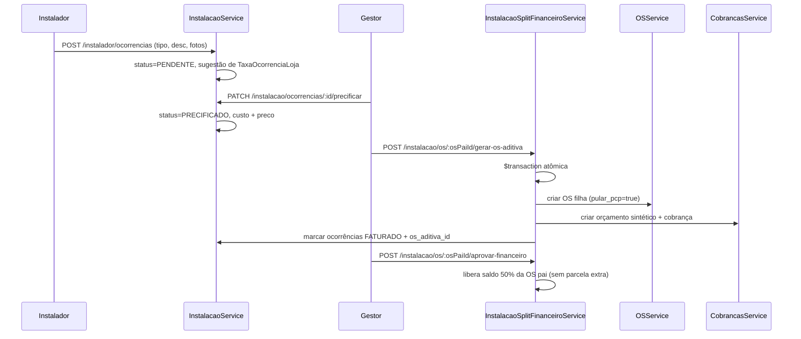

# ERP installation module strategy

_Exported on 7/2/2026 at 13:51:36 GMT-3 from Cursor (3.9.16)_

---

**User**

"Atue como um arquiteto de software sênior especializado em sistemas ERP para Comunicação Visual. Estamos aprimorando o fluxo do Módulo de Instalação do ComunikApp e precisamos consolidar a estratégia de cobrança de intercorrências de campo.

CONTEXTO E DOR OPERACIONAL:
Atualmente, temos o módulo de instalação onde o instalador registra ocorrências (fotos + texto) durante a execução (ex: visita perdida, material extra). No entanto, essas ocorrências não possuem valor financeiro e não impactam a OS principal (que é imutável após a aprovação). O Jonathan (nosso usuário final) precisa cobrar custos extras e deslocamentos que ocorrem na rua, com margem de lucro aplicada, mas sem reabrir ou alterar a OS original de produção/venda.

CAMINHO ESCOLHIDO:
Vamos utilizar o conceito de 'Split Financeiro':

O instalador registra o problema sem ver valores (apenas diário de bordo).

O Gestor (no backoffice) revisa as ocorrências, aplica 'Custo' e 'Valor de Repasse' (com margem de lucro).

O sistema gera uma 'OS Aditiva' (filha) para faturar esses valores, mantendo a rastreabilidade com a OS Pai.

SEU OBJETIVO:
Analise os arquivos do projeto (Schema, Services de OS e Módulo de Instalação) e me forneça um plano de implementação técnica detalhado:

Mudanças no Prisma: O que precisamos adicionar à entidade OcorrenciaInstalacao para permitir o fluxo de precificação (custo x venda) e controle de status (Pendente, Precificado, Faturado)?

Dinâmica de Fluxo: Como você estruturaria a transaction no ExpedicaoFinanceiroService (ou similar) para criar a OS Aditiva e vincular à OS original sem quebrar as travas de estoque e PCP já existentes?

Pontos de Decisão (Critique): Existe algum risco de integridade ou concorrência nesta abordagem? Onde poderíamos ter problemas de 'Over-billing' ou erro humano na precificação e como podemos mitigar isso via código/validação?

UX/Frontend: Baseado nas telas que já temos (Módulo de Instalação), como você integraria o Dashboard do gestor para que ele visualize facilmente as pendências de precificação sem precisar abrir OS por OS?

Por favor, apresente sua visão técnica e critique se este caminho é o mais escalável para um sistema multi-tenant ou se você sugere algum ajuste na arquitetura de entidades."

---

**Cursor**

Vou analisar o schema Prisma, os serviços de OS e o módulo de instalação para montar um plano técnico fundamentado no código existente.

# Plano técnico: Split Financeiro com OS Aditiva (Módulo de Instalação)

## Diagnóstico do estado atual

O repositório **já implementa ~70% da infraestrutura operacional**, mas o fluxo financeiro ainda não segue o caminho que vocês escolheram (OS Aditiva + precificação pelo gestor).

### O que já existe

| Camada                 | Situação                                                                                         |
| ---------------------- | ------------------------------------------------------------------------------------------------ |
| `OcorrenciaInstalacao` | Tipo, categoria, quantidade, `custo_interno`, `preco_cliente`, fotos, vínculo OS/lote            |
| `TaxaOcorrenciaLoja`   | Tabela de sugestão por `loja_id` + `tipo`                                                        |
| RBAC campo             | Instalador não recebe valores (`InstaladorController` + `.select()` omitindo financeiro)         |
| Pós-cálculo            | `InstalacaoPosCalculoService` consolida extras em **parcela extra na cobrança do orçamento pai** |
| Split fiscal           | `InstalacaoSplitFiscalService` inclui ocorrências no PDF do relatório técnico                    |
| DEC-17                 | Ocorrências **não** alteram `ItemOS` nem lotes                                                   |

### Lacuna em relação ao objetivo

Hoje, em `registrarOcorrenciaObra`, o backend **já precifica automaticamente** via `TaxaOcorrenciaLoja`:

```372:389:backend/src/instalacao/services/instalacao.service.ts
    const quantidade = input.quantidade ?? 1;
    const custoUnitario = Number(taxa?.custo_padrao ?? 0);
    const precoUnitario = Number(taxa?.preco_padrao ?? 0);
    // ...
    const ocorrencia = await this.prisma.ocorrenciaInstalacao.create({
      data: {
        // ...
        custo_interno: new Prisma.Decimal(custoUnitario * quantidade),
        preco_cliente: new Prisma.Decimal(precoUnitario * quantidade),
```

Não há:

- máquina de estados (`PENDENTE` → `PRECIFICADO` → `FATURADO`);
- `os_pai_id` em `OrdemServico`;
- OS Aditiva;
- fila transversal de pendências para o gestor.

O caminho de **parcela extra na cobrança pai** está em `executarLiberacaoComercialEmTransacao` — precisará ser **substituído ou bifurcado** quando a OS Aditiva entrar em produção.

---

## 1. Mudanças no Prisma

### 1.1 `OcorrenciaInstalacao` — evolução aditiva

```prisma
enum StatusFinanceiroOcorrencia {
  PENDENTE_PRECIFICACAO  // instalador registrou; sem valores finais
  PRECIFICADO            // gestor definiu custo + repasse
  FATURADO               // vinculada à OS Aditiva / cobrança
  ABONADO                // gestor decidiu não cobrar (auditoria)
  CANCELADO              // erro operacional
}

model OcorrenciaInstalacao {
  // ... campos existentes ...

  // Workflow financeiro
  status_financeiro     StatusFinanceiroOcorrencia @default(PENDENTE_PRECIFICACAO)

  // Valores finais (nullable até precificação)
  custo_interno         Decimal?  @db.Decimal(10, 2)
  preco_cliente         Decimal?  @db.Decimal(10, 2)

  // Sugestão da taxa (somente referência para o gestor)
  custo_sugerido        Decimal?  @db.Decimal(10, 2)
  preco_sugerido        Decimal?  @db.Decimal(10, 2)

  // Auditoria de precificação
  precificado_por       String?
  precificado_em        DateTime?
  observacao_gestor     String?   @db.Text

  // Rastreabilidade pós-faturamento
  os_aditiva_id         String?
  cobranca_parcela_id   String?   // se cobrança avulsa sem OS formal

  // Concorrência
  versao                Int       @default(0)

  os_aditiva OrdemServico? @relation("OcorrenciasFaturadas", fields: [os_aditiva_id], references: [id], onDelete: SetNull)

  @@index([loja_id, status_financeiro])
  @@index([loja_id, status_financeiro, criado_em])
  @@index([os_aditiva_id])
}
```

**Migração de dados legados:** ocorrências com `preco_cliente > 0` → `status_financeiro = PRECIFICADO`; `custo_sugerido`/`preco_sugerido` = valores atuais.

**Regra de negócio no schema (validada no service):**

- `PENDENTE`: `custo_interno` e `preco_cliente` devem ser `null` (ou zero tratado como null).
- `PRECIFICADO`: ambos obrigatórios; `preco_cliente >= custo_interno` (configurável por loja).
- `FATURADO`: `os_aditiva_id` obrigatório.

### 1.2 `OrdemServico` — OS Aditiva

```prisma
model OrdemServico {
  // ... campos existentes ...

  os_pai_id              String?
  tipo_vinculo_os        String?  @db.VarChar(24) // PRINCIPAL | ADITIVA_INSTALACAO

  // Flags operacionais (evitam efeitos colaterais)
  pular_pcp              Boolean  @default(false)
  pular_expedicao        Boolean  @default(true)  // aditiva nunca entra no kanban logístico
  pular_validacao_estoque Boolean @default(true)

  os_pai    OrdemServico?  @relation("OsFilhas", fields: [os_pai_id], references: [id])
  os_filhas OrdemServico[] @relation("OsFilhas")

  @@index([loja_id, os_pai_id])
  @@index([loja_id, tipo_vinculo_os])
}
```

Estender `origem_os`: `ADITIVA_INSTALACAO` (além de `ORCAMENTO`, `DIRETA`, `INTERNA`).

### 1.3 Orçamento mínimo para cobrança (recomendado)

`Cobranca` hoje é **1:1 com `orcamento_id`**:

```168:168:backend/prisma/schema.prisma
  orcamento_id String  @unique // 1:1 com orcamento
```

Para multi-tenant sem quebrar o financeiro existente, a OS Aditiva deve nascer com um **orçamento sintético**:

```prisma
model OrcamentoAditivoInstalacao {
  id            String   @id @default(cuid())
  loja_id       String
  os_pai_id     String
  os_aditiva_id String   @unique
  orcamento_id  String   @unique
  criado_em     DateTime @default(now())
  // snapshot JSON das ocorrências faturadas (auditoria imutável)
  ocorrencias_snapshot Json
}
```

Alternativa mais simples (menos ideal): tornar `orcamento_id` opcional em `Cobranca` e adicionar `os_id`. Isso exige refatorar `ExpedicaoFinanceiroService`, rollup de status e relatórios — **não recomendo** no curto prazo.

### 1.4 Índices multi-tenant críticos

```sql
CREATE INDEX idx_ocorrencias_fila_gestor
  ON ocorrencias_instalacao (loja_id, status_financeiro, criado_em DESC);

CREATE INDEX idx_os_aditivas_pai
  ON ordens_servico (loja_id, os_pai_id)
  WHERE tipo_vinculo_os = 'ADITIVA_INSTALACAO';
```

---

## 2. Dinâmica de fluxo e transação

### 2.1 Máquina de estados (visão geral)



### 2.2 Novo service: `InstalacaoSplitFinanceiroService`

Não colocar isso em `ExpedicaoFinanceiroService` — ele cuida de **trava de entrega por parcela SALDO** da OS principal. A OS Aditiva é domínio de instalação + financeiro comercial.

**`gerarOsAditiva(osPaiId, lojaId, usuarioId, ocorrenciaIds?)`** — transação Prisma:

```typescript
await prisma.$transaction(async (tx) => {
  // 1. Lock pessimista: ocorrências elegíveis
  const ocorrencias = await tx.ocorrenciaInstalacao.findMany({
    where: {
      loja_id: lojaId,
      os_id: osPaiId,
      status_financeiro: 'PRECIFICADO',
      os_aditiva_id: null,
      ...(ocorrenciaIds ? { id: { in: ocorrenciaIds } } : {}),
    },
  });
  if (!ocorrencias.length) throw new BadRequestException(...);

  const osPai = await tx.ordemServico.findFirst({ ... });
  validarOsPaiElegivel(osPai); // aprovada, não inativa, mesma loja

  // 2. Criar orçamento sintético (1 linha por ocorrência ou agrupado por tipo_faturamento)
  const orcamentoAditivo = await criarOrcamentoSintetico(tx, osPai, ocorrencias);

  // 3. Criar OS filha — NÃO chamar OSService.create() completo
  const osAditiva = await tx.ordemServico.create({
    data: {
      loja_id: lojaId,
      cliente_id: osPai.cliente_id,
      os_pai_id: osPaiId,
      tipo_vinculo_os: 'ADITIVA_INSTALACAO',
      origem_os: 'ADITIVA_INSTALACAO',
      orcamento_id: orcamentoAditivo.id,
      nome_servico: `Aditivo instalação — OS ${osPai.numero}`,
      quantidade: 1,
      status: 'FINALIZADA',           // ou status dedicado ADITIVA_ABERTA
      pular_pcp: true,
      pular_expedicao: true,
      pular_validacao_estoque: true,
      aprovacao_tecnica_status: 'APROVADA', // bypass checkpoint produção
      valor_orcado: somaPrecoCliente,
      criado_por: usuarioId,
      numero: await gerarNumeroAditiva(tx, lojaId, osPai.numero), // ex: OS-2026-042-A1
    },
  });

  // 4. Itens OS (somente descritivos — sem insumos, sem PCP)
  await criarItensOsAditiva(tx, osAditiva.id, ocorrencias);

  // 5. Cobrança (condição A_VISTA ou FATURADO_30 conforme política da loja)
  await cobrancasService.criarCobrancaParaOrcamento(..., { skipTravaInstalacao: true });

  // 6. Fechar ocorrências
  await tx.ocorrenciaInstalacao.updateMany({
    where: { id: { in: ocorrencias.map(o => o.id) }, versao: { in: versoes } },
    data: {
      status_financeiro: 'FATURADO',
      os_aditiva_id: osAditiva.id,
    },
  });

  // 7. Log + snapshot
  await tx.ordemServicoLog.create({ tipo_acao: 'OS_ADITIVA_GERADA', ... });
  await tx.orcamentoAditivoInstalacao.create({ snapshot: ocorrencias });

  return { os_aditiva_id: osAditiva.id, valor_total, cobranca_id };
});
```

### 2.3 Proteção das travas existentes

| Sistema              | Risco                   | Mitigação                                                                                                                         |
| -------------------- | ----------------------- | --------------------------------------------------------------------------------------------------------------------------------- |
| **PCP**              | OS filha entrar na fila | `pular_pcp=true`; `OSService.create` deve checar flag e **não** criar `WorkflowInstancia`, não chamar `workflowAssignmentService` |
| **Estoque**          | Baixa indevida          | `pular_validacao_estoque=true`; itens aditivos sem `insumos_necessarios`                                                          |
| **Expedição**        | Kanban duplicado        | `pular_expedicao=true`; `ExpedicaoCriacaoService.criarSeElegivel` ignora `tipo_vinculo_os = ADITIVA_INSTALACAO`                   |
| **Sinal 50%**        | Bloqueio indevido       | Orçamento aditivo **não** chama `aplicarTravaSaldoAposAprovacao`                                                                  |
| **Saldo OS pai**     | Confundir cobranças     | `aprovarFinanceiroOs` libera apenas parcela SALDO do orçamento **pai**; extras saem só da aditiva                                 |
| **Split fiscal PDF** | Dupla contagem          | PDF pai: incluir extras como **referência** (`origem: OCORRENCIA_REF`) sem somar ao total se já faturados em aditiva              |

### 2.4 Ajuste em `InstalacaoPosCalculoService`

Substituir o bloco que cria `parcelaExtra` (linhas 387–404) por:

```typescript
const extrasPendentes = await tx.ocorrenciaInstalacao.count({
  where: {
    os_id: params.osId,
    loja_id: params.lojaId,
    status_financeiro: { in: ["PENDENTE_PRECIFICACAO", "PRECIFICADO"] },
  },
});

if (extrasPendentes > 0) {
  throw new BadRequestException(
    "Existem ocorrências de campo não faturadas. Gere a OS Aditiva antes de aprovar o faturamento principal.",
  );
}
```

Isso força o gestor a fechar o ciclo financeiro dos extras **antes** de liberar o saldo contratual.

---

## 3. Pontos de decisão e crítica arquitetural

### 3.1 Este caminho é escalável multi-tenant?

**Sim, com ressalvas.** O padrão orçamento sintético + OS filha reutiliza entidades já isoladas por `loja_id` e evita exceções no módulo financeiro. Escala bem porque:

- cada tenant configura `TaxaOcorrenciaLoja` como **sugestão**, não verdade absoluta;
- fila de precificação é indexada por `(loja_id, status_financeiro)`;
- OS Aditiva não polui PCP/expedição.

**Risco de escala:** muitas ocorrências micro (R$ 15 de estacionamento) gerando OS Aditiva individual. **Mitigação:** permitir agrupamento por OS pai + lote de faturamento semanal (`lote_faturamento_id` opcional).

### 3.2 Over-billing — onde quebra e como mitigar

| Cenário                                     | Risco             | Mitigação no código                                                                         |
| ------------------------------------------- | ----------------- | ------------------------------------------------------------------------------------------- |
| Parcela extra **e** OS Aditiva              | Cobrança dupla    | Remover criação de parcela extra; feature flag de migração                                  |
| Precificar 2x a mesma ocorrência            | Valor inflado     | `update` com `where: { versao: atual }`; 409 se conflito                                    |
| Gerar 2 OS Aditivas para mesmas ocorrências | Duplicidade       | `os_aditiva_id IS NULL` no `updateMany`; unique parcial se necessário                       |
| Ocorrência nova após aditiva                | Órfã sem cobrança | Dashboard de pendências; alerta na OS pai                                                   |
| Gestor zera preço por engano                | Perda de receita  | `preco_cliente < custo_interno` → confirmação obrigatória + log                             |
| Instalador infla quantidade                 | Over-billing      | Teto por tipo (`TaxaOcorrenciaLoja.quantidade_max`); foto obrigatória para `MATERIAL_EXTRA` |

### 3.3 Erro humano na precificação

Recomendo **UI de precificação em duas colunas** com margem calculada em tempo real:

```
Custo interno (R$)  |  Repasse cliente (R$)  |  Margem %
[  80,00 ]          |  [ 120,00 ]            |  50%
Sugestão taxa: custo 70 / preço 105
```

Validações backend:

- `preco_cliente > 0` para cobrar;
- `ABONADO` exige `observacao_gestor` mín. 10 chars;
- alteração após `PRECIFICADO` só por perfil `FINANCEIRO`/`ADMINISTRADOR`.

### 3.4 OS Aditiva vs. parcela extra (crítica honesta)

| Critério                  | Parcela extra (atual)      | OS Aditiva (proposto)      |
| ------------------------- | -------------------------- | -------------------------- |
| Imutabilidade OS pai      | ✅                         | ✅                         |
| NF-e/NFS-e separada       | ⚠️ mistura no split do pai | ✅ documento próprio       |
| Complexidade              | Baixa                      | Média-alta                 |
| Rastreabilidade auditoria | Média                      | Alta                       |
| Integração financeiro     | Nativa                     | Requer orçamento sintético |
| Risco PCP/estoque         | Nenhum                     | Médio (se flags falharem)  |

**Veredito:** para o Jonathan (cobrar na rua com margem, sem reabrir OS de produção), **OS Aditiva é o caminho correto** — desde que as flags `pular_*` sejam enforced no `OSService` e nos hooks de PCP/expedição. A parcela extra atual é um atalho válido para MVP, mas escala mal quando o cliente quer NF separada ou negociação independente do contrato original.

### 3.5 Ajuste arquitetural sugerido (híbrido pragmático)

Em vez de uma OS Aditiva **por evento**, usar **uma OS Aditiva por ciclo de fechamento** da OS pai:

- Gestor precifica N ocorrências;
- Um clique gera `OS-042-A1` com N linhas;
- Próximo mês, novas ocorrências → `OS-042-A2`.

Isso reduz poluição de numeração e simplifica o financeiro.

---

## 4. UX / Frontend — dashboard do gestor

### 4.1 O que já temos para reaproveitar

- `/instalacao` — grid de OS + workspace modal (`InstalacaoWorkspacePanel`);
- `InstalacaoLoteOcorrenciasHistorico` — histórico por lote (sem precificação);
- `InstalacaoRelatorioTecnicoCard` — aprovação financeira na OS (financeiro);
- `OcorrenciaRapidaDialog` — registro rápido.

### 4.2 Nova superfície: fila transversal de precificação

**Rota:** aba `"Pendências"` em `/instalacao` (ao lado de Lista e Calendário).

**API nova:**

```
GET  /instalacao/ocorrencias/fila-precificacao
     ?status=PENDENTE_PRECIFICACAO|PRECIFICADO
     &busca=&pagina=1

PATCH /instalacao/ocorrencias/:id/precificar
POST  /instalacao/os/:osPaiId/gerar-os-aditiva
GET   /instalacao/ocorrencias/contadores  → { pendentes: 12, precificados: 3 }
```

**Componente:** `InstalacaoOcorrenciasFilaGrid`

| Coluna        | Conteúdo                            |
| ------------- | ----------------------------------- |
| OS            | `OS-2026-042` (link abre workspace) |
| Cliente       | nome                                |
| Tipo          | badge `VISITA_IMPRODUTIVA`          |
| Lote/endereço | resumo                              |
| Data campo    | `criado_em`                         |
| Evidência     | thumbnail                           |
| Status        | `Pendente` / `Precificado`          |
| Ação          | botão "Precificar" → drawer lateral |

**Drawer `PrecificarOcorrenciaDrawer`:**

- descrição + fotos (readonly);
- campos custo/repasse com sugestão da taxa;
- margem % calculada;
- ações: Salvar | Abonar | Cancelar.

**Badge no menu:** contador `pendentes` no item Instalação (reutilizar padrão de `contadores-menu.service.ts`).

### 4.3 Integração no workspace existente

No `InstalacaoWorkspacePanel`, na lista de ocorrências:

- badge de status financeiro;
- botão "Precificar" inline (gestor/financeiro);
- seção "OS Aditivas" listando filhas com link para `/os/:id` e `/financeiro/recebimentos?os=...`.

### 4.4 Fluxo do Jonathan (gestor) sem abrir OS por OS

1. Entra em `/instalacao` → aba **Pendências** (ordenado por `criado_em DESC`);
2. Filtra `Pendentes` → precifica em lote (selecionar múltiplas da mesma OS);
3. Clica **"Gerar OS Aditiva"** no topo quando todas da OS estão precificadas;
4. Vai ao Financeiro receber a cobrança da aditiva;
5. Volta à OS pai → **Aprovar faturamento** (libera saldo 50%).

---

## 5. Plano de implementação por fases

### Fase A — Schema + registrar sem valor (1 sprint)

1. Migration Prisma (campos + enum + `os_pai_id`);
2. Alterar `registrarOcorrenciaObra`: `PENDENTE`, gravar só `custo_sugerido`/`preco_sugerido`;
3. Testes: instalador não vê valores; gestor vê sugestão.

### Fase B — Precificação gestor (1 sprint)

1. Endpoints `precificar`, `abonar`, `fila-precificacao`;
2. Frontend aba Pendências + drawer;
3. Contador no menu.

### Fase C — OS Aditiva + cobrança (1–2 sprints)

1. `InstalacaoSplitFinanceiroService`;
2. Orçamento sintético + guards `pular_*` no `OSService`;
3. Remover parcela extra do pós-cálculo;
4. Validação: não aprovar financeiro pai com pendências.

### Fase D — Relatório e BI (0,5 sprint)

1. Ajustar `InstalacaoSplitFiscalService` para não double-count;
2. PDF pai: seção "Extras faturados em OS Aditiva OS-042-A1";
3. `calcularMargemRealOs`: usar `custo_interno` só de ocorrências `PRECIFICADO`/`FATURADO`.

---

## 6. Decisões de produto a fechar antes de codar

| #   | Pergunta                                 | Opção recomendada                                  |
| --- | ---------------------------------------- | -------------------------------------------------- |
| D1  | Uma ou N OS Aditivas por OS pai?         | Uma por ciclo de fechamento (`-A1`, `-A2`)         |
| D2  | Condição de pagamento da aditiva?        | `A_VISTA` default; configurável por loja           |
| D3  | Obrigar fotos para cobrar?               | Sim para `MATERIAL_EXTRA` e `SERVICO_ADICIONAL`    |
| D4  | Quem pode abonar?                        | `FINANCEIRO` + `ADMINISTRADOR`                     |
| D5  | Migração do fluxo atual (parcela extra)? | Feature flag `INSTALACAO_OS_ADITIVA=true` por loja |

---

## Resumo executivo

O caminho de **Split Financeiro com OS Aditiva** é **arquiteturalmente sólido e alinhado com DEC-17**, mas exige evoluir o que já foi implementado (precificação automática + parcela extra). O núcleo técnico é:

1. **Estado financeiro na ocorrência** (não valor fixo na criação);
2. **`os_pai_id` + orçamento sintético** para respeitar o modelo `Cobranca ↔ Orçamento`;
3. **Transação atômica** que cria OS filha, cobrança e fecha ocorrências;
4. **Guards `pular_pcp` / `pular_expedicao`** para não quebrar produção;
5. **Fila transversal no frontend** para o gestor não caçar OS por OS.

Se quiser, no próximo passo posso detalhar a migration SQL exata, os DTOs dos endpoints ou um spike de implementação da Fase A.

---

**User**

coloque toda essa documentação em @docs/modulo instalacao em um arquivo dedicado a esta feature

---

**Cursor**

Criando o arquivo dedicado e atualizando o índice do módulo de instalação.

Documentação criada em:

**[`docs/modulo instalacao/13-plano-split-financeiro-os-aditiva.md`](docs/modulo%20instalacao/13-plano-split-financeiro-os-aditiva.md)**

O arquivo inclui:

1. Contexto e dor operacional (Split Financeiro)
2. Diagnóstico do estado atual no repositório
3. Mudanças no Prisma (`OcorrenciaInstalacao`, `OrdemServico`, orçamento sintético)
4. Dinâmica de fluxo, transação e `InstalacaoSplitFinanceiroService`
5. Proteção das travas PCP / estoque / expedição / financeiro
6. Riscos, over-billing e crítica arquitetural
7. UX/frontend (fila de pendências, APIs, jornada do gestor)
8. Plano de implementação em 4 fases (A–D)
9. Decisões de produto pendentes
10. Resumo executivo e histórico de revisões

O índice em [`docs/modulo instalacao/README.md`](docs/modulo%20instalacao/README.md) foi atualizado com a entrada do documento **13**.

---

**User**

"Atue como Arquiteto de Software Senior e Engenheiro Frontend especializado em sistemas ERP. Estamos dando início à Fase 5 do ComunikApp, focada na 'Engine do Relatório Técnico (PDF) e Split Fiscal'.

DIRETRIZES OBRIGATÓRIAS DE DESENVOLVIMENTO:

Zero CSS Inline: Proibido uso de estilos inline. Utilize exclusivamente classes do Tailwind CSS com variáveis de tema para suporte nativo a Dark/Light Mode.

Segurança (OWASP Top 10): Aplique blindagem estrita contra IDOR. Toda consulta ou mutação deve validar o loja_id no contexto da sessão/token. Não confie no ID da OS passado via body/query sem validação de tenant.

Componentização (DRY - Don't Repeat Yourself): Antes de criar qualquer componente, verifique components/ui e módulos existentes. Se a funcionalidade (tabela, modal, badge, input) já existe, utilize-a. Deduplicação é prioridade máxima.

Internacionalização: Todo texto de interface deve ser mantido em pt-BR (UTF-8).

Persistência e Estado: Utilize o ciclo de vida de estado que definimos (PATCH payloads robustos, chaves por entidade) para evitar perdas em rascunhos.

OBJETIVO TÉCNICO (FASE 5):
Vamos implementar a Engine de Relatório Técnico (PDF) e a lógica de Split Financeiro.

Split Financeiro (OS Aditiva): Implementar o serviço que transforma OcorrenciaInstalacao em OS_ADITIVA (OS-XXXX-A1). Deve respeitar a transação atômica, vincular ao rootOsId e bloquear a ocorrência original (LOCKED).

Engine de PDF: Criar o serviço de geração de PDF que consolida os itens da OS Pai + os valores das OS Aditivas de forma legível para o cliente final.

Fluxo de Precificação: Implementar calcularMargemRealOs considerando custo operacional (instalação) e receita (aditiva).

TAREFA IMEDIATA:
Analise o arquivo 13-plano-split-financeiro-os-aditiva.md e o schema.prisma.

Primeiro, valide se a migration aditiva está pronta para ser executada.

Segundo, crie a estrutura do ExpedicaoFinanceiroService seguindo o padrão de injeção de dependência do nosso NestJS 11.

Terceiro, apresente um plano de implementação para o frontend que reutilize nossos componentes de 'Quick Actions' e 'Detail View' para a interface de fechamento financeiro.

Comece pela análise do plano e me confirme se o contexto está completo antes de iniciar a escrita de código."

---

**Cursor**

Analisando o plano, o schema atual e os serviços existentes para validar a migration e o contexto antes de qualquer código.

# Análise de contexto — Fase 5 (Engine PDF + Split Financeiro / OS Aditiva)

Analisei o doc **13**, o `schema.prisma`, as migrations existentes, os serviços de instalação/expedição e o frontend atual. **O contexto está suficientemente completo para planejar a implementação**, mas há **bloqueadores explícitos** antes de escrever código. Confirmo abaixo item a item.

---

## 1. Validação da migration aditiva

### Veredito: **não está pronta para executar**

| Item do plano (doc 13)                                                                                       | Estado no repositório                                               |
| ------------------------------------------------------------------------------------------------------------ | ------------------------------------------------------------------- |
| `StatusFinanceiroOcorrencia`                                                                                 | ❌ Não existe no `schema.prisma`                                    |
| `status_financeiro`, `custo_sugerido`, `preco_sugerido`, `os_aditiva_id`, `versao` em `OcorrenciaInstalacao` | ❌ Modelo ainda com `custo_interno`/`preco_cliente` **NOT NULL**    |
| `os_pai_id`, `tipo_vinculo_os`, `pular_*` em `OrdemServico`                                                  | ❌ Ausentes                                                         |
| `OrcamentoAditivoInstalacao`                                                                                 | ❌ Ausente                                                          |
| Migration SQL correspondente                                                                                 | ❌ Nenhuma migration com `os_pai`, `status_financeiro` ou `aditiva` |

**O que já existe (Fase 5 anterior — PDF legado):**

- Migration `20260630180000_instalacoes_fase5_relatorio_pdf` → tabela `relatorios_tecnicos_instalacao` + status `A_FATURAR` em parcelas.
- Serviços: `InstalacaoRelatorioPdfService`, `InstalacaoSplitFiscalService`, `InstalacaoPosCalculoService`.

**Pré-requisito antes de qualquer service novo:** criar migration aditiva `2026070XXXXX_instalacao_split_financeiro_os_aditiva` com:

1. Enum + colunas em `ocorrencias_instalacao` (tornar `custo_interno`/`preco_cliente` nullable).
2. Colunas + relação self em `ordens_servico`.
3. Tabela `orcamentos_aditivos_instalacao` (ou nome alinhado ao padrão do projeto).
4. **Backfill** legado: `preco_cliente > 0` → `PRECIFICADO` + copiar para `*_sugerido`.
5. Índices `(loja_id, status_financeiro, criado_em)`.

**Risco de migration:** alterar `NOT NULL` → `NULL` em colunas com dados exige script de backfill na mesma migration. Sem isso, `migrate deploy` pode falhar ou deixar inconsistência.

---

## 2. Sobre `ExpedicaoFinanceiroService` — esclarecimento necessário

No repositório, **`ExpedicaoFinanceiroService` já existe** e tem escopo bem definido:

```34:38:backend/src/expedicao/services/expedicao-financeiro.service.ts
export class ExpedicaoFinanceiroService {
  constructor(
    private readonly prisma: PrismaService,
    private readonly statusRollup: StatusRollupService,
  ) {}
```

Responsabilidade atual: **trava de entrega/expedição** por parcela SALDO em aberto — não gera OS Aditiva nem precifica ocorrências.

O doc **13** e o objetivo desta fase apontam para um **novo serviço no módulo `instalacao`**:

| Serviço proposto                   | Responsabilidade                                                       |
| ---------------------------------- | ---------------------------------------------------------------------- |
| `InstalacaoSplitFinanceiroService` | OS Aditiva, orçamento sintético, cobrança, lock de ocorrências         |
| `InstalacaoSplitFiscalService`     | _(já existe)_ segregação NF-e / NFS-e                                  |
| `InstalacaoRelatorioPdfService`    | _(já existe)_ engine PDF — evoluir para incluir aditivas               |
| `InstalacaoPosCalculoService`      | _(já existe)_ `calcularMargemRealOs` + `aprovarFinanceiroOs` — evoluir |

**Recomendação arquitetural:** não expandir `ExpedicaoFinanceiroService` com lógica de OS Aditiva (viola separação de domínio). Se a intenção era esse serviço, provavelmente houve troca de nome. O padrão NestJS 11 a seguir é o de `instalacao.module.ts`:

```37:53:backend/src/instalacao/instalacao.module.ts
  providers: [
    // ...
    InstalacaoPosCalculoService,
    InstalacaoRelatorioPdfService,
    InstalacaoSplitFiscalService,
    // + InstalacaoSplitFinanceiroService (novo)
  ],
```

Com `imports: [FinanceiroModule]` (forwardRef se houver ciclo) para `CobrancasService`.

### Estrutura proposta (só esqueleto — **sem implementar ainda**)

```
backend/src/instalacao/
  services/
    instalacao-split-financeiro.service.ts      # gerarOsAditiva, precificar, abonar
    instalacao-split-financeiro.service.spec.ts
  dto/
    precificar-ocorrencia.dto.ts
    gerar-os-aditiva.dto.ts
  constants/
    status-financeiro-ocorrencia.enum.ts        # alinhado ao Prisma
```

**Contrato IDOR (OWASP):** todo método recebe `(lojaId, ...)` do `@LojaId()`; queries sempre `where: { loja_id: lojaId }`; para ocorrências, validar `ocorrencia.loja_id === lojaId` **e** `ocorrencia.os_id` pertence à mesma loja; nunca confiar em `os_id` do body sem cruzar com tenant.

**Status LOCKED vs FATURADO:** o briefing cita `LOCKED`; o doc 13 usa `FATURADO`. Sugiro **unificar** em `FATURADO` (ou `BLOQUEADA`) no enum Prisma e mapear “locked” como regra: após faturamento, ocorrência imutável (`os_aditiva_id` preenchido + `versao` incrementada).

**`rootOsId`:** no modelo atual, a ocorrência aponta para a OS pai via `os_id`; a filha via `os_pai_id` + `os_aditiva_id` na ocorrência. Não é necessário `rootOsId` separado se `os_pai_id` for a fonte de verdade.

---

## 3. Gap entre Fase 5 “concluída” e esta Fase 5 “evolutiva”

Há **sobreposição de nomenclatura**:

| Entregue (doc 06)                                            | A construir agora (doc 13 + briefing)                                                                |
| ------------------------------------------------------------ | ---------------------------------------------------------------------------------------------------- |
| PDF com 5 blocos                                             | PDF deve consolidar **OS pai + OS Aditivas** sem double-count                                        |
| Split fiscal por ocorrência na cobrança pai                  | Split via **OS Aditiva** + cobrança própria                                                          |
| Parcela extra em `executarLiberacaoComercialEmTransacao`     | Remover/substituir por validação “sem pendências”                                                    |
| `calcularMargemRealOs` só com `custo_interno` de ocorrências | Incluir **receita aditiva** (`preco_cliente` precificado/faturado) e custo operacional de instalação |

O código atual de margem:

```127:137:backend/src/instalacao/services/instalacao-pos-calculo.service.ts
    const agregadoExtras = await this.prisma.ocorrenciaInstalacao.aggregate({
      where: { os_id: osId, loja_id: lojaId },
      _sum: { custo_interno: true },
    });
    // lucro_real = valor_orcado - custo_orcado - custosExtras
```

Precisará evoluir para algo como:

- **Custo:** `Σ custo_interno` (PRECIFICADO/FATURADO) + custo operacional de instalação do orçamento (`instalacao_custo_mao_obra` + deslocamento).
- **Receita:** `valor_orcado` + `Σ preco_cliente` faturado em aditivas (não somar duas vezes no split fiscal do PDF pai).

---

## 4. Plano de implementação frontend (reuso DRY)

Não existe componente literal `QuickActions` / `DetailView` — os equivalentes no projeto são:

| Padrão existente                                                    | Uso na feature                                                      |
| ------------------------------------------------------------------- | ------------------------------------------------------------------- |
| `OcorrenciaRapidaDialog`                                            | Ação rápida de registro (instalador/gestor) — **manter**            |
| `InstalacaoWorkspacePanel` / `InstalacaoLoteDetalhePanel`           | Detail view por OS/lote                                             |
| `InstalacaoRelatorioTecnicoCard`                                    | **Hub de fechamento financeiro** (já em `/financeiro/recebimentos`) |
| `InstalacaoSplitFiscalCard`                                         | Bloco NF-e / NFS-e                                                  |
| `Card`, `Badge`, `Table`, `AlertDialog`, `Button` (`components/ui`) | Zero CSS inline — só Tailwind + tokens de tema                      |

### Fase FE-1 — Tipos e API (BFF)

Estender `instalacao.types.ts` e `instalacao-api.ts`:

- `StatusFinanceiroOcorrencia`
- `PrecificarOcorrenciaPayload` (PATCH com `versao` para optimistic lock)
- `gerarOsAditiva(osPaiId)`
- `listarFilaPrecificacao()`, `contadoresPendencias()`

Rotas BFF espelhando backend, sempre proxy com JWT (padrão `app/api/instalacao/...`).

### Fase FE-2 — Fila transversal (gestor)

Nova aba **Pendências** em `/instalacao` (ao lado Lista/Calendário):

- Reutilizar `Table` + `Input` + `Select` de `InstalacaoOsGrid`.
- Novo `InstalacaoOcorrenciasFilaGrid` — **não** duplicar grid do zero.
- `PrecificarOcorrenciaDrawer` com `Sheet` ou `Dialog` de `components/ui`.
- Badge de contador no menu (padrão home operacional).

### Fase FE-3 — Fechamento financeiro (Detail View)

Evoluir **`InstalacaoRelatorioTecnicoCard`** (já é o painel de fechamento):

```
┌─ InstalacaoRelatorioTecnicoCard ─────────────────────┐
│ Status OS · Métricas (lotes, ocorrências, extras)     │
├─ Seção: Ocorrências por status financeiro ───────────┤
│   → Precificar inline (gestor) / link para fila      │
├─ Seção: OS Aditivas (filhas) ────────────────────────┤
│   → Lista OS-042-A1, valor, link financeiro          │
│   → Botão "Gerar OS Aditiva" (habilitado se PRECIFICADO) │
├─ InstalacaoSplitFiscalCard (preview sem double-count) │
├─ Margem real (novo mini-card ou expandir grid)       │
└─ Aprovar faturamento (AlertDialog existente) ────────┘
```

**Persistência de rascunho:** no drawer de precificação, estado local com debounce + PATCH ao salvar (payload `{ custo_interno, preco_cliente, versao, observacao_gestor }`); 409 em conflito de versão → toast + recarregar entidade.

### Fase FE-4 — PDF

- Botão "Baixar PDF" já existe; após backend evoluir, exibir seção "Valores faturados em OS Aditiva" no card antes da aprovação.
- Reutilizar `InstalacaoSplitFiscalCard` — não criar terceiro card de split.

### Componentes que **não** criar

- Nova tabela genérica (usar `Table` existente).
- Novo modal de confirmação (usar `AlertDialog` do card financeiro).
- Novo formatador de moeda (`formatarMoeda` de `financeiro-format`).

---

## 5. Checklist de completude do contexto

| Área                                      | Completo?  | Observação                                                                               |
| ----------------------------------------- | ---------- | ---------------------------------------------------------------------------------------- |
| Dor de negócio / fluxo 3 etapas           | ✅         | Doc 13 + briefing                                                                        |
| Schema alvo                               | ✅         | Especificado no doc 13, não aplicado                                                     |
| Migration executável                      | ❌         | **Bloqueador #1**                                                                        |
| Padrão IDOR / `@LojaId()`                 | ✅         | Já usado em `obterPainelOs`                                                              |
| Engine PDF base                           | ✅         | `InstalacaoRelatorioPdfService` — evoluir                                                |
| Split fiscal base                         | ✅         | `InstalacaoSplitFiscalService` — evoluir anti double-count                               |
| Serviço OS Aditiva                        | ❌         | **Bloqueador #2** — criar `InstalacaoSplitFinanceiroService`                             |
| Guards PCP/expedição para aditiva         | ⚠️ Parcial | Flags no schema; hooks em `OSService`/`ExpedicaoCriacaoService` ainda não existem        |
| Orçamento sintético + cobrança            | ⚠️ Parcial | `CobrancasService.criarCobrancaParaOrcamento` existe; falta factory de orçamento aditivo |
| Frontend fechamento                       | ✅ base    | `InstalacaoRelatorioTecnicoCard` é o ponto de extensão                                   |
| Decisões D1–D5 (doc 13 §8)                | ⚠️         | Recomendações existem; falta fechamento formal de produto                                |
| Terminologia LOCKED / ExpedicaoFinanceiro | ⚠️         | Alinhar antes de codar                                                                   |

---

## 6. Ordem de execução recomendada (após sua confirmação)

1. **Migration + `prisma generate`** (Fase A do doc 13).
2. **`InstalacaoSplitFinanceiroService`** (esqueleto + `gerarOsAditiva` transacional).
3. Ajustar `registrarOcorrenciaObra` → `PENDENTE_PRECIFICACAO` sem valores finais.
4. Endpoints precificação + fila (com guards + IDOR).
5. Evoluir `InstalacaoSplitFiscalService` + `InstalacaoRelatorioPdfService`.
6. Evoluir `calcularMargemRealOs` e `aprovarFinanceiroOs` (remover parcela extra).
7. Frontend: fila Pendências + evolução do `InstalacaoRelatorioTecnicoCard`.

---

## Confirmação

**O contexto está completo o suficiente para iniciar a implementação**, desde que aceitemos:

1. O serviço novo é **`InstalacaoSplitFinanceiroService`** (módulo `instalacao`), não `ExpedicaoFinanceiroService`.
2. A **migration aditiva é o primeiro commit** — não há código de produção sem ela.
3. Unificar **LOCKED → `FATURADO`** (ou renomear no enum antes da migration).
4. Tratar esta entrega como **evolução da Fase 5** (OS Aditiva), não reimplementação do PDF do zero.

**Não iniciei escrita de código** conforme solicitado.

Confirme:

- o nome do serviço (`InstalacaoSplitFinanceiroService` vs estender `ExpedicaoFinanceiroService`);
- o enum final (`FATURADO` vs `LOCKED`);
- se posso prosseguir pela **Fase A (migration + schema)** como primeiro passo de código.

---

**User**

coloque esta analise em documento

---

**Cursor**

A análise foi documentada em:

**[`docs/modulo instalacao/14-analise-contexto-fase5-split-financeiro.md`](docs/modulo%20instalacao/14-analise-contexto-fase5-split-financeiro.md)**

O documento cobre:

- Veredito executivo (migration não pronta, serviço correto)
- Validação da migration aditiva vs estado do `schema.prisma`
- `ExpedicaoFinanceiroService` vs `InstalacaoSplitFinanceiroService`
- Estrutura proposta, IDOR e alinhamento de terminologia (`LOCKED` / `FATURADO`)
- Gap entre Fase 5 legada e evolução atual
- Plano frontend com reuso DRY (`InstalacaoRelatorioTecnicoCard`, `OcorrenciaRapidaDialog`, etc.)
- Checklist de completude, ordem de execução e decisões pendentes
- Referências de código

O índice em [`docs/modulo instalacao/README.md`](docs/modulo%20instalacao/README.md) foi atualizado com a entrada **14**.

---

**User**

Atue como Arquiteto de Software Senior e Engenheiro Frontend especializado em sistemas ERP. Estamos dando início à Fase 5 do ComunikApp, focada na 'Engine do Relatório Técnico (PDF) e Split Fiscal'.

DIRETRIZES OBRIGATÓRIAS DE DESENVOLVIMENTO:

Zero CSS Inline: Proibido uso de estilos inline. Utilize exclusivamente classes do Tailwind CSS com variáveis de tema para suporte nativo a Dark/Light Mode.

Segurança (OWASP Top 10): Aplique blindagem estrita contra IDOR. Toda consulta ou mutação deve validar o loja_id no contexto da sessão/token. Não confie no ID da OS passado via body/query sem validação de tenant.

Componentização (DRY - Don't Repeat Yourself): Antes de criar qualquer componente, verifique components/ui e módulos existentes. Se a funcionalidade (tabela, modal, badge, input) já existe, utilize-a. Deduplicação é prioridade máxima.

Internacionalização: Todo texto de interface deve ser mantido em pt-BR (UTF-8).

Persistência e Estado: Utilize o ciclo de vida de estado que definimos (PATCH payloads robustos, chaves por entidade) para evitar perdas em rascunhos.

OBJETIVO TÉCNICO (FASE 5):
Vamos implementar a Engine de Relatório Técnico (PDF) e a lógica de Split Financeiro.

Split Financeiro (OS Aditiva): Implementar o serviço que transforma OcorrenciaInstalacao em OS_ADITIVA (OS-XXXX-A1). Deve respeitar a transação atômica, vincular ao rootOsId e bloquear a ocorrência original (LOCKED).

Engine de PDF: Criar o serviço de geração de PDF que consolida os itens da OS Pai + os valores das OS Aditivas de forma legível para o cliente final.

Fluxo de Precificação: Implementar calcularMargemRealOs considerando custo operacional (instalação) e receita (aditiva).

TAREFA IMEDIATA:
Analise o arquivo 13-plano-split-financeiro-os-aditiva.md e o schema.prisma.

Primeiro, valide se a migration aditiva está pronta para ser executada.

Segundo, crie a estrutura do ExpedicaoFinanceiroService seguindo o padrão de injeção de dependência do nosso NestJS 11.

Terceiro, apresente um plano de implementação para o frontend que reutilize nossos componentes de 'Quick Actions' e 'Detail View' para a interface de fechamento financeiro.

Comece pela análise do plano e me confirme se o contexto está completo antes de iniciar a escrita de código."

---

**Cursor**

Verificando o estado atual do schema e das migrations para confirmar se algo mudou desde a análise documentada.

# Análise de contexto — Fase 5 (pré-implementação)

Revisei o [`13-plano-split-financeiro-os-aditiva.md`](docs/modulo%20instalacao/13-plano-split-financeiro-os-aditiva.md), o `schema.prisma` atual e o repositório. A análise detalhada já está em [`14-analise-contexto-fase5-split-financeiro.md`](docs/modulo%20instalacao/14-analise-contexto-fase5-split-financeiro.md). Abaixo o resumo executivo com resposta às três tarefas.

**Confirmo: o contexto está completo para planejar e implementar — mas não para rodar serviços novos sem a migration primeiro.** Não inicio código nesta resposta.

---

## 1. Migration aditiva — pronta para executar?

### Veredito: **não**

| Item previsto (doc 13)                                                                     | Estado no repo                                         |
| ------------------------------------------------------------------------------------------ | ------------------------------------------------------ |
| `StatusFinanceiroOcorrencia`                                                               | Ausente                                                |
| `status_financeiro`, `custo_sugerido`, `os_aditiva_id`, `versao` em `OcorrenciaInstalacao` | Ausente                                                |
| `custo_interno` / `preco_cliente` nullable                                                 | Ainda **NOT NULL**                                     |
| `os_pai_id`, `tipo_vinculo_os`, `pular_*` em `OrdemServico`                                | Ausente                                                |
| `OrcamentoAditivoInstalacao`                                                               | Ausente                                                |
| Migration SQL                                                                              | Nenhuma com `os_pai` / `status_financeiro` / `aditiva` |

**Já existe (Fase 5 legada):** `20260630180000_instalacoes_fase5_relatorio_pdf`, `InstalacaoRelatorioPdfService`, `InstalacaoSplitFiscalService`, parcela extra em `InstalacaoPosCalculoService`.

**Primeiro commit de código deve ser:** migration aditiva + backfill legado (`preco_cliente > 0` → `PRECIFICADO`) + `prisma generate`.

---

## 2. Estrutura do serviço — `ExpedicaoFinanceiroService`?

### Esclarecimento obrigatório

`ExpedicaoFinanceiroService` **já existe** em `backend/src/expedicao/` com escopo distinto: **trava de entrega** por parcela SALDO em aberto. Não deve receber lógica de OS Aditiva.

Para o Split Financeiro, o serviço correto é **`InstalacaoSplitFinanceiroService`** no módulo `instalacao`, seguindo o padrão DI do NestJS 11:

```
backend/src/instalacao/
  constants/status-financeiro-ocorrencia.enum.ts
  dto/precificar-ocorrencia.dto.ts
  dto/gerar-os-aditiva.dto.ts
  services/instalacao-split-financeiro.service.ts
  services/instalacao-split-financeiro.service.spec.ts
```

Registro em `instalacao.module.ts`:

- `providers` + `exports`: `InstalacaoSplitFinanceiroService`
- `imports`: `FinanceiroModule` (`forwardRef` se ciclo com `CobrancasService`)

**IDOR (obrigatório em todo método):**

- `lojaId` sempre via `@LojaId()` do token
- Queries com `where: { loja_id: lojaId }`
- Ocorrências: cruzar `ocorrencia.loja_id` + `os_id` pertencente ao tenant
- `404` quando recurso não existe no tenant (padrão de `obterPainelOs`)

**Terminologia:**

| Briefing   | Plano doc 13 | Sugestão                                                  |
| ---------- | ------------ | --------------------------------------------------------- |
| `LOCKED`   | `FATURADO`   | Enum **`FATURADO`** + imutabilidade pós-`os_aditiva_id`   |
| `rootOsId` | `os_pai_id`  | `OcorrenciaInstalacao.os_id` = pai; filha com `os_pai_id` |

**Contrato transacional `gerarOsAditiva`:** orçamento sintético → OS filha `OS-XXXX-A1` → itens descritivos → cobrança → ocorrências `FATURADO` + `os_aditiva_id` na mesma `$transaction`.

---

## 3. Plano frontend (DRY — Quick Actions + Detail View)

No projeto não há componentes com esses nomes literais. Os equivalentes são:

| Papel                     | Componente existente                                                  |
| ------------------------- | --------------------------------------------------------------------- |
| Quick Action              | `OcorrenciaRapidaDialog`                                              |
| Detail View OS/lote       | `InstalacaoWorkspacePanel`, `InstalacaoLoteDetalhePanel`              |
| **Fechamento financeiro** | `InstalacaoRelatorioTecnicoCard` (`/financeiro/recebimentos`)         |
| Split fiscal              | `InstalacaoSplitFiscalCard`                                           |
| UI base                   | `Card`, `Badge`, `Table`, `AlertDialog`, `Sheet` — **sem CSS inline** |

### Ordem FE sugerida

| Fase     | Entrega                                                                                                                                                             |
| -------- | ------------------------------------------------------------------------------------------------------------------------------------------------------------------- |
| **FE-1** | Tipos + `instalacao-api.ts` + rotas BFF (`precificar`, `gerar-os-aditiva`, `fila-precificacao`, `contadores`)                                                       |
| **FE-2** | Aba **Pendências** em `/instalacao` — `InstalacaoOcorrenciasFilaGrid` reutilizando `Table`/`Input` de `InstalacaoOsGrid`                                            |
| **FE-3** | Evoluir `InstalacaoRelatorioTecnicoCard`: status financeiro, lista OS Aditivas, botão "Gerar OS Aditiva", margem real, `InstalacaoSplitFiscalCard` sem double-count |
| **FE-4** | `PrecificarOcorrenciaDrawer` com PATCH `{ custo_interno, preco_cliente, versao }` — 409 → toast + recarregar                                                        |

**Não criar:** tabela genérica nova, modal de confirmação novo, formatador de moeda novo (`formatarMoeda` já existe).

---

## 4. Gaps a resolver na implementação (além da migration)

| Área                            | Situação                                                                                        |
| ------------------------------- | ----------------------------------------------------------------------------------------------- |
| `registrarOcorrenciaObra`       | Hoje preenche valores via `TaxaOcorrenciaLoja` — mudar para `PENDENTE_PRECIFICACAO` + sugestões |
| `calcularMargemRealOs`          | Evoluir: custo operacional instalação + receita aditiva                                         |
| `InstalacaoRelatorioPdfService` | Consolidar OS pai + aditivas sem dupla contagem                                                 |
| `aprovarFinanceiroOs`           | Remover parcela extra; bloquear se houver ocorrências não faturadas                             |
| Hooks PCP/expedição             | `pular_pcp` / `pular_expedicao` em `OSService` e `ExpedicaoCriacaoService`                      |
| Decisões D1–D5 (doc 13 §8)      | Fechar com produto antes ou em paralelo à Fase A                                                |

---

## 5. Ordem de execução backend (após confirmação)

1. Migration + `prisma generate`
2. `InstalacaoSplitFinanceiroService` (esqueleto + `gerarOsAditiva`)
3. Ajuste `registrarOcorrenciaObra`
4. Endpoints precificação + fila (guards + IDOR)
5. Evolução PDF + split fiscal + margem + aprovação financeira
6. Frontend (FE-1 → FE-4)

---

## Confirmação final

| Pergunta                         | Resposta                                                                 |
| -------------------------------- | ------------------------------------------------------------------------ |
| Contexto completo para planejar? | **Sim**                                                                  |
| Migration pronta?                | **Não — bloqueador #1**                                                  |
| Serviço para OS Aditiva?         | **`InstalacaoSplitFinanceiroService`**, não `ExpedicaoFinanceiroService` |
| Posso iniciar código agora?      | **Aguardando sua confirmação** nos três pontos abaixo                    |

Confirme para eu começar a Fase A (migration + schema):

1. Nome do serviço: `InstalacaoSplitFinanceiroService` ✓ ou estender `ExpedicaoFinanceiroService`?
2. Status pós-faturamento: `FATURADO` ✓ ou manter `LOCKED` no enum?
3. Primeiro passo: migration aditiva ✓?

---

**User**

pode começar

---

**Cursor**

Iniciando pela Fase A: migration aditiva, schema Prisma e esqueleto do `InstalacaoSplitFinanceiroService`.

Implementando migration e schema; em seguida os serviços.

# Fase A implementada — Split Financeiro / OS Aditiva

Iniciei a implementação conforme confirmado. Resumo do que foi entregue:

## 1. Migration aditiva

**Arquivo:** `backend/prisma/migrations/20260702120000_instalacao_split_financeiro_os_aditiva/migration.sql`

- Enum `status_financeiro` em `ocorrencias_instalacao`
- `custo_interno` / `preco_cliente` → nullable
- Campos de sugestão, auditoria, `os_aditiva_id`, `versao`
- `os_pai_id`, `tipo_vinculo_os`, `pular_*` em `ordens_servico`
- Tabela `orcamentos_aditivos_instalacao`
- **Backfill** legado → `PRECIFICADO` quando `preco_cliente > 0`

**Aplicar no ambiente:**

```powershell
cd backend
npx prisma migrate deploy
npx prisma generate
```

## 2. Schema Prisma

Atualizado em `schema.prisma` com `StatusFinanceiroOcorrencia`, relações pai/filha e `OrcamentoAditivoInstalacao`.

## 3. `InstalacaoSplitFinanceiroService` (novo)

| Método                     | Função                                                                                        |
| -------------------------- | --------------------------------------------------------------------------------------------- |
| `precificarOcorrencia`     | PATCH com `versao` (optimistic lock)                                                          |
| `abonarOcorrencia`         | Status `ABONADO` + observação obrigatória                                                     |
| `gerarOsAditiva`           | Transação atômica: orçamento sintético → OS `-A1` → itens → cobrança → ocorrências `FATURADO` |
| `listarFilaPrecificacao`   | Fila transversal por loja                                                                     |
| `contadoresPendencias`     | Badge para menu                                                                               |
| `listarOsAditivasPorOsPai` | OS filhas da principal                                                                        |

**IDOR:** todas as queries filtram `loja_id` do token.

## 4. Endpoints novos (`InstalacaoController`)

| Método | Rota                                        | Guard      |
| ------ | ------------------------------------------- | ---------- |
| GET    | `/instalacao/ocorrencias/fila-precificacao` | Gestão     |
| GET    | `/instalacao/ocorrencias/contadores`        | Gestão     |
| PATCH  | `/instalacao/ocorrencias/:id/precificar`    | Financeiro |
| PATCH  | `/instalacao/ocorrencias/:id/abonar`        | Financeiro |
| POST   | `/instalacao/os/:osPaiId/gerar-os-aditiva`  | Financeiro |
| GET    | `/instalacao/os/:osPaiId/os-aditivas`       | Gestão     |

## 5. Ajustes de fluxo

- **`registrarOcorrenciaObra`:** `PENDENTE_PRECIFICACAO` + apenas `custo_sugerido` / `preco_sugerido` (instalador não vê valores finais).
- **`calcularMargemRealOs`:** custo operacional de instalação + receita de OS Aditivas.
- **`aprovarFinanceiroOs`:** bloqueia se houver ocorrências `PENDENTE` ou `PRECIFICADO` sem aditiva.
- **`InstalacaoSplitFiscalService`:** exclui ocorrências `FATURADO` do split da OS pai (evita double-count).

## 6. Testes

24 testes passando nos arquivos focados (`instalacao.service`, `split-financeiro`, `pos-calculo`, `split-fiscal`).

---

## Próximos passos (Fase B — Frontend)

1. Tipos + `instalacao-api.ts` + rotas BFF
2. Aba **Pendências** em `/instalacao`
3. Evolução do `InstalacaoRelatorioTecnicoCard` (OS Aditivas + gerar aditiva)
4. PDF: consolidar OS pai + aditivas no `InstalacaoRelatorioPdfService`

Quer que eu continue pela **Fase FE-1** (API + tipos no frontend)?

---

**User**

pode seguir

---

**Cursor**

Continuando pela Fase B do frontend: tipos, API, rotas BFF e integração na interface de fechamento financeiro.

Implementando tipos, API, rotas BFF e componentes de interface.

Criando rotas BFF, API e componentes.

Fase B do frontend concluída. Resumo do que foi implementado:

### Tipos e API

- `instalacao.types.ts` — `StatusFinanceiroOcorrencia`, fila de precificação, OS aditivas, margem expandida
- `instalacao-api.ts` — métodos para fila, contadores, precificar, abonar, gerar OS aditiva e listar aditivas
- `instalacao-financeiro.util.ts` — helpers de valor cobrável e bloqueio de aprovação
- `instalacao-labels.ts` — labels/tons do status financeiro

### Rotas BFF (6 novas)

- `ocorrencias/fila-precificacao`, `ocorrencias/contadores`
- `ocorrencias/[id]/precificar`, `ocorrencias/[id]/abonar`
- `os/[osPaiId]/gerar-os-aditiva`, `os/[osPaiId]/os-aditivas`

### Componentes

- **`InstalacaoOcorrenciasFilaGrid`** — tabela com busca, filtro de status e paginação
- **`PrecificarOcorrenciaDialog`** — precificação com optimistic lock (`versao`) e opção de abono

### Páginas atualizadas

- **`/instalacao`** — aba **Pendências** (desktop e mobile) com badge de contador; visível para ADMIN/FINANCEIRO/VENDAS; precificação só para ADMIN/FINANCEIRO
- **`InstalacaoRelatorioTecnicoCard`** — badges de status financeiro, margem real, lista de OS aditivas, botão **Gerar OS Aditiva**, bloqueio de aprovação quando há pendências
- **`InstalacaoTimeline`** — valores nullable/sugeridos

### Fluxo esperado

1. Instalador registra ocorrência → `PENDENTE_PRECIFICACAO`
2. Gestor precifica na aba **Pendências** → `PRECIFICADO`
3. Financeiro gera **OS Aditiva** no card de relatório técnico → `FATURADO`
4. Só então aprova o faturamento da OS principal

### Próximos passos (backend/ops, se quiser continuar)

- Guards `pular_pcp` / `pular_expedicao` na OS aditiva
- PDF consolidando OS pai + aditivas
- `npx prisma migrate deploy` no ambiente local, se ainda não aplicou a migration

Quer que eu siga com algum desses itens ou faça commit das alterações?

---

**User**

pode seguir sequencia, comitamos no final

---

**Cursor**

Continuando com os próximos itens do plano: guards `pular_pcp`/`pular_expedicao` e evolução do PDF consolidado.

Implementando guards no PCP/expedição/estoque e evoluindo o PDF consolidado.

Segui a sequência pós-frontend. Resumo do que foi feito:

### Fase C — Guards operacionais (backend)

Util compartilhado `os-pular-fluxo.util.ts` com:

- `devePularPcp` / `devePularExpedicao` / `materiaisDisponiveisParaFluxo`

**Expedição** (`expedicao-criacao.service.ts`):

- Ignora OS com `pular_expedicao` ou `tipo_vinculo_os = ADITIVA_INSTALACAO` → `motivo_skip: 'OS_ADITIVA'`

**PCP** (`workflow-assignment.service.ts` + `os.service.ts`):

- Não atribui workflow quando `pular_pcp=true`
- `promoverAprovacaoParaPCP` retorna cedo para OS aditiva
- Liberação manual para PCP só dispara workflow se `!pular_pcp`

**Estoque** (`os.service.ts`):

- Transição para `FINALIZADA` e elegibilidade PCP respeitam `pular_validacao_estoque`

### Fase D — PDF e fechamento

**`instalacao-relatorio-pdf.service.ts`**:

- Bloco 4: só ocorrências **não faturadas** na OS pai
- Bloco 4.1: **extras faturados em OS Aditiva** (número, itens, total)
- Bloco 5: split da OS pai **sem** double-count das aditivas

**`instalacao-pos-calculo.service.ts`**:

- Removida a **parcela extra** legada na cobrança pai (extras vão só via OS Aditiva)

### FE-4 — Split fiscal no card

**`InstalacaoSplitFiscalCard`**: seção “Valores faturados em OS Aditiva”
**`InstalacaoRelatorioTecnicoCard`**: passa a usar esse card (DRY)

### Testes

- `os-pular-fluxo.util.spec.ts` ✅
- `expedicao-criacao.service.spec.ts` ✅ (+ caso OS aditiva)
- `instalacao-pos-calculo.service.spec.ts` ✅

### Pendente antes de usar em produção

```powershell
cd backend
npx prisma migrate deploy
npx prisma generate
```

### Opcional (não implementado)

- Feature flag `INSTALACAO_OS_ADITIVA` por loja (doc 13, D5)

Quando quiser, posso preparar o **commit** com tudo (backend + frontend desta fase).

---

**User**

pode implementar e após isso faça o commit de tudo que foi feito. Não faça apenas do que voce alterou, verifique tudo que tem alterado no e suba no commit e push

---

**Cursor**

Implementando a feature flag `INSTALACAO_OS_ADITIVA` e, em seguida, commit e push de todas as alterações pendentes.

Implementando a feature flag e preparando o commit completo.

Feature flag implementada, commit e push concluídos.

### Feature flag `INSTALACAO_OS_ADITIVA`

- **Migration:** `20260702180000_instalacao_os_aditiva_feature_flag` — coluna `os_aditiva_habilitada` em `configuracao_instalacao_loja` (default `false`)
- **Comportamento:**
  - **Desligada (legado):** ocorrência já vai `PRECIFICADO` com taxas; aprovação financeira consolida **parcela extra** na cobrança pai
  - **Ligada (novo fluxo):** `PENDENTE_PRECIFICACAO` → fila → OS Aditiva; bloqueio de aprovação sem aditiva; sem parcela extra
- **API:**
  - `GET /instalacao/configuracao`
  - `PATCH /instalacao/configuracao/os-aditiva` (ADMIN/FINANCEIRO)
- **Frontend:** aba Pendências e UI de aditiva só aparecem com a flag ativa

### Commit e push

- **Branch:** `feature/modulo-instalacao`
- **Commit:** `7ce6187` — 243 arquivos
- **Push:** `origin/feature/modulo-instalacao` ✅

**Excluídos do commit** (artefatos locais): `*.err.log`, `*.out.log`, `estrutura-comunikapp.zip`

### Para ativar no ambiente

```powershell
cd backend
npx prisma migrate deploy
npx prisma generate
```

Depois habilite por loja:

```http
PATCH /instalacao/configuracao/os-aditiva
{ "habilitada": true }
```

---

**User**

[dev:backend]
[dev:backend] > comunikapp@1.0.0 dev:backend
[20:30:52] Starting compilation in watch mode...
[dev:backend]
[dev:frontend] [Error: You cannot use different slug names for the same dynamic path ('osId' !== 'osPaiId').]
[dev:frontend]
[dev:frontend] npm run dev:frontend exited with code 0
[dev:backend] src/instalacao/controllers/instalacao.controller.ts:311:18 - error TS2304: Cannot find name 'PrecificarOcorrenciaDto'.
[dev:backend]
[dev:backend] 311 @Body() dto: PrecificarOcorrenciaDto,
[dev:backend] ~~~~~~~~~~~~~~~~~~~~~~~
[dev:backend]
[dev:backend] [20:31:23] Found 1 error. Watching for file changes.
[dev:backend]

---

**Cursor**

Corrigindo o conflito de rotas do Next.js (`osId` vs `osPaiId`) e o import ausente no controller.

Corrigido nos dois pontos:

### 1. Frontend — conflito de slug Next.js

O Next.js não permite `[osId]` e `[osPaiId]` no mesmo nível em `api/instalacao/os/`.

**Solução:** rotas movidas para `[osId]`:

- `api/instalacao/os/[osId]/gerar-os-aditiva/route.ts`
- `api/instalacao/os/[osId]/os-aditivas/route.ts`

As rotas antigas em `[osPaiId]/` foram removidas. As URLs da API client continuam iguais (`/api/instalacao/os/${id}/...`).

### 2. Backend — import ausente

Adicionado o import de `PrecificarOcorrenciaDto` em `instalacao.controller.ts`.

---

Reinicie o `npm run dev` (ou só o frontend) para o Next.js recarregar as rotas. O backend em watch mode deve recompilar sozinho após o import.

---

**User**

preciso que me diga passo a passo para ver o cenário que foi implementado desde a criação do orçamento

---

**Cursor**

Montando o roteiro completo a partir do fluxo real do sistema — vou conferir rotas, papéis e pré-requisitos no código.

Segue um roteiro **passo a passo**, do orçamento até o cenário novo (Split Financeiro + OS Aditiva). Use como checklist de validação no ambiente local.

---

## 0. Pré-requisitos (uma vez)

### Banco e backend

```powershell
cd backend
npx prisma migrate deploy
npx prisma generate
```

Reinicie o `npm run dev` na raiz depois disso.

### Usuários / perfis (mínimo para o fluxo completo)

| Papel     | Função no sistema           | O que faz neste cenário                                    |
| --------- | --------------------------- | ---------------------------------------------------------- |
| Comercial | VENDAS                      | Orçamento                                                  |
| Produção  | PRODUCAO                    | PCP + campo (`/instalador`)                                |
| Gestor    | ADMINISTRADOR ou FINANCEIRO | Pendências, precificação, OS Aditiva, aprovação financeira |

### Habilitar o fluxo novo (obrigatório para ver Split + OS Aditiva)

Por padrão a flag vem **desligada** (fluxo legado com parcela extra). Para testar o que implementamos:

```http
PATCH /api/instalacao/configuracao/os-aditiva
Authorization: Bearer <seu_token>
Content-Type: application/json

{ "habilitada": true }
```

No DevTools (logado como ADMIN ou FINANCEIRO), ou via curl no backend (`http://localhost:4000/instalacao/configuracao/os-aditiva`).

Confirme:

```http
GET /api/instalacao/configuracao
```

→ `os_aditiva_habilitada: true`

Sem isso: **não aparece** a aba **Pendências** e o instalador volta ao fluxo legado (já precificado na criação).

---

## 1. Orçamento com instalação

1. Acesse **`/orcamentos-v2/novo`**
2. Selecione cliente e monte o orçamento.
3. No produto, marque **Requer instalação** (`instalacao_necessaria`).
4. Preencha tipo/endereço de instalação se o formulário pedir.
5. **Condição de pagamento:** use algo com **entrada + saldo** (ex.: 50% entrada / 50% saldo).
   O saldo fica retido até o relatório técnico quando há instalação.
6. Salve e **aprove** o orçamento (fluxo normal de aprovação comercial).

**O que isso dispara:** produto com instalação → OS com expedição em modo instalação → parcela SALDO em `AGUARDANDO_RELATORIO_TECNICO` após a cobrança.

---

## 2. Ordem de serviço (OS)

1. Gere a **OS** a partir do orçamento aprovado (fluxo habitual: orçamento → OS).
2. Anote o número (ex.: `OS-2026-010`).
3. Faça a **aprovação técnica** da OS (tela da OS / fluxo de aprovação técnica).
4. Libere itens para **PCP** e conduza a produção no kanban até o item com instalação estar concluído na fábrica.

**Validar:** OS aparece em **`/instalacao`** na lista (produto com instalação ou lote já criado).

---

## 3. Gestão — lotes e agenda

1. Acesse **`/instalacao`**
2. Clique na OS → abre o **workspace** (modal/drawer).
3. **Criar lote(s):** botão de novo lote → endereço, quantidade, **data/turno/equipe** (agenda).
4. Opcional: confira conflitos no **calendário** na mesma tela.

**Validar:** lote(s) em `AGUARDANDO` ou `EM_ANDAMENTO`; OS com status operacional de instalação em andamento.

---

## 4. Campo — instalador (sem ver valores)

1. Com usuário **PRODUCAO** ou **ADMIN**, acesse **`/instalador`**
2. Abra o lote → **Iniciar trabalho**
3. **Nova ocorrência** (ex.: visita improdutiva, material extra):
   - tipo + descrição + fotos
   - **sem valores** na tela (RBAC)
4. **Concluir** o lote (fotos/assinatura se pedido).
5. Repita até **todos os lotes** da OS estarem `CONCLUIDO`.

**Validar (com flag ON):**

- Ocorrência criada com status financeiro **Pendente de precificação**
- Instalador **não** vê custo/preço

**Após o último lote:**

- OS → `AGUARDANDO_RELATORIO_TECNICO`
- Expedição → `AGUARDANDO_FECHAMENTO` (não finaliza entrega sozinha)

---

## 5. Gestão — fila de pendências (Split Financeiro)

1. Volte a **`/instalacao`** com ADMIN/FINANCEIRO/VENDAS
2. Aba **Pendências** (só com flag ligada; badge com contador)
3. Localize a ocorrência da OS
4. **Precificar** (usuário ADMIN/FINANCEIRO):
   - custo interno + preço ao cliente
   - salvar (usa `versao` — optimistic lock)
5. Opcional: **Abonar** (sem cobrança)

**Validar:** status → **Precificado**; badge de pendências diminui.

---

## 6. Financeiro — OS Aditiva + fechamento da OS pai

1. Acesse **`/financeiro/recebimentos?os=<uuid-da-os>&ref=OS-XXXX`**
   - Ou abra a cobrança da OS e o card de relatório aparece automaticamente
2. No card **Relatório técnico e faturamento**:
   - resumo das ocorrências com badges de status
   - **Gerar OS Aditiva para extras** (só se houver precificadas)
3. Confirme a geração → nasce algo como **`OS-XXXX-A1`** com cobrança separada
4. Ocorrências vão para **Faturado** (via aditiva)
5. Com pendências zeradas, clique **Aprovar faturamento** da OS **pai**:
   - libera parcela **SALDO** → `A_FATURAR`
   - gera **PDF** do relatório técnico
   - expedição pode seguir para entrega finalizada

**Validar:**

- Lista de **OS Aditivas** no card (valor + status da cobrança)
- Split fiscal da OS pai **sem** double-count dos extras já faturados na aditiva
- PDF com seção **Extras faturados em OS Aditiva**
- Aprovação **bloqueada** se ainda houver ocorrência pendente ou precificada sem aditiva

---

## 7. Mapa visual do fluxo (flag ON)

```mermaid
flowchart LR
  A[Orçamento com instalação] --> B[OS + PCP]
  B --> C[Lotes em /instalacao]
  C --> D[Campo /instalador]
  D --> E[Ocorrência PENDENTE_PRECIFICACAO]
  E --> F[/instalacao Pendências]
  F --> G[PRECIFICADO]
  G --> H[Gerar OS Aditiva A1]
  H --> I[FATURADO na aditiva]
  I --> J[Aprovar faturamento OS pai]
  J --> K[Saldo A_FATURAR + PDF + expedição]
```

---

## 8. Onde ver cada parte na UI

| Etapa                   | Tela                               |
| ----------------------- | ---------------------------------- |
| Orçamento               | `/orcamentos-v2`                   |
| OS / PCP                | `/os`, `/pcp`                      |
| Lotes e agenda          | `/instalacao`                      |
| Campo                   | `/instalador`                      |
| Precificação            | `/instalacao` → aba **Pendências** |
| OS Aditiva + aprovação  | `/financeiro/recebimentos?os=...`  |
| Expedição pós-aprovação | `/expedicao`                       |

---

## 9. Comparar com o fluxo legado (flag OFF)

Se `os_aditiva_habilitada = false`:

- Ocorrência já nasce **Precificada** (taxa da loja)
- **Não** há aba Pendências
- Na aprovação financeira, extras viram **parcela extra** na cobrança da OS pai (sem OS Aditiva)

Útil para comparar migração antes/depois.

---

## 10. Problemas comuns

| Sintoma                         | Causa provável                                                                                    |
| ------------------------------- | ------------------------------------------------------------------------------------------------- |
| OS não aparece em `/instalacao` | Produto sem `instalacao_necessaria` ou sem lote                                                   |
| Sem aba Pendências              | Flag `os_aditiva_habilitada` desligada                                                            |
| Botão “Aprovar” desabilitado    | Lotes não concluídos ou ocorrências sem aditiva                                                   |
| Sem parcela SALDO retida        | Orçamento sem condição entrada/saldo ou sem instalação                                            |
| Erro de slug no frontend        | Rotas BFF devem usar `[osId]` (correção já feita localmente; faça pull/commit se ainda não tiver) |

---

Se quiser, no próximo passo monto um **roteiro mínimo** (1 orçamento, 1 lote, 1 ocorrência) com valores de exemplo e os pontos exatos de checagem no banco (`ocorrencia_instalacao.status_financeiro`, `ordens_servico.numero` da aditiva, etc.).
