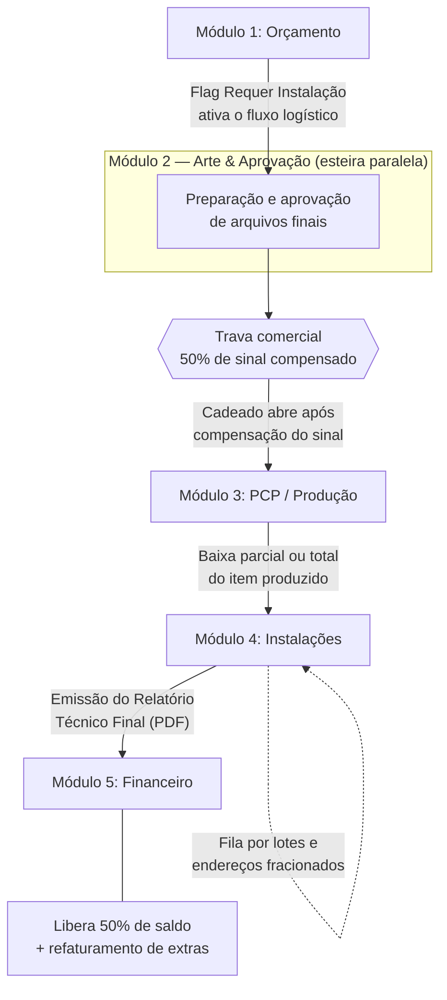

# Especificação Técnica e Funcional: Módulo de Logística, Execução de Campo e Pós-Cálculo Financeiro

**Versão:** 2.0 (Documento Unificado de Engenharia)

**Status:** Pronto para Implementação (Fase 2 do ComunikApp)

**Dependência:** Conclusão da Fase 1 (Arte & Aprovação)

---

## 1. Introdução e Filosofia de Produto

Este documento especifica a arquitetura e as regras de negócio para a gestão de pós-venda, produção, campo e faturamento estruturado do ComunikApp. O objetivo central é transformar o sistema de um gerenciador de ordens passivo em uma plataforma viva de controle de campo e inteligência financeira (Business Intelligence).

O motor do sistema foi projetado para ser global e robusto na base de dados, mas altamente flexível e adaptável na camada de experiência do usuário (UX). Essa engenharia permite atender a dois perfis opostos de clientes com a mesma base de código:

### O Modelo Broker / Agente (Sem Fábrica Própria)

Focado em gestão estratégica, intermediação e terceirização. Centraliza as operações no Desktop. Ele não possui instaladores de rua; recebe os reports (fotos/textos) de seus parceiros terceirizados via WhatsApp e os insere rapidamente no sistema para controle e geração automática de relatórios.

### O Modelo Indústria Verticalizada (Com Fábrica e Equipes)

Focado em execução direta. Disponibiliza uma interface Mobile responsiva e simplificada em formato de checklist para que os instaladores internos registrem o andamento, os consumos e os imprevistos da obra diretamente do local de instalação.

---

## 2. Jornada do Pedido e Fluxo Ponta a Ponta

A esteira de trabalho é dividida em 5 grandes módulos integrados, aplicando travas comerciais modulares baseadas nas configurações da loja.



**Legenda do fluxo:**

| Etapa | Gatilho principal |
|-------|-------------------|
| Orçamento → Arte | Flag **Requer Instalação** ativa o fluxo logístico |
| Arte → PCP | Trava comercial: confirmação dos **50% de sinal** |
| PCP → Instalações | Baixa de produção (parcial ou total) |
| Instalações → Financeiro | Geração do **Relatório Técnico Final** |

### 2.1. Detalhamento dos Gatilhos entre Módulos

#### Gatilho de Entrada (Orçamento V2)

No momento da venda, se o item exigir montagem/colocagem em campo, o comercial ativa o flag **"Requer Instalação"**. O sistema calcula o preço padrão do serviço e projeta o faturamento global.

#### Gatilho Comercial (Trava de Sinal)

Nas Configurações Comerciais da Loja, existirá a flag: **"Exigir confirmação de sinal para iniciar Ordens de Serviço"**.

- **Se Ativada:** A esteira de Arte & Aprovação permanece liberada para o designer preparar o arquivo final e o cliente aprová-lo. No entanto, o item nasce no PCP com o status `BLOQUEADO: AGUARDANDO SINAL`. A fábrica não compra materiais, não gera ordens de corte e não gasta tempo de máquina até que a primeira parcela de 50% seja compensada no financeiro.

- **Se Desativada:** A OS segue o fluxo direto (Fast Track) para clientes corporativos ou recorrentes que operam com faturamento faturado direto de ponta a ponta.

#### Gatilho de Saída (PCP → Instalação)

Assim que a produção realiza a baixa de um item (parcial ou total), o sistema verifica a flag **"Requer Instalação"**. Caso seja positiva, o lote físico produzido é despachado imediatamente para a fila do módulo de Instalações.

---

## 3. Modelagem de Dados (Prisma Schema)

A modelagem de dados foi desenhada para suportar projetos expressos (entrega e fechamento em um único dia) e projetos de longo prazo (rollouts de marcas que duram de 3 a 6 meses, onde uma única OS de 10 unidades é instalada fracionadamente em múltiplos condomínios à medida que o cliente final ganha novos contratos).

```prisma
model ItemOSInstalacao {
  id                  String            @id @default(cuid())
  item_os_id          String
  endereco_entrega    String            // Endereço do condomínio ou local da obra
  quantidade_alocada  Int               // Quantidade fracionada para este endereço
  status_instalacao   StatusInstalacao  @default(AGUARDANDO)
  data_previsao       DateTime?
  data_execucao       DateTime?
  fotos_evidencia     Json?             // Array de URLs das imagens comprobatórias
  assinatura_url      String?           // Link da assinatura digital colhida em campo
  apontamentos        OsApontamento[]
  criado_em           DateTime          @default(now())

  @@index([status_instalacao])
}

model OsApontamento {
  id                  String            @id @default(cuid())
  os_id               String
  item_instalacao_id  String?           // Opcional: liga a ocorrência a um endereço
  tipo                TipoApontamento   // Tipo do desvio/imprevisto
  categoria           CategoriaApont    // Onde ocorreu o evento
  quantidade          Decimal           @db.Decimal(10, 2)
  custo_interno       Decimal           @db.Decimal(10, 2) // Oculto para o operador (CMV)
  preco_cliente       Decimal           @db.Decimal(10, 2) // Valor cobrado do cliente final
  descricao           String            // Texto descritivo e justificativa técnica
  criado_em           DateTime          @default(now())
}

enum StatusInstalacao {
  AGUARDANDO
  EM_ANDAMENTO
  CONCLUIDO
  NEGATIVA_OCORRENCIA
}

enum TipoApontamento {
  VISITA_IMPRODUTIVA
  MATERIAL_EXTRA
  SERVICO_ADICIONAL
  RETRABALHO
}

enum CategoriaApont {
  PRODUCAO
  INSTALACAO
  LOGISTICA
}
```

---

## 4. Regras de Negócio Críticas

### 4.1. Gestão de Rollouts e Entregas Fracionadas

Uma única Ordem de Serviço possui controle de fracionamento de entrega.

**Exemplo:** Uma OS de 10 totens pode possuir 5 registros na tabela `ItemOSInstalacao`, cada um alocando 2 unidades para endereços diferentes.

O instalador ou o gestor realiza baixas parciais por lote de endereço. O status da OS Mãe permanece aberto controlando o saldo, enquanto os locais finalizados guardam suas respectivas evidências e assinaturas de forma isolada.

### 4.2. Blindagem de Custo e Processamento Oculto

**Segurança de Margem (RBAC):** Os operadores de produção, instaladores ou terceiros de campo nunca visualizam valores financeiros (`custo_interno` ou `preco_cliente`) nas interfaces do sistema.

No caso de uma **Visita Improdutiva / Perda de Viagem** (ex.: equipe chegou ao local e a portaria barrou a instalação por falta de autorização do morador), o operador aponta apenas a quantidade física (1 Visita Perdida). O backend captura o evento, consulta a tabela de taxas padrão da loja (ex.: Taxa de visita perdida fixa de R$ 250,00) e popula os campos financeiros de forma oculta.

### 4.3. Impacto Financeiro dos Apontamentos Extras

Sempre que um registro na tabela `OsApontamento` for inserido, o motor financeiro recalcula a saúde do pedido em duas frentes:

1. **Margem Líquida Real (CMV):** O campo `custo_interno` reduz imediatamente o lucro real da OS exibido no painel do administrador (`Lucro Real = Preço de Venda - Custo Orçado - Custos Extras de Apontamentos`).

2. **Faturamento de Cobrança Extra:** Caso o desvio tenha sido gerado por culpa do cliente (`VISITA_IMPRODUTIVA` ou `SERVICO_ADICIONAL` aprovado em obra), o campo `preco_cliente` armazena o valor a ser repassado. O sistema cria um gatilho de cobrança complementar no módulo financeiro para faturar esses adicionais no encerramento.

### 4.4. Split Fiscal Automático (Cisão de Notas)

Todos os insumos, matérias-primas e serviços do ComunikApp passam a carregar a propriedade estrutural `tipo_faturamento: 'PRODUTO' | 'SERVICO'`.

Ao consolidar a Ordem de Serviço, o sistema faz o somatório segregado:

- **Nota Fiscal de Produto (Comércio/Indústria):** matérias-primas físicas (ACM, Vinil, Acrílico, fita de LED, fontes).
- **Nota Fiscal de Serviço (Mão de Obra):** serviços manuais, horas de design e taxas de montagem.

O painel exibe para o faturamento o comando de emissão limpo: **Emitir R$ X em NF-e** e **Emitir R$ Y em NFS-e**.

---

## 5. Experiência do Usuário (UX Adaptativa)

### 5.1. Painel Desktop (Interface do Gestor / Perfil Broker)

**Componente Timeline:** A gestão de ocorrências elimina formulários complexos. O gestor visualiza um feed cronológico estilo rede social. Ao receber fotos e relatos do instalador parceiro via WhatsApp, ele clica em "Adicionar Ocorrência", seleciona a categoria, cola o texto e faz o upload das imagens. O sistema faz o mapeamento estruturado no banco de dados.

**Painel de Endereços:** Uma tabela limpa com os endereços de entrega vinculados à OS. O gestor pode atualizar prazos, associar fornecedores e alterar o status logístico de cada lote manualmente com base no retorno de campo.

### 5.2. Painel Mobile (Interface do Instalador / Perfil Indústria)

**Fila On-Demand:** O instalador visualiza de forma responsiva no celular apenas a fila de locais de instalação pendentes que foram liberados pelo PCP.

**Fluxo de 3 Cliques:** Ele clica em "Iniciar Trabalho" ao chegar ao local (registrando o SLA). Ao concluir o serviço, o sistema abre diretamente a câmera do aparelho para upload das fotos de evidência local e exibe um ecrã de Canvas digital para colher a assinatura do recebedor da obra. O fluxo é encerrado sem burocracia de escrita.

---

## 6. O Fechamento Financeiro e Emissão do Relatório Técnico

O sistema elimina a necessidade de preenchimento manual de relatórios de entrega em editores externos. O modelo de cobrança segue o padrão de **Faturamento Global Condicionado (50% Sinal / 50% Entrega Técnica)**.

### 6.1. O Processo de Encerramento e Faturamento

As duas parcelas financeiras (50/50) são lançadas no Contas a Receber assim que o orçamento é aprovado. A primeira é faturada imediatamente para liberar o PCP.

Durante a execução, os lotes em `ItemOSInstalacao` vão sendo liquidados fisicamente ao longo do tempo.

Ao concluir o último lote pendente, o gestor clica no botão **"Exportar Relatório Técnico (PDF)"** no módulo de Instalações.

No milissegundo em que o PDF é gerado para envio ao cliente final, o ComunikApp executa duas ações:

1. **Libera a Parcela 2 (50% Final):** Altera o status da fatura de saldo para "Emitida/A faturar", abrindo o prazo de 15 dias para o pagamento do cliente.

2. **Dispara a Cobrança Complementar:** Caso a tabela `OsApontamento` possua valores em `preco_cliente` acumulados pelas visitas perdidas ou bases extras, o sistema gera uma fatura adicional unificada para liquidação dessas ocorrências de campo.

### 6.2. Estrutura do PDF do Relatório Técnico Gerado de Forma Nativa

O documento em PDF compilado pelo backend adota a seguinte estrutura profissional:

| Seção | Conteúdo |
|-------|----------|
| **Cabeçalho** | Logotipo da empresa, número identificador da OS, dados da Proposta Comercial e descrição técnica dos itens vendidos. |
| **Mapeamento Logístico** | Lista de todos os locais e endereços que foram previstos e planejados originalmente para o projeto. |
| **Histórico de Instalações Realizadas** | Tabela cronológica listando as datas de conclusão de cada lote, exibindo o nome de quem recebeu a entrega, a assinatura digital colhida e as fotos das evidências fotográficas dos totens fixados renderizadas diretamente no corpo do documento. |
| **Serviços Adicionais e Ocorrências de Campo** | Seção que transcreve de forma limpa todas as ocorrências de campo registradas (visitas improdutivas, remoção de materiais antigos, custos extras com logística de frete), justificando tecnicamente os valores complementares cobrados. |
| **Sumário de Fechamento Financeiro** | Demonstrativo financeiro final validando o encerramento da entrega técnica, exibindo a divisão exata de faturamento de Notas de Produto vs. Notas de Serviço e solicitando a liberação do pagamento do saldo. |
