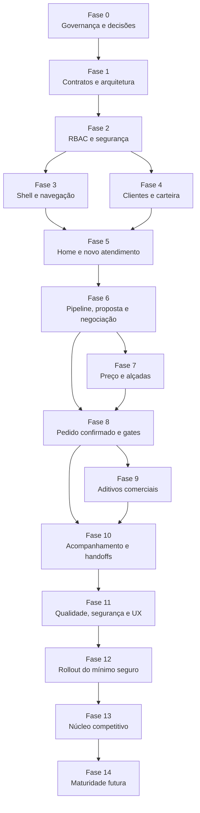

# Plano de Ação — Implementação do Módulo de Vendas

**Status geral:** Fase 0 concluída documentalmente; hotfix de segurança é o próximo gate
**Documento de produto obrigatório:** [`RP-modulo-vendas.md`](./RP-modulo-vendas.md)
**Entregáveis da Fase 0:** [`fase-0/`](./fase-0/README.md)
**Auditoria do código real:** [`fase-0/01-auditoria-estado-real.md`](./fase-0/01-auditoria-estado-real.md) — prevalece sobre o RP §4 em caso de divergência
**Última revisão:** 2026-07-31
**Objetivo:** transformar o RP em uma sequência executável, verificável e
auditável de entregas, sem perder as fronteiras entre Vendas, Financeiro, OS,
Arte, PCP, Expedição e Instalação.

---

## 1. Como usar este plano

Este documento é o controle oficial de execução do módulo. O agente responsável por
uma fase deve:

1. reler este plano, o RP e as referências obrigatórias da fase;
2. conferir o estado real do repositório antes de assumir que o RP ainda representa
   o código;
3. registrar decisões e desvios antes de implementar;
4. executar somente o escopo da fase;
5. validar segurança, banco, backend, frontend, UX e regressões aplicáveis;
6. marcar cada item concluído somente após obter evidência;
7. marcar o **Gate de conclusão da fase** por último;
8. atualizar o RP e este plano no mesmo PR quando a implementação alterar uma
   premissa, decisão, contrato ou item de backlog.

### Regra de conclusão obrigatória

Uma fase **não está concluída** porque o código foi escrito. Ela só está concluída
quando:

- [ ] todos os itens obrigatórios da fase estão marcados;
- [ ] critérios de aceite da fase foram demonstrados;
- [ ] testes proporcionais ao risco passaram;
- [ ] validações de banco/build/typecheck aplicáveis passaram;
- [ ] `git diff --check` passou;
- [ ] documentação e OpenAPI aplicáveis foram atualizadas;
- [ ] não existem pendências P0 ocultas em comentário, TODO ou conversa;
- [ ] o checkbox **Gate de conclusão** foi marcado.

Se algo não for aplicável, o agente não apaga o item: marca como
`[x] N/A — <justificativa e evidência>`.

### Estados permitidos

| Estado | Uso |
|--------|-----|
| `[ ]` | Não iniciado ou sem evidência |
| `[x]` | Concluído e validado |
| `[x] N/A — justificativa` | Inaplicável de forma comprovada |
| `BLOQUEADO` | Dependência externa ou decisão pendente; não equivale a concluído |

### Proibição de avanço silencioso

O agente pode preparar a fase seguinte, mas não deve implementar uma dependência que
pressuponha uma fase anterior incompleta. Exceções exigem registro explícito:

- qual dependência foi contornada;
- por que o trabalho é seguro;
- como será removido o contorno;
- qual item permanece bloqueado.

---

## 2. Premissas permanentes do projeto

Estas premissas valem para **todas as fases** e devem ser relidas antes de cada PR.

### 2.1 Produto e fronteiras

- [ ] Vendas é a casa de preço, proposta, negociação, carteira, follow-up, pedido
      confirmado e aditivo comercial.
- [ ] Financeiro continua dono de cobrança, recebimento, conciliação, fluxo de caixa
      e fechamento.
- [ ] OS, PCP, Expedição e Instalação continuam donos da execução.
- [ ] Aprovação comercial e aprovação de Arte são gates distintos.
- [ ] Orçamento, proposta enviada, pedido confirmado, OS e cobrança não são
      sinônimos.
- [ ] O vendedor de equipe não precisa entrar no módulo Financeiro para operar.
- [ ] O modo solo pode acumular papéis sem enfraquecer o menor privilégio do modo
      equipe.
- [ ] O cliente pertence à loja; carteira é responsabilidade comercial, não
      propriedade privada do vendedor.
- [ ] Não recriar Orçamentos V2, Cliente, chat público, Arte ou OS Aditiva.
- [ ] Não alterar pós-cálculo ou aba Financeiro da OS sem fase/decisão específica.

**Referência:** RP §§0, 1, 3, 5.2, 5.3 e 14.

### 2.2 Segurança e multi-tenancy

- [ ] Negar por padrão e aplicar menor privilégio.
- [ ] Derivar `loja_id` exclusivamente da identidade autenticada.
- [ ] Nunca confiar em `loja_id`, cliente, responsável, carteira, slug, hostname,
      role ou permissão enviados pelo frontend como prova de autorização.
- [ ] Toda leitura e mutação por ID filtra também pelo tenant.
- [ ] Links públicos, anexos e tokens são revogáveis, expiráveis e não revelam
      segredos.
- [ ] Dados inexistentes ou fora do tenant não permitem enumeração.
- [ ] Toda mutação sensível possui DTO tipado, autorização no backend, auditoria
      sanitizada, concorrência e idempotência quando aplicável.
- [ ] Logs não contêm token, código de aprovação, senha, segredo ou dado sensível
      desnecessário.
- [ ] Sessão de usuário bloqueado/inativado não continua autorizando requisições.

**Referência:** `AGENTS.md`, RP §§3, 4.9, 8.5–8.9 e 11.

### 2.3 Banco de dados e Prisma

- [ ] Usar somente `backend/prisma/schema.prisma`.
- [ ] Ler `docs/database/boas-praticas-schema-prisma.md` antes de qualquer alteração.
- [ ] Criar schema apenas quando a fase usar efetivamente a estrutura.
- [ ] Toda tabela da loja possui `loja_id`.
- [ ] Toda FK possui índice começando pelo campo adequado.
- [ ] Dados estruturados novos usam `Json` nativo quando apropriado.
- [ ] Valores monetários usam `Decimal`.
- [ ] `onDelete` é explícito e histórico comercial/financeiro não é apagado por
      cascata inconsciente.
- [ ] Entidades concorrentes usam versão otimista ou mecanismo equivalente.
- [ ] Migrations são aditivas, descritivas, revisadas e nunca editadas após aplicadas.
- [ ] Não usar `db push` em staging/produção.
- [ ] Não gerar IDs manualmente quando o Prisma possui default seguro.
- [ ] Listagens crescentes possuem paginação e índices orientados às consultas reais.

**Referência:** RP §§3, 4.9 e 8.7; documentação de banco.

### 2.4 Backend

- [ ] Todo `@Body()` usa DTO + `class-validator`; não ampliar uso de `any`.
- [ ] Controllers, guards, services e contratos são separados por domínio.
- [ ] Não duplicar autorização ou validação em múltiplos controllers.
- [ ] Transações mantêm estado e auditoria atômicos.
- [ ] I/O externo não ocorre dentro de transação longa.
- [ ] Aceite, geração de pedido, OS, cobrança e aditivo são idempotentes.
- [ ] Erros públicos são estáveis, em pt-BR e sem detalhes internos.
- [ ] Evitar N+1; agregações e dashboards possuem queries próprias e limitadas.
- [ ] Serviços novos respeitam limites de manutenção; não aumentar
      `OrcamentosV2Service` como monólito.
- [ ] OpenAPI e exemplos de payload são atualizados.

**Referência:** `AGENTS.md`, RP §4.9.

### 2.5 Frontend e UX

- [ ] Reutilizar componentes, clientes HTTP, máscaras e formatadores globais.
- [ ] Não usar CSS inline.
- [ ] Usar tokens compatíveis com dark/light mode.
- [ ] **Toda listagem CRUD de Vendas segue obrigatoriamente o template canônico de
      `frontend/src/app/(main)/fornecedores/`.**
- [ ] No desktop, a visualização inicial e prioritária é **Tabela/Grid** via
      `DataTable`; o usuário pode alternar para Cards.
- [ ] No mobile, a visualização é **sempre Cards**; o toggle Tabela/Cards fica
      oculto e a aplicação não renderiza a tabela comprimida.
- [ ] Usar `useIsMobile` e manter a preferência de visualização do desktop somente
      quando já houver padrão compartilhado no projeto; mobile sempre prevalece.
- [ ] A tabela usa `columns.tsx` com `@tanstack/react-table`, ordenação relevante e
      menu de ações com `DropdownMenu` + `MoreHorizontal`.
- [ ] Cards usam componente dedicado e reutilizável em `frontend/src/components`,
      com grid `grid grid-cols-1 gap-4 md:grid-cols-2 lg:grid-cols-3`.
- [ ] Tabela e Cards oferecem as mesmas ações e respeitam as mesmas permissões,
      preferencialmente reutilizando a definição/menu de ações para não duplicar
      regra ou markup.
- [ ] Se a API pagina no servidor, `DataTable` usa
      `enablePagination={false}` e os controles permanecem no servidor; caso
      contrário, utiliza paginação local do componente.
- [ ] Toda listagem cobre cabeçalho, ação primária, filtros, loading, vazio com CTA
      quando aplicável, erro, sem permissão, paginação e confirmação de ação sensível.
- [ ] Mutações sensíveis usam `ConfirmDialog` ou diálogo dedicado.
- [ ] Toda jornada cobre loading, vazio, sem resultado, erro, sem permissão,
      conflito, sucesso e instabilidade.
- [ ] Ações assíncronas só mostram sucesso após confirmação real do backend.
- [ ] Acessibilidade, foco, labels, teclado, contraste e responsividade fazem parte
      do aceite.
- [ ] Textos ao usuário permanecem em português do Brasil com UTF-8.

**Referência:** `AGENTS.md`, RP §§6.5, 8.7–8.9.

### 2.6 Preservação e qualidade

- [ ] Preservar alterações locais não relacionadas.
- [ ] Não executar refactor expansivo fora da fase.
- [ ] Não introduzir dados mockados/hardcoded.
- [ ] Testar com pelo menos dois tenants nos fluxos que acessam recursos por ID.
- [ ] Testar vendedor, gestor, Financeiro/Admin e usuário sem permissão.
- [ ] Executar testes proporcionais ao risco, validação Prisma quando aplicável,
      typecheck/build e `git diff --check`.
- [ ] Atualizar os checkboxes deste plano no mesmo PR da entrega.

---

## 3. Mapa de dependências

> **Decisão DV-16.** A ordem obrigatória é Fase 0 → hotfix de segurança → Fase 1 →
> Fase 2 → Fase 3. Navegação e home não serão antecipadas: expor uma nova entrada
> para contratos sem autorização efetiva ampliaria a superfície de ataque. Ver
> `fase-0/02-registro-de-decisoes.md`, DV-13 e DV-16.

### Marcos de produto

| Marco | Fases necessárias | Resultado |
|-------|-------------------|-----------|
| Fundação navegável | 0–3 | Vendas existe sem duplicar domínios |
| Operação comercial básica | 0–8 | Cliente → proposta → aceite → pedido/gates |
| Mínimo Operacional Seguro | 0–12 | Fluxo completo, aditivos, segurança e rollout |
| Núcleo Competitivo | 13 | Operação sem planilhas paralelas de follow-up/carteira |
| Maturidade | 14 | Forecast, metas, comissão e automações avançadas |

---

## 3.1 Gate 0S — Hotfix de segurança do legado comercial

**Status:** [x] Tecnicamente congelado — promoção/produção pendentes
**Checkpoint:** `ab79e8ef76b2411f8928f1db60dcec6d81865411` (`gate0s-tecnico-2026-08-04`)
**Dependência:** Fase 0 concluída
**Bloqueia:** publicação do Módulo de Vendas
**Não bloqueia:** desenvolvimento local das fases (a partir do checkpoint)
**Contrato obrigatório:**
[`fase-0/09-gate-hotfix-seguranca.md`](./fase-0/09-gate-hotfix-seguranca.md) ·
[`fase-0/13-backlog-operacional-gate0s.md`](./fase-0/13-backlog-operacional-gate0s.md)

> **Gate 0S tecnicamente congelado no SHA `ab79e8ef`. Promoção e validação em
> produção pendentes. Bloqueia publicação do Módulo de Vendas, mas não bloqueia
> desenvolvimento local.**

Este gate não cria produto novo. Ele corrige ou contém os riscos já existentes em
Orçamentos V2: autorização inerte, IDOR, fronteira pública divergente, segredo
inseguro, vazamento em logs/erros e aceite sujeito a repetição ou falha parcial.

> **DV-17, 2026-08-01.** A observabilidade centralizada saiu deste gate e virou
> projeto apartado, provavelmente em VPS separada da Oracle com recursos
> limitados. Nenhuma plataforma de observabilidade é instalada aqui ou na VPS
> principal. O HS-06 passa a exigir apenas o escopo local: evento estruturado e
> sanitizado, ausência de segredo, baixa cardinalidade, log local consultável,
> runbook de investigação, critérios de incidente, comprovação manual dos cinco
> tipos de evento e rollback fail-closed. Métricas centralizadas e alertas
> automáticos deixam de bloquear o Gate 0S.

- [x] HS-01 — autorização efetiva e negação por padrão (código/CI).
- [x] HS-02 — isolamento multi-tenant e correção de IDOR (código/CI).
- [x] HS-03 — fronteira pública única, DTOs e rate limit (código/CI).
- [x] HS-04 — tokens seguros, revogáveis e sem exposição (código/CI; **produção pendente**).
- [x] HS-05 — aceite legado atômico/idempotente (código/CI; **produção pendente**).
- [x] HS-06 — eventos sanitizados, consulta local, runbook e rollback fail-closed.
- [x] Testes cross-tenant, persona, rota pública, concorrência e carga no CI.
- [ ] Promoção + migrate + smoke + varredura + reenvios + fechamento formal
      ([backlog operacional](./fase-0/13-backlog-operacional-gate0s.md)).
- [ ] **GATE 0S CONCLUÍDO — PUBLICAÇÃO DE VENDAS LIBERADA.**

---

## 4. Fase 0 — Governança, auditoria e decisões bloqueadoras

**Status:** [x] Concluída documentalmente — 2026-07-31
**Dependência:** nenhuma
**Referências do RP:** Veredito; §§0, 3, 4, 9, 11 e 15; DV-01–DV-12.
**Objetivo:** congelar o contrato de produto e confirmar o estado real antes de
qualquer migration ou alteração de fluxo.
**Entregáveis:** [`fase-0/`](./fase-0/README.md)

### Execução detalhada

- [x] Reler integralmente `AGENTS.md`, RP e documentação de banco.
- [x] Ler as referências obrigatórias listadas no cabeçalho do RP.
- [x] Auditar novamente Orçamentos V2, Clientes, Arte, Financeiro, OS, PCP,
      Expedição, Instalação, sidebar e Module Nav.
      → `fase-0/01-auditoria-estado-real.md`
- [x] Confirmar quais ativos citados no RP continuam existentes e em uso.
      → todos confirmados, `fase-0/01-auditoria-estado-real.md` §12
- [x] Registrar divergências entre RP, schema, migrations, backend e frontend.
      → dez dívidas D-01 a D-10, `fase-0/01-auditoria-estado-real.md` §1
- [x] Resolver DV-01: pedido confirmado como evento + projeção `pedido_comercial`.
- [x] Resolver DV-02: snapshot visível ao cliente define invalidação do aceite.
- [x] Resolver DV-03: matriz configurável de gates por loja/tipo de venda.
- [x] Resolver DV-04 e DV-05: alçadas por perfil e custo detalhado negado por padrão.
- [x] Resolver DV-06: contato aprovador e evidência segura de aceite B2B.
- [x] Resolver DV-07–DV-09: expiração automática, canais e SLA na Fase 13.
- [x] Resolver DV-10: pós-venda limitado a aceite e satisfação/recompra.
- [x] Confirmar DV-11 e DV-12: participantes e rollout seguro de carteira.
- [x] **Resolver DV-13: estratégia de autorização.** Não existe `RolesGuard`;
      `@Roles` é metadata inerte. Bloqueia a Fase 2 inteira.
- [x] **Resolver DV-14: reconciliação dos três vocabulários de status.**
- [x] **Resolver DV-15: destino das quatro tabelas de histórico, três órfãs.**
- [x] **Resolver DV-16: ordem de entrega**, divergente entre RP §10 e o mapa de
      dependências deste plano.
- [x] Definir nomenclatura canônica de papéis, permissões, status e eventos.
      → `fase-0/03-nomenclatura-e-matriz-rbac.md` e
      `fase-0/04-maquina-de-estados-comercial.md`
- [x] Elaborar matriz de rastreabilidade requisito → endpoint → tela → teste.
      → `fase-0/07-matriz-de-rastreabilidade.md`
- [x] Classificar qualquer mudança de banco como necessária agora ou futura.
      → `fase-0/06-plano-de-migrations.md`, 15 migrations distribuídas por fase
- [x] Atualizar o RP com as decisões fechadas.

### Entregáveis

- [x] Registro de decisões — `fase-0/02-registro-de-decisoes.md`
      (DV-01 a DV-16 fechadas em 2026-07-31; DV-17 acrescentada em 2026-08-01;
      17 decisões no total).
- [x] Inventário atualizado de reuso e dívidas — `fase-0/01-auditoria-estado-real.md`.
- [x] Matriz inicial de permissões — `fase-0/03-nomenclatura-e-matriz-rbac.md`,
      31 permissões `vendas.*`.
- [x] Máquina de estados proposta — `fase-0/04-maquina-de-estados-comercial.md`,
      10 estados e 23 transições.
- [x] Matriz de gates por cenário — `fase-0/05-matriz-de-gates.md`.
- [x] Plano de migrations, sem aplicar estrutura especulativa —
      `fase-0/06-plano-de-migrations.md`.
- [x] Matriz de testes e rastreabilidade — `fase-0/07-matriz-de-rastreabilidade.md`.
- [x] Apoio extra, não previsto no plano: resumo executivo das decisões para a
      reunião de kickoff — `fase-0/08-resumo-executivo-decisoes.md`.

### Gate de conclusão

- [x] **FASE 0 CONCLUÍDA:** não há decisão P0 de produto/arquitetura pendente.
      Checkpoint Gate 0S: `ab79e8ef` / `gate0s-tecnico-2026-08-04` (promoção
      pendente). Desenvolvimento local da Fase 1 liberado; publicação bloqueada.

---

## 5. Fase 1 — Contratos de domínio, dados e compatibilidade

**Status:** **FASE 1 CONCLUÍDA** (2026-08-04)
**Dependência:** Fase 0 concluída; Gate 0S **tecnicamente congelado** (`ab79e8ef` /
`gate0s-tecnico-2026-08-04`). Publicação continua bloqueada até promoção/fechamento
formal do Gate 0S.
**Referências do RP:** §§3, 4.8, 4.9, 5.2, 5.3, 7/E1-4–E1-7 e 14.1.
**Objetivo:** definir contratos canônicos sem criar um segundo Orçamento, Cliente,
chat, Arte, pedido operacional ou OS Aditiva.
**Contratos diferidos (F4/F5/F6/F8):** [`fase-1/contratos-diferidos.md`](./fase-1/contratos-diferidos.md)
**README da fase:** [`fase-1/README.md`](./fase-1/README.md)

### Ajustes exigidos pela auditoria da Fase 0

- [x] Tratar D-04: três vocabulários reconciliados com `status_comercial` (M1.1)
      + dual-write + backfill (`04-maquina-de-estados-comercial.md` §7).
- [x] Tratar D-05: writer de `VersaoOrcamento` religado (M1.2);
      `HistoricoOrcamento` canônico com `loja_id`/`evento`/`payload` (M1.4);
      demais tabelas deprecated sem drop.
- [x] Tratar D-07: validade estruturada (M1.3) + `enviado_em`/`aceito_em` (M1.2).
- [x] Eleger `MensagemChat` como canônico; escritas de `mensagens-negociacao`
      → 410 Gone (órfã auditada em `backend/src/mensagens-negociacao/AGENTS.md`);
      leituras preservadas.
- [x] Substituir `@Body() dados: any` por `CriarOrcamentoBodyDto` /
      `AtualizarOrcamentoBodyDto`.
- [x] Aplicar as migrations M1.1 a M1.4.

### Execução detalhada

- [x] Mapear entidades existentes e seus campos legados/estruturados.
- [x] Definir fonte canônica de status comercial.
- [x] Separar status comercial de status de execução.
- [x] Definir eventos comerciais canônicos (`eventos-comerciais.ts` + M1.4).
- [x] Definir versão vigente/enviada/aceita (`versao_enviada_id` /
      `versao_aceita_id` + writer).
- [x] Definir e aplicar invalidação de aceite por alteração material (DV-02).
- [x] Eleger contrato canônico de chat/negociação (`MensagemChat`).
- [x] Planejar convivência `MensagemChat` × `mensagemnegociacao`
      (leitura + 410; AGENTS.md e `contratos-diferidos.md` §9).
- [x] Definir projeção de pedido confirmado — contrato §1 (implementação Fase 6).
- [x] Definir atividades comerciais — contrato §2 (Fase 5).
- [x] Definir carteira/participantes — contrato §3 (Fase 4).
- [x] Definir contatos e papéis — contrato §4 (Fase 4).
- [x] Definir payload comercial resumido — contrato §5 (Fases 6/8).
- [x] Definir idempotência dos handoffs — contrato §6 (Fase 6).
- [x] Definir soft delete/retenção — contrato §7.
- [x] Modelar índices futuros de carteira/pipeline/atividades — previsão §8
      (sem `CREATE INDEX` especulativo nesta fase).

### Banco e migrations

- [x] Boas práticas aplicadas (enum, `loja_id`, índices FK, `onDelete`, Json,
      sem drop destrutivo).
- [x] Cada campo novo usado na mesma entrega.
- [x] Backfill set-based documentado (lote se volume > 500k).
- [x] SQL revisado e exercitado em MySQL 8 no CI (`comunikapp_m1`).
- [x] Migrations aditivas posteriores a HS-04/HS-05; sem edição pós-apply em prod.

### Backend

- [x] `@Body() any` removido nos create/update tocados.
- [x] Facades de domínio: `status-comercial`, `versao-orcamento`,
      `validade-proposta`, `eventos-comerciais`.
- [x] OpenAPI: POSTs legados de mensagens deprecated/410.
- [x] Testes de estados, invariantes, aceite, validade, eventos e chat 410.

### Gate de conclusão

- [x] Schema/contratos aprovados e sem entidade duplicada.
- [x] Estratégia de compatibilidade e backfill documentada.
- [x] Testes de invariantes principais verdes.
- [x] **FASE 1 CONCLUÍDA.**

---

## 6. Fase 2 — RBAC, segurança e isolamento multi-tenant

**Status:** [x] Concluída (revisão `5a40a965..f16a7dd8` corrigida — evidência em `docs/modulo-vendas/fase-2/`)
**Dependência:** Fase 1 concluída
**Referências do RP:** §§3, 4.3, 4.5, 5.1, 5.5, 6.3, 7/E0-4, E1-5, E2-2,
8.5–8.8 e 11.
**Objetivo:** criar a política canônica de Vendas antes de expor novas superfícies.
**HEAD de partida:** `5a40a965`
**Reabertura resolvida:** precedência `permitido=false` > piso; sem cache;
bypass só por `usuario_funcao.ADMINISTRADOR`; `assertPode` em mutações sensíveis;
seed com auditoria MySQL, colisões abortivas e idempotência real.

### Ajustes exigidos pela auditoria da Fase 0 — esta fase mudou de natureza

- [x] Tratar D-01: **não existe `RolesGuard`**. `@Roles(...)` é metadata inerte em
      todo o backend; nenhuma das 10 permissões `orcamentos.*` declaradas hoje é
      verificada. Hoje qualquer usuário autenticado da loja fecha pedido de qualquer
      orçamento. Esta fase deixa de ser "declarar permissões" e passa a ser
      "construir o mecanismo de autorização". Ver DV-13.
      *(Evidência: `VendasPermissionsService` + Guard + `assertPode` nos services.)*
- [x] Não refazer autenticação: `JwtGlobalMiddleware` (`app.module.ts:99–104`) já
      cobre token, usuário ativo, loja ativa, revogação de sessão e tenant do host.
      O que falta é exclusivamente a camada de autorização.
- [x] Implementar `VendasPermissionsService` seguindo o padrão de
      `backend/src/compras/services/compras-permissions.service.ts`, único que
      funciona hoje. **Não** usar `@Roles` como se autorizasse.
- [x] Criar o seed de `perfil_acesso` e `perfil_permissao` (M2.1):
      `backend/prisma/seed-vendas-rbac.ts` ligado em `seed.ts` (idempotente).
- [x] Tratar D-02: corrigir o IDOR de `links-v2.service.ts`, que resolve
      orçamento por `id` sem `loja_id`. *(Gate 0S; confirmado em F2 — findFirst com
      `loja_id`.)*
- [x] Verificar em runtime a divergência entre o decorator `@Public()` e a allowlist
      do middleware. Fonte única: `rotas-publicas.ts` + `RotasPublicasValidator`
      *(Gate 0S; F2 não reabre bypass).*
- [x] Usar a matriz de permissões e os perfis padrão de
      `fase-0/03-nomenclatura-e-matriz-rbac.md` §§3–4.
      *(Catálogo TS completo; defaults concedidos = só recorte F2.)*

### Execução detalhada

- [x] Unificar o significado de `UserRole.VENDEDOR`, `usuario_funcao.VENDAS` e
      permissões `orcamentos.*`/`vendas.*`. Decisão da Fase 0: `usuario_funcao` é a
      única fonte de verdade; `UserRole` é legado e não entra em código novo.
      *(Doc: `fase-2/mapeamento-user-role.md`.)*
- [x] Definir catálogo granular de permissões de Vendas.
- [x] Implementar defaults para vendedor, gestor, Financeiro e Admin.
- [x] Garantir que VENDAS não receba acesso ao módulo Financeiro.
- [x] Criar permissões de carteira própria, equipe, todos e sem responsável.
      *(No catálogo TS; **não** concedidas no seed F2 — Fase 4+.)*
- [x] Criar permissões de criar prospect/cliente, transferir e mesclar.
      *(Catálogo; sem concessão F2.)*
- [x] Criar permissões de ver custo/margem e aprovar alçada.
      *(Catálogo; sem concessão F2.)*
- [x] Criar permissões de precificar aditivo e de abonar.
      *(Catálogo; sem concessão F2.)*
- [x] Aplicar autorização no backend, não apenas na navegação.
- [x] Revisar todos os endpoints por ID tocados pela feature.
      *(Matriz: `fase-2/matriz-endpoints.md`.)*
- [x] Validar tenant em links, anexos, chat, orçamento (superfície Orçamentos V2).
      *(Cliente/atividade/OS/ocorrência fora do escopo F2.)*
- [x] Definir retorno seguro 404/403 conforme política sem enumeração.
- [x] Sanitizar logs e auditoria. *(Eventos de segurança Gate 0S; relatório seed
      sem e-mail.)*
- [x] Testar sessão de usuário inativado. *(Spec `VendasPermissionsService`.)*

### Cenários obrigatórios de teste

- [ ] Vendedor A não acessa carteira privada do vendedor B sem permissão.
      **Diferido (Fase 4+):** recurso de carteira ainda não existe nesta fase.
- [ ] Gestor acessa equipe autorizada, não outra loja.
      **Parcial:** cross-tenant coberto em F2; escopo equipe diferido (Fase 4+).
- [x] Financeiro acessa leitura comercial (`proposta.ver`), sem edição implícita.
      *(Cobrança de pedido / módulo Financeiro = fases posteriores.)*
- [ ] Vendedor precifica aditivo, mas não abona se não autorizado.
      **Diferido (Fase 5–6+):** aditivo ainda não exposto nesta fase.
- [x] Instalador/produção continua sem receber valores comerciais.
- [x] ID de orçamento/link de outro tenant não produz efeito.
- [x] Ocultar item de menu não substitui negação no endpoint.
      *(Frontend ≠ auth documentado e testado.)*

### Gate de conclusão

- [x] Matriz RBAC documentada e coberta por testes positivos e negativos.
- [x] Testes cross-tenant passaram.
- [x] Nenhum endpoint novo depende de `loja_id` do cliente HTTP.
- [x] **FASE 2 CONCLUÍDA.**
      *(Revisão corrigida; evidências MySQL + Jest em `docs/modulo-vendas/fase-2/`.)*
---

## 7. Fase 3 — Fundação visual, navegação e compatibilidade de rotas

**Status:** [x] Concluída (evidências em `docs/modulo-vendas/fase-3/`)
**Dependência:** Fase 2 concluída
**Referências do RP:** §§4.6, 6.1–6.4, 7/E0 e 8.1.
**Objetivo:** criar a casa do módulo sem reescrever recursos existentes.

### Execução detalhada

- [x] Criar `vendasModuleNav`.
- [x] Registrar o módulo no `MODULE_NAV_REGISTRY`.
- [x] Criar `/vendas` e `ModuleLayoutShell`.
- [x] Adicionar Vendas à sidebar conforme permissão.
- [x] Retirar Orçamentos e Clientes como itens globais independentes.
- [x] Manter aliases/redirects seguros para `/orcamentos-v2` e `/clientes`.
- [x] Garantir que bookmarks e links internos continuem funcionando.
- [x] Criar cards iniciais para Orçamentos, Clientes e Simulador.
- [x] Exibir Aditivos somente quando a configuração da loja permitir.
- [x] Não exibir Financeiro para perfil VENDAS.
- [x] Implementar estados loading, vazio, erro e sem permissão.
- [x] Validar dark/light, teclado, mobile e desktop.

### Gate de conclusão

- [x] Navegação Vendas funciona para solo, equipe, gestor e usuário sem acesso.
- [x] Rotas antigas continuam compatíveis.
- [x] Nenhum dado mockado foi usado.
- [x] Critérios RP 8.1–8.3 atendidos.
- [x] **FASE 3 CONCLUÍDA.**

---

## 8. Fase 4 — Clientes, carteira e contatos

**Status:** [x] Concluída
**Dependência:** Fase 2 concluída
**Referências do RP:** §§4.5, 5.2.1–5.2.4, 6.2, 7/E3B-3 e E3B-6–E3B-10,
8.8 e DV-11–DV-12.
**Objetivo:** transformar Clientes na base comercial de Vendas, preservando-o como
cadastro mestre da loja.

### Ajustes exigidos pela auditoria da Fase 0

- [x] Tratar D-06: o modelo `cliente` **não tem responsável comercial, participantes,
      contatos nem histórico de transferência**. Esta fase é construção, não
      absorção. Migrations M4.1 a M4.3 são obrigatórias.
- [x] Atenção ao nome: `cliente.responsavel` já existe e é o **contato dentro do
      cliente**, não o vendedor. O campo novo precisa de nome e comentário distintos.
- [x] Não criar `@@unique` nos campos normalizados de deduplicação: duplicidade é
      alerta, não bloqueio (RP §5.2.3), e constraint quebraria cadastros existentes.
- [x] Implementar paginação de servidor em `backend/src/clientes/clientes.controller.ts`,
      que hoje não tem `take`/`skip` — exigido pelo critério RP 8.8 (34).
- [x] Corrigir os desvios de template já mapeados em
      `fase-0/01-auditoria-estado-real.md` §6 na tela de Clientes: grid de cards fora
      do padrão, erro só em `console.error`, cores fixas de light mode,
      `createColumns` sem `useMemo` e ausência de `ModuleHeader`.

### Backend e banco

- [x] Implementar responsável comercial principal.
- [x] Implementar gestão de participantes na API e na ficha do cliente, com caminho
      autorizado para listar, adicionar e remover participantes.
- [x] Preservar histórico de atribuição e transferência.
- [x] Implementar busca normalizada e deduplicação por tenant.
- [x] Tratar CPF/CNPJ, e-mail e telefone conforme normalização compartilhada.
- [x] Criar contatos e papéis sem duplicar cliente.
- [x] Garantir acesso contextual mínimo pelos outros domínios.
- [x] Implementar paginação e filtros de Minha carteira, Minha equipe, Todos e Sem
      responsável.
- [ ] Implementar redistribuição segura ao inativar vendedor.
      *(Diferido: transferência manual coberta; hook no fluxo de inativação de usuário fica para entrega posterior.)*
- [x] Implementar mesclagem administrativa apenas se incluída nesta entrega; caso
      contrário, manter bloqueio/alerta sem merge parcial.
      *(Bloqueio explícito via `mesclar` → Forbidden.)*

### Frontend e UX

- [x] Criar `/vendas/carteira`.
- [x] Integrar Todos os clientes dentro do shell de Vendas.
- [x] Seguir o template de Fornecedores: desktop abre em Tabela/Grid com toggle para
      Cards; mobile força Cards e oculta o toggle.
- [x] Implementar `columns.tsx` + `DataTable` e card reutilizável com as mesmas
      ações/permissões.
- [x] Criar CTA Novo cliente/prospect.
- [x] Mostrar duplicidades sem expor dados não autorizados.
- [x] Criar transferência com confirmação, motivo e impacto.
- [ ] Criar ficha 360º com contatos, atividades, propostas, pedidos, aditivos e
      timeline.
      *(Parcial: contatos + transferências + orçamentos/OS; atividades/pedidos/aditivos na ficha = Fase 5+.)*
- [x] Exibir financeiro somente no nível autorizado.
- [x] Criar estados vazios orientativos para carteira nova e sem responsável.

### Testes obrigatórios

- [x] Vendedor vê por padrão apenas sua carteira/participações.
- [x] Gestor alterna escopos permitidos.
- [x] Duplicidade é calculada somente dentro da loja.
- [x] Transferência não altera silenciosamente responsáveis históricos.
- [x] Outros módulos continuam resolvendo o mesmo cliente.
- [x] Inativação não apaga clientes nem histórico.

### Gate de conclusão

- [x] Critérios RP 8.8 (27–34) atendidos.
- [x] Nenhuma regressão no CRUD atual de Clientes.
- [x] **FASE 4 CONCLUÍDA.**

---

## 9. Fase 5 — Home acionável, novo atendimento e atividades

**Status:** [x] FASE 5 CONCLUÍDA (evidências em `docs/modulo-vendas/fase-5/`)
**Dependências:** Fases 3 e 4 concluídas
**Referências do RP:** §§6.4, 6.5.1–6.5.4, 7/E3B-1–E3B-2, E3C-1–E3C-3 e
8.9 (35–37).
**Objetivo:** entregar a mesa de trabalho diária do vendedor e impedir perda de
demanda/follow-up.

### Ajustes exigidos pela auditoria da Fase 0

- [x] Tratar D-09: a tabela `notificacao` é endereçada à **loja**, não ao usuário —
      não existe `usuario_id`. A home por próxima ação exige a migration M5.2.
      Evidência: migration `20260805120500` + `criarNotificacaoEndereçada`.
- [x] Não criar um sexto serviço de notificação. Já existem cinco caminhos
      (`notificacoes`, `notificacao-v2`, `notificacoes-pcp`, `arte-notificacao` com
      nodemailer próprio, `expedicao-notificacao` via WebSocket). Reutilizar
      `NotificacoesService` e `MailService`.
- [x] Criar `atividade_comercial` (M5.1); o conceito não existe em nenhuma forma hoje.
      Evidência: migration `20260805120400`.

### Execução detalhada

- [x] Definir atividade comercial, próxima ação, prazo, responsável e conclusão.
- [x] Criar agregador da Home respeitando escopo e permissão.
- [x] Implementar prioridades do dia, vencidas e próximas.
- [x] Implementar propostas aguardando ação, mensagens e aditivos pendentes.
      (aditivos: bloco só se contrato/auth; caso contrário indisponível)
- [x] Implementar Novo atendimento.
- [x] Buscar cliente/prospect antes de cadastrar.
- [x] Preservar dados digitados ao detectar duplicidade ou falta de acesso.
      (preservação no frontend; backend sem eco de payload)
- [x] N/A — anexos e consentimento de cliente diferidos (plano §12). Origem,
      contato, necessidade e prazo implementados na atividade/atendimento.
- [x] Permitir criar orçamento ou agendar próxima ação.
      (orçamento via deep-link canônico; próxima ação via atividade)
- [x] Criar Minhas atividades com paginação e estados.
- [x] Em Minhas atividades e demais listagens, aplicar desktop Tabela/Grid por
      padrão e mobile sempre Cards conforme o template de Fornecedores.
- [x] Criar notificações acionáveis, sem duplicidade.
- [x] Não criar gráficos sem ação correspondente.

### Gate de conclusão

- [x] O vendedor identifica o que fazer primeiro ao entrar. (home tipada)
- [x] Uma demanda pode ser registrada sem cadastro completo. (prospect)
- [x] Nenhuma atividade depende somente de memória ou planilha.
- [x] Critérios RP 8.9 (35–37) atendidos.
      Evidência: home + atendimento + CTA/deep-link (ficha e testes).
- [x] **FASE 5 CONCLUÍDA.**
      Evidências: `docs/modulo-vendas/fase-5/` (testes, MySQL 8 CAS lote, nav).
      Ressalvas documentadas: `migrate deploy` do zero e drift legado pré-F5
      (mesmo padrão da Fase 4).
---

## 10. Fase 6 — Pipeline, proposta, versão e negociação

**Status:** [ ] Não iniciada
**Dependência:** Fase 5 concluída
**Referências do RP:** §§4.1, 4.9, 5.3, 6.5.5–6.5.6, 7/E1, 8.2, 8.6 e
8.9 (38–39).
**Objetivo:** tornar Orçamentos V2 o coração de um pipeline comercial coerente.

### Ajustes exigidos pela auditoria da Fase 0

- [ ] Tratar D-03: a máquina de estados **já existe** em
      `validacao-v2.service.ts:605–636`, mas `OrcamentosV2Service.alterarStatus`
      (`:2923`) **não a chama** e grava qualquer string. Religar validação e caminho
      de escrita é pré-requisito de tudo nesta fase.
- [ ] Garantir um **único ponto de escrita** de status comercial. Hoje há escritas
      espalhadas em `alterarStatus`, `fecharPedidoInterno` e
      `processarAcaoClientePublico`.
- [ ] Remover o `console.log` do código de aprovação em
      `orcamentos-v2.service.ts:2961–2967`, que imprime o segredo em texto puro,
      contra `docs/database/boas-praticas-schema-prisma.md` §Segurança.
- [ ] Eleger `MensagemChat`: é a tabela que o frontend realmente usa, apesar de os
      métodos se chamarem `...Legado`. O módulo `mensagens-negociacao` é o órfão.
- [ ] Decidir o destino do `LinkPublico`, que tem quatro campos duplicados de duas
      gerações, registra IP e user-agent vindos de **query string** e não é o canal
      usado pela aprovação real (que usa `codigo_aprovacao`).
- [ ] Não ampliar `orcamentos-v2.service.ts`, hoje com 4.072 linhas e 47 métodos.

### Máquina de estados

- [ ] Implementar os 10 estados e 23 transições de
      `fase-0/04-maquina-de-estados-comercial.md`, após decisão de DV-14.
- [ ] Definir transições válidas e ator autorizado.
- [ ] Implementar proposta enviada, negociação, revisão, expiração e perda.
- [ ] Separar `em_execucao`/`concluido` da superfície comercial.
- [ ] Exigir motivo de perda e auditar reabertura.
- [ ] Implementar expiração pelo timezone da loja.

### Proposta e versão

- [ ] Congelar snapshot da versão enviada.
- [ ] Identificar versão vigente, enviada e aceita.
- [ ] Invalidar aceite quando campos materiais mudarem.
- [ ] Criar diff legível entre versões.
- [ ] Garantir preview fiel ao documento do cliente.
- [ ] Confirmar destinatário, canal, validade e permissões do link.
- [ ] Revalidar preço/prazo ao retomar proposta expirada.

### Negociação

- [ ] Eleger e usar somente o contrato canônico de chat.
- [ ] Preservar mensagens/histórico legado.
- [ ] Consolidar versão, mensagens, anexos, validade e próxima ação.
- [ ] Implementar não lidas e estatísticas sem N+1.
- [ ] Tratar anexos com validação de tipo/tamanho/storage privado.
- [ ] Implementar revogação e expiração de links públicos.
- [ ] Garantir que código/token não apareça em resposta indevida.

### Gate de conclusão

- [ ] Regressão zero em criação, edição, envio, link e chat.
- [ ] Versão aceita é inequívoca e imutável.
- [ ] Proposta expirada não é aceita silenciosamente.
- [ ] Critérios RP 8.2, 8.6 (17, 21) e 8.9 (38–39) atendidos.
- [ ] **FASE 6 CONCLUÍDA.**

---

## 11. Fase 7 — Governança de preço, desconto, margem e alçadas

**Status:** [ ] Não iniciada
**Dependências:** Fases 2 e 6 concluídas
**Referências do RP:** §§6.3, 6.5.5, 7/E3A, 8.6 (20), 9, DV-04–DV-05.
**Objetivo:** impedir erosão de margem e decisões comerciais fora da autoridade.

### Ajustes exigidos pela auditoria da Fase 0

- [ ] Tratar D-10: **o nome "alçadas" já está ocupado** por
      `backend/src/os/services/alcadas-orcamento.service.ts`, que trata de limites de
      orçamento de centro de custo em OS, com configuração hardcoded para funções
      (`SUPERVISOR`, `GERENTE`, `DIRETOR`, `ADMIN`) que **não existem** no enum
      `usuario_funcao`. Usar "alçada comercial" e não colidir com a "alçada
      orçamentária" existente.
- [ ] Seguir o padrão de `backend/src/os/services/os-approval-permissions.service.ts`,
      que já implementa quatro níveis de aprovação consultando `perfil_permissao`.
- [ ] `perfil_permissao` guarda apenas booleano `(modulo, acao, permitido)` — não há
      onde armazenar faixa de desconto. Migrations M7.1 e M7.2 são obrigatórias.

### Execução detalhada

- [ ] Definir limite de desconto por item e total.
- [ ] Definir margem mínima e informação exibida por perfil.
- [ ] Definir alçadas por permissão/faixa.
- [ ] Bloquear exceção no backend, independentemente do frontend.
- [ ] Exigir justificativa para solicitação e decisão.
- [ ] Registrar snapshot antes/depois, solicitante, aprovador e tempo.
- [ ] Criar fila de alçadas do gestor.
- [ ] Atualizar preview e versão após aprovação/rejeição.
- [ ] Impedir envio enquanto alçada obrigatória está pendente.
- [ ] Definir regra de tabelas de preço apenas se houver uso P1 imediato.
- [ ] Não duplicar motor de cálculo ou máscara de moeda.

### Gate de conclusão

- [ ] Cenários dentro/fora da alçada cobertos por testes.
- [ ] Vendedor sem custo detalhado consegue decidir com informação permitida.
- [ ] Aprovação não pode ser forjada pelo cliente HTTP.
- [ ] Critério RP 8.6 (20) atendido.
- [ ] **FASE 7 CONCLUÍDA.**

---

## 12. Fase 8 — Aceite, pedido confirmado, gates e handoffs

**Status:** [ ] Não iniciada
**Dependências:** Fases 6 e 7 concluídas
**Referências do RP:** §§3.11–3.13, 5.3, 6.5.7, 7/E1A, 8.6, 9 e
DV-01–DV-03/DV-06.
**Objetivo:** transformar aceite válido em compromisso comercial e handoffs
idempotentes, sem usar OS como sinônimo de pedido.

### Ajustes exigidos pela auditoria da Fase 0

- [ ] Tratar D-08: a aprovação atual **não é transacional**. Update do orçamento,
      criação da OS e criação da cobrança são operações independentes
      (`orcamentos-v2.service.ts:3217`, `:3227`, `:3259`), a falha de cobrança é
      silenciada e a compensação é manual e parcial.
- [ ] A idempotência atual é por **consulta prévia** (`findFirst` na linha 3159),
      sujeita a corrida. Substituir por garantia estrutural:
      `pedido_comercial.orcamento_id @unique` (M8.1), seguindo o precedente de
      `Cobranca.orcamento_id @unique`, que é o único handoff idempotente que
      funciona hoje.
- [ ] Replicar o padrão de `CobrancasService.criarCobrancaParaOrcamento`
      (`backend/src/financeiro/services/cobrancas.service.ts:73–183`), que já é
      idempotente e transacional.
- [ ] Substituir `gerarCodigoAprovacao` (`:2271–2299`), que usa `Math.random()`,
      contra `docs/database/boas-praticas-schema-prisma.md` §Segurança.
- [ ] Registrar evidência de aceite: hoje **nada** é gravado — nem `data_aprovacao`,
      nem `aprovado_por`, nem IP, nem user-agent, e os campos `cliente_nome`/
      `cliente_email` recebidos no body são ignorados.
- [ ] Criar DTO tipado para `processarAcaoClientePublico`, hoje com body tipado
      inline sem `class-validator`.
- [ ] Corrigir o erro público que **expõe o status do orçamento** a chamador não
      autenticado (`:2364–2369`).
- [ ] Adicionar rate limit e contador de tentativas na validação do código de
      aprovação.

### Aceite e pedido

- [ ] Validar versão vigente, validade e autoridade/evidência do aceite.
- [ ] Registrar aceite de forma auditável.
- [ ] Criar projeção/evento de pedido confirmado conforme decisão da Fase 0.
- [ ] Impedir aceite repetido de gerar efeitos duplicados.
- [ ] Implementar cancelamento/alteração pós-aceite por fluxo compensatório.
- [ ] Preservar histórico mesmo quando o pedido é cancelado.

### Gates

- [ ] Implementar gate comercial.
- [ ] Integrar gate de sinal sem mover recebimento para Vendas.
- [ ] Integrar gate de aprovação de Arte.
- [ ] Integrar gate de revisão técnica.
- [ ] Configurar aplicabilidade por tipo de produto/venda/loja.
- [ ] Exibir responsável, motivo e prazo de cada pendência.
- [ ] Impedir liberação operacional enquanto gate obrigatório estiver aberto.

### Handoffs

- [ ] Criar cobrança/parcelas pelo contrato Financeiro existente.
- [ ] Criar OS/itens pelo contrato operacional existente.
- [ ] Garantir transação e/ou padrão outbox/idempotência adequado.
- [ ] Testar retries, clique duplo e concorrência.
- [ ] Auditar todos os efeitos gerados.
- [ ] Não executar e-mail/rede dentro de transação de banco longa.

### Gate de conclusão

- [ ] Um aceite válido gera no máximo um conjunto de efeitos.
- [ ] Arte, sinal e revisão técnica permanecem independentes.
- [ ] Vendedor chega ao acompanhamento, não ao Financeiro/PCP.
- [ ] Critérios RP 8.6 (17–19, 22) e 8.9 (40–41) atendidos.
- [ ] **FASE 8 CONCLUÍDA.**

---

## 13. Fase 9 — Aditivos comerciais e OS Aditiva

**Status:** [ ] Não iniciada
**Dependências:** Fases 2 e 8 concluídas
**Referências do RP:** §§4.2–4.3, 5.3.1–5.3.3, 6.5.8, 7/E2, 8.3 e
8.9 (42); documentos de Instalação 12–14.
**Objetivo:** colocar a decisão comercial de ocorrências em Vendas, reutilizando
integralmente o split existente.

### Execução detalhada

- [ ] Reler diagnóstico do módulo OS e docs 12–14 de Instalação.
- [ ] Confirmar o código atual do `InstalacaoSplitFinanceiroService`.
- [ ] Criar `/vendas/aditivos`.
- [ ] Reutilizar `InstalacaoOcorrenciasFilaGrid`.
- [ ] Reutilizar/adaptar `PrecificarOcorrenciaDialog`.
- [ ] Aplicar permissão comercial a precificar/gerar.
- [ ] Manter abono em Financeiro/Admin conforme matriz.
- [ ] Exibir OS pai, cliente, ocorrência, quantidade, evidências e sugestão permitida.
- [ ] Implementar solicitar informação, precificar, enviar e acompanhar aceite.
- [ ] Agendar follow-up do aditivo.
- [ ] Gerar aditiva pelo endpoint/service existente.
- [ ] Garantir que ocorrência faturada não entre em outra aditiva.
- [ ] Garantir que OS principal não seja reaberta ou alterada.
- [ ] Ocultar valores do instalador.
- [ ] Não expor flags `pular_*` ao vendedor.
- [ ] Se houver nova produção/material, aplicar gates operacionais adequados em vez
      de forçar bypass.
- [ ] Remover/relocar CTA comercial de Recebimentos sem retirar status financeiro.
- [ ] Adicionar atalhos “Abrir em Vendas” sem duplicar UI.
- [ ] Criar badge de pendências idempotente e paginado.

### Testes obrigatórios

- [ ] Clique/retry não duplica orçamento sintético, OS Aditiva ou cobrança.
- [ ] Cross-tenant por ocorrência/OS é negado.
- [ ] Instalador não recebe valores.
- [ ] Vendedor não consegue abonar sem permissão.
- [ ] Flags operacionais produzem o efeito esperado.
- [ ] Nova produção não é ignorada indevidamente.

### Gate de conclusão

- [ ] Critérios RP 8.3 (7–11) e 8.9 (42) atendidos.
- [ ] Nenhum segundo gerador/modelo de OS Aditiva foi criado.
- [ ] **FASE 9 CONCLUÍDA.**

---

## 14. Fase 10 — Acompanhamento comercial e pontes de leitura

**Status:** [ ] Não iniciada
**Dependências:** Fases 8 e 9 concluídas
**Referências do RP:** §§4.4, 5.3.2, 6.3, 6.5.7–6.5.8, 7/E3 e E3C-6–E3C-7.
**Objetivo:** permitir que o vendedor informe o cliente sem operar Financeiro ou PCP.

### Execução detalhada

- [ ] Criar `/vendas/pedidos` como projeção, não cópia de OS.
- [ ] Na listagem de pedidos, usar Tabela/Grid como padrão desktop e Cards forçados
      no mobile, com ações equivalentes, conforme Fornecedores.
- [ ] Criar timeline comercial de pedido.
- [ ] Mapear estados operacionais para linguagem comercial estável.
- [ ] Exibir previsão e pendência sem detalhes internos desnecessários.
- [ ] Exibir cobrança read-only conforme permissão.
- [ ] Mostrar CTA Financeiro somente para quem pode entrar.
- [ ] Integrar status de Arte, revisão técnica, produção, expedição e instalação.
- [ ] Consolidar aditivas no contexto do pedido principal.
- [ ] Criar deep-links contextuais para usuários autorizados.
- [ ] Evitar polling excessivo; definir atualização/cache e invalidação.
- [ ] Impedir que projeção comercial altere diretamente fatos operacionais.

### Gate de conclusão

- [ ] Vendedor acompanha ponta a ponta sem ver Contas a pagar/pós-cálculo.
- [ ] Nenhum status comercial altera silenciosamente status operacional.
- [ ] Pontes são read-only onde o RP determina.
- [ ] **FASE 10 CONCLUÍDA.**

---

## 15. Fase 11 — Qualidade transversal, UX e segurança de lançamento

**Status:** [ ] Não iniciada
**Dependências:** Fases 0–10 concluídas
**Referências do RP:** §§6.5.9–6.5.10, 7/E3C-8–E3C-10, 8.5–8.9, 9 e 11.
**Objetivo:** validar o Mínimo Operacional Seguro como sistema integrado.

### Testes e validações

- [ ] Testes unitários de estados, alçadas, carteira, aceite, gates e aditivos.
- [ ] Testes de integração dos handoffs.
- [ ] E2E cliente → proposta → aceite → pedido → OS/cobrança.
- [ ] E2E ocorrência → preço → aceite → OS Aditiva/cobrança.
- [ ] Testes de concorrência/retry em todas as mutações idempotentes.
- [ ] Testes cross-tenant com dois usuários/lojas.
- [ ] Testes de links expirados/revogados e anexos inválidos.
- [ ] Testes de permissões por persona.
- [ ] Testes de paginação, N+1 e volume representativo.
- [ ] Testes de timezone, `Decimal` e arredondamento.
- [ ] Validação de acessibilidade por teclado/foco/labels/contraste.
- [ ] Validação mobile e desktop.
- [ ] Auditoria de todas as listagens de Vendas contra Fornecedores: Tabela/Grid
      padrão no desktop, toggle para Cards, Cards forçados no mobile e ações
      equivalentes.
- [ ] Validação dark/light.
- [ ] Testes de usabilidade com vendedor solo, vendedor de equipe e gestor.
- [ ] Revisão de textos pt-BR.
- [ ] Revisão OWASP/IDOR/mass assignment/logs.

### Validações obrigatórias do repositório

- [ ] Testes do backend afetado.
- [ ] Testes do frontend afetado.
- [ ] `npx prisma validate`, quando houver schema.
- [ ] `npx prisma migrate status`, quando houver migration/ambiente aplicável.
- [ ] Typecheck.
- [ ] Build.
- [ ] `git diff --check`.
- [ ] OpenAPI e documentação atualizados.
- [ ] Nenhum mock/hardcode em tela ou KPI.

### Gate de conclusão

- [ ] Todos os critérios RP 8.1–8.9 estão rastreados e aprovados.
- [ ] Checklist de não-objetivos RP §11 está integralmente marcado.
- [ ] Pendências conhecidas estão classificadas e nenhuma P0 está aberta.
- [ ] **FASE 11 CONCLUÍDA.**

---

## 16. Fase 12 — Migração, observabilidade, rollout e aceite do Mínimo Seguro

**Status:** [ ] Não iniciada
**Dependência:** Fase 11 concluída
**Referências do RP:** §§9, 10, 14.1 e 14.4; documentação de deploy seguro de
migrations.
**Objetivo:** disponibilizar gradualmente o módulo, com rollback e evidências.

### Preparação

- [ ] Definir feature flags por loja e capacidade.
- [ ] Definir ordem de backfill/migration sem downtime indevido.
- [ ] Executar preflight de migrations conforme documentação.
- [ ] Preparar backup e ensaio de restauração quando houver mudança de banco.
- [ ] Definir métricas técnicas: erros, latência, retries e falhas de handoff.
- [ ] Definir métricas de integridade: duplicidade de OS/cobrança, propostas sem
      versão, clientes sem responsável, atividades órfãs e ocorrências presas.
- [ ] Criar alertas e dashboards operacionais necessários.
      *(Depende do projeto apartado de observabilidade — DV-17. Enquanto ele não
      existir, os sinais de segurança são obtidos por consulta local ao log do PM2,
      conforme runbook em
      [`fase-0/10-observabilidade-e-logs-producao.md`](./fase-0/10-observabilidade-e-logs-producao.md) §4.
      Não instalar plataforma de observabilidade na VPS principal.)*
- [ ] Preparar rollback por flag e procedimentos de compensação.

### Rollout

- [ ] Liberar ambiente de homologação.
- [ ] Executar roteiro com vendedor solo.
- [ ] Executar roteiro com equipe separada.
- [ ] Executar roteiro com gestor e Financeiro.
- [ ] Liberar piloto para loja(s) selecionada(s).
- [ ] Monitorar erros e integridade por período definido.
- [ ] Corrigir bloqueadores sem ampliar escopo.
- [ ] Liberar progressivamente para demais lojas.
- [ ] Comunicar mudanças de navegação e treinamento.

### Aceite

- [ ] PO valida jornada completa.
- [ ] Segurança valida tenant/RBAC.
- [ ] Operação valida handoffs/gates.
- [ ] Financeiro valida que Vendas não invadiu sua superfície.
- [ ] Usuários piloto validam usabilidade.
- [ ] Atualizar status do RP e deste plano.

### Gate de conclusão

- [ ] Mínimo Operacional Seguro do RP §14.1 integralmente entregue.
- [ ] Rollback e monitoramento comprovados.
- [ ] **FASE 12 CONCLUÍDA — MÍNIMO OPERACIONAL SEGURO LANÇADO.**

---

## 17. Fase 13 — Núcleo Competitivo

**Status:** [ ] Não iniciada
**Dependência:** Fase 12 concluída e estabilizada
**Referências do RP:** §§7/E1-3–E1-9 P1, E2-3–E2-5, E3, E3A-3, E3B,
E3C-8–E3C-10 e 14.2.
**Objetivo:** eliminar planilhas paralelas e tornar o módulo competitivo para equipes
do segmento.

### Escopo

- [ ] Atividades/follow-up completos e lembretes configuráveis.
- [ ] Motivos de perda e reabertura auditada.
- [ ] Múltiplos contatos e papéis maduros.
- [ ] Recompra controlada com recálculo.
- [ ] Mesclagem administrativa de duplicados.
- [ ] Regras de preço por cliente, volume e vigência.
- [ ] Conversão, ticket, ciclo, carteira, perdas e propostas expiradas.
- [ ] Visão do gestor e distribuição de carga.
- [ ] Automação básica de proposta/aprovação.
- [ ] Acompanhamento comercial consolidado.
- [ ] Validação de usabilidade e performance em volume real.

### Gate de conclusão

- [ ] A operação não depende de planilha paralela para carteira, follow-up, motivo
      de perda, versão aceita, pedido confirmado ou controle de desconto.
- [ ] Núcleo Competitivo do RP §14.2 integralmente entregue ou capacidade
      explicitamente desativada por configuração de produto aprovada.
- [ ] **FASE 13 CONCLUÍDA — NÚCLEO COMPETITIVO ENTREGUE.**

---

## 18. Fase 14 — Maturidade e expansões futuras

**Status:** [ ] Não iniciada
**Dependência:** Fase 13 concluída; novo RP/delta aprovado para cada pacote
**Referências do RP:** §§7/E4 e 14.3.
**Objetivo:** evoluir o produto sem contaminar o escopo do lançamento inicial.

Cada item abaixo exige RP/delta próprio, decisão de produto e novos critérios:

- [ ] Forecast ponderado.
- [ ] Metas, territórios e equipes.
- [ ] Comissão avançada, estorno, campanhas e pagamento.
- [ ] Assinatura eletrônica com provedor e política jurídica.
- [ ] Portal do cliente ampliado.
- [ ] Recorrência e contratos.
- [ ] Automação multicanal e WhatsApp com consentimento/templates.
- [ ] BI avançado, coortes, sazonalidade e previsão de demanda.
- [ ] Separação futura da visão comercial/financeira na OS.
- [ ] Preset formal solo × equipe.
- [ ] SLA avançado de aditivos e negociação.

### Gate de conclusão

- [ ] Cada capacidade implementada possui RP/delta, segurança, testes e rollout
      próprios.
- [ ] Nenhum item foi usado para reabrir ou duplicar domínios existentes.
- [ ] **FASE 14 CONCLUÍDA somente quando o pacote de maturidade aprovado estiver
      integralmente entregue.**

---

## 19. Rastreabilidade RP → fase

| RP / épico | Fase principal | Validação |
|-------------|---------------|-----------|
| E0 Fundação | 2–3 | RBAC, nav, home e aliases |
| E1 Pipeline | 6 | Estados, versão, negociação e expiração |
| E1A Pedido/gates | 8 | Aceite, idempotência e handoffs |
| E2 Aditivos | 9 | Reuso do split e OS Aditiva |
| E3 Financeiro | 10 | Ponte read-only e CTA autorizado |
| E3A Preço/alçada | 7 | Limites, justificativa e aprovação |
| E3B CRM/carteira | 4–5 e 13 | Cadastro mestre, carteira, atividades e P1 |
| E3C Jornada UX | 3–11 | Home, atendimento, ficha, proposta e acompanhamento |
| E4 Futuro | 14 | Novo RP/delta |
| Critérios 8.1–8.4 | 3, 6, 9 | Navegação, pipeline, aditivos e fronteiras |
| Critérios 8.5–8.7 | 1–2 e 11 | Tenant, qualidade, integridade e UI |
| Critérios 8.8 | 4 | Clientes e carteira |
| Critérios 8.9 | 5–11 | Jornada operacional |
| Mínimo Seguro 14.1 | 0–12 | Gate de lançamento |
| Núcleo Competitivo 14.2 | 13 | Gate competitivo |
| Maturidade 14.3 | 14 | Gate por pacote |

---

## 20. Checklist mestre de progresso

- [x] Fase 0 — Governança, auditoria e decisões
      *(contrato documental aprovado em `fase-0/`; próximo gate: hotfix de segurança)*
- [ ] Gate 0S — Hotfix de segurança do legado comercial
- [x] Fase 1 — Contratos de domínio, dados e compatibilidade
- [x] Fase 2 — RBAC, segurança e multi-tenancy
- [x] Fase 3 — Fundação visual e navegação
- [x] Fase 4 — Clientes, carteira e contatos
- [ ] Fase 5 — Home, novo atendimento e atividades
- [ ] Fase 6 — Pipeline, proposta, versão e negociação
- [ ] Fase 7 — Preço, desconto, margem e alçadas
- [ ] Fase 8 — Aceite, pedido confirmado, gates e handoffs
- [ ] Fase 9 — Aditivos comerciais e OS Aditiva
- [ ] Fase 10 — Acompanhamento e pontes de leitura
- [ ] Fase 11 — Qualidade transversal, UX e segurança
- [ ] Fase 12 — Rollout do Mínimo Operacional Seguro
- [ ] Fase 13 — Núcleo Competitivo
- [ ] Fase 14 — Maturidade futura

### Declaração final de conclusão

- [ ] Todos os itens do Mínimo Operacional Seguro foram concluídos.
- [ ] Todos os itens do Núcleo Competitivo foram concluídos ou formalmente
      desativados por decisão de produto.
- [ ] O fluxo completo funciona sem planilha paralela para atividades essenciais.
- [ ] O RP, este plano, OpenAPI e documentação operacional representam o código real.
- [ ] O módulo foi validado por vendedor solo, vendedor de equipe, gestor,
      Financeiro e Operação.
- [ ] **MÓDULO DE VENDAS CONCLUÍDO PARA O ESCOPO APROVADO.**
