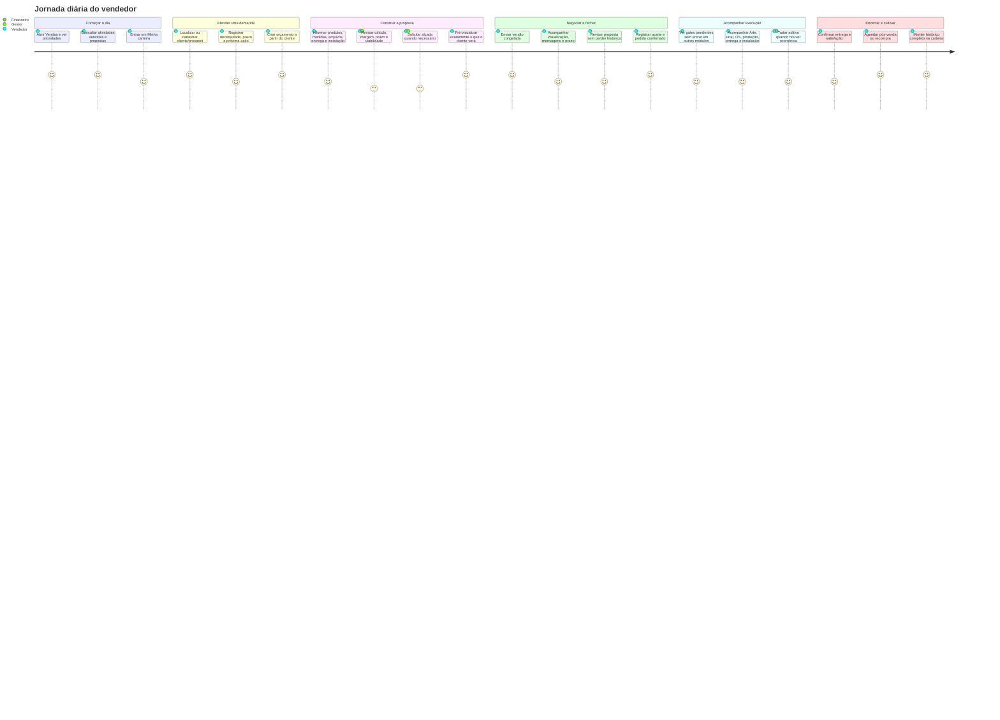

# RP — Módulo de Vendas

**Status:** requisitos de produto e plano arquitetural — implementação **não iniciada**  
**Revisão:** 2026-07-31 — Fase 0 executada; inventário confrontado com o código real  
**Estado real do repositório:** o inventário da §4 descreve a intenção de produto. A
auditoria de código em [`fase-0/01-auditoria-estado-real.md`](./fase-0/01-auditoria-estado-real.md)
descreve o que existe de fato e **prevalece em caso de divergência**. Ela encontrou
dez dívidas não previstas, três bloqueadoras.
**RP significa:** Requisitos de Produto  
**Nome na interface:** Vendas  
**Domínio interno:** Comercial / Vendas  
**Objetivo:** dar casa própria ao ciclo comercial (preço ao cliente, proposta, negociação, aditivos e handoff limpo), sem misturar o vendedor de equipe na área financeira nem reinventar OS Aditiva / pós-cálculo.
**Execução por fases:** [`PLANO-ACAO-MODULO-VENDAS.md`](./PLANO-ACAO-MODULO-VENDAS.md)

## Veredito executivo da revisão

O direcionamento arquitetural está **correto**, mas o escopo originalmente descrito
não representa, sozinho, um módulo de Vendas completo para um ERP de comunicação
visual. Ele entrega um bom **MVP de centralização comercial** sobre ativos já
existentes — orçamento, cliente, chat, aprovação, cobrança e OS Aditiva — porém
ainda deixa lacunas relevantes entre a entrada da demanda e a entrega do pedido.

### Classificação objetiva

| Dimensão | Veredito | Observação |
|----------|----------|------------|
| Separação Vendas × Financeiro × Operação | **Adequada** | Preserva menor privilégio e evita transformar o vendedor em operador financeiro |
| Precificação técnica para comunicação visual | **Forte** | O repositório já cobre materiais, máquinas, mão de obra, geometria, DXF, terceirização, entrega e instalação |
| Proposta, link e negociação | **Boa, com consolidação pendente** | Há versões, links e chats paralelos; falta definir o contrato canônico |
| Pipeline comercial | **Insuficiente para gestão** | Os status atuais misturam proposta e execução e não registram etapas, probabilidade, motivo de perda ou próxima ação |
| Conversão orçamento → pedido | **Parcial** | A aprovação cria OS/cobrança, mas falta um conceito comercial explícito de pedido confirmado e seus gates |
| Aprovação de arte/prova | **Existe em outro domínio, mas não está no handoff comercial** | Para comunicação visual, aprovação de preço e aprovação de arte são eventos independentes e ambas precisam ser rastreáveis |
| CRM e follow-up | **Insuficiente** | Cliente cadastrado não substitui lead/oportunidade, contatos, atividades e histórico de relacionamento |
| Governança de desconto e margem | **Insuficiente** | Há cálculo, mas não há alçada comercial formal, justificativa e aprovação de exceção |
| Gestão por indicadores | **Insuficiente** | Contagens de orçamento não cobrem conversão, ciclo, perdas, carteira, previsão e desempenho |
| Aderência total ao mercado | **Não, nesta versão do escopo** | Atende o núcleo de cotação; exige P0/P1 adicionais abaixo para operação comercial completa |

**Decisão desta revisão:** manter o MVP enxuto, mas não declarar o módulo “completo”
até concluir o **Mínimo Operacional Seguro** e o **Núcleo Competitivo** definidos
na seção 14. CRM avançado, automação sofisticada e BI preditivo continuam evoluções;
captura de demanda, follow-up, pedido confirmado, aprovação de arte e governança de
desconto não podem permanecer todos como P3.

**Referências obrigatórias (inventário e fronteiras):**

- `docs/modulo instalacao/13-plano-split-financeiro-os-aditiva.md`
- `docs/modulo instalacao/14-analise-contexto-fase5-split-financeiro.md`
- `docs/modulo instalacao/12-decisoes-produto-instalacao-comunikapp.md` (DEC-17)
- `docs/modulo financeiro/radar-home-financeiro.md`
- `docs/modulo financeiro/feature-financeiro-previsto-real.md`
- `docs/modulo-os-melhorias/DIAGNOSTICO-MODULO-OS.md`
- `docs/modulo-aprovacao-orcamento.md`
- `docs/fase-0-home-operacional/07-permissoes-home.md`
- `docs/database/boas-praticas-schema-prisma.md`
- Estilo de RP: `docs/modulo de compras/RP-mvp-compras-suprimentos.md`

---

## 0. Decisões fechadas do product owner (não negociar neste RP)

1. **Hoje não existe módulo de Vendas.** Orçamento existe; o vendedor acaba misturado com Financeiro/OS — dor de UX em equipes.
2. **Vendedor solo** continua podendo fazer tudo (modo “dona da loja”).
3. **Em equipe**, o vendedor **não** deve “entrar na área financeira da empresa” para precificar, gerar aditivo ou tratar preço ao cliente.
4. **OS Aditivas já funcionam e estão corretas.** **Não recriar.** Apenas referenciar e encaixar no fluxo de Vendas (UX + ownership + RBAC).
5. **Custos / valores / pós-cálculo / aba Financeiro na OS: não mexer agora.** Este RP **absorve** as melhorias de fronteira comercial para implementação futura (épicos marcados).
6. Premissa de mercado:
   - **Vendas** = preço e relação comercial;
   - **Financeiro** = cobrar / conciliar / fechar;
   - **OS / PCP / campo** = fatos **sem R$** na superfície operacional.

---

## 1. Visão do produto

Vendas é o módulo em que a loja **propõe, negocia e fecha preço com o cliente**, e acompanha o pipeline comercial até o handoff para operação e financeiro.

Não é:

- um segundo orçamento;
- um segundo financeiro;
- um segundo módulo de OS Aditiva;
- o lugar do previsto × real (pós-cálculo).

É a **casa do comercial**: listagens, filas e ações que hoje estão espalhadas em Orçamentos (sidebar solto), Instalação (gestão + precificação misturada), Financeiro (recebimentos + card de relatório técnico) e OS (aba Financeiro).

---

## 2. Problemas que o MVP resolve

1. Equipe comercial não encontra um hub “Vendas” — só “Orçamentos” e atalhos misturados.
2. Em equipe, precificar ocorrência / gerar caminho comercial de aditivo exige perfil `FINANCEIRO` e UI embutida em superfícies financeiras (`FinanceiroPermissionsGuard`, card em `InstalacaoRelatorioTecnicoCard`).
3. Vendedor de equipe vê (ou é empurrado para) contas a receber, pós-cálculo e fechamento — fora do job.
4. Ownership comercial (pipeline, responsável, follow-up de proposta) não tem home nem badges próprios.
5. Fronteira conceitual “preço ao cliente vs cobrar” não está explícita na navegação nem no RBAC.

**Fora do MVP (só documentado):** reescrever motor de cálculo, recriar OS Aditiva, alterar pós-cálculo/aba Financeiro da OS, comissionamento avançado, CRM avançado, NF-e. O **CRM operacional mínimo** (origem, responsável, próxima ação, motivo de perda e histórico) deixa de ser classificado como CRM completo e passa a ser P1.

---

## 3. Princípios fechados

1. **Reutilizar** `orcamentos-v2`, `cliente`, chat/links públicos e **OS Aditiva** — não duplicar entidades.
2. **Não recriar** `OrcamentoAditivoInstalacao`, `InstalacaoSplitFinanceiroService.gerarOsAditiva`, nem o fluxo pai→filha já entregue.
3. Vendas **absorve UX/ownership** do caminho comercial; Financeiro permanece dono de cobrança/recebimento/conciliação/fechamento.
4. Campo (instalador) continua **sem R$** (já enforced no backend de instalação).
5. Solo = união de papéis na mesma pessoa; equipe = menor privilégio por `usuario_funcao` + perfis.
6. Handoffs são explícitos: Vendas → OS/PCP (fato operacional) e Vendas → Financeiro (obrigação de receber).
7. Toda consulta/mutação permanece multi-tenant (`loja_id` do token).
8. Migrations futuras, se necessárias, são **aditivas**; sem tabelas especulativas neste RP.
9. Navegação segue o padrão Module Nav (`frontend/src/lib/module-nav/` + `MODULE_NAV_REGISTRY`).
10. Textos ao usuário em pt-BR; erros públicos estáveis, sem vazamento de segredo.
11. **Orçamento, pedido, OS e cobrança são fatos distintos:** proposta não aprovada
    não é pedido; pedido confirmado não é execução; OS não é documento comercial;
    cobrança não é autorização de produção.
12. **Aprovação comercial e aprovação de arte são independentes.** Produção só
    recebe uma especificação congelada quando os gates aplicáveis estiverem
    satisfeitos.
13. Toda transição sensível é idempotente, auditável e protegida por versão;
    notificações, geração de OS e cobrança não podem duplicar efeito.

---

## 4. Inventário do que já existe (reaproveitar)

### 4.1 Orçamentos V2 (núcleo comercial já pronto)

| Ativo | Path / artefato | Uso em Vendas |
|-------|-----------------|---------------|
| Lista + CRUD | `frontend/src/app/(main)/orcamentos-v2/` | Seção principal do hub Vendas |
| Formulário | `frontend/src/components/ui/orcamentos-v2/orcamento-v2-form.tsx` | Sem reescrita |
| Backend módulo | `backend/src/orcamentos-v2/` | Fonte autoritativa |
| Status | `backend/src/orcamentos-v2/enums/orcamento-status.enum.ts` (`rascunho` … `cancelado`) | Pipeline comercial |
| Motor / cálculo | `backend/src/motor-calculo-v2/`, `calculo-v2.controller.ts` | Precificação da proposta |
| Simulador | `frontend/src/app/(main)/orcamentos-v2/simulador/`, `SimuladorPrecificacao.tsx` | Ferramenta do vendedor |
| Links públicos | `links-v2.controller.ts` / `links-v2.service.ts` | Envio ao cliente |
| Página pública | `frontend/src/app/orcamento-v2/[id]/page.tsx` + API routes `frontend/src/app/api/orcamentos-v2/` | Aprovação/negociação externa |
| Chat V2 | `chat-v2.controller.ts` / `chat-v2.service.ts` | Negociação no orçamento |
| Mensagens (legado paralelo) | `backend/src/mensagens-negociacao/` | Unificar/apontar no hub; não criar terceiro chat |
| Responsável | `orcamento.responsavel_id` (Prisma) | Ownership do vendedor |
| Comissão padrão loja | `loja.comissao_padrao` | Input de preço (já no form) |
| Module nav atual | `frontend/src/lib/module-nav/operacionais.ts` → `orcamentosModuleNav` | Migrar para dentro de `vendasModuleNav` |
| Sidebar | `frontend/src/lib/sidebar-menu.tsx` (`/orcamentos-v2`) | Substituir item por **Vendas** (ou agrupar) |

### 4.2 OS Aditiva / split (reutilizar — não recriar)

| Ativo | Path / artefato | Nota |
|-------|-----------------|------|
| Modelo vínculo | `OrcamentoAditivoInstalacao` em `backend/prisma/schema.prisma` | OS pai + OS filha + orçamento sintético + snapshot |
| OS pai/filha | `OrdemServico.os_pai_id`, `tipo_vinculo_os` (`PRINCIPAL` \| `ADITIVA_INSTALACAO`) | Já na listagem OS |
| Ocorrências | `OcorrenciaInstalacao` + `StatusFinanceiroOcorrencia` | Fato de campo → precificação |
| Taxas sugestão | `TaxaOcorrenciaLoja` + seeder | Baseline de custo/preço |
| Serviço split | `backend/src/instalacao/services/instalacao-split-financeiro.service.ts` | `precificarOcorrencia`, `gerarOsAditiva`, fila |
| APIs | `instalacao.controller.ts`: `fila-precificacao`, `precificar`, `abonar`, `gerar-os-aditiva`, `os-aditivas` | Backend pronto |
| Proxies Next | `frontend/src/app/api/instalacao/ocorrencias/…`, `…/gerar-os-aditiva` | Reaproveitar |
| UI precificar | `PrecificarOcorrenciaDialog.tsx` | **Casa atual errada para equipe** (ver §4.3) |
| Fila grid | `InstalacaoOcorrenciasFilaGrid.tsx` | Existe; **ainda não plugada** na home de instalação |
| Card relatório / aditiva | `frontend/src/components/financeiro/InstalacaoRelatorioTecnicoCard.tsx` | Usado em Instalação **e** Recebimentos |
| Grid OS aditivas | `frontend/src/lib/os-grid-aditiva.utils.ts`, colunas em `os/columns.tsx` | Só leitura/contexto no comercial |
| Flag loja | `configuracao_instalacao_loja.os_aditiva_habilitada` | Config operacional, não recriar |
| Spec produto | `docs/modulo instalacao/13-plano-split-financeiro-os-aditiva.md` | Fonte do fluxo; implementação já avançou além do doc 14 |

**Decisão de produto:** o **motor** de OS Aditiva permanece no domínio Instalação/OS. Vendas passa a ser a **superfície comercial** (fila de precificação ao cliente + disparo “gerar aditivo comercial”), sem segundo gerador.

### 4.3 Onde a fronteira está “errada” hoje (inventário de misplacement)

| Comportamento | Onde mora hoje | Problema | Destino conceitual (Vendas) |
|---------------|----------------|----------|-----------------------------|
| Precificar ocorrência (`preco_cliente`) | Guard `FinanceiroPermissionsGuard` (`ADMINISTRADOR`, `FINANCEIRO`) em `instalacao.controller.ts` | Vendedor de equipe **não** pode precificar; quem precifica é “financeiro” | Ação comercial em Vendas (+ ADMIN); Financeiro só exceção/auditoria |
| Gerar OS Aditiva | Mesmo guard financeiro | Aditivo comercial tratado como ato financeiro | Ação comercial em Vendas; Financeiro recebe cobrança gerada |
| UI de precificação + gerar aditiva | `InstalacaoRelatorioTecnicoCard` sob `components/financeiro/`, embutido em workspace de instalação **e** `/financeiro/recebimentos` | Vendedor é empurrado ao financeiro / OS de instalação | Hub Vendas → “Aditivos / ocorrências a precificar” |
| Fila transversal | Componente pronto, rota API pronta; **não** há aba “Pendências” na page `/instalacao` | Spec doc 13 não refletida na home de instalação | Preferir sob Vendas; Instalação fica operacional |
| Aba “Financeiro” na OS | `frontend/src/app/(main)/os/[id]/page.tsx` + `OsPosCalculoPanel` | Mistura custo interno / fechamento com olhar comercial | **Não mexer agora**; futuro: comercial vê só “preço/aditivos” em Vendas |
| Pós-cálculo | `/financeiro/pos-calculo` + painel na OS | É margem real / fechamento — correto no Financeiro | Permanecer Financeiro |
| Contas a receber | `/financeiro/recebimentos` | Correto no Financeiro | Vendas só atalho “status da cobrança” (read-only) pós-aprovação |

### 4.4 Cobranças / Financeiro (handoff, não casa do vendedor)

| Ativo | Path | Relação com Vendas |
|-------|------|--------------------|
| `Cobranca` 1:1 orçamento | `schema.prisma` `Cobranca` | Criada na aprovação — Financeiro opera |
| Home financeiro | `/financeiro`, `financeiroModuleNav` | Fora do menu do vendedor de equipe |
| Contas a receber | `/financeiro/recebimentos` | Handoff após preço fechado |
| Pós-cálculo | `/financeiro/pos-calculo`, `feature-financeiro-previsto-real.md` | **Fora** de Vendas |
| Travas comerciais PCP | `docs/modulo instalacao/03-relatorio-fase-2-…`, serviços `pcp-bloqueio-sinal` | Operação; Vendas não reabre |

Sidebar já esconde Financeiro para quem não é `ADMINISTRADOR`/`FINANCEIRO` (`frontend/src/app/(main)/layout.tsx` → `podeVerFinanceiro`).

### 4.5 Clientes, papéis e RBAC

| Ativo | Situação |
|-------|----------|
| CRUD clientes | `frontend/src/app/(main)/clientes/`, `clientesModuleNav` — **absorver como seção de Vendas**; manter a rota `/clientes` no primeiro ciclo apenas por compatibilidade |
| Enum função | `usuario_funcao`: `ADMINISTRADOR`, `FINANCEIRO`, `PRODUCAO`, `VENDAS`, `ESTOQUE` — **não há** `COMERCIAL`/`VENDEDOR` no enum Prisma; “Comercial” aparece só em docs de home (`07-permissoes-home.md`) |
| Label UI | `VENDAS` → “Vendas” (`admin-labels.ts`) |
| Instalação gestão | `InstalacaoGestaoPermissionsGuard`: `ADMINISTRADOR`, `FINANCEIRO`, `VENDAS` — VENDAS **vê** gestão, mas **não** precifica (guard financeiro) |
| OS | `OSPermissionsGuard`: `VENDAS` → `VISUALIZAR`, `CRIAR` |
| Orçamentos controller | `@Roles(UserRole.… VENDEDOR)` — nomenclatura **paralela** ao enum Prisma; alinhar na implementação do módulo |
| Perfis granulares | `perfil_permissao` existe e funciona (padrão de Compras), mas **não há seed de perfis nem catálogo central de permissões**, e as permissões `orcamentos.*` declaradas em `@Roles` não são verificadas por nenhum guard. Ver D-01 e `fase-0/03-nomenclatura-e-matriz-rbac.md` |

**Decisão de produto — Clientes e carteira:** Clientes deixa de ser apresentado
como módulo global independente na sidebar e passa a ser uma seção central de
Vendas. Essa mudança é de **navegação e ownership funcional**, não de propriedade
dos dados: o cliente continua pertencendo à loja e permanece disponível,
contextualmente e por permissão, para Financeiro, OS, Arte, Expedição e Instalação.

### 4.6 Navegação e homes

| Ativo | Path | Gap |
|-------|------|-----|
| Registry | `frontend/src/lib/module-nav/registry.ts` | Sem `vendas` |
| Orçamentos / clientes / OS / instalação | `operacionais.ts` | Módulos soltos na sidebar |
| Regra Module Nav | `.cursor/rules/module-nav-shell.mdc` | Novo módulo deve nascer com `vendasModuleNav` + home + `ModuleLayoutShell` |
| Home operacional / permissões | `docs/fase-0-home-operacional/07-permissoes-home.md` | Perfil “Comercial” proposto — mapear para função `VENDAS` + permissões |

### 4.7 OS e diagnóstico (contexto, sem alterar agora)

Do `DIAGNOSTICO-MODULO-OS.md`: OS aditiva de instalação e pós-cálculo já estão sólidos; faturamento NF não é do módulo OS. Vendas **não** assume faturamento fiscal; só preço e aditivo comercial.

### 4.8 Capacidades comerciais já existentes, mas sub-representadas no RP original

| Capacidade existente | Evidência no repositório | Decisão para Vendas |
|----------------------|--------------------------|---------------------|
| Produtos sob medida e de prateleira | `ProdutoOrcamento`, `produto_finito_id`, `modo_fulfillment` | Expor como força do módulo; não criar “pedido rápido” paralelo |
| Geometria, imagem, PDF e DXF | `QuickGeometryInput`, `anexo-geometria`, parser/sugestão DXF | Manter revisão humana da geometria antes do preço |
| Terceirização | Campos `fornecedor_terceirizado_*` e custos previstos | Mostrar prazo/custo previsto no risco comercial e no handoff de Compras |
| Entrega e instalação estruturadas | Campos de modalidade, endereço, prazo, executor e distribuição | Validar viabilidade antes do envio e congelar snapshot na aprovação |
| Condição de pagamento estruturada | `condicao_pagamento_*` + `Cobranca`/parcelas | Vendas negocia termos; Financeiro recebe e concilia |
| Versões, histórico e auditoria | `OrcamentoHistorico`, `VersaoOrcamento`, `OrcamentoLog` | Definir qual versão foi enviada e qual foi aceita |
| Aprovação de arte | `ArteVersao`, `ArteComentario`, `ArteLinkAprovacao`, `ArteMensagem` | Integrar como gate separado, sem mover o domínio Arte para Vendas |
| Origem de sobra/retalho | `orcamento-origem-sobra.service.ts` | Preservar rastreabilidade e margem ao reutilizar material |

### 4.9 Dívidas encontradas que viram gates de implementação

1. O controller principal de Orçamentos V2 ainda possui `@Body() dados: any`,
   em desacordo com `AGENTS.md`; o módulo Vendas não pode ampliar esse contrato sem
   DTO tipado e validação.
2. Existem nomenclaturas paralelas de autorização (`UserRole.VENDEDOR`,
   `usuario_funcao.VENDAS` e permissões textuais `orcamentos.*`). Antes de criar
   `vendas.*`, deve existir uma matriz canônica e testes de negação.
3. Há mais de um caminho de chat/negociação (`MensagemChat`,
   `mensagemnegociacao` e métodos “legado” no service). É obrigatório eleger um
   contrato canônico, migrar/compatibilizar o histórico e impedir um terceiro fluxo.
4. Os status de orçamento atuais (`rascunho`, `em_analise`, `aprovado`,
   `rejeitado`, `em_execucao`, `concluido`, `cancelado`) não modelam adequadamente
   envio, negociação, expiração e perda; também misturam comercial com execução.
5. Campos estruturados convivem com legados/JSON serializado em texto. Novos dados
   comerciais devem usar tipos/relacionamentos coerentes, `Json` nativo quando
   estruturados e migrations aditivas; não ampliar a dívida.
6. `OrcamentosV2Service` concentra múltiplas responsabilidades e excede amplamente
   o limite de manutenção documentado (4.072 linhas, 47 métodos). Evoluções de
   Vendas devem usar facades e serviços de domínio menores, sem refactor expansivo
   ou quebra dos contratos atuais.

### 4.10 Dívidas descobertas na auditoria da Fase 0 (não previstas acima)

Detalhamento com evidência de arquivo e linha em
[`fase-0/01-auditoria-estado-real.md`](./fase-0/01-auditoria-estado-real.md).

| # | Dívida | Severidade | Decisão associada |
|---|--------|-----------|-------------------|
| D-01 | **Não existe `RolesGuard`.** `@Roles(...)` é metadata inerte; qualquer usuário autenticado da loja opera todo o Orçamentos V2, inclusive fechar pedido. A autenticação, essa sim, é sólida via `JwtGlobalMiddleware` | P0 segurança | DV-13 |
| D-02 | IDOR em `links-v2.service.ts` (resolve orçamento sem `loja_id`) e duas listas divergentes de rota pública (`@Public()` × allowlist do middleware) | P1 segurança | DV-13 |
| D-03 | A máquina de estados existe em `validacao-v2.service.ts` mas `alterarStatus` não a chama e aceita qualquer string | P0 | DV-14 |
| D-04 | Três vocabulários de status coexistem; `pendente`, `enviado` e `negociando` são gravados sem existir no enum | P0 | DV-14 |
| D-05 | Quatro tabelas de histórico/versão; três nunca recebem registro | P0 | DV-15 |
| D-06 | `cliente` não tem responsável comercial, participantes, contatos nem histórico de transferência | P0 | DV-11 |
| D-07 | `validade_proposta` é texto livre; não existem `enviado_em`, `expira_em` nem `aceito_em` | P0 | DV-07 |
| D-08 | Aprovação sem transação; idempotência por consulta prévia com corrida; aceite sem evidência; `codigo_aprovacao` com `Math.random()` e impresso em `console.log` | P0 | DV-01 |
| D-09 | `notificacao` é endereçada à loja, não ao usuário | P1 | DV-08 |
| D-10 | `AlcadasOrcamentoService` já ocupa o nome "alçadas", com funções hardcoded inexistentes no enum | P1 | DV-04 |

Consequência de escopo: a Fase 2 deixa de ser "declarar permissões" e passa a ser
"construir o mecanismo de autorização"; a Fase 4 deixa de ser absorção de Clientes e
passa a ser construção de carteira; a Fase 6 precisa religar a máquina de estados
antes de ampliá-la.

---

## 5. Premissas necessárias para o módulo funcionar

### 5.1 Personas

| Persona | Job to be done | Vê R$ ao cliente? | Entra em Financeiro? |
|---------|----------------|-------------------|----------------------|
| **Vendedor (equipe)** | Propor, negociar, acompanhar pipeline, precificar aditivos comerciais | Sim (preço de venda) | Não |
| **Vendedor solo / dono** | Tudo acima + cobrança + operação | Sim | Sim (mesma pessoa, papéis unidos) |
| **Financeiro** | Cobrar, conciliar, fechar, pós-cálculo, abono excepcional | Sim (caixa / custo) | Sim (casa) |
| **Operação (PCP/produção)** | Executar OS sem negociar preço | Não na superfície de chão | Não |
| **Instalador (campo)** | Registrar ocorrência sem valores | Não | Não |
| **Administrador** | Configurar, bypass consciente, auditoria | Sim | Sim |

### 5.2 Ownership

- Cada orçamento tem **responsável comercial** (`responsavel_id`).
- Pipeline e filas de Vendas filtram por responsável (com visão “loja” para gestores/admin).
- OS Aditiva gerada a partir de ocorrências precificadas **pertence** ao ciclo comercial da OS pai (cliente/contrato), mas a **execução** continua sem PCP/expedição quando flags `pular_*` já existentes aplicam.
- Cobrança gerada no aditivo **pertence** ao Financeiro após o handoff.

#### 5.2.1 Cliente da loja × carteira comercial

O cadastro de cliente é um **cadastro mestre da loja**. Um vendedor não é dono do
registro e não pode criar uma cópia privada do mesmo cliente. A carteira representa
a responsabilidade de relacionamento e atendimento.

```text
Cliente da loja
├── responsável comercial principal
├── vendedores participantes (quando aplicável)
├── contatos e papéis
├── oportunidades e atividades
├── orçamentos e versões
├── pedidos confirmados e OS
├── aditivos comerciais
├── situação financeira resumida, conforme permissão
└── histórico de relacionamento
```

Regras:

1. Todo cliente pertence ao `loja_id` derivado da identidade autenticada.
2. O responsável principal organiza a carteira, mas não altera a propriedade do
   cliente nem restringe integrações legítimas de outros domínios.
3. Um gestor pode transferir a responsabilidade comercial; a transferência registra
   origem, destino, autor, data e motivo.
4. Vendedores participantes podem colaborar sem duplicar o cliente ou o histórico.
5. A saída/inativação de um vendedor exige redistribuição assistida da carteira;
   clientes não podem ficar inacessíveis ou ser excluídos em cascata.
6. Permissão de carteira é aplicada no backend. Filtro de frontend não é controle de
   autorização.
7. Orçamentos, atividades e negociações preservam o responsável histórico mesmo
   após transferência da carteira, salvo reassociação explícita e auditada.
8. A carteira não autoriza acesso a custo interno, conciliação ou demais dados
   financeiros protegidos.

#### 5.2.2 Visões de carteira

| Visão | Conteúdo | Acesso padrão |
|-------|----------|---------------|
| **Minha carteira** | Clientes cujo responsável principal é o usuário ou dos quais participa | Vendedor |
| **Minha equipe** | Carteiras dos vendedores sob gestão do usuário | Gestor de Vendas |
| **Todos os clientes** | Cadastro mestre completo da loja | Gestor/Admin ou permissão explícita |
| **Sem responsável** | Clientes/prospects que precisam de distribuição | Gestor/Admin |
| **Inativos/bloqueados** | Registros preservados, sem uso comercial normal | Permissão específica |

O vendedor entra por padrão em **Minha carteira**. Busca global de cliente já
existente pode retornar uma correspondência mínima para evitar duplicidade, sem
expor carteira, histórico ou dados não autorizados.

#### 5.2.3 Cadastro de cliente pelo vendedor

O vendedor pode cadastrar cliente ou prospect dentro de Vendas, conforme permissão.
Antes de criar, o backend deve procurar duplicidade **dentro da mesma loja** usando
dados normalizados:

- CPF/CNPJ, quando informado;
- e-mail;
- telefone/WhatsApp;
- combinação de razão social/nome e endereço como alerta, não bloqueio automático.

Se houver possível duplicidade, o sistema oferece vincular a demanda ao cliente
existente ou solicitar tratamento por usuário autorizado. Mesclagem de clientes é
operação administrativa auditada e deve preservar relacionamentos.

No cadastro inicial, registrar:

- cliente ou prospect;
- origem/canal;
- responsável comercial inicial;
- contato principal e papel;
- consentimentos aplicáveis ao canal;
- data da primeira interação;
- próxima ação, quando ainda não houver orçamento.

#### 5.2.4 Acesso contextual pelos demais módulos

Clientes não precisa permanecer como item global para que outros domínios consumam
o cadastro:

| Domínio | Acesso contextual permitido |
|---------|------------------------------|
| Financeiro | Identificação, contatos de cobrança e histórico financeiro autorizado |
| OS / PCP | Identificação e requisitos operacionais vinculados ao pedido |
| Arte | Solicitante, revisor e aprovador da prova |
| Expedição | Destinatário, contato e endereço de entrega |
| Instalação | Contato local, endereço e instruções de acesso |
| Administração | Cadastro mestre, deduplicação, bloqueio e transferência de carteira |

Cada domínio recebe somente os campos necessários à sua função. Nenhum consumidor
deve confiar em `cliente_id`, responsável ou carteira enviados pelo frontend sem
validar `loja_id` e permissão.

### 5.3 Handoffs explícitos

```text
[Cliente / lead]
      │
      ▼
[Vendas: orçamento + negociação + aprovação]
      │
      ├──────────────► [OS / Arte / PCP / Expedição / Instalação]  (fatos, sem UI de preço ao vendedor de equipe)
      │
      └──────────────► [Financeiro: cobrança / receber / conciliar]

[Campo: ocorrência sem R$]
      │
      ▼
[Vendas: precificar preço ao cliente]  ──(reusa split)──► [OS Aditiva] ──► [Financeiro: cobrança]
      │
      └─(opcional)──► [Financeiro: abonar / auditoria / pós-cálculo]
```

O handoff principal deve distinguir os seguintes marcos:

```text
Demanda/lead
  → oportunidade qualificada
  → orçamento em elaboração
  → proposta enviada (versão congelada)
  → negociação / revisão
  → aceite comercial
  → pedido confirmado
  → aprovação de arte/prova (quando aplicável)
  → liberação operacional
  → OS / PCP / Compras / Expedição / Instalação
  → entrega e aceite
  → pós-venda
```

O sistema pode implementar parte desses marcos como eventos e projeções, sem criar
uma tabela para cada caixa. A semântica, entretanto, deve ser preservada.

#### 5.3.1 Fluxo ponta a ponta — venda principal, execução e aditivos

```mermaid
flowchart TD
    A["Demanda recebida<br/>WhatsApp, telefone, e-mail, balcão ou indicação"] --> B["Vendas<br/>Identificar cliente/prospect, contato, origem, necessidade e prazo"]
    B --> C{"Demanda qualificada?"}
    C -- "Não" --> C1["Vendas<br/>Registrar motivo e próxima ação ou encerrar como perdida"]
    C -- "Sim" --> D["Vendas<br/>Criar orçamento e responsável comercial"]

    D --> E["Orçamento V2<br/>Produtos, medidas, geometria/DXF, materiais, máquinas, terceirização, entrega e instalação"]
    E --> F["Motor de cálculo<br/>Custo técnico, impostos, comissão, margem e preço sugerido"]
    F --> G{"Preço dentro da alçada?"}
    G -- "Não" --> G1["Gestor autorizado<br/>Aprovar ou rejeitar exceção de desconto/margem"]
    G1 -- "Rejeitada" --> F
    G1 -- "Aprovada" --> H
    G -- "Sim" --> H["Vendas<br/>Congelar versão e enviar proposta ao cliente"]

    H --> I{"Resposta do cliente"}
    I -- "Solicita alteração" --> I1["Vendas<br/>Registrar negociação e criar nova versão"]
    I1 --> E
    I -- "Rejeita ou expira" --> I2["Vendas<br/>Motivo de perda, follow-up ou revalidação"]
    I2 -. "Retomada" .-> D
    I -- "Aceita versão válida" --> J["Vendas<br/>Registrar aceite comercial e pedido confirmado"]

    J --> K["Financeiro<br/>Gerar cobrança e parcelas conforme condição negociada"]
    J --> L{"Quais gates se aplicam?"}
    K --> L
    L --> L1["Gate comercial<br/>Aceite válido"]
    L --> L2["Gate financeiro<br/>Sinal recebido, quando exigido"]
    L --> L3["Gate de Arte<br/>Prova/versão aprovada, quando aplicável"]
    L --> L4["Gate técnico<br/>Revisão da OS e materiais"]

    L1 --> M{"Todos os gates obrigatórios cumpridos?"}
    L2 --> M
    L3 --> M
    L4 --> M
    M -- "Não" --> M1["Fila de pendências<br/>Responsável, motivo, prazo e lembrete"]
    M1 --> M
    M -- "Sim" --> N["OS principal<br/>Snapshot do pedido, itens, materiais, arquivos e instruções"]

    N --> O["PCP / Compras / Estoque<br/>Reservar, comprar e produzir"]
    O --> P["Expedição / Instalação<br/>Entregar, instalar e registrar evidências"]
    P --> Q{"Execução sem ocorrência comercial?"}
    Q -- "Sim" --> R["Aceite de entrega/instalação<br/>Fechamento operacional"]
    R --> S["Financeiro<br/>Receber, conciliar e fechar"]
    S --> T["Pós-venda<br/>Satisfação, recompra e histórico do cliente"]

    Q -- "Não: surgiu extra ou imprevisto" --> U["Campo / Operação<br/>Registrar Ocorrência de Instalação sem R$"]
    U --> V["Vendas<br/>Fila de ocorrências a precificar"]
    V --> W{"Decisão comercial"}
    W -- "Abonar" --> W1["Financeiro/Admin<br/>Abono justificado e auditado"]
    W -- "Cobrar" --> X["Vendas<br/>Definir preço ao cliente e negociar o aditivo"]
    X --> Y{"Cliente aceita o aditivo?"}
    Y -- "Não" --> Y1["Vendas<br/>Renegociar, abonar ou encerrar com justificativa"]
    Y1 -. "Nova proposta" .-> X
    Y -- "Sim" --> Z["Serviço existente de split<br/>Gerar orçamento sintético + OS Aditiva"]

    Z --> ZA["OS Aditiva filha<br/>Vinculada à OS principal; não altera a grade original"]
    Z --> ZB["Financeiro<br/>Cobrança própria do aditivo"]
    ZA --> ZC["Sem PCP/estoque/expedição quando flags pular_* se aplicarem"]
    ZB --> S
    ZC --> R
    W1 --> R
```



#### 5.3.2 Leitura do fluxo por domínio

| Domínio | Começa quando | É dono de | Entrega para |
|---------|---------------|-----------|--------------|
| **Vendas** | A demanda entra | Qualificação, proposta, preço, negociação, versão aceita, pedido confirmado, follow-up e aditivo comercial | Arte, Financeiro e OS |
| **Arte** | O pedido exige prova visual | Versões de arte, comentários, solicitação de alteração e aceite da prova | Gate de liberação operacional |
| **Financeiro** | Há condição de pagamento ou aditivo aceito | Cobrança, parcelas, recebimento, conciliação, abono e fechamento | Sinal liberado e situação financeira |
| **OS** | O pedido está confirmado | Snapshot operacional do que foi vendido e rastreabilidade pai/filha | PCP, Expedição e Instalação |
| **PCP / Compras / Estoque** | Gates obrigatórios foram cumpridos | Viabilidade, materiais, suprimento, reserva, produção e consumo | Expedição/Instalação |
| **Instalação / campo** | O trabalho chega à execução externa | Lotes, agenda, evidências e ocorrências sem preço | Vendas, quando houver extra |

#### 5.3.3 Regras invariantes do caminho de aditivo

1. O instalador registra o **fato operacional**, nunca define preço.
2. A ocorrência não altera quantidade, item ou grade da OS principal.
3. Vendas decide o preço ao cliente e conduz o aceite do aditivo.
4. Financeiro/Admin decide abono excepcional conforme permissão; abono exige motivo.
5. O aditivo aceito reutiliza `InstalacaoSplitFinanceiroService` e gera uma
   **OS Aditiva filha**, sem segundo motor.
6. Uma ocorrência faturada não pode entrar em outra OS Aditiva.
7. A OS Aditiva referencia a OS pai, o orçamento sintético, a cobrança e o snapshot
   imutável das ocorrências.
8. As flags `pular_pcp`, `pular_expedicao` e `pular_validacao_estoque` determinam
   efeitos operacionais; não são decisão do frontend.
9. Novo material ou serviço que realmente exija produção não deve ser forçado pelo
   bypass. Nesse caso, o aditivo precisa seguir os gates e o caminho operacional
   compatíveis com o item vendido.
10. Repetição do comando de gerar aditivo deve retornar o resultado existente ou
    falhar de forma estável, nunca duplicar OS/cobrança.

### 5.4 O que NÃO entra no módulo Vendas

- Contas a pagar, conciliação bancária, fluxo de caixa.
- Pós-cálculo previsto × real e fechamento financeiro da OS.
- Apontamento PCP, kanban produção, expedição logística.
- Registro de ocorrência de campo (permanece Instalação/campo).
- Recriação de OS Aditiva / orçamento sintético.
- Emissão de NF-e/NFS-e (split fiscal permanece onde está).
- Alteração imediata da aba Financeiro da OS (dívida absorvida, implementação futura).

### 5.5 Premissas técnicas mínimas do MVP

1. Função `VENDAS` passa a ter permissões comerciais de precificação/aditivo **sem** abrir o módulo Financeiro na sidebar.
2. `ADMINISTRADOR` (e modo solo) mantém união de papéis.
3. Endpoints de precificar/gerar aditiva ganham política **comercial** (novo guard ou ampliação consciente) — sem mover a lógica de `InstalacaoSplitFinanceiroService`.
4. Module nav + item de sidebar **Vendas** agregam Orçamentos, Clientes, filas comerciais.
5. Feature flag / config de OS Aditiva por loja permanece; Vendas só consome.

---

## 6. Arquitetura de informação e mapa de telas

### 6.1 Sidebar

| Antes | Depois (MVP) |
|-------|----------------|
| Orçamentos → `/orcamentos-v2` | **Vendas** → `/vendas` (home do módulo) |
| Clientes → `/clientes` | Sai como item global; entra em Vendas. A rota `/clientes` pode permanecer no v1 como alias/compatibilidade dentro do shell de Vendas |
| Financeiro | Continua oculto para `VENDAS` (já é) |
| OS / Instalação / PCP… | Permanecem; vendedor de equipe usa só o necessário (leitura / criação OS já permitida) |

### 6.2 `vendasModuleNav` (proposto)

Home: `/vendas`

| id | Label | href sugerido | Origem |
|----|-------|---------------|--------|
| `visao-geral` | Visão geral | `/vendas` | Novo hub (cards + KPIs comerciais) |
| `minha-carteira` | Minha carteira | `/vendas/carteira` | Nova visão comercial sobre o cadastro mestre |
| `orcamentos` | Orçamentos | `/orcamentos-v2` (ou `/vendas/orcamentos` alias) | Existente |
| `novo-orcamento` | Novo orçamento | `/orcamentos-v2/novo` | Existente |
| `clientes` | Todos os clientes | `/clientes` (ou `/vendas/clientes` alias) | Existente; visibilidade por permissão |
| `negociacao` | Em negociação | `/vendas/negociacao` | Filtro/status + mensagens não lidas |
| `aditivos` | Aditivos / ocorrências | `/vendas/aditivos` | **Nova superfície** reusando fila + dialog + APIs de instalação |
| `simulador` | Simulador | `/orcamentos-v2/simulador` | Existente |
| `modelos` | Modelos (atalho) | `/produtos` | Existente; opcional no MVP |
| `atividades` | Minhas atividades | `/vendas/atividades` | P1: follow-ups, propostas vencendo e retornos |
| `pedidos` | Pedidos confirmados | `/vendas/pedidos` | P1: projeção comercial de orçamentos aceitos, sem duplicar OS |

### 6.3 O que cada papel vê

| Tela | Vendedor equipe | Financeiro | Operação |
|------|-----------------|------------|----------|
| Hub Vendas | Sim | Opcional (atalho) | Não |
| Orçamentos / chat / link | Sim | Leitura se necessário | Não |
| Aditivos a precificar | Sim (preço cliente) | Sim (auditoria/abono) | Não |
| Contas a receber | Não (só status resumido no card do orçamento) | Sim | Não |
| Pós-cálculo / aba Financeiro OS | Não (equipe) | Sim | Não |
| Agenda instalação / campo | Leitura gestão se já permitida | Sim | Sim (produção/campo) |
| Custo interno na precificação | Controlado pela permissão `vendas.preco.custo.ver`, **negada por padrão** para o vendedor de equipe. Ver DV-05 | Vê custo | Não |

### 6.4 Wireframe lógico do hub `/vendas`

1. **KPIs do MVP:** propostas enviadas, aguardando cliente, aprovadas no período, ocorrências pendentes de precificação e mensagens não lidas.
2. **Cards de recurso** (padrão Financeiro/Compras via `ModuleHubCards`).
3. **Fila curta:** “Precificar agora” (top N da fila de ocorrências).
4. **Atalhos:** Novo orçamento, Clientes, Simulador.

No P1, acrescentar conversão, ticket médio, ciclo médio, propostas expiradas,
motivos de perda e atividades vencidas. Valores e margens agregados exigem permissão
específica; contagem comercial não autoriza exposição de custo interno.

### 6.5 Jornada UX principal — vendedor de equipe

A experiência deve ser orientada por **próxima ação**, não pela arquitetura interna
do ERP. O vendedor não precisa decidir se determinada informação mora em Cliente,
Orçamento, Arte, OS ou Financeiro; Vendas apresenta o contexto e o leva à superfície
correta.



#### 6.5.1 Entrada no módulo — mesa de trabalho

Ao abrir `/vendas`, o vendedor encontra:

1. **Próxima ação recomendada**, destacando o item mais urgente e acionável.
2. **Minhas pendências:** atividades vencidas, retornos de hoje, propostas
   expirando, mensagens novas e aditivos aguardando ação.
3. **Pipeline resumido:** em elaboração, enviado, negociação, revisão, aceite e
   perdido, sempre limitado à carteira permitida.
4. **Minha carteira:** clientes recentes, sem contato e com oportunidade aberta.
5. **Pedidos em andamento:** visão resumida dos gates e da execução, sem expor
   superfícies financeiras ou operacionais indevidas.
6. Ações rápidas: **Novo atendimento**, **Novo cliente/prospect** e
   **Novo orçamento**.

Não mostrar gráficos sem ação correspondente. Todo alerta deve responder:
**o que aconteceu, em qual cliente/pedido, quem é o responsável, qual o prazo e
qual ação pode ser tomada agora**.

#### 6.5.2 Jornada detalhada por momento

| Momento | Objetivo do usuário | Tela/contexto | Ação principal | Feedback obrigatório |
|---------|---------------------|---------------|----------------|----------------------|
| Início do dia | Saber o que fazer primeiro | `/vendas` | Abrir próxima ação | Prioridade, prazo, cliente e responsável |
| Nova demanda | Não perder contato ou informação | Novo atendimento | Buscar cliente antes de cadastrar | Possíveis duplicidades e acesso permitido |
| Qualificação | Entender se vale orçar | Cliente/prospect | Registrar necessidade e próxima ação | Status comercial e pendência futura |
| Montagem | Formar preço correto rapidamente | Orçamento | Configurar produto/serviço | Custo permitido, preço, margem, alertas e viabilidade |
| Exceção | Conseguir autorização sem conversa paralela | Orçamento/alçada | Solicitar aprovação | Quem aprova, motivo e estado da solicitação |
| Revisão | Conferir a experiência do cliente | Preview da proposta | Validar e congelar versão | Versão, validade e campos visíveis ao cliente |
| Envio | Colocar a proposta nas mãos do cliente | Envio/compartilhamento | Enviar link | Canal, destinatário, expiração e confirmação |
| Negociação | Responder e revisar sem perder histórico | Timeline/chat | Responder ou criar revisão | Mensagens não lidas, versão vigente e próxima ação |
| Fechamento | Transformar aceite em compromisso real | Resumo do aceite | Confirmar pedido | Versão aceita, evidência e handoffs gerados |
| Handoff | Saber o que impede o início | Acompanhamento do pedido | Resolver pendência | Gates: aceite, sinal, arte e revisão técnica |
| Execução | Informar o cliente sem operar PCP | Timeline do pedido | Consultar andamento | Status legível e previsão, sem detalhes internos indevidos |
| Aditivo | Cobrar um extra de forma rastreável | Fila/detalhe do aditivo | Precificar e enviar | Ocorrência, evidência, preço, aceite e OS Aditiva |
| Pós-venda | Manter relacionamento e gerar recompra | Ficha do cliente | Agendar contato/recompra | Histórico consolidado e próxima ação |

#### 6.5.3 Nova demanda e cadastro sem atrito

O CTA **Novo atendimento** inicia uma jornada curta:

```text
1. Buscar por nome, CPF/CNPJ, telefone ou e-mail
2. Selecionar cliente existente ou criar prospect
3. Confirmar contato e papel
4. Registrar o que precisa, prazo desejado, origem e anexos
5. Escolher: criar orçamento agora ou agendar próxima ação
```

O sistema preserva o que já foi digitado caso encontre duplicidade ou o usuário
precise solicitar acesso/atribuição. Nunca obrigar cadastro completo para capturar
uma demanda inicial; dados fiscais e operacionais podem ser completados antes do
envio/aceite conforme necessidade.

#### 6.5.4 Ficha 360º do cliente

A ficha do cliente dentro de Vendas deve priorizar relacionamento:

- cabeçalho com nome, status, responsável, contatos e próxima ação;
- resumo da carteira: última interação, última compra e oportunidade aberta;
- abas ou seções: **Visão geral**, **Atividades**, **Orçamentos**, **Pedidos/OS**,
  **Aditivos**, **Arquivos** e **Histórico**;
- situação financeira apenas como resumo autorizado, por exemplo
  “sem pendência”, “há pendência” ou saldo, conforme permissão;
- ações persistentes: **Registrar atividade**, **Novo orçamento**,
  **Adicionar contato** e menu de ações permitidas.

O histórico deve ser uma timeline única de eventos relevantes, mas com filtros por
tipo para não misturar mensagens, mudanças cadastrais, propostas e execução em uma
lista ilegível.

#### 6.5.5 Experiência de criação da proposta

O formulário de orçamento deve usar progressão assistida, sem transformar cada
campo em uma etapa obrigatória:

```text
Cliente e necessidade
  → Itens/produtos e especificações
  → Entrega/instalação/terceirização
  → Preço, margem e condição comercial
  → Revisão e preview
  → Envio
```

Regras de UX:

- salvar rascunho automaticamente ou de forma previsível, exibindo estado de
  salvamento;
- manter resumo de preço e alertas visível durante a edição no desktop e acessível
  no mobile;
- diferenciar claramente **custo interno**, **preço sugerido** e **preço ao cliente**;
- explicar o bloqueio e oferecer a ação correta quando faltar dado, aprovação ou
  permissão;
- permitir duplicar estrutura de pedido anterior, mas recalcular custos e prazos;
- preview deve ser a fonte visual do que será enviado, sem informações internas.

#### 6.5.6 Negociação e versionamento

Na negociação, o vendedor vê numa única superfície:

- versão vigente e versões anteriores;
- data de envio, validade, destinatários e visualizações;
- chat/mensagens e anexos;
- próxima ação e responsável;
- ações **Responder**, **Criar revisão**, **Reenviar**, **Registrar aceite externo**
  conforme permissão e **Marcar como perdida**.

Ao criar revisão, o sistema mostra o que mudou em preço, escopo, quantidade, prazo,
entrega, instalação e pagamento. Versão substituída permanece consultável e é
identificada como não vigente.

#### 6.5.7 Pedido confirmado e acompanhamento

Depois do aceite, o vendedor não é redirecionado para Financeiro ou PCP. Ele chega
ao **Acompanhamento do pedido**, com uma linha do tempo comercial:

```text
Pedido confirmado
  → Sinal aguardando/confirmado
  → Arte aguardando/em revisão/aprovada
  → Revisão técnica
  → Produção
  → Expedição/instalação
  → Entregue
```

Cada etapa mostra linguagem compreensível ao comercial, previsão e eventual
pendência. Ações operacionais continuam nos módulos responsáveis e aparecem ao
vendedor somente quando ele possui permissão e há motivo real para intervir.

#### 6.5.8 Jornada do aditivo para o vendedor

1. O vendedor recebe em Vendas: **“A OS 123 possui uma ocorrência para decisão
   comercial”**.
2. Abre o detalhe com cliente, OS principal, descrição, quantidade, endereço,
   evidências e sugestão permitida.
3. Escolhe **Precificar**, **Solicitar informação** ou encaminha para
   **Abono**, conforme permissão.
4. Ao precificar, revisa preço, margem/limite e texto que o cliente receberá.
5. Envia proposta de aditivo e agenda follow-up automaticamente.
6. O aceite chama o mesmo serviço de split e exibe a OS Aditiva criada.
7. O acompanhamento mostra cobrança e situação da aditiva de forma resumida.
8. O vendedor retorna ao pedido principal sem perder o contexto.

Se o extra exigir nova produção/material, a interface informa que haverá gates
operacionais adicionais. Não apresentar `pular_pcp` ou outras flags técnicas ao
vendedor.

#### 6.5.9 Jornada do gestor de Vendas

O gestor usa a mesma estrutura, com escopo ampliado:

- alterna Minha carteira, Minha equipe, Todos e Sem responsável;
- redistribui clientes e atividades;
- vê propostas sem follow-up, ciclo, conversão e motivos de perda;
- aprova exceções de desconto/margem dentro da própria fila;
- identifica carga desigual, clientes sem responsável e oportunidades paradas;
- entra no detalhe sem assumir silenciosamente a responsabilidade do vendedor.

Toda ação de gestão deve indicar impacto, exigir confirmação quando sensível e
registrar auditoria.

#### 6.5.10 Estados e padrões obrigatórios

Cada tela da jornada cobre:

- **carregamento:** skeleton compatível com a visão;
- **vazio inicial:** explicação curta + CTA adequado;
- **sem resultado:** preservar filtros e permitir limpar;
- **erro recuperável:** mensagem em pt-BR + tentar novamente;
- **sem permissão:** não revelar dados; indicar ação possível sem confirmar a
  existência de recurso protegido;
- **conflito de versão:** mostrar que houve alteração, recarregar e preservar o que
  puder ser reaplicado com segurança;
- **sucesso:** confirmar o efeito real e oferecer a próxima ação;
- **offline/instabilidade:** nunca afirmar que proposta, aceite ou aditivo foi
  enviado/gerado sem confirmação do backend.

No mobile, a experiência prioriza carteira, atividades, mensagens e acompanhamento.
Edição técnica extensa de orçamento continua responsiva, mas pode recomendar desktop
sem bloquear tarefas urgentes.

---

## 7. Épicos / backlog priorizado

Legenda de origem:

- 🏠 **Casa certa** — nasce em Vendas
- 📦 **Migrar conceitualmente** — hoje mora em OS/Financeiro/Instalação; destino Vendas (sem implementar agora onde marcado)
- 🔗 **Handoff** — permanece no domínio atual; Vendas só referencia
- ⏸️ **Congelado** — explícito do PO: não alterar nesta fase de código OS/financeiro

### Épico E0 — Fundação do módulo (MVP)

| ID | Item | Prioridade | Origem |
|----|------|------------|--------|
| E0-1 | ✅ Criar `docs` + RP (este documento), plano de ação e artefatos da Fase 0 | P0 | 🏠 |
| E0-2 | `vendasModuleNav` + registry + home `/vendas` + layout shell | P0 | 🏠 |
| E0-3 | Sidebar: item Vendas; absorver entrada Orçamentos | P0 | 🏠 |
| E0-4 | Matriz RBAC `vendas.*` + mapear função `VENDAS` (sem abrir Financeiro) | P0 | 🏠 |
| E0-5 | Cards do hub apontando rotas existentes (orcamentos, clientes, simulador) | P0 | 🏠 |

### Épico E1 — Pipeline comercial (orçamento como coração)

| ID | Item | Prioridade | Origem |
|----|------|------------|--------|
| E1-1 | Visão “Em negociação” (filtros status + não lidas chat) | P0 | 🏠 sobre orçamentos-v2 |
| E1-2 | KPIs comerciais na home (contagens reais, sem mock) | P0 | 🏠 |
| E1-3 | Deep-link cliente → orçamentos (já parcial na ficha) | P1 | 🏠 |
| E1-4 | Unificar narrativa chat V2 × `mensagens-negociacao` na UX | P1 | 📦 docs/legado |
| E1-5 | Alinhar `@Roles(UserRole.VENDEDOR)` com `usuario_funcao.VENDAS` | P1 | 📦 dívida RBAC |
| E1-6 | Definir máquina de estados comercial sem misturar execução; incluir enviada, em negociação, revisão solicitada, expirada e perdida | P0 | 🏠 |
| E1-7 | Congelar e identificar a versão efetivamente enviada/aceita; revisão posterior invalida aceite anterior quando alterar preço, escopo, prazo ou condição | P0 | 🏠 |
| E1-8 | Expiração automática/assistida da proposta, revalidação de preço e lembretes configuráveis | P1 | 🏠 |
| E1-9 | Motivo de perda padronizado + observação; reabertura auditada | P1 | 🏠 |

### Épico E1A — Pedido confirmado e gates comerciais

| ID | Item | Prioridade | Origem |
|----|------|------------|--------|
| E1A-1 | Definir projeção/estado de **pedido confirmado** após aceite válido; não criar entidade duplicada sem necessidade | P0 | 🏠 |
| E1A-2 | Garantir idempotência do aceite: uma versão aceita gera no máximo uma cobrança e o conjunto esperado de OS/handoffs | P0 | 🔗 |
| E1A-3 | Matriz de gates: aceite comercial, sinal quando exigido, aprovação de arte e revisão técnica antes de liberar produção | P0 | 🔗 |
| E1A-4 | Cancelamento e alteração pós-aceite por fluxo formal (nova versão/aditivo), nunca edição silenciosa | P0 | 🏠 |
| E1A-5 | Aceite de entrega/instalação e pesquisa simples de satisfação como fechamento do ciclo | P2 | 🔗 |

### Épico E2 — Aditivos comerciais (reuso OS Aditiva)

| ID | Item | Prioridade | Origem |
|----|------|------------|--------|
| E2-1 | Tela `/vendas/aditivos` plugando `InstalacaoOcorrenciasFilaGrid` + `PrecificarOcorrenciaDialog` | P0 | 📦 hoje em financeiro/instalação |
| E2-2 | Política de permissão: `VENDAS` (+ ADMIN) pode precificar e gerar OS Aditiva; Financeiro mantém abono/auditoria | P0 | 📦 guard atual financeiro |
| E2-3 | Remover/relocar CTA comercial de `/financeiro/recebimentos` (deixar só status de cobrança) | P1 | 📦 misplacement |
| E2-4 | Atalho na OS/Instalação: “Abrir em Vendas” para precificar (não duplicar UI) | P1 | 🔗 |
| E2-5 | Badge sidebar Vendas com contador de pendências de precificação | P1 | 🏠 |
| E2-6 | Documentar contrato: gerar aditiva **não** reabre OS pai; usa serviço existente | P0 (doc) | 🔗 |

### Épico E3 — Handoff Financeiro (só ponte)

| ID | Item | Prioridade | Origem |
|----|------|------------|--------|
| E3-1 | No detalhe do orçamento/aditivo: card read-only “Situação da cobrança” (status, saldo) | P1 | 🔗 |
| E3-2 | CTA “Ir ao Financeiro” apenas se `podeVerFinanceiro` | P1 | 🔗 |
| E3-3 | Não incluir contas a pagar / pós-cálculo no hub Vendas | — | 🔗 |

### Épico E3A — Governança de preço, desconto e comissão

| ID | Item | Prioridade | Origem |
|----|------|------------|--------|
| E3A-1 | Política de desconto por item/total com limite por perfil e margem mínima | P0 | 🏠 |
| E3A-2 | Exceção abaixo da margem/limite exige justificativa e aprovação de alçada, com snapshot antes/depois | P0 | 🏠 |
| E3A-3 | Tabela/regra de preço por cliente, quantidade, vigência ou segmento sem sobrescrever custo técnico | P1 | 🏠 |
| E3A-4 | Comissão prevista por vendedor/equipe e regra de estorno/cancelamento; pagamento da comissão permanece fora do MVP | P2 | 🔗 |

### Épico E3B — CRM operacional mínimo

| ID | Item | Prioridade | Origem |
|----|------|------------|--------|
| E3B-1 | Captura padronizada da demanda: origem/canal, cliente ou prospect, contato, resumo, arquivos, prazo desejado e consentimentos aplicáveis | P1 | 🏠 |
| E3B-2 | Próxima ação obrigatória, responsável, data/hora, conclusão e lembrete; visão “minhas atividades” | P1 | 🏠 |
| E3B-3 | Empresa com múltiplos contatos e papéis (solicitante, aprovador, financeiro, entrega), mantendo endereços distintos | P1 | 🏠 |
| E3B-4 | Recompra/duplicação controlada a partir de pedido anterior, recalculando custos e validade | P1 | 🏠 |
| E3B-5 | Lead/oportunidade completo, forecast ponderado e metas por equipe | P2 | 🏠 |
| E3B-6 | Visões Minha carteira, Minha equipe, Todos e Sem responsável, com autorização no backend | P0 | 🏠 |
| E3B-7 | Responsável principal, participantes e transferência de carteira auditada | P0 | 🏠 |
| E3B-8 | Cadastro de cliente/prospect pelo vendedor com deduplicação normalizada por loja | P0 | 🏠 |
| E3B-9 | Acesso contextual de Financeiro, OS, Arte, Expedição e Instalação sem item global na sidebar | P0 | 🔗 |
| E3B-10 | Mesclagem administrativa de duplicados preservando histórico e relacionamentos | P1 | 🏠 |

### Épico E3C — Jornada e experiência operacional

| ID | Item | Prioridade | Origem |
|----|------|------------|--------|
| E3C-1 | Home de Vendas orientada por próxima ação, pendências e carteira, sem dashboard decorativo | P0 | 🏠 |
| E3C-2 | Fluxo Novo atendimento: buscar/deduplicar cliente, capturar demanda e criar orçamento ou atividade | P0 | 🏠 |
| E3C-3 | Ficha 360º comercial do cliente com timeline, contatos, atividades, propostas, pedidos e aditivos | P0 | 🏠 |
| E3C-4 | Progressão assistida do orçamento com resumo, alertas, preview fiel e estado de salvamento | P0 | 🏠 |
| E3C-5 | Superfície única de negociação com versão vigente, diff, mensagens, validade e próxima ação | P0 | 🏠 |
| E3C-6 | Acompanhamento comercial do pedido por gates, sem redirecionar vendedor para Financeiro/PCP | P0 | 🔗 |
| E3C-7 | Notificação acionável e jornada completa do aditivo dentro de Vendas | P0 | 📦 |
| E3C-8 | Visão do gestor para redistribuição, alçadas, carteira parada e desempenho da equipe | P1 | 🏠 |
| E3C-9 | Cobrir estados loading/vazio/erro/permissão/conflito/sucesso/offline em todas as jornadas | P0 | 🏠 |
| E3C-10 | Testes de usabilidade com vendedor solo, vendedor de equipe e gestor antes da liberação geral | P1 | 🏠 |

### Épico E4 — Fronteiras absorvidas (implementação futura — **não agora**)

Itens que o PO pediu para o RP **absorver**, sem tocar código de OS financeiro/custos nesta fase:

| ID | Item | Prioridade futura | Origem |
|----|------|-------------------|--------|
| E4-1 | Separar na OS a visão “comercial (preço/aditivos)” da aba “Financeiro (pós-cálculo/fechamento)” | P2 | ⏸️ / 📦 aba OS |
| ~~E4-2~~ | ~~Política de exposição de custo interno vs só preço ao cliente para perfil VENDAS~~ **Promovido para a Fase 2** como a permissão `vendas.preco.custo.ver`. Ver DV-05 | — | 🏠 |
| E4-3 | Precificação de ocorrência como etapa explícita do funil comercial (estados + SLA) | P2 | 📦 |
| E4-4 | Revisão de copy/guards que chamam de “financeiro” o ato de precificar preço ao cliente | P2 | 📦 |
| E4-5 | Solo vs equipe: preset de loja (“modo único usuário” libera união de menus) | P2 | 🏠 |
| E4-6 | Comissão avançada por vendedor/equipe (pagamento, estorno, campanhas e metas) | P2 | — |
| E4-7 | CRM avançado (forecast, metas, automações e segmentação); o CRM operacional mínimo está em E3B | P2 | — |

### Épico E5 — Fora de escopo permanente deste módulo

- Recriar OS Aditiva / `OrcamentoAditivoInstalacao`
- Motor de pós-cálculo / previsto × real
- NF-e, conciliação, fluxo de caixa
- Apontamento e capacidade PCP

---

## 8. Critérios de aceite — MVP de Vendas

### 8.1 Navegação e casa

1. Existe item **Vendas** na sidebar com home `/vendas` e seções via Module Nav.
2. Orçamentos e simulador são alcançáveis a partir do hub sem parecer módulos “órfãos”.
3. Função `VENDAS` **não** vê item Financeiro na sidebar (comportamento atual preservado).

### 8.2 Pipeline

4. Vendedor cria/edita/envia orçamento (fluxos atuais) e vê lista filtrável por status e responsável.
5. Link público + chat de negociação continuam funcionando (regressão zero).
6. Aprovação do orçamento segue gerando OS/cobrança como hoje (Vendas não quebra o handoff).

### 8.3 Aditivos (reuso, não recriação)

7. Em `/vendas/aditivos`, usuário `VENDAS` ou `ADMINISTRADOR` lista ocorrências pendentes (API existente).
8. Precifica com `PrecificarOcorrenciaDialog` (ou equivalente) chamando o mesmo backend de split.
9. Gera OS Aditiva pelo endpoint existente; **não** há segundo gerador.
10. Instalador continua sem ver valores.
11. Financeiro continua podendo abonar/auditar conforme regra acordada.

### 8.4 Fronteiras

12. Nenhuma alteração obrigatória na aba Financeiro da OS nem no pós-cálculo para fechar o MVP.
13. Documentação do módulo declara explicitamente: **não recriar OS Aditiva**.

### 8.5 Qualidade

14. Multi-tenant: todas as filas/mutações com `loja_id` do token.
15. Sem dados mockados nas listagens/KPIs.
16. UI alinhada a Module Header / dark-light / pt-BR.

### 8.6 Integridade comercial e gates

17. A versão aceita pelo cliente é identificável e imutável; alterações materiais
    criam revisão e exigem novo aceite.
18. Aprovação comercial, aprovação de arte, sinal e aprovação técnica são eventos
    distintos, com regra configurável de liberação operacional.
19. Repetir aceite, webhook, clique ou requisição não duplica OS, cobrança,
    notificação ou pedido.
20. Desconto/margem fora da alçada é negado no backend e exige aprovação auditada.
21. Proposta expirada não pode ser aceita silenciosamente; exige revalidação ou
    nova versão.
22. Cancelamento pós-aceite preserva histórico e trata efeitos já gerados por fluxo
    compensatório explícito.

### 8.7 Qualidade de listagens e UX

23. Toda listagem segue o template obrigatório e a referência canônica de
    `frontend/src/app/(main)/fornecedores/`.
    - No desktop, abre por padrão em **Tabela/Grid** via `DataTable`, com toggle para
      Cards.
    - No mobile, força **Cards** e oculta o toggle; tabela comprimida não é aceita.
    - A tabela usa `columns.tsx`, `@tanstack/react-table`, ordenação relevante e menu
      `DropdownMenu` + `MoreHorizontal`.
    - Cards usam componente dedicado em `frontend/src/components` e grid
      `grid grid-cols-1 gap-4 md:grid-cols-2 lg:grid-cols-3`.
    - Tabela e Cards expõem as mesmas ações e permissões sem duplicar regras.
    - Paginação local é desabilitada no `DataTable` quando a API já pagina no
      servidor.
    - Cabeçalho, ação primária, loading, vazio, erro, sem permissão, filtros,
      paginação e confirmações fazem parte da entrega.
24. KPIs e filas usam paginação/limites no backend, não fazem N+1 e não expõem custo
    interno sem permissão.
25. Datas de prazo/validade têm timezone explícito da loja; dinheiro usa `Decimal`
    e máscara/formatador BRL compartilhado.
26. Anexos e links públicos têm tipo/tamanho permitidos, armazenamento privado,
    expiração/revogação, autorização por tenant e proteção contra conteúdo malicioso.

### 8.8 Clientes e carteira

27. Clientes aparece dentro da navegação de Vendas e não como módulo global
    independente na sidebar.
28. O vendedor entra em **Minha carteira** e não recebe automaticamente a lista
    completa da loja.
29. Gestor autorizado alterna entre Minha carteira, Minha equipe, Todos e Sem
    responsável.
30. Cadastro pelo vendedor cria cliente/prospect da loja e atribui responsável
    inicial sem tornar o registro propriedade privada do usuário.
31. O backend verifica possíveis duplicidades por loja antes da criação e nunca
    revela dados de outro tenant.
32. Transferência de carteira é autorizada e auditada, preservando o histórico de
    responsáveis dos orçamentos e atividades já concluídos.
33. Financeiro, OS, Arte, Expedição e Instalação acessam o cliente pelo contexto do
    recurso e recebem somente os campos necessários.
34. Busca, paginação, filtros e contadores de carteira são processados no servidor;
    ausência de permissão não é resolvida apenas escondendo controles no frontend.

Matriz mínima de autorização:

| Ação | Vendedor | Gestor de Vendas | Admin/Financeiro |
|------|----------|------------------|-------------------|
| Ver própria carteira | Sim | Sim | Conforme função |
| Ver carteira da equipe | Não | Sim | Admin |
| Ver todos os clientes | Não por padrão | Sim | Conforme permissão |
| Criar cliente/prospect | Sim, se permitido | Sim | Configurável |
| Editar dados comerciais | Na própria carteira | Sim | Configurável |
| Transferir carteira | Não | Sim | Admin |
| Mesclar duplicados/inativar | Não | Configurável | Admin |
| Ver situação financeira resumida | Permissão específica | Permissão específica | Financeiro/Admin |
| Ver conciliação, custos e detalhes financeiros | Não | Não por padrão | Financeiro/Admin |

### 8.9 Jornada operacional

35. Ao entrar em Vendas, o usuário identifica sem navegação adicional suas
    pendências prioritárias, propostas aguardando ação e atividades do dia.
36. Uma nova demanda pode ser capturada e associada a cliente/prospect sem perder
    dados caso haja duplicidade, ausência de permissão ou cadastro incompleto.
37. A partir da ficha do cliente, Novo orçamento já herda cliente, contato,
    responsável e contexto permitido.
38. Antes do envio, o vendedor visualiza exatamente a proposta do cliente e confirma
    versão, validade, destinatário e canal.
39. Durante a negociação, versão vigente, mensagens e próxima ação permanecem na
    mesma superfície.
40. Após o aceite, o vendedor chega ao acompanhamento comercial do pedido e não ao
    módulo Financeiro ou PCP.
41. Gates pendentes apresentam responsável, motivo, prazo e ação possível, sem
    expor campos internos indevidos.
42. Ocorrência de instalação gera uma pendência acionável em Vendas; o vendedor
    consegue precificar, enviar, acompanhar aceite e retornar ao pedido principal.
43. Toda ação assíncrona confirma o resultado do backend antes de apresentar sucesso.
44. As jornadas críticas são utilizáveis por teclado, em mobile e desktop, e passam
    por teste com as três personas comerciais antes da liberação.

---

## 9. Riscos (solo vs equipe)

| Risco | Solo | Equipe | Mitigação |
|-------|------|--------|-----------|
| **Orçamentos V2 hoje sem camada de autorização** (`@Roles` inerte; qualquer usuário autenticado da loja fecha pedido) | Baixo (papéis unidos) | **Alto** | DV-13 + Fase 2; ver `fase-0/01-auditoria-estado-real.md` §§2–3 |
| **Aceite duplicado hoje não é impedido por constraint** (idempotência por consulta prévia, sem transação) | Médio | **Alto** | `pedido_comercial.orcamento_id @unique` na Fase 8 |
| Vendedor não consegue precificar aditivo | Baixo (usa ADMIN/FINANCEIRO) | **Alto hoje** (guard só financeiro) | E2-2: permissão comercial |
| Vendedor “invade” Financeiro | Aceitável | Indesejável | Manter sidebar; não embutir CTAs de receber no hub |
| Duplicar UI de precificação em 3 lugares | Confusão | Confusão | Uma casa em Vendas + atalhos |
| Esconder custo interno do comercial e ele precificar no escuro | — | Margem ruim | Decidir na E4-2 antes de endurecer UI |
| Migrar rotas de orçamento quebra bookmarks | Médio | Médio | Aliases / redirects no MVP |
| Confundir `UserRole.VENDEDOR` com `usuario_funcao.VENDAS` | Bugs de auth | Bugs de auth | E1-5 |
| Doc 14 desatualizado vs código de aditiva | Planejamento errado | Idem | Tratar código + schema como fonte; docs instalação como histórico |
| Implementar E4 junto com MVP | Escopo explode | Idem | Congelar E4 até PO liberar |
| Aceite duplicado gera OS/cobrança dupla | Médio | Alto | Idempotência, chave única e transação no handoff |
| Produzir arte/escopo não aprovado | Alto | Alto | Gates independentes e versão congelada |
| Proposta expirada aceita com custo antigo | Médio | Alto | Expiração + revalidação |
| Desconto corrói margem sem controle | Médio | Alto | Alçada e aprovação no backend |
| Follow-up depender da memória do vendedor | Médio | Alto | Próxima ação e atividades vencidas |
| Cliente aprova sem autoridade interna | Médio | Alto em B2B | Contatos/papéis + registro do aceite; assinatura eletrônica conforme política jurídica |
| Anexos/links públicos vazam dados entre lojas | Alto | Alto | Tenant, tokens revogáveis, storage privado e testes IDOR |

---

## 10. Sequência aprovada de implementação (quando autorizada)

> **Decisão DV-16.** Segurança e contratos precedem qualquer nova navegação. O
> hotfix crítico de DV-13 é um gate isolado e obrigatório; a sequência abaixo não
> pode ser reordenada por conveniência visual.

1. **Hotfix de segurança:** autorização efetiva, IDOR/rotas públicas, aceite
   transacional e idempotente, token seguro e remoção de segredo dos logs.
   O escopo e o gate verificável estão em
   [`fase-0/09-gate-hotfix-seguranca.md`](./fase-0/09-gate-hotfix-seguranca.md).
2. **Contratos e dados:** status comercial, versões, pedido confirmado, contatos,
   carteira e migrations aditivas/backfill em lotes.
3. **RBAC comercial:** permissões, alçadas e projeções mínimas sem custo detalhado.
4. **Nav + home de Vendas:** somente após os gates anteriores, com dados reais e
   consultas paginadas/indexadas.
5. **Máquina de estados, negociação, gates e handoffs idempotentes**.
6. **KPIs, fila de negociação e CRM operacional mínimo**.
7. **Governança de desconto/margem e integração com aprovação de arte**.
8. Só depois, com novo RP/delta: E4 (aba OS, custo vs preço, modo solo).

---

## 11. Checklist de não-objetivos (gate de PR futuro)

Antes de mergear qualquer PR rotulado “módulo Vendas”, o revisor confirma:

- [ ] Não criou segundo fluxo de OS Aditiva
- [ ] Não alterou pós-cálculo / fechamento financeiro da OS (salvo PR explícito do PO)
- [ ] Não abriu Contas a receber/pagar para função `VENDAS`
- [ ] Reusou `InstalacaoSplitFinanceiroService` / modelos Prisma existentes
- [ ] Module nav registrado em `registry.ts`
- [ ] Textos e erros em pt-BR
- [ ] Não misturou status comercial com status de execução
- [ ] Preservou versão enviada/aceita e invalidou aceite quando necessário
- [ ] Handoffs são transacionais/idempotentes e não duplicam OS/cobrança
- [ ] Aplicou alçada de desconto/margem no backend
- [ ] Cobriu tenant e revogação em links, anexos, chats e consultas por ID

---

## 12. Glossário rápido

| Termo | Significado neste RP |
|-------|----------------------|
| Preço ao cliente | Valor comercial cobrado / proposto |
| Custo interno | Custo operacional (domínio financeiro/gestão) |
| OS Aditiva | OS filha de cobrança comercial de ocorrências — **já implementada** |
| Handoff | Passagem de ownership entre módulos sem duplicar o fato |
| Solo | Um usuário acumula Vendas + Financeiro + Admin |
| Equipe | Separação rígida de superfícies por função |
| Proposta | Versão do orçamento formalmente enviada ao cliente |
| Pedido confirmado | Compromisso comercial aceito; projeção/evento que antecede a execução |
| Gate | Condição obrigatória para avançar, como aceite, sinal, arte ou revisão técnica |
| Atividade comercial | Próxima ação agendada do vendedor, com responsável e prazo |
| Perda | Encerramento comercial sem venda, com motivo estruturado |

---

## 13. Benchmark de mercado e implicações

Esta revisão usou referências oficiais de ERP horizontal e de plataformas voltadas
a gráficas/comunicação visual. O objetivo não é copiar produtos, mas identificar
capacidades recorrentes do mercado.

| Prática recorrente | Evidência de mercado | Implicação para o ComunikApp |
|--------------------|----------------------|------------------------------|
| Lead/oportunidade antes da proposta e marcação de ganho/perda | Odoo conecta oportunidade, proposta e pedido e mantém o funil comercial | CRM operacional mínimo não deve ficar em P3 |
| Proposta confirmada vira pedido | Odoo distingue quotation de sales order | Não usar OS como sinônimo de pedido |
| Assinatura/aceite e pagamento online configuráveis | Odoo suporta confirmação por assinatura e pagamento | Tratar aceite, sinal e produção como gates configuráveis |
| Regras de preço, quantidade, vigência, desconto e margem | Odoo usa listas e fórmulas de preço | Formalizar governança de preço e alçadas |
| Aprovação de orçamento separada da aprovação de arte | Printavo permite aprovações distintas e automações por evento | Integrar domínio Arte ao ciclo sem fundi-lo com orçamento |
| Provas versionadas com comentário e solicitação de alteração | shopVOX registra revisões, visualizações, comentários e aprovação | Versão enviada/aceita deve ser inequívoca |
| Cotação aprovada converte em job e segue workflow visual | shopVOX, Printavo e CoreBridge conectam estimativa, job, produção e entrega | Handoff deve ser rastreável, idempotente e sem redigitação |
| Templates e repetição de pedidos | Plataformas do setor destacam templates e reorder | Recompra deve recalcular custos, não clonar preço vencido |
| Indicadores de conversão, rentabilidade e gargalos | Plataformas do setor reportam vendas, lucratividade e tempo por etapa | KPIs devem ir além de contagem por status |

Referências consultadas em 2026-07-30:

- [Odoo — criar e enviar propostas a partir do CRM](https://www.odoo.com/documentation/18.0/applications/sales/crm/acquire_leads/send_quotes.html)
- [Odoo — propostas, pedidos, assinatura e pagamento online](https://www.odoo.com/documentation/18.0/applications/sales/sales/sales_quotations/create_quotations.html)
- [Odoo — listas de preço, descontos e fórmulas](https://www.odoo.com/documentation/16.0/applications/sales/sales/products_prices/prices/pricing.html)
- [Printavo — aprovação separada de orçamento e arte](https://support.printavo.com/hc/en-us/articles/1260804599709-Requesting-Approval)
- [Printavo — gestão do pedido do orçamento à produção](https://www.printavo.com/features/print-shop-order-management/)
- [shopVOX — workflow de gráfica/comunicação visual](https://shopvox.com/promotional-products-software/sign-shop-workflow/)
- [shopVOX — provas, revisões e aprovação do cliente](https://help.shopvox.com/article/npcxy1n4u6-uploading-and-sending-proofs-for-approval)
- [CoreBridge — estimativa, produção, faturamento e pagamento conectados](https://www.corebridge.net/)

---

## 14. Cobertura-alvo e fases de maturidade

### 14.1 Mínimo Operacional Seguro — obrigatório para lançar

- Hub e RBAC canônico de Vendas.
- Pipeline comercial sem estados operacionais.
- Versão enviada/aceita e expiração de proposta.
- Pedido confirmado como marco explícito.
- Handoffs idempotentes para OS e cobrança.
- Integração dos gates de arte/sinal/revisão técnica.
- Aditivos comerciais reutilizando o fluxo existente.
- Alçada mínima de desconto e margem.
- Segurança multi-tenant, auditoria e contratos tipados.

### 14.2 Núcleo Competitivo — necessário para atender bem equipes do segmento

- CRM operacional mínimo e atividades/follow-up.
- Carteira comercial, transferência auditada, deduplicação e múltiplos contatos.
- Motivos de perda e recompra.
- Tabelas/regras de preço por cliente/volume/vigência.
- Indicadores de conversão, ciclo, carteira e perdas.
- Lembretes e automações básicas de proposta/aprovação.
- Visibilidade comercial do andamento do pedido, sem expor custo/financeiro.

### 14.3 Maturidade — evolução, não bloqueia o primeiro lançamento

- Forecast ponderado, metas, territórios e equipes.
- Comissão avançada e campanhas.
- Assinatura eletrônica com provedor e política jurídica definida.
- Portal do cliente ampliado, recorrência/contratos e automações multicanal.
- BI avançado, coortes, sazonalidade e previsão de demanda.

### 14.4 O que significa “atender em sua totalidade”

Não existe totalidade universal: uma loja pequena, uma rede de franquias e uma
indústria de comunicação visual têm necessidades diferentes. Para o público-alvo
atual do ComunikApp, considerar o módulo **funcionalmente completo** somente quando:

1. o Mínimo Operacional Seguro estiver integralmente entregue;
2. o Núcleo Competitivo estiver entregue ou explicitamente desativado por perfil de
   produto/loja;
3. o fluxo ponta a ponta puder ser executado sem planilha paralela para follow-up,
   aprovação de versão, motivo de perda, pedido confirmado ou controle de desconto;
4. integrações fiscais, financeiras e operacionais tenham contratos claros, mesmo
   quando permaneçam em outros módulos.

---

## 15. Decisões de produto e arquitetura aprovadas antes do código

> **O registro oficial de decisão é
> [`fase-0/02-registro-de-decisoes.md`](./fase-0/02-registro-de-decisoes.md).** A
> tabela abaixo replica o contrato aprovado em 2026-07-31. O registro contém as
> opções detalhadas, as salvaguardas de segurança e desempenho e quatro decisões nascidas da
> auditoria: **DV-13** (estratégia de autorização), **DV-14** (reconciliação de
> status), **DV-15** (destino do histórico órfão) e **DV-16** (ordem de entrega).

| ID | Decisão | Contrato aprovado |
|----|---------|----------------------|
| DV-01 | Pedido confirmado será entidade, evento ou projeção do orçamento aceito? | Evento de domínio + projeção persistida leve `pedido_comercial`, 1:1 com o orçamento e criação idempotente/transacional |
| DV-02 | Quais alterações invalidam o aceite? | Comparar por hash canônico a versão aceita com os campos visíveis ao cliente; qualquer alteração material exige nova versão e novo aceite |
| DV-03 | Quais gates liberam produção por tipo de venda? | Matriz configurável por loja/tipo de produto; nunca um booleano global |
| DV-04 | Quem pode aprovar desconto/margem excepcional? | Permissão granular + alçada numérica por perfil, sem autoaprovação e com auditoria obrigatória, inclusive para ADMIN |
| DV-05 | Comercial vê custo detalhado ou apenas margem/limite? | Permissão separada; padrão de equipe mostra informação mínima para decidir preço |
| DV-06 | Quem é o aprovador válido do cliente B2B? | Contato ativo cadastrado como aprovador; token criptograficamente seguro, limitado a contato/versão/finalidade, com expiração, uso único e evidência auditável |
| DV-07 | Política de expiração e revalidação | Expiração automática em UTC e revalidação obrigatória de preço/prazo, gerando nova versão e novo token |
| DV-08 | Canais oficiais do follow-up | In-app direcionado ao usuário + e-mail assíncrono; WhatsApp somente em fase futura com consentimento e templates aprovados |
| DV-09 | SLA de proposta e negociação | Fora do mínimo operacional; entra na Fase 13 com política configurável por loja |
| DV-10 | Escopo de pós-venda | Aceite de entrega/instalação + satisfação/recompra simples; suporte e tickets permanecem em módulo próprio |
| DV-11 | Um cliente pode ter mais de um vendedor participante? | Sim, com um responsável principal; participantes não recebem poderes de gestão automaticamente |
| DV-12 | Quem pode ver “Todos os clientes”? | Gestor/Admin por permissão; vendedor inicia em Minha carteira, com rollout gradual e flag temporária apenas para compatibilidade de lojas existentes |
| DV-13 | Qual estratégia de autorização será usada? | `VendasPermissionsService`, com `usuario_funcao` como fonte canônica e validação no backend; hotfix de autorização/IDOR/aceite é pré-requisito de qualquer nova entrega |
| DV-14 | Como reconciliar os vocabulários de status? | Novo `status_comercial` canônico; legado derivado durante transição, backfill em lotes e transições centralizadas com concorrência otimista |
| DV-15 | Qual o destino das tabelas de histórico? | `VersaoOrcamento` como snapshot imutável e `HistoricoOrcamento` como timeline; tabelas órfãs descontinuadas sem drop imediato |
| DV-16 | Qual a ordem de entrega? | Fase 0 → hotfix de segurança → Fase 1 → Fase 2 → Fase 3; nenhuma vitrine antecipada sobre contratos inseguros |

---

## 16. Histórico

| Data | Autor | Nota |
|------|-------|------|
| 2026-07-30 | Produto/arquitetura (agente) | RP inicial com inventário do repositório e premissas do PO |
| 2026-07-30 | Produto/arquitetura (revisão) | Auditoria transversal do projeto e benchmark de ERP/comunicação visual; inclusão de gates comerciais, pedido confirmado, aprovação de arte, CRM operacional, governança de preço e fases de maturidade |
| 2026-07-30 | Produto/arquitetura (carteira) | Clientes incorporado à navegação de Vendas; cadastro mestre da loja separado de carteira, visões, transferência, deduplicação e acessos contextuais |
| 2026-07-30 | Produto/UX (jornada) | Jornada operacional de vendedor e gestor, home acionável, novo atendimento, ficha 360º, proposta, negociação, acompanhamento e aditivo |
| 2026-07-31 | Arquitetura (Fase 0) | Auditoria do código real; §4.10 com dez dívidas não previstas; DV-13 a DV-16; unificação da decisão de custo interno (E4-2 promovido para a Fase 2); divergência de sequência registrada em §10 |
| 2026-07-31 | Produto/arquitetura (decisões) | DV-01 a DV-16 aprovadas e incorporadas ao contrato do RP, com segurança crítica antes das fases funcionais |
