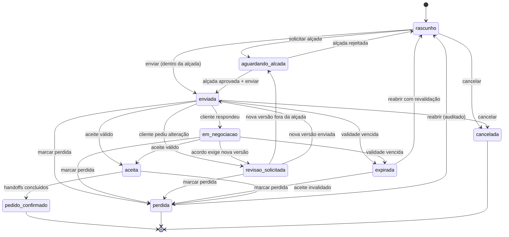

# Fase 0 — Máquina de estados comercial

**Documento:** entregável "Máquina de estados proposta" da Fase 0
**Status:** aprovado — DV-14, DV-01, DV-02 e DV-07 decididas em 2026-07-31
**Referências:** RP §§4.9 (4), 5.3, 6.5.6, 8.2, 8.6; `01-auditoria-estado-real.md` §4

---

## 1. Ponto de partida real

A auditoria encontrou três vocabulários simultâneos e uma máquina de estados
desligada:

- `validacao-v2.service.ts:605–636` implementa transições corretas, mas
  `OrcamentosV2Service.alterarStatus` **não a chama** e grava qualquer string;
- os valores realmente gravados incluem `pendente`, `enviado` e `negociando`, que
  **não existem** no enum `OrcamentoStatus`;
- há um segundo eixo, `orcamento.status_aprovacao`, sem regra de consistência com o
  primeiro.

Esta proposta segue a **opção A de DV-14**: criar um eixo comercial canônico novo,
manter o `status` legado como campo derivado de compatibilidade e religar a
validação ao caminho de escrita.

---

## 2. Princípio de separação

O RP §4.9 (4) e o critério 8.2 exigem que status comercial e status de execução não
se misturem. A regra é:

| Eixo | Campo | Dono | Contém |
|---|---|---|---|
| Comercial | `status_comercial` (novo) | Vendas | Do rascunho ao pedido confirmado ou perdido |
| Execução | `OrdemServico.status` | OS/PCP | Da fila à entrega |
| Financeiro | `Cobranca.status` | Financeiro | De prevista a liquidada |

`em_execucao` e `concluido`, hoje dentro do enum de orçamento, **saem do eixo
comercial**. Depois do pedido confirmado, o andamento é lido da OS e da cobrança,
não replicado no orçamento.

---

## 3. Estados comerciais canônicos

| Estado | Significado | Terminal? |
|---|---|---|
| `rascunho` | Em elaboração, nunca enviado | Não |
| `aguardando_alcada` | Envio bloqueado por exceção de desconto/margem pendente | Não |
| `enviada` | Versão congelada e disponibilizada ao cliente | Não |
| `em_negociacao` | Cliente respondeu; há troca ativa | Não |
| `revisao_solicitada` | Cliente pediu alteração; nova versão em elaboração | Não |
| `expirada` | Validade vencida sem aceite | Não |
| `aceita` | Aceite válido registrado com evidência | Não |
| `pedido_confirmado` | Compromisso comercial firmado; handoffs disparados | **Sim** |
| `perdida` | Encerrada sem venda, com motivo estruturado | **Sim** |
| `cancelada` | Encerrada pela loja antes do aceite | **Sim** |

Terminais admitem reabertura apenas por transição explícita e auditada
(`perdida` e `expirada` → `rascunho`), nunca por edição silenciosa.

---

## 4. Diagrama

---

## 5. Tabela de transições e autoridade

| # | De | Para | Ator autorizado | Permissão | Pré-condição | Evento |
|---|---|---|---|---|---|---|
| 1 | `rascunho` | `aguardando_alcada` | Vendedor | `vendas.alcada.solicitar` | Desconto/margem fora do limite; justificativa obrigatória | `vendas.alcada.solicitada` |
| 2 | `rascunho` | `enviada` | Vendedor | `vendas.proposta.enviar` | Dentro da alçada; cliente, itens, validade e destinatário definidos; snapshot criado | `vendas.proposta.enviada` |
| 3 | `rascunho` | `cancelada` | Vendedor | `vendas.proposta.editar` | — | — |
| 4 | `aguardando_alcada` | `enviada` | Vendedor | `vendas.proposta.enviar` | Alçada aprovada e ainda válida | `vendas.alcada.decidida` + `vendas.proposta.enviada` |
| 5 | `aguardando_alcada` | `rascunho` | Gestor | `vendas.alcada.aprovar` | Rejeição com justificativa | `vendas.alcada.decidida` |
| 6 | `enviada` | `em_negociacao` | Sistema | — | Primeira mensagem do cliente | — |
| 7 | `enviada` | `revisao_solicitada` | Vendedor ou cliente | `vendas.proposta.revisar` | — | `vendas.proposta.revisao_solicitada` |
| 8 | `enviada` | `aceita` | Cliente ou vendedor | `vendas.proposta.aceite.registrar` quando interno | Versão vigente = versão enviada; não expirada; evidência registrada | `vendas.proposta.aceita` |
| 9 | `enviada` | `expirada` | Sistema (job) | — | `expira_em < agora` no timezone da loja | `vendas.proposta.expirada` |
| 10 | `enviada` | `perdida` | Vendedor | `vendas.proposta.marcar_perdida` | Motivo estruturado obrigatório | `vendas.proposta.perdida` |
| 11 | `enviada` | `cancelada` | Vendedor | `vendas.proposta.editar` | — | — |
| 12 | `em_negociacao` | `revisao_solicitada` | Vendedor | `vendas.proposta.revisar` | — | `vendas.proposta.revisao_solicitada` |
| 13 | `em_negociacao` | `aceita` | Cliente ou vendedor | idem 8 | idem 8 | `vendas.proposta.aceita` |
| 14 | `em_negociacao` | `expirada` | Sistema (job) | — | idem 9 | `vendas.proposta.expirada` |
| 15 | `em_negociacao` | `perdida` | Vendedor | `vendas.proposta.marcar_perdida` | Motivo obrigatório | `vendas.proposta.perdida` |
| 16 | `revisao_solicitada` | `aguardando_alcada` | Vendedor | `vendas.alcada.solicitar` | Nova versão fora do limite | `vendas.alcada.solicitada` |
| 17 | `revisao_solicitada` | `enviada` | Vendedor | `vendas.proposta.enviar` | Novo snapshot; aceite anterior invalidado | `vendas.proposta.revisada` + `vendas.proposta.enviada` |
| 18 | `revisao_solicitada` | `perdida` | Vendedor | `vendas.proposta.marcar_perdida` | Motivo obrigatório | `vendas.proposta.perdida` |
| 19 | `expirada` | `rascunho` | Vendedor | `vendas.proposta.reabrir` | Revalidação de preço obrigatória (DV-07) | `vendas.proposta.reaberta` |
| 20 | `expirada` | `perdida` | Vendedor | `vendas.proposta.marcar_perdida` | Motivo obrigatório | `vendas.proposta.perdida` |
| 21 | `aceita` | `pedido_confirmado` | Sistema | — | Handoffs idempotentes concluídos | `vendas.pedido.confirmado` |
| 22 | `aceita` | `perdida` | Gestor | `vendas.proposta.marcar_perdida` | Aceite invalidado por alteração material (DV-02) | `vendas.proposta.perdida` |
| 23 | `perdida` | `rascunho` | Gestor | `vendas.proposta.reabrir` | Auditoria obrigatória | `vendas.proposta.reaberta` |

Transição não listada é **inválida** e deve retornar erro estável em pt-BR.

---

## 6. Regras invariantes

1. Toda transição passa por um único ponto de escrita, que valida a transição
   **antes** de gravar. Nenhum caminho pode repetir o padrão atual de
   `alterarStatus`, que aceita string arbitrária.
2. Toda transição grava um registro em `HistoricoOrcamento` com o nome de evento
   canônico de `03-nomenclatura-e-matriz-rbac.md` §6, dentro da mesma transação.
3. `enviada` exige snapshot imutável em `VersaoOrcamento`. Sem snapshot, não há
   envio.
4. `aceita` exige que a versão aceita seja **a mesma** versão enviada vigente.
   Qualquer divergência bloqueia o aceite.
5. Alteração material (DV-02) em proposta `aceita` que ainda não virou
   `pedido_confirmado` invalida o aceite e força nova versão.
6. Depois de `pedido_confirmado`, o orçamento **não muda mais de estado comercial**.
   Alterações passam a ser aditivo ou cancelamento de pedido.
7. Expiração usa `expira_em` em UTC e é processada por job global em lotes
   indexados, além de ser validada no acesso sensível; timezone da loja serve para
   apresentação e cálculo contratual da data, não para criar um job por tenant.
8. Reabertura é sempre auditada e nunca reaproveita a validade antiga.

### 6.1 Limite entre o Gate 0S e esta máquina futura

O hotfix não implanta `status_comercial`, snapshots ou as 23 transições. Ele deve
impedir escrita arbitrária no fluxo legado que represente risco de segurança e
centralizar o aceite existente com validações compatíveis. A migração completa da
máquina permanece nas Fases 1 e 6. Se o legado não puder atender uma ação pública de
forma segura antes disso, a ação deve ser negada temporariamente, conforme
[`09-gate-hotfix-seguranca.md`](./09-gate-hotfix-seguranca.md).

---

## 7. Mapeamento de compatibilidade e backfill

O campo `status` legado permanece, derivado de `status_comercial`, para não quebrar
os consumidores atuais: `home-operacional` (`alertas-operacionais.service.ts:149`,
`onboarding.service.ts:249`, `contadores-menu.service.ts`, `fluxo-trabalho.service.ts`),
`validacao-v2.service.ts:691` e `instalacao-split-financeiro.service.ts:315`.

### Backfill proposto

| `status` legado encontrado | `status_comercial` | Observação |
|---|---|---|
| `rascunho` | `rascunho` | Direto |
| `pendente` | `rascunho` | Valor fora do enum; tratado como não enviado |
| `enviado` | `enviada` | Direto |
| `em_analise` | `enviada` | Valor do enum sem uso real de escrita |
| `negociando` | `em_negociacao` | Direto |
| `aprovado` **com** OS gerada | `pedido_confirmado` | Verificar `ordemServico` por `orcamento_id` |
| `aprovado` **sem** OS | `aceita` | Handoff pendente |
| `rejeitado` | `perdida` | Motivo de perda: `nao_informado_legado` |
| `em_execucao` | `pedido_confirmado` | Execução passa a ser lida da OS |
| `concluido` | `pedido_confirmado` | Idem |
| `cancelado` | `cancelada` | Direto |
| `EXCLUIDO` | não migrar | Filtro de soft delete, não é status |

### Derivação inversa (compatibilidade de escrita)

| `status_comercial` | `status` legado gravado |
|---|---|
| `rascunho` | `rascunho` |
| `aguardando_alcada` | `rascunho` |
| `enviada` | `enviado` |
| `em_negociacao` | `negociando` |
| `revisao_solicitada` | `negociando` |
| `expirada` | `enviado` |
| `aceita` | `aprovado` |
| `pedido_confirmado` | `aprovado` |
| `perdida` | `rejeitado` |
| `cancelada` | `cancelado` |

`status_aprovacao` continua sendo gravado pelo mesmo ponto de escrita, derivado de
`status_comercial`, até que seus consumidores sejam migrados. Não deve receber
escrita direta de nenhum código novo.

---

## 8. O que não faz parte deste eixo

- Status de arte (`ArteVersao`) — gate independente, ver `05-matriz-de-gates.md`.
- Status de OS (`StatusOS`) — dono é o módulo OS.
- Status de cobrança (`Cobranca.status`) — dono é Financeiro.
- `status_liberacao_pcp` — dono é PCP.

Nenhum deles pode ser alterado por uma transição comercial, e nenhum deles deve ser
espelhado em campo próprio de Vendas. O acompanhamento do RP §6.5.7 é **leitura**.
