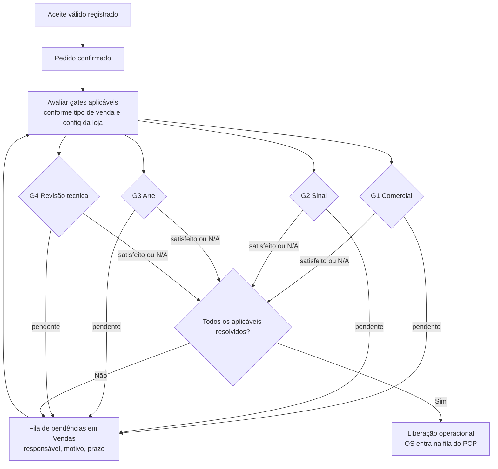

# Fase 0 — Matriz de gates de liberação operacional

**Documento:** entregável "Matriz de gates por cenário" da Fase 0
**Status:** proposto — depende de DV-03, DV-01 e DV-06
**Referências:** RP §§3.11–3.13, 5.3.1, 6.5.7, 7/E1A-3, 8.6 (18), 9

---

## 1. O problema que os gates resolvem

Hoje a aprovação do orçamento dispara OS e cobrança direto, sem nenhuma condição
intermediária (`orcamentos-v2.service.ts:3227` e `:3259`). Não existe o conceito de
"pedido aceito mas ainda não liberado para produção".

Isso produz dois riscos já registrados no RP §9: produzir arte não aprovada e
produzir sem sinal recebido.

Gate é uma **condição obrigatória para liberar a execução**, avaliada depois do
aceite e antes de a OS entrar na fila operacional. Gates são independentes entre si:
aprovação comercial não é aprovação de arte, e nenhuma delas é recebimento.

---

## 2. Os quatro gates

| Gate | Pergunta que responde | Dono da evidência | Onde o fato já existe hoje |
|---|---|---|---|
| **G1 — Comercial** | O cliente aceitou uma versão válida? | Vendas | A criar (aceite não grava evidência) |
| **G2 — Sinal** | O sinal exigido foi recebido? | Financeiro | `Cobranca` + `CobrancaParcela` + `pcp-bloqueio-sinal` |
| **G3 — Arte** | A prova visual foi aprovada pelo cliente? | Arte | `ArteVersao`, `ArteLinkAprovacao` |
| **G4 — Revisão técnica** | A OS e os materiais foram validados? | OS/PCP | `aprovacao_tecnica_status` em `ordens_servico` |

Vendas **não é dono de G2, G3 nem G4**. Vendas apenas lê o estado deles e mostra ao
vendedor quem é o responsável, qual o motivo e qual o prazo — critério RP 8.9 (41).

---

## 3. Estados de um gate

| Estado | Significado |
|---|---|
| `nao_aplicavel` | O gate não se aplica a este pedido pela configuração da loja/tipo de venda |
| `pendente` | Aplicável e ainda não satisfeito |
| `satisfeito` | Condição cumprida, com evidência |
| `dispensado` | Liberado por exceção autorizada e auditada |

`dispensado` exige permissão explícita, justificativa e registro de quem dispensou.
Nunca é o estado padrão.

---

## 4. Matriz de aplicabilidade por tipo de venda

Proposta de defaults, configuráveis por loja conforme DV-03 (opção B).

| Tipo de venda | G1 Comercial | G2 Sinal | G3 Arte | G4 Revisão técnica |
|---|---|---|---|---|
| Produto sob medida com arte | Obrigatório | Configurável | **Obrigatório** | Obrigatório |
| Produto sob medida sem arte | Obrigatório | Configurável | Não aplicável | Obrigatório |
| Produto de prateleira / revenda | Obrigatório | Configurável | Não aplicável | Não aplicável |
| Serviço de instalação avulso | Obrigatório | Configurável | Não aplicável | Obrigatório |
| Aditivo de ocorrência sem nova produção | Obrigatório | Configurável | Não aplicável | Não aplicável |
| Aditivo de ocorrência com nova produção | Obrigatório | Configurável | Conforme o item | Obrigatório |
| Amostra / cortesia | Obrigatório | Não aplicável | Conforme o item | Configurável |

A última linha do aditivo cobre a regra RP §5.3.3 (9): se o extra exigir produção
real, ele **não pode** usar o bypass de `pular_pcp` para escapar dos gates.

### Fonte de cada default

- G2 já tem precedente operacional em `pcp-bloqueio-sinal` e nas travas comerciais documentadas em `docs/modulo instalacao/03-relatorio-fase-2-travas-comerciais-e-hooks-pcp.md`.
- G3 depende de o pedido conter item que exija prova. A determinação vem do domínio Arte, não de Vendas.
- G4 já existe como `aprovacao_tecnica_status` (`PENDENTE | APROVADA | REJEITADA`), documentado em `docs/fase-0-home-operacional/01-status-oficiais.md`.

---

## 5. Regras de liberação

1. A OS pode ser **criada** com o aceite, mas só entra na fila operacional quando
   todos os gates aplicáveis estiverem `satisfeito` ou `dispensado`.
2. Enquanto houver gate `pendente`, a OS permanece em estado de espera e a
   liberação para PCP é negada **no backend**, não apenas escondida na UI.
3. Cada gate expõe ao vendedor: responsável, motivo, prazo previsto e a ação
   possível — sem revelar campos internos indevidos.
4. Um gate satisfeito não pode voltar a `pendente` por edição silenciosa. Se a
   condição deixar de valer (por exemplo, nova versão de arte reprovada), o
   registro é uma nova avaliação auditada.
5. A ordem de satisfação é livre. Gates são independentes e podem ser resolvidos em
   paralelo.
6. Nenhum gate é avaliado dentro da transação que cria o pedido. A avaliação é
   consulta ao estado dos domínios donos.

---

## 6. Fluxo

---

## 7. Evidência exigida por gate

| Gate | Evidência mínima |
|---|---|
| G1 | Versão aceita, data/hora, identidade do aceitante, canal, IP e user-agent da requisição de aceite |
| G2 | Parcela de sinal com recebimento confirmado, valor e data |
| G3 | `ArteVersao` aprovada, com aprovador e data |
| G4 | `aprovacao_tecnica_status = APROVADA`, com aprovador e data |

Para G1, nada disso é gravado hoje. Ver `01-auditoria-estado-real.md` §8: o aceite
não registra `data_aprovacao`, `aprovado_por`, IP nem user-agent, e o
`codigo_aprovacao` usa `Math.random()`. É migration e correção obrigatórias da
Fase 1 e da Fase 8.

---

## 8. O que Vendas pode e não pode fazer

| Ação | Permitido? |
|---|---|
| Ler o estado de qualquer gate | Sim |
| Mostrar responsável, motivo e prazo | Sim |
| Oferecer deep-link para o domínio dono, se o usuário tiver permissão | Sim |
| Marcar G1 como satisfeito ao registrar aceite válido | Sim |
| Marcar G2, G3 ou G4 como satisfeito | **Não** |
| Dispensar qualquer gate | Somente com permissão específica e auditoria; não é permissão padrão de vendedor |
| Alterar `aprovacao_tecnica_status` ou status de arte | **Não** |
| Liberar OS para PCP diretamente | **Não** |

---

## 9. Questões abertas para DV-03

1. A configuração de gates fica em tabela própria por loja ou é estendida em `configuracao_instalacao_loja`? Recomendação: tabela própria, porque os gates não são exclusivos de instalação.
2. "Dispensar gate" precisa de permissão própria (`vendas.gate.dispensar`) ou fica restrito a `ADMINISTRADOR`? Recomendação: restrito a `ADMINISTRADOR` no primeiro ciclo, promovido a permissão granular se surgir demanda real.
3. G2 é configurável por loja, por tipo de venda ou por condição de pagamento? Recomendação: por condição de pagamento — só faz sentido exigir sinal quando a condição prevê entrada.
