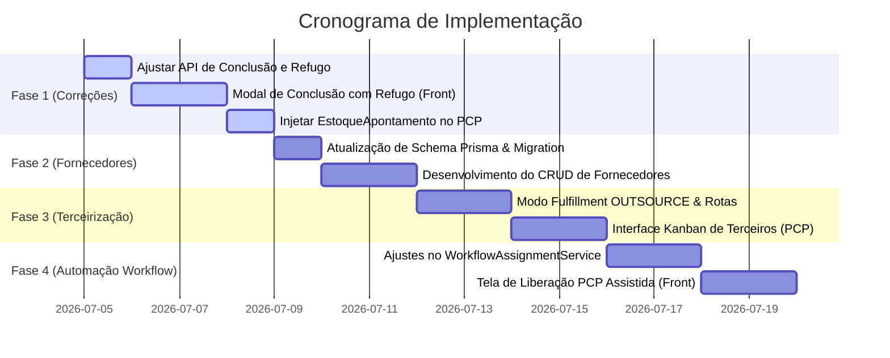

# 🚀 Planejamento de Novas Features - Módulo PCP & Terceirização (Comunikapp)

Este documento centraliza as definições e o planejamento técnico para as implementações acordadas no módulo de Planejamento e Controle de Produção (PCP) e a criação do ecossistema de **Terceirização (Agenciamento / Print Broker)** com a reestruturação do cadastro de **Fornecedores**.

---

## 📅 FASE 1: Correções de Fluxo e Integração Interna (Urgente)

Objetivo: Resolver as lacunas críticas que impedem o funcionamento integrado do PCP atual com o estoque e o controle de desperdício.

### 1.1 Correção e Alinhamento do Fluxo de Refugo (Perdas)

- **Backend:**
  - Alterar a rota `POST /api/pcp/kanban/concluir/:itemOsId` no [pcp-kanban.controller.ts](file:///C:/Projects/comunikapp/backend/src/pcp/controllers/pcp-kanban.controller.ts) para capturar o campo `quantidadeRefugo` vindo do `ConcluirEtapaDto`.
  - Atualizar o método `concluirEtapa` no [pcp-kanban.service.ts](file:///C:/Projects/comunikapp/backend/src/pcp/services/pcp-kanban.service.ts) para receber `quantidadeRefugo` e registrá-la no banco de dados na criação do `apontamento` de `CONCLUSAO`.
- **Frontend:**
  - No componente [FilaOperador.tsx](file:///C:/Projects/comunikapp/frontend/src/components/pcp/FilaOperador.tsx), substituir a conclusão direta por um **Modal de Confirmação**.
  - Esse modal permitirá ao operador informar:
    - Quantidade produzida (valor padrão = quantidade total do item).
    - Quantidade de refugo (perda) e observações (motivo da perda).

### 1.2 Integração do PCP com o Controle de Estoque

- **Backend:**
  - Injetar o `EstoqueApontamentoService` (atualmente localizado em [estoque-apontamento.service.ts](file:///C:/Projects/comunikapp/backend/src/os/services/estoque-apontamento.service.ts)) dentro do [pcp-kanban.service.ts](file:///C:/Projects/comunikapp/backend/src/pcp/services/pcp-kanban.service.ts).
  - No método `iniciarProducao`: Invocar a reserva de insumos (`TipoApontamento.INICIO`).
  - No método `concluirEtapa`: Invocar a baixa física dos insumos (`TipoApontamento.CONCLUSAO`). Se houver refugo, disparar a chamada de refugo (`TipoApontamento.REFUGO`) para baixar o material extra desperdiçado.
  - Substituir o `TODO` existente no [apontamento.service.ts](file:///C:/Projects/comunikapp/backend/src/pcp/services/apontamento.service.ts) pela chamada oficial do serviço de estoque.

---

## 🏢 FASE 2: Novo Módulo de Fornecedores & Parceiros

Atualmente, o Comunikapp possui apenas um cadastro simplificado (apenas `id`, `nome` e `loja_id`). Para comportar compras de insumos e terceirização de serviços, o cadastro será expandido para um módulo estruturado de **Fornecedores & Parceiros**.

### 2.1 Reestruturação do Banco de Dados (`schema.prisma`)

Modificar a tabela `fornecedor` para incluir campos de controle e contato:

```prisma
enum TipoFornecedor {
  INSUMO        // Fornece matéria-prima (lona, vinil, tintas)
  TERCEIRIZADO  // Executa produção ou instalação externa
  AMBOS
}

model fornecedor {
  id                String         @id @default(cuid())
  loja_id           String
  nome              String         // Nome fantasia ou marca
  razao_social      String?        // Razão social (V2)
  cnpj_cpf          String?        // Identificação fiscal
  tipo              TipoFornecedor @default(INSUMO)
  ativo             Boolean        @default(true)

  // Contatos
  contato_nome      String?
  telefone          String?
  whatsapp          String?
  email             String?

  // Endereço (Útil para logística e frete de retirada)
  cep               String?
  endereco          String?
  numero            String?
  complemento       String?
  bairro            String?
  cidade            String?
  estado            String?

  // Especialidades (Serviços que o parceiro realiza)
  // Armazenado como JSON array. Ex: ["totens", "fachadas", "adesivacao"]
  especialidades    Json?

  // Relacionamentos
  loja              loja           @relation(fields: [loja_id], references: [id], onDelete: Cascade)
  insumos           Insumo[]
  itens_terceirizados ItemOS[]     // Relacionamento com itens produzidos externamente

  @@unique([loja_id, nome])
  @@index([loja_id])
}
```

### 2.2 Criação da Interface de Gerenciamento (Frontend)

- Substituir o cadastro em popup/modal pelo módulo dedicado em `/fornecedores`, disponível diretamente no menu lateral.
- **Formulário de Cadastro:**
  - Dados Gerais (Nome, CNPJ, Razão Social).
  - Classificação (Insumos vs. Terceirizado).
  - Endereço com busca automática por CEP.
  - Contato direto com link rápido para WhatsApp (`https://wa.me/number`).
  - Checklist de Especialidades (Comunicação Visual, Fachadas, Serralheria, Impressão UV, Corte Router, Instalação).

---

## 🤝 FASE 3: Módulo de Agenciamento / PCP Terceirizado

Permitir que a empresa gerencie pedidos onde toda a produção e/ou instalação é executada por terceiros, sem passar pelos operadores físicos locais.

### 3.1 Mapeamento e Vinculação de Itens

- Adicionar a opção `OUTSOURCE` (Terceirizado) no enum `ModoFulfillmentItem` no banco de dados.
- No momento da aprovação da OS ou no catálogo de produtos, permitir vincular um item de produto ao modo `OUTSOURCE` e selecionar o **Parceiro Terceirizado** padrão.

#### 3.1.1 Decisão comercial no orçamento

Cada `ProdutoOrcamento` deve registrar o destino operacional antes da aprovação:

- `MAKE`: produção interna.
- `OUTSOURCE`: produção integral pelo parceiro.
- `HIBRIDO`: combinação de etapas internas e terceirizadas.

Para `OUTSOURCE` e `HIBRIDO`, o orçamento exige um fornecedor classificado como
`TERCEIRIZADO` ou `AMBOS` e mantém um snapshot comercial com:

- custo unitário do parceiro;
- setup/preparação;
- frete previsto;
- custo total terceirizado;
- prazo em dias;
- observações internas.

O custo total terceirizado participa do custo-base do produto antes da aplicação
de margem, comissão e impostos. Na aprovação, `modo_fulfillment` e fornecedor são
propagados para o `ItemOS`. Alterações posteriores no cadastro do fornecedor não
modificam o custo histórico do orçamento.

> Escopo do MVP: um parceiro por produto do orçamento. A terceirização por
> operação/componente será a evolução do modo `HIBRIDO`, para cenários como
> impressão interna + estrutura terceirizada + instalação própria.

### 3.2 Workflow de Acompanhamento Externo

- Configuração de **Setores Virtuais** no PCP representados por fornecedores ou etapas externas.
- **Envio Facilitado (Handoff):**
  - Tela no painel do administrador para "Enviar para Terceiro".
  - Geração automática de e-mail/notificação com o link do [LinkPublico](file:///C:/Projects/comunikapp/backend/prisma/schema.prisma#L1226) contendo apenas o detalhamento das medidas, acabamentos e o arquivo de arte anexado (bloqueando dados financeiros internos da agência).
- **Fila de Controle de Terceiros:**
  - Kanban do PCP passa a ter colunas de progresso de fornecedores terceirizados.
  - O agenciador atualiza os marcos com base nos retornos (ex: _"Produção Iniciada pelo Parceiro Y"_, _"Postado/Enviado"_, _"Instalação Concluída"_).

### 3.3 Ordem de Terceirização

Após a aprovação do orçamento, o sistema deverá gerar uma ordem operacional e
financeira vinculada ao `ItemOS`, ao fornecedor e ao snapshot do orçamento. Fluxo
inicial proposto:

`A_COTAR → COTADO → PEDIDO_ENVIADO → EM_PRODUCAO → PRONTO → EM_TRANSITO → RECEBIDO/ENTREGUE`.

Essa ordem será a fonte do Kanban externo; o fornecedor não será transformado em
um setor físico. O PCP usará uma etapa virtual de terceirização com identificação
do parceiro, prazo e ordem associada.

**Implementado no MVP:** criação automática da ordem na conversão do orçamento
em OS, snapshot financeiro, prazo previsto, validação de transições e painel em
`/pcp/terceirizacao`. Permanecem como evolução o envio automático do handoff ao
parceiro, anexos compartilháveis e terceirização por operação/componente.

---

## 🤖 FASE 4: Automatização Inteligente de Workflows por Item

Evitar a atribuição manual de processos produtivos aos itens da OS quando ela for aprovada, distribuindo as demandas de forma dinâmica entre recursos locais (**In-house**) ou parceiros externos (**Terceirizados**).

### 4.1 Granularidade de Atribuição (Item da OS)

- **Refatoração no Backend:**
  - Atualmente, o [workflow-assignment.service.ts](file:///C:/Projects/comunikapp/backend/src/pcp/services/workflow-assignment.service.ts) opera no escopo da OS como um todo. A lógica será refatorada para sugerir e instanciar workflows **individualmente por `ItemOS`** (produto/serviço).
  - Isso permite que, na mesma OS, um banner impresso in-house siga o fluxo físico da loja, enquanto um letreiro de acrílico siga o fluxo virtual de terceiros.

### 4.2 Lógica de Roteamento (Algoritmo de Decisão)

Ao aprovar a OS para envio ao PCP, o sistema avalia cada item de acordo com a seguinte hierarquia de fallbacks:

1. **Regra de Fulfillment (Terceirização):**
   - Se o item possui `modo_fulfillment == OUTSOURCE` (configurado manualmente no orçamento ou herdado do produto), o sistema vincula imediatamente o **Workflow de Terceirização Padrão**.
2. **Associação Direta no Catálogo (Template de Produto):**
   - Se o produto for baseado em um `TemplateProduto` que possua a propriedade `workflow_id_padrao` preenchida no banco, ele aplica esse template diretamente.
3. **Motor de Regras Inteligentes (Baseado em Insumos e Metadados):**
   - Caso seja um produto avulso (ad-hoc), o sistema executa o motor do `WorkflowAssignmentService` analisando:
     - **Insumos Utilizados:** Se o item usa o insumo "Lona", direciona para o workflow de "Lonas". Se usa "ACM" + Router CNC, direciona para "Serralheria/Usinagem".
     - **Recursos/Máquinas:** Se exige máquinas específicas do setor produtivo.
     - **Palavras-Chave:** Varre o `nome_servico` (ex: termos como "adesivação", "painel", "instalacao") para atribuir pesos aos workflows correspondentes.

### 4.3 Interface de UX: Liberação Assistida (Fallback)

- **Tela de Liberação do PCP (/os/:id/liberar):**
  - Ao clicar em "Liberar para PCP", o administrador visualiza uma prévia dos itens da OS e a indicação de qual workflow o algoritmo inteligente selecionou para cada um deles.
  - O sistema exibe um marcador visual de confiabilidade do algoritmo. Se a confiança for baixa (ex: projeto especial avulso), o sistema destaca o item permitindo que o gestor mude o workflow através de um dropdown rápido antes de confirmar a liberação final.

---

## 📐 Plano de Implementação Técnico



### 📋 Próximo Passo Imediato:

Iniciar o desenvolvimento da **Fase 1**, corrigindo o fluxo de refugo no backend e implementando o modal de confirmação de conclusão na fila do operador (`FilaOperador.tsx`).
