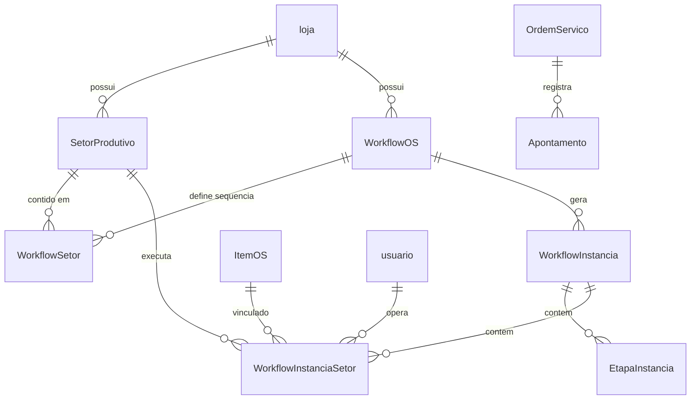
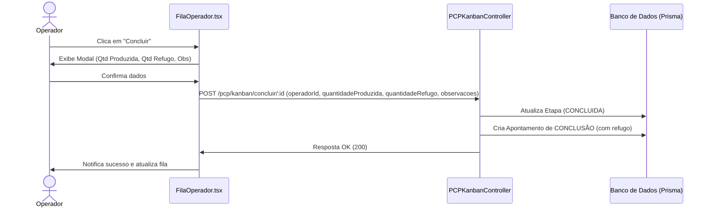

# 📊 Relatório de Análise Detalhada - Módulo PCP (Comunikapp)

Este relatório apresenta uma análise aprofundada do **Módulo de Planejamento e Controle de Produção (PCP)** do sistema **Comunikapp**, confrontando os requisitos definidos na documentação técnica (incluindo o documento original [Analise_PCP_Comunikapp.md](file:///C:/Projects/comunikapp/docs/pcp/Analise_PCP_Comunikapp.md)) com o estado atual da implementação no código (backend e frontend).

---

## 1. Visão Geral do Sistema e do PCP

O PCP do Comunikapp foi reestruturado para operar com base em **Centros de Trabalho (Setores Produtivos)** e **Workflows**. A granularidade do controle foi deslocada da Ordem de Serviço (OS) completa para os **Itens de OS (produtos/serviços)**, o que reflete com precisão a realidade de uma gráfica de comunicação visual, onde diferentes itens de um mesmo pedido podem exigir processos produtivos distintos (ex: um banner passa por _Impressão_ e _Acabamento_, enquanto um painel de ACM passa por _Usinagem CNC_ e _Montagem_).

### 🏗️ Arquitetura de Dados Implementada

Abaixo está o modelo de relacionamento entre as principais entidades do PCP no banco de dados (`schema.prisma`):



---

## 2. O que já está Contemplado (Status das Implementações)

Com baseado no cruzamento das pastas de código e na documentação histórica de progresso ([PLANO-ACAO-REALISTA-PCP.md](file:///C:/Projects/comunikapp/docs/pcp/PLANO-ACAO-REALISTA-PCP.md)), identificamos o que já está funcional e integrado:

### 2.1 Módulos de Suporte Existentes

- **Insumos e Estoque:** O sistema já possui um catálogo estruturado de insumos e movimentações físicas (localizações de estoque, saldo mínimo e controle de lote).
- **Centros de Trabalho / Recursos:** O cadastro de **Máquinas**, **Funções** e **Serviços Manuais** já está integrado às configurações do sistema, permitindo definir parâmetros de eficiência e horas operacionais.

### 2.2 Estrutura do Novo Módulo PCP

- **Setores Produtivos:** Cadastro em `/centros-de-trabalho/setores-produtivos` que agrupa máquinas, funções operacionais e operadores vinculados de forma dinâmica.
- **Workflows por Setores:** Cadastro em `/pcp/workflows` que permite criar e ordenar cadeias de produção compostas por setores físicos, substituindo as antigas etapas em texto livre.
- **Fila do Operador ("Meu Setor"):** Rota `/pcp/meu-setor` que exibe a fila de itens a produzir de acordo com o setor em que o operador logado está lotado. Oferece ações rápidas para **Iniciar**, **Pausar**, **Retomar** e **Mover** itens.
- **Kanban Gerencial por Setores:** Rota `/pcp/kanban` que exibe o fluxo em colunas (onde cada coluna representa um setor produtivo cadastrado) com cards individuais por produto, permitindo que a gestão tenha visão holística do progresso.
- **Carga de Setores & Máquinas:** O backend (`PCPCapacidadeService`) já calcula a ocupação e o status de carga (`normal`, `atencao`, `cheia`, `sobrecarregada`) baseado nas horas programadas contra a disponibilidade mensal dividida por dia útil (22 dias).

---

## 3. Matriz de Comparação: Documentação vs. Implementação Real

A tabela a seguir contrasta as regras de negócio propostas na documentação base do PCP e o que foi de fato construído no código:

| Requisito do PCP ([Analise_PCP_Comunikapp.md](file:///C:/Projects/comunikapp/docs/pcp/Analise_PCP_Comunikapp.md)) |    Status no Código     | Detalhe Técnico e Observação                                                                                                                                                                                                                                                                                                                |
| :---------------------------------------------------------------------------------------------------------------- | :---------------------: | :------------------------------------------------------------------------------------------------------------------------------------------------------------------------------------------------------------------------------------------------------------------------------------------------------------------------------------------ |
| **Aprovação de Layout como Trava**                                                                                |     🟢 **Parcial**      | A OS possui fluxo de arte (`arte_producao_url`), mas o bloqueio rígido impedindo o início da produção no PCP se o layout não estiver aprovado depende de regras de validação manuais ou está parcialmente contornado.                                                                                                                       |
| **Matriz de Carga Máquina (Humana vs Maquinário)**                                                                |     🟡 **Parcial**      | O backend em [pcp-capacidade.service.ts](file:///C:/Projects/comunikapp/backend/src/pcp/services/pcp-capacidade.service.ts) separa o cálculo de carga de setores das máquinas. Contudo, não há uma divisão percentual de tempo do mesmo item entre homem/máquina (ex: 30% máquina, 70% homem) em um cadastro central de "Tempos e Métodos". |
| **Baixa por Fração e $m^2$**                                                                                      |    🟢 **Concluído**     | O `EstoqueApontamentoService` busca a string JSON `insumos_necessarios` do item da OS e calcula a baixa proporcional correspondente.                                                                                                                                                                                                        |
| **Gestão e Apontamento de Perdas (Refugo)**                                                                       |    🔴 **Incompleto**    | **Inconsistência Crítica:** O banco de dados e as interfaces do backend possuem suporte para receber refugo, mas o fluxo do novo PCP não os conecta à interface e ignora a propriedade no controller. (Veja detalhes na Seção 4).                                                                                                           |
| **Alertas Preventivos de Insumos**                                                                                |     🔴 **Pendente**     | Não há um serviço ativo que cruze os insumos necessários da fila do Kanban de produção futura com o estoque real de forma preditiva ("estoque insuficiente para os próximos 3 dias").                                                                                                                                                       |
| **Painel de Simulação (Cenários em Tempo Real)**                                                                  | 🔴 **Não Implementado** | Mencionada como o "Grande Diferencial" (simular o impacto de priorizar a OS X sobre os outros projetos), esta tela ou inteligência de cálculo não existe. O Kanban exibe apenas dados atuais.                                                                                                                                               |
| **Ordem de Produção (OP) Digital e Visual**                                                                       |     🟢 **Parcial**      | O componente `FilaOperador` renderiza visualmente a imagem da arte/layout vinculada ao item (`ArteProducaoVdpControle`), eliminando em parte o papel, mas não há um fluxo de assinatura eletrônica do operador no encerramento.                                                                                                             |

---

## 4. Lacunas e Inconsistências Críticas Identificadas (Gaps)

Ao analisar o código fonte minuciosamente, localizamos falhas cruciais na implementação que inviabilizam o atingimento pleno do fluxo desenhado para o PCP:

### ⚠️ Inconsistência Crítica 1: Desconexão da Integração com o Estoque no Módulo PCP (Novo)

O backend possui um excelente serviço de integração de estoque chamado `EstoqueApontamentoService` em [estoque-apontamento.service.ts](file:///C:/Projects/comunikapp/backend/src/os/services/estoque-apontamento.service.ts). Ele é responsável por:

1. Reservar o estoque ao iniciar a produção de uma etapa (`TipoApontamento.INICIO`).
2. Efetuar a baixa do estoque ao concluir a etapa (`TipoApontamento.CONCLUSAO`).
3. Dar baixa adicional por perdas de refugo (`TipoApontamento.REFUGO`).

> [!CAUTION]
> **O Problema:** Esse serviço é injetado e executado apenas no antigo `WorkflowInstanciaService` (vinculado ao módulo `/os/`).
> O novo serviço do PCP, o [pcp-kanban.service.ts](file:///C:/Projects/comunikapp/backend/src/pcp/services/pcp-kanban.service.ts), **NÃO** importa, não injeta e não chama o `EstoqueApontamentoService` em suas ações de `iniciarProducao` e `concluirEtapa`.
> O [apontamento.service.ts](file:///C:/Projects/comunikapp/backend/src/pcp/services/apontamento.service.ts) do PCP possui apenas uma função mockada com um comentário `TODO`:
>
> ```typescript
> private async processarIntegracaoEstoque(...) {
>   // ...
>   // TODO: integração real de estoque quando estrutura de itens estiver completa
>   void this.validacaoEstoque;
> }
> ```
>
> **Consequência:** As ações de produção no chão de fábrica (Kanban e Meu Setor) **não afetam o estoque**. O controle de estoque real está desconectado do novo PCP.

---

### ⚠️ Inconsistência Crítica 2: Omissão do Campo de Refugo no Controller e na Interface do Operador

Na documentação do PCP, o apontamento de perdas (refugo) por motivo (erro humano, falha de máquina, erro de arquivo) é tratado como fundamental para retroalimentar os custos de produção e calcular perdas de insumos.
No entanto, há dois gargalos no fluxo implementado:

1. **No Backend:**
   O DTO `ConcluirEtapaDto` em [kanban.dto.ts](file:///C:/Projects/comunikapp/backend/src/pcp/dto/kanban.dto.ts) já prevê a propriedade `quantidadeRefugo?: number;`. Contudo, o método do controller em [pcp-kanban.controller.ts](file:///C:/Projects/comunikapp/backend/src/pcp/controllers/pcp-kanban.controller.ts#L95-L116) ignora essa propriedade ao repassá-la para o serviço:

   ```typescript
   // pcp-kanban.controller.ts
   const resultado = await this.pcpKanbanService.concluirEtapa(
     lojaId,
     itemOsId,
     data.operadorId,
     data.observacoes,
     data.quantidadeProduzida, // quantidadeRefugo não é passado aqui!
     usuario,
   );
   ```

   Além disso, a assinatura do método `concluirEtapa` em `PCPKanbanService` sequer aceita a variável de refugo para registrá-la no banco.

2. **No Frontend:**
   No componente da fila do operador [FilaOperador.tsx](file:///C:/Projects/comunikapp/frontend/src/components/pcp/FilaOperador.tsx#L258-L290), o botão **Concluir** executa a ação direta:
   ```typescript
   onClick={() =>
     void executarAcao(item.id, () => onConcluirEtapa(item.id))
   }
   ```
   Não há abertura de diálogo/modal para que o operador registre as quantidades reais produzidas e se houve refugo (perdas). O sistema simplesmente marca a etapa como concluída com 100% de aproveitamento por padrão.

---

### ⚠️ Inconsistência 3: Gargalos e Interdependência Dinâmica Inexistentes

De acordo com o item 1 do documento [Analise_PCP_Comunikapp.md](file:///C:/Projects/comunikapp/docs/pcp/Analise_PCP_Comunikapp.md), _"uma trava ou atraso na fase de aprovação da arte inviabiliza o cumprimento do prazo na impressão... O sistema precisa recalcular as previsões de entrega dinamicamente quando uma etapa atrasa."_

- **O Problema:** Atualmente, os prazos de entrega (`data_prazo`) e tempos previstos nas etapas do PCP são estáticos. Caso o setor anterior atrase, as etapas futuras permanecem com suas datas estimadas originais. Não existe uma fila baseada em gargalos com propagação de atraso dinâmica (recalculation engine).

---

## 5. Oportunidades de Amadurecimento e Melhorias (Plano de Ação)

Com base nas fragilidades encontradas, listamos as oportunidades de melhoria ordenadas por impacto operacional:

### 🔴 Passo 1: Correção e Alinhamento do Fluxo de Refugo (Urgência Alta)

- **Backend:**
  1. Alterar a assinatura de `concluirEtapa` no [pcp-kanban.service.ts](file:///C:/Projects/comunikapp/backend/src/pcp/services/pcp-kanban.service.ts) para aceitar `quantidadeRefugo?: number`.
  2. Ajustar a gravação do apontamento no banco inserindo o valor de `quantidade_refugo`.
  3. Ajustar o [pcp-kanban.controller.ts](file:///C:/Projects/comunikapp/backend/src/pcp/controllers/pcp-kanban.controller.ts) para extrair o valor do DTO e passar ao serviço.
- **Frontend:**
  1. No [FilaOperador.tsx](file:///C:/Projects/comunikapp/frontend/src/components/pcp/FilaOperador.tsx), substituir o clique direto do botão "Concluir" por um Modal de Confirmação de Conclusão.
  2. Esse modal deve permitir ao operador inserir a **Quantidade Produzida**, **Quantidade Refugo** e **Motivo/Observação da Perda**.



### 🔴 Passo 2: Reatar a Integração com o Controle de Estoque (Urgência Alta)

- **Backend:**
  1. Importar o `EstoqueApontamentoService` no [pcp.module.ts](file:///C:/Projects/comunikapp/backend/src/pcp/pcp.module.ts) ou exportá-lo adequadamente a partir do módulo original.
  2. Injetar o `EstoqueApontamentoService` no [pcp-kanban.service.ts](file:///C:/Projects/comunikapp/backend/src/pcp/services/pcp-kanban.service.ts).
  3. No método `iniciarProducao`, chamar `processarOperacaoEstoque` com `TipoApontamento.INICIO` para gerar as reservas de materiais necessárias.
  4. No método `concluirEtapa`, chamar `processarOperacaoEstoque` com `TipoApontamento.CONCLUSAO` para dar baixa nos materiais consumidos. Se houver refugo, disparar também a chamada com `TipoApontamento.REFUGO` passando a quantidade informada para baixar as mídias desperdiçadas.

### 🟡 Passo 3: Painel de Alertas Preventivos de Estoque (Urgência Média)

- Criar uma rotina em segundo plano ou uma query integrada ao dashboard que compare a soma de `insumos_necessarios` de todos os itens em fila (`PENDENTE` ou `EM_ANDAMENTO`) no PCP com o saldo físico disponível nas localizações de estoque.
- Exibir um card de alerta no Dashboard do PCP caso o saldo projetado fique negativo para os próximos 3 a 5 dias operacionais.

### 🔵 Passo 4: Painel de Simulação de Fila e Otimização (Urgência Baixa)

- Criar uma tela de simulação onde o administrador possa arrastar um item para o topo da prioridade e o sistema recalcule de forma teórica a previsão de conclusão de todos os outros itens afetados na fila daquele setor.
- Isso utiliza a capacidade de minutos disponíveis vs. soma de minutos previstos calculada hoje no `PCPCapacidadeService`.

---

## Conclusão

O PCP do Comunikapp possui uma base técnica robusta, com tabelas bem estruturadas no banco de dados e APIs sólidas de gestão de carga de trabalho por setor e máquina. No entanto, **o fluxo de baixa física do estoque está quebrado no novo módulo**, e o **apontamento de perdas (refugo) é ignorado no caminho entre o front e o back**.

A correção dessas lacunas (Passos 1 e 2) trará estabilidade imediata e entregará o real valor de PCP Dinâmico desenhado originalmente para o Comunikapp.
