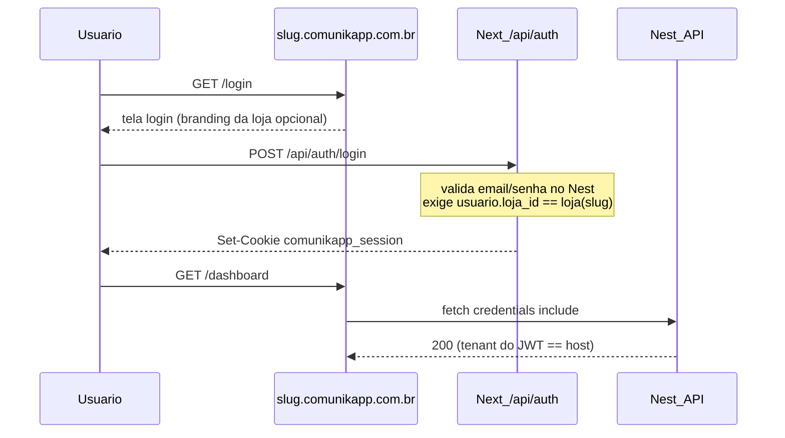

# RP — Subdomínio por loja

**Status:** Fatia A em produção (dados/UI/onboarding); runtime host = Fatia B
**Produto:** ComunikApp  
**Feature:** Tenant por hostname (`{slug}.comunikapp.com.br`)  
**Público:** lojas (tenant), TI/proxy corporativo do cliente, operação ComunikApp  
**Última atualização:** 28/07/2026  
**Branch de trabalho:** `feat/subdominio-por-loja`

## 1. Resumo executivo

Cada loja do ComunikApp deve poder ser acessada por um subdomínio próprio:

```text
https://{slug}.comunikapp.com.br/login
```

Motivação principal: empresas que usam proxy/firewall e liberam hostnames
específicos. Com o apex genérico (`comunikapp.com.br`), a liberação é ampla
demais ou inviável; com `minhaloja.comunikapp.com.br`, a liberação é cirúrgica.

Decisão de UX confirmada:

- a tela de login aparece **já no subdomínio da loja**;
- após autenticar, a navegação permanece no mesmo host;
- o apex `comunikapp.com.br` fica para marketing, descoberta de slug e
  compatibilidade temporária com lojas legadas.

A sessão HttpOnly atual (`comunikapp_session`, `Domain=.comunikapp.com.br`)
é pré-requisito e deve ser reutilizada — não reinventar auth.

## 2. Contexto atual confirmado no repositório

- Multi-tenant já existe via `loja_id` no JWT e nas queries.
- Modelo Prisma `loja` tem `id`, `nome`, `email`, `status`, trial, etc.
- **Não existe** campo `slug` / subdomain hoje.
- Produção:
  - front: `https://comunikapp.com.br` (Next em `127.0.0.1:3001`)
  - API: `https://api.comunikapp.com.br` (Nest em `127.0.0.1:4001`)
  - cookie de sessão: `comunikapp_session` HttpOnly, `Domain=.comunikapp.com.br`
  - BFF auth: `/api/auth/*` no Next (Nginx roteia para 3001)
- Cloudflare na frente (SSL Full strict, proxy laranja).

## 3. Objetivos

### 3.1 Objetivos de negócio

- Viabilizar adoção em empresas com whitelist de hostnames.
- Dar URL canônica estável por loja (suporte, bookmarks, e-mails).
- Reduzir fricção de “qual site liberar?” no onboarding corporativo.

### 3.2 Objetivos do usuário da loja

- Abrir `minhaloja.comunikapp.com.br/login` e entrar direto.
- Continuar no mesmo host após o login.
- Não precisar memorizar o apex genérico no dia a dia.

### 3.3 Não objetivos do MVP

- Domínio customizado do cliente (`app.acme.com.br`) — fase 2+.
- Multi-loja no mesmo usuário navegando vários subdomains na mesma sessão
  sem reauth (pode vir depois).
- Isolamento de cookie por subdomain sem `Domain=.comunikapp.com.br`
  (manter cookie compartilhado no eTLD+1 no MVP).
- Migrar a API para `{slug}.comunikapp.com.br/api` no MVP — `api.` continua.

## 4. Modelo de dados

### 4.1 Novo campo

Na tabela `loja`:

| Campo | Tipo | Regras |
|---|---|---|
| `slug` | `String` único, indexado | lowercase, `[a-z0-9-]+`, 3–48 chars, sem iniciar/terminar com `-` |
| `razao_social` | `String?` | pré-NF |
| `nome_fantasia` | `String?` | pré-NF |
| `inscricao_estadual` | `String?` | pré-NF |
| `inscricao_municipal` | `String?` | pré-NF |
| `cep` | `String?` | endereço |
| `logradouro` | `String?` | endereço |
| `numero` | `String?` | endereço |
| `complemento` | `String?` | endereço |
| `bairro` | `String?` | endereço |
| `cidade` | `String?` | endereço |
| `uf` | `String?` (2) | endereço |

Opcional depois:

| Campo | Tipo | Uso |
|---|---|---|
| `slug_atualizado_em` | `DateTime?` | auditoria de mudança |
| `slug_anterior` | `String?` | redirect 301 temporário após rename |
| `dominio_custom` | `String?` | Fatia C |

### 4.2 Slugs reservados (nunca atribuir a loja)

```text
www, api, app, ssh, mail, ftp, admin, gestao, gestao-app,
static, assets, cdn, status, monitor, beta, docs, support,
suporte, help, billing, pagamento, webhook, webhooks
```

### 4.3 Geração automática (backfill e cadastro)

1. Normalizar `loja.nome` → slug candidato compacto (NFD, remover acentos,
   juntar palavras: `Cacau Placas` → `cacauplacas`). Fallback com hífens
   se o compacto for inválido.
2. Se vazio/inválido/reservado → usar prefixo `loja-` + 6 chars do `id`
   (provisório; a UI sugere o nome e permite “Usar sugestão”).
3. Se colisão → `slug`, `slug-2`, `slug-3`, … ou `slug-{4charsId}`.
4. Loja pode alterar o slug depois (admin da loja + confirmação), com
   redirect do slug antigo por período definido (ex.: 90 dias) se
   `slug_anterior` for implementado.

## 5. Resolução de tenant

Ordem de verdade no request autenticado:

1. **Host** → resolve `slug` → `loja_id` (quando host é `{slug}.comunikapp.com.br`).
2. **JWT / cookie** → `loja_id` do usuário.
3. **Conflito** (host loja A + JWT loja B) → **401/403**, nunca misturar dados.

Regras:

- Login em `{slug}` só aceita usuários com `usuario.loja_id` = loja do slug.
- Apex sem slug: login legado resolve loja pelo usuário (como hoje) e
  **redireciona** para o subdomain canônico após sucesso.
- Host desconhecido / slug inexistente → página 404 amigável (“loja não encontrada”)
  com link para o apex.

## 6. Fluxos

### 6.1 Fluxo feliz (canônico)



### 6.2 Lojas legadas (compatibilidade)

1. **Backfill** de `slug` para todas as lojas existentes (migration + script).
2. Apex `comunikapp.com.br/login` continua aceitando login por N releases.
3. Após login no apex → `302` para `https://{slug}.comunikapp.com.br/dashboard`
   (ou path original, se deep-link).
4. Usuário autenticado que acessa apex em rotas app → redirect para subdomain.
5. Comunicação: e-mail / banner “seu endereço permanente é …” (opcional no MVP).

Não apagar nem migrar dados operacionais; só acrescentar `slug` e redirects.

### 6.3 Cadastro / onboarding novo

- No cadastro, sugerir slug a partir do nome; permitir edição antes de concluir.
- Após verificação de e-mail, o link de “entrar” já aponta para o subdomain.

## 7. Infraestrutura

### 7.1 DNS / Cloudflare

- Registro wildcard `*.comunikapp.com.br` → proxied (laranja) para a origem.
- Certificado: Cloudflare Universal SSL cobre wildcard no proxy; origem continua
  com cert Let’s Encrypt do apex (Full strict) — validar se o tunnel/origem
  precisa de SAN wildcard ou se o proxy termina TLS (modelo atual: CF termina
  TLS do cliente; origem recebe host via SNI/`Host`).
- **Não** criar um DNS A/AAAA por loja.

### 7.2 Nginx

Hoje o server_name é `comunikapp.com.br www.comunikapp.com.br`.

MVP:

```nginx
server_name comunikapp.com.br www.comunikapp.com.br *.comunikapp.com.br;
```

- Mesmo `proxy_pass` do front (Next).
- Manter exclusões: `api.`, `ssh.` não entram neste server (já têm hosts próprios).
- `/api/auth/` continua indo ao Next; restante `/api/` ao Nest (como hoje no apex).
- `Host` original deve chegar ao Next (`proxy_set_header Host $host`).

### 7.3 Next.js

- Middleware (ou layout server) lê `host`, extrai slug, resolve loja
  (cache curto / edge config / chamada interna).
- Injeta `loja_id` / slug no request context para páginas e BFF.
- BFF `/api/auth/login` recebe o host e envia `slug` (ou `loja_id`) ao Nest
  para validação cruzada.

### 7.4 NestJS

- Endpoint ou extensão do login: aceitar `slug` / `loja_id` esperado.
- Guard/middleware HTTP: se header `x-tenant-slug` ou host informado pelo
  proxy interno, validar consistência com JWT.
- WebSocket: após Fatia 2 cookie, validar tenant do JWT; opcionalmente
  checar origem/`Host` do handshake.

## 8. Cookie e CORS

| Item | Decisão MVP |
|---|---|
| Cookie nome | `comunikapp_session` (inalterado) |
| Domain | `.comunikapp.com.br` (inalterado) |
| SameSite | `Lax` |
| API | `https://api.comunikapp.com.br` + `credentials: 'include'` |
| CORS Allow-Origin | refletir origem do request se estiver em allowlist: apex, www, e `https://{slug}.comunikapp.com.br` |

Nginx CORS map precisa passar a aceitar origem `https://*.comunikapp.com.br`
(regex / validação), não só a lista fixa do apex — **um único**
`Access-Control-Allow-Origin` espelhado, sem duplicar com o Nest
(`CORS_VIA_PROXY=true` permanece).

## 9. Segurança

- Nunca confiar só no slug do client sem amarrar ao JWT.
- Host header spoofing: Nginx define server_name; app valida formato do host.
- Rate limit de login por IP **e** por slug (já existe zona `login_limit`).
- Troca de slug: somente admin da loja; auditoria; invalidar redirects eternos.
- Páginas públicas (orcamento/arte link): definir na implementação se ficam no
  apex, no subdomain da loja, ou ambos com canonical — default sugerido:
  **links públicos gerados passam a usar o subdomain da loja** quando slug
  existir; links antigos do apex continuam resolvendo pelo id no path.

## 10. UX — Configurações da loja e onboarding (Fatia A)

### 10.1 `/configuracoes/loja` (hub)

Seções:

1. **Identidade / cadastro** — nome, razão social, fantasia, CPF/CNPJ, e-mail, telefone, IE, IM  
2. **Endereço** — CEP, logradouro, número, complemento, bairro, cidade, UF (pré-NF)  
3. **Acesso e URL** — slug + URL canônica informativa `https://{slug}.comunikapp.com.br` + placeholder “domínio próprio em breve”  
4. **Branding** — logo + cabeçalho de orçamento  
5. **Parâmetros de negócio** — margem, impostos, comissão, horas

Sem emissão de NF nesta fatia; campos fiscais/endereço existem para integração futura.

### 10.2 Onboarding

Nova etapa obrigatória `definir_slug`:

- título: Definir endereço da loja (URL)
- `acao_href`: `/configuracoes/loja`
- conclusão automática: `loja.slug` preenchido e válido
- lojas legadas herdam a etapa pendente até definirem/aceitarem o slug (backfill já preenche — etapa auto-conclui se slug existir)

`dados_empresa` continua exigindo nome + doc + telefone; a página passa a editar esses campos de verdade.

### 10.3 Login no subdomain (Fatia B)

- Em `{slug}/login`: mostrar nome da loja (e logo se houver).
- Apex `/login`: só e-mail + redirect pós-sucesso para subdomain.
- 404 de slug: mensagem clara + CTA para suporte/apex.

## 11. Fases de implementação

### Fatia A — Dados + UI + onboarding (atual)

- [x] RP neste diretório (atualizado)
- [x] Migration `loja.slug` + campos cadastro/endereço + backfill
- [x] API PATCH cadastro/slug
- [x] Reformulação `/configuracoes/loja`
- [x] Etapa onboarding `definir_slug`

### Fatia B — Runtime tenant-by-host

- [ ] Wildcard DNS `*.comunikapp.com.br` no Cloudflare
- [ ] Validar TLS/proxy com slug de teste
- [ ] Nginx `server_name` com wildcard
- [ ] Next middleware: resolve slug → contexto
- [ ] BFF login valida slug do host
- [ ] Nest rejeita mismatch JWT ↔ tenant do host
- [ ] CORS map para origens `https://*.comunikapp.com.br`
- [ ] Pós-login no apex → subdomain

### Fatia C — Domínio custom + endurecimento

- [ ] Wizard DNS no onboarding/config (CNAME/TXT + verificar)
- [ ] `slug_anterior` + 301
- [ ] Sunset do login no apex (após métricas)
- [ ] Isolamento de sessão mais rígido (se necessário)

## 12. Critérios de aceite (MVP)

1. Existe `loja.slug` único para 100% das lojas ativas (backfill).
2. `https://{slug}.comunikapp.com.br/login` renderiza login da loja correta.
3. Credenciais de outra loja são rejeitadas nesse host.
4. Cookie HttpOnly continua funcionando; JWT não volta ao `localStorage`.
5. Login no apex redireciona para o subdomain canônico após sucesso.
6. OPTIONS/POST CORS da API com `Origin: https://{slug}.comunikapp.com.br`
   retorna **um** `Access-Control-Allow-Origin` espelhado + credentials.
7. Slugs reservados nunca são atribuídos.
8. Host inexistente → 404 amigável, sem vazar dados de outras lojas.

## 13. Riscos e mitigações

| Risco | Mitigação |
|---|---|
| Wildcard DNS / cert | Testar `sandbox.` antes do corte geral |
| CORS wildcard mal configurado | Validar Origin com regex estrita `^https://[a-z0-9-]+\.comunikapp\.com\.br$` |
| Colisão de slug no backfill | Sufixo numérico / id curto; revisão manual dos top N |
| Proxy corporativo ainda bloqueia `api.` | Documentar liberação de `api.comunikapp.com.br` **e** do slug; fase futura same-origin API |
| Usuário salva bookmark no apex | Redirect autenticado + comunicação |
| Rename de slug quebra links | `slug_anterior` + 301 (fase 4) |

## 14. Relação com outras frentes

- **Sessão HttpOnly** (`docs/sessao-cookie-httponly.md`): base pronta; não regredir.
- **Gestão SaaS** (`docs/gestao-comunikapp/`): painel interno deve listar/editar slug.
- **Cloudflare hardening**: wildcard sob a mesma zona; não abrir SSH; manter UFW.

## 15. Decisões abertas (registrar aqui ao fechar)

1. Links públicos de orçamento/arte: subdomain da loja vs apex — **default proposto: subdomain**.
2. Prazo de convivência do login no apex — **proposta: 90 dias após Fase 3 em prod**.
3. Quem pode editar slug: só admin da loja, ou também operação ComunikApp no `/gestao` — **proposta: ambos**.

---

Este diretório é a fonte de verdade funcional da feature. Mudanças de regra
de negócio devem atualizar este RP antes ou junto da implementação.
